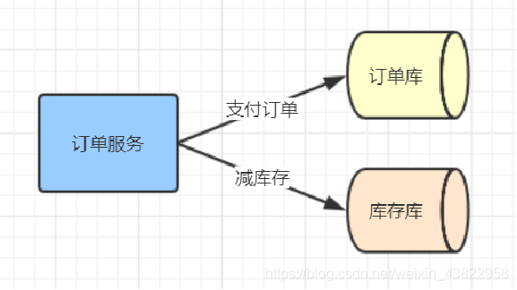
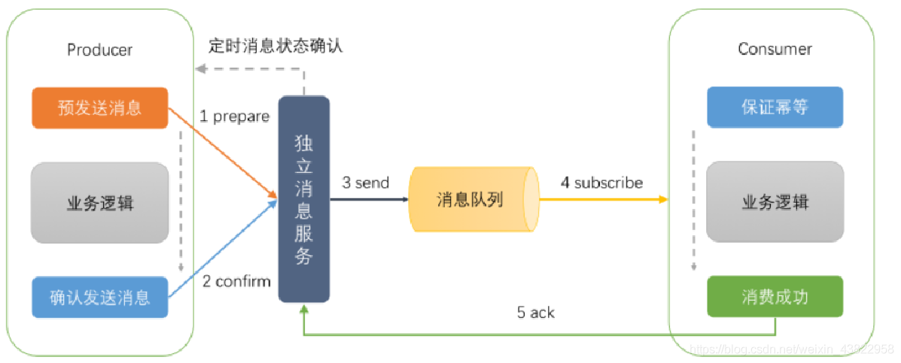
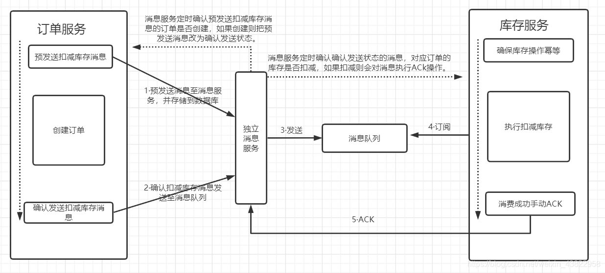
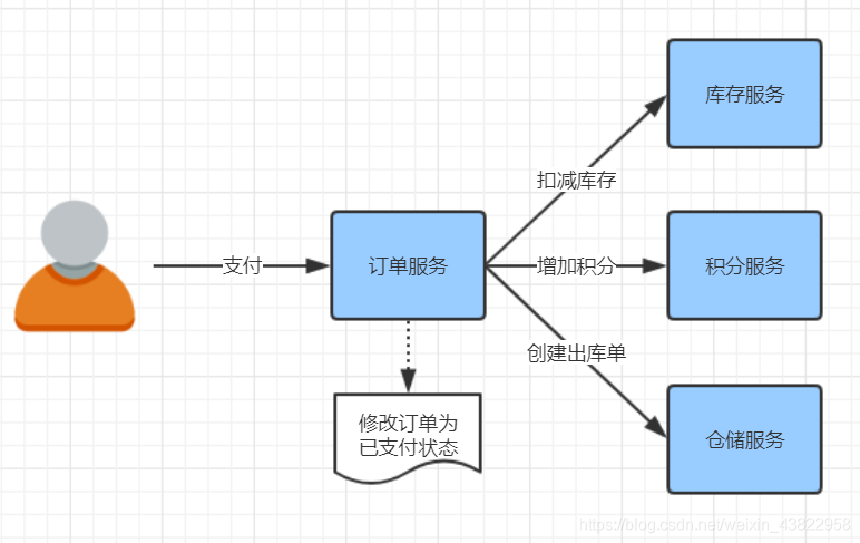
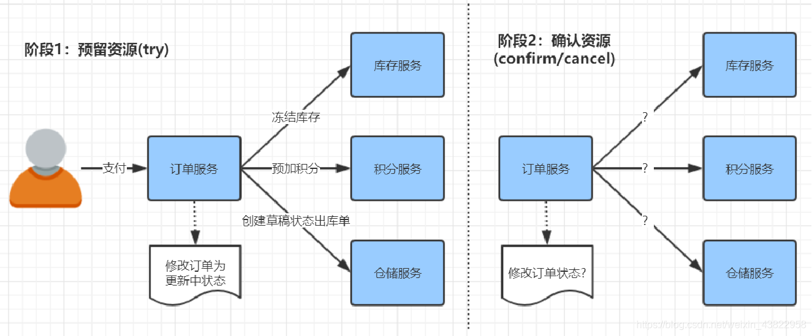
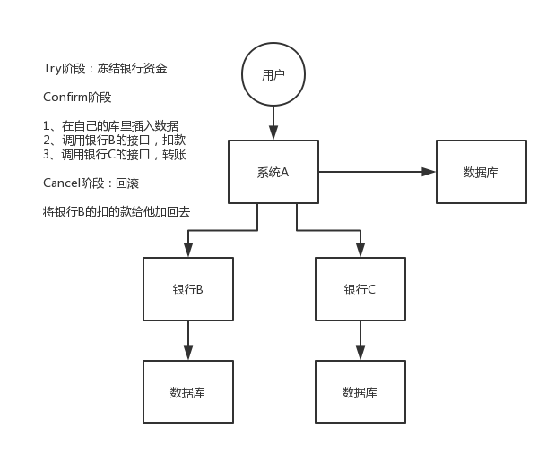

# 02-分布式事务

## 一、分布式事务的相关理论
CAP理论：    
- 一致性（Consistency）
- 可用性（Availability）
- 分区容错（Partition-tolerance）

一个分布式系统最多只能满足以上的两项，分区容错性是分布式系统必然需要面对和解决的问题，因此在一些大型互联网公司都会把精力放在如何在C（一致性）和A（可用性）之间寻求平衡。  

BASE理论：   
基本可用（Basically Available）  
指分布式系统在出现不可预知故障的时候，允许损失部分可用性。  
软状态（ Soft State）  
指允许系统中的数据存在中间状态，并认为该中间状态的存在不会影响系统的整体可用性，即允许系统在不同节点的数据副本之间进行数据同步的过程存在延时。  
最终一致（ Eventual Consistency）  
强调的是所有的数据更新操作，在经过一段时间的同步之后，最终都能够达到一个一致的状态。因此，最终一致性的本质是需要系统保证最终数据能够达到一致，而不需要实时保证系统数据的强一致性。   
BASE理论即在整体可用的情况下，满足最终一致性，BASE理论可以说是CAP理论的拓展。  

## 二、分布式事务实现
分布式事务的实现主要有以下 6 种方案：  
- XA 方案
- TCC 方案
- SAGA 方案
- 本地消息表
- 可靠消息最终一致性方案
- 最大努力通知方案

## 三、分布式事务解决方案
### 3.1、跨库事务（强一致性事务）
跨库事务即在一个jvm内调用两个数据库。  
XA是由X/Open组织提出的分布式事务的规范，主要定义了：  
```
全局）事务管理器（Transaction Manager），承担协调者（中间人transactionmanager）的身份
（局部）资源管理器（Resource Manager），通常是数据源
XA接口是双向的系统接口，在事务管理器（Transaction Manager）以及一个或多个资源管理器（Resource Manager）之间形成通信桥梁。
```
JTA是XA协议在JAVA上上的实现，主要定义了：
```
事务管理器的接口javax.transaction.TransactionManager，定义了有关事务的开始、提交、撤回等操作。
满足XA规范的资源定义接口javax.transaction.xa.XAResource，一种资源如果要支持JTA事务，就需要让它的资源实现该XAResource接口，并实现该接口定义的两阶段提交相关的接口。
```
XA/JTA简单来说就是一个两阶段提交协议，以下图举例。
1、准备阶段：协调者（事务管理器Transaction Manager）询问每个数据源（资源管理器 Resource Manager）。事务管理器询问订单库和库存库，数据是否准备好，是否可以提交。  
2、执行阶段：如果数据源都回复可以提交数据，则协调者会把每个数据源的数据提交。如果数据源因为资源不足（库存不足）或网络连接失败等情况，回复不可以提交，则协调者会把每个数据源的数据进行回滚。  
   
常见的JTA实现Atomikos，TransactionEssentials。

### 3.2、跨JVM事务（柔性事务）
XA/JTA是强一致性事务，在分布式系统中体现为CP。虽然数据强一致，但在大型互联网公司通常对AP与CP都有需求，此种方案明显无法被使用。 大多数互联网公司都采用基于BASE理论的柔性事务，兼顾AP与CP。  

#### 3.2.1、可靠消息最终一致性方案
可靠消息最终一致性方案是基于消息中间件的解决方案。   
在确保消息服务可用的前提下，由生产者预发送消息给独立消息服务存储到数据库，之后执行业务逻辑，执行完之后向消息服务发送确定发送消息，独立消息服务将此消息发送到消息队列中。此时消息消费者，在保证幂等性的前提下，消费消息，消费成功后并手动ack。如果在确认发送消息或ack因网络等原因，一直无法执行时。独立消息服务可以通过定时器，定时去相应服务查询相关数据的状态，进行自动确认发送和自动ack。  
     
例子如下：
     
独立消息服务定时任务的作用就是解决异常情况下，消息无法发送和消费成功无ACK的情况。但是如果消息消费的过程中出现了异常情况，且多次重试都无法成功的情况下，就需要人工干预。   

#### 3.2.2、TCC(Try-Confirm-Cancel)两阶段补偿型方案
     
     

TCC(Try-Confirm-Cancel)就不再赘述了。T指资源预留，C资源确认,C资源回滚。   
如下单，通常情况下只用写一个接口。使用TCC方案下，需要写三个接口，一个是资源预留接口，资源预留通常新增数据库字段控制。一个是资源预留成功情况下的资源确定接口，一个是资源预留失败情况下的资源回滚接口。   
TCC开源框架实现：  
Atomikos，tcc-transaction，ByteTcc  

### 3.3、TCC与XA/JTA的对比
XA是资源层面的分布式事务，强一致性，在两阶段提交的整个过程中，一直会持有资源的锁  
TCC是业务层面的分布式事务，最终一致性，不会一直持有资源的锁  


-------------------------------------------------------


### 两阶段提交方案XA/JTA方案   
所谓的 XA 方案，即：两阶段提交，有一个**事务管理器**的概念，负责协调多个数据库（资源管理器）的事务，事务管理器先问问各个数据库你准备好了吗？如果每个数据库都回复 ok，那么就正式提交事务，在各个数据库上执行操作；如果任何其中一个数据库回答不 ok，那么就回滚事务。

这种分布式事务方案，比较适合单块应用里，跨多个库的分布式事务，而且因为严重依赖于数据库层面来搞定复杂的事务，效率很低，绝对不适合高并发的场景。如果要玩儿，那么基于 `Spring + JTA` 就可以搞定，自己随便搜个 demo 看看就知道了。

这个方案，我们很少用，一般来说**某个系统内部如果出现跨多个库**的这么一个操作，是**不合规**的。我可以给大家介绍一下， 现在微服务，一个大的系统分成几十个甚至几百个服务。一般来说，我们的规定和规范，是要求**每个服务只能操作自己对应的一个数据库**。

如果你要操作别的服务对应的库，不允许直连别的服务的库，违反微服务架构的规范，你随便交叉胡乱访问，几百个服务的话，全体乱套，这样的一套服务是没法管理的，没法治理的，可能会出现数据被别人改错，自己的库被别人写挂等情况。

如果你要操作别人的服务的库，你必须是通过**调用别的服务的接口**来实现，绝对不允许交叉访问别人的数据库。


### TCC 方案

TCC 的全称是： `Try` 、 `Confirm` 、 `Cancel` 。

- Try 阶段：这个阶段说的是对各个服务的资源做检测以及对资源进行**锁定或者预留**。
- Confirm 阶段：这个阶段说的是在各个服务中**执行实际的操作**。
- Cancel 阶段：如果任何一个服务的业务方法执行出错，那么这里就需要**进行补偿**，就是执行已经执行成功的业务逻辑的回滚操作。（把那些执行成功的回滚）

这种方案说实话几乎很少人使用，我们用的也比较少，但是也有使用的场景。因为这个**事务回滚**实际上是**严重依赖于你自己写代码来回滚和补偿**了，会造成补偿代码巨大，非常之恶心。

比如说我们，一般来说跟**钱**相关的，跟钱打交道的，**支付**、**交易**相关的场景，我们会用 TCC，严格保证分布式事务要么全部成功，要么全部自动回滚，严格保证资金的正确性，保证在资金上不会出现问题。

而且最好是你的各个业务执行的时间都比较短。

但是说实话，一般尽量别这么搞，自己手写回滚逻辑，或者是补偿逻辑，实在太恶心了，那个业务代码是很难维护的。



### Saga 方案

金融核心等业务可能会选择 TCC 方案，以追求强一致性和更高的并发量，而对于更多的金融核心以上的业务系统 往往会选择补偿事务，补偿事务处理在 30 多年前就提出了 Saga 理论，随着微服务的发展，近些年才逐步受到大家的关注。目前业界比较公认的是采用 Saga 作为长事务的解决方案。

#### 基本原理

业务流程中每个参与者都提交本地事务，若某一个参与者失败，则补偿前面已经成功的参与者。下图左侧是正常的事务流程，当执行到 T3 时发生了错误，则开始执行右边的事务补偿流程，反向执行 T3、T2、T1 的补偿服务 C3、C2、C1，将 T3、T2、T1 已经修改的数据补偿掉。


#### 使用场景

对于一致性要求高、短流程、并发高 的场景，如：金融核心系统，会优先考虑 TCC 方案。而在另外一些场景下，我们并不需要这么强的一致性，只需要保证最终一致性即可。

比如 很多金融核心以上的业务（渠道层、产品层、系统集成层），这些系统的特点是最终一致即可、流程多、流程长、还可能要调用其它公司的服务。这种情况如果选择 TCC 方案开发的话，一来成本高，二来无法要求其它公司的服务也遵循 TCC 模式。同时流程长，事务边界太长，加锁时间长，也会影响并发性能。

所以 Saga 模式的适用场景是：

- 业务流程长、业务流程多；
- 参与者包含其它公司或遗留系统服务，无法提供 TCC 模式要求的三个接口。

#### 优势

- 一阶段提交本地事务，无锁，高性能；
- 参与者可异步执行，高吞吐；
- 补偿服务易于实现，因为一个更新操作的反向操作是比较容易理解的。

#### 缺点

- 不保证事务的隔离性。

### 本地消息表

本地消息表其实是国外的 ebay 搞出来的这么一套思想。

这个大概意思是这样的：

1. A 系统在自己本地一个事务里操作同时，插入一条数据到消息表；
2. 接着 A 系统将这个消息发送到 MQ 中去；
3. B 系统接收到消息之后，在一个事务里，往自己本地消息表里插入一条数据，同时执行其他的业务操作，如果这个消息已经被处理过了，那么此时这个事务会回滚，这样**保证不会重复处理消息**；
4. B 系统执行成功之后，就会更新自己本地消息表的状态以及 A 系统消息表的状态；
5. 如果 B 系统处理失败了，那么就不会更新消息表状态，那么此时 A 系统会定时扫描自己的消息表，如果有未处理的消息，会再次发送到 MQ 中去，让 B 再次处理；
6. 这个方案保证了最终一致性，哪怕 B 事务失败了，但是 A 会不断重发消息，直到 B 那边成功为止。

这个方案说实话最大的问题就在于**严重依赖于数据库的消息表来管理事务**啥的，如果是高并发场景咋办呢？咋扩展呢？所以一般确实很少用。


### 可靠消息最终一致性方案

这个的意思，就是干脆不要用本地的消息表了，直接基于 MQ 来实现事务。比如阿里的 RocketMQ 就支持消息事务。

大概的意思就是：

1. A 系统先发送一个 prepared 消息到 mq，如果这个 prepared 消息发送失败那么就直接取消操作别执行了；
2. 如果这个消息发送成功过了，那么接着执行本地事务，如果成功就告诉 mq 发送确认消息，如果失败就告诉 mq 回滚消息；
3. 如果发送了确认消息，那么此时 B 系统会接收到确认消息，然后执行本地的事务；
4. mq 会自动**定时轮询**所有 prepared 消息回调你的接口，问你，这个消息是不是本地事务处理失败了，所有没发送确认的消息，是继续重试还是回滚？一般来说这里你就可以查下数据库看之前本地事务是否执行，如果回滚了，那么这里也回滚吧。这个就是避免可能本地事务执行成功了，而确认消息却发送失败了。
5. 这个方案里，要是系统 B 的事务失败了咋办？重试咯，自动不断重试直到成功，如果实在是不行，要么就是针对重要的资金类业务进行回滚，比如 B 系统本地回滚后，想办法通知系统 A 也回滚；或者是发送报警由人工来手工回滚和补偿。
6. 这个还是比较合适的，目前国内互联网公司大都是这么玩儿的，要不你就用 RocketMQ 支持的，要不你就自己基于类似 ActiveMQ？RabbitMQ？自己封装一套类似的逻辑出来，总之思路就是这样子的。


### 最大努力通知方案

这个方案的大致意思就是：

1. 系统 A 本地事务执行完之后，发送个消息到 MQ；
2. 这里会有个专门消费 MQ 的**最大努力通知服务**，这个服务会消费 MQ 然后写入数据库中记录下来，或者是放入个内存队列也可以，接着调用系统 B 的接口；
3. 要是系统 B 执行成功就 ok 了；要是系统 B 执行失败了，那么最大努力通知服务就定时尝试重新调用系统 B，反复 N 次，最后还是不行就放弃。

### 如何处理分布式事务的？

如果你真的被问到，可以这么说，我们某某特别严格的场景，用的是 TCC 来保证强一致性；然后其他的一些场景基于阿里的 RocketMQ 来实现分布式事务。

你找一个严格资金要求绝对不能错的场景，你可以说你是用的 TCC 方案；如果是一般的分布式事务场景，订单插入之后要调用库存服务更新库存，库存数据没有资金那么的敏感，可以用可靠消息最终一致性方案。

友情提示一下，RocketMQ 3.2.6 之前的版本，是可以按照上面的思路来的，但是之后接口做了一些改变，我这里不再赘述了。

当然如果你愿意，你可以参考可靠消息最终一致性方案来自己实现一套分布式事务，比如基于 RocketMQ 来玩儿。


