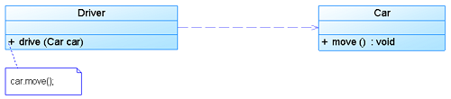
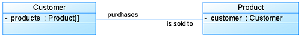
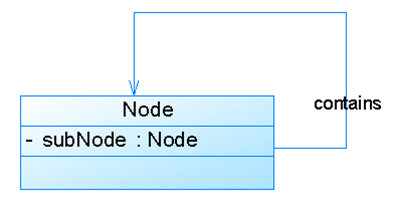
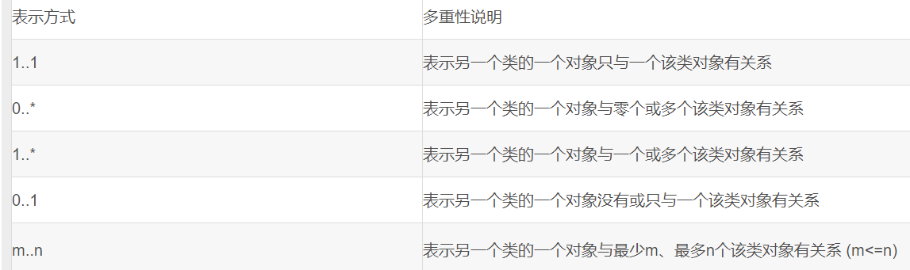
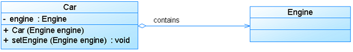
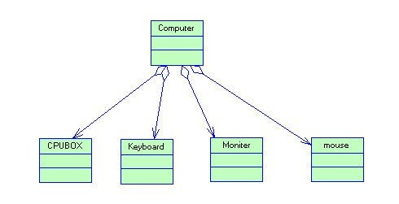

## 04-UML图例解析

UML图中类之间的关系：依赖,泛化,关联,聚合,组合,实现

类与类图：
1) 类(Class)封装了数据和行为，是面向对象的重要组成部分，它是具有相同属性、操作、关系的对象集合的总称。
2) 在系统中，每个类具有一定的职责，职责指的是类所担任的任务，即类要完成什么样的功能，要承担什么样的义务。一个类可以有多种职责，设计得好的类一般只有一种职责，在定义类的时候，将类的职责分解成为类的属性和操作（即方法）。
3) 类的属性即类的数据职责，类的操作即类的行为职责 

### 一、关系

#### 1.1、依赖关系(Dependence)

依赖关系（Dependence）：假设A类的变化引起了B类的变化，则说名B类依赖于A类。
- 依赖关系(Dependency) 是一种使用关系，特定事物的改变有可能会影响到使用该事物的其他事物，在需要表示一个事物使用另一个事物时使用依赖关系。 大多数情况下，依       赖关系体现在某个类的方法使用另一个类的对象作为参数。
- 在UML中，依赖关系用带箭头的虚线表示，由依赖的一方指向被依赖的一方。



```
public class Driver  
{  
    public void drive(Car car)  
    {  
        car.move();  
    }  
    ……  
}  
public class Car  
{  
    public void move()  
    {  
        ......  
    }  
    ……  
}  
```

依赖关系有如下三种情况：
1、A类是B类中的（某中方法的）局部变量；
2、A类是B类方法当中的一个参数；
3、A类向B类发送消息，从而影响B类发生变化；


#### 1.2、泛化关系（Generalization）
泛化关系（Generalization）：A是B和C的父类，B,C具有公共类（父类）A，说明A是B,C的一般化（概括，也称泛化）
- 泛化关系(Generalization)也就是继承关系，也称为“is-a-kind-of”关系，泛化关系用于描述父类与子类之间的关系，父类又称作基类或超类，子类又称作派生类。 在UML中，泛      化关系用带空心三角形的直线来表示。
- 在代码实现时，使用面向对象的继承机制来实现泛化关系，如在 Java 语言中使用 extends 关键字、在 C++/C# 中使用冒号“：”来实现。 


```
public class Person   
{  
    protected String name;  
    protected int age;  
    public void move()   
    {  
        ……  
    }  
    public void say()   
   {  
        ……  
    }  
}  
public class Student extends Person   
{  
    private String studentNo;  
    public void study()   
    {  
        ……  
    }  
}  
```
在UML当中，对泛化关系有三个要求：
1、子类与父类应该完全一致，父类所具有的属性、操作，子类应该都有；
2、子类中除了与父类一致的信息以外，还包括额外的信息；
3、可以使用父类的实例的地方，也可以使用子类的实例；


#### 1.3、关联关系（Association）
关联关系（Association）:类之间的联系，如客户和订单，每个订单对应特定的客户，每个客户对应一些特定的订单，再如篮球队员与球队之间的关联（下图所示）。


其中，关联两边的"employee"和“employer”标示了两者之间的关系，而数字表示两者的关系的限制，是关联两者之间的多重性。通常有“*”（表示所有，不限），“1”（表示有且仅有一个），“0...”（表示0个或者多个），“0，1”（表示0个或者一个），“n...m”(表示n到m个都可以),“m...*”（表示至少m个）。

- 关联关系(Association) 是类与类之间最常用的一种关系，它是一种结构化关系， 用于表示一类对象与另一类对象之间有联系。
- 在 UML 类图中， 用实线连接有关联的对象所对应的类 ，在使用 Java 、 C# 和 C++ 等编程语言实现关联关系时， 通常将一个类的对象作为另一个类的属性 。
- 在使用类图表示关联关系时可以 在关联线上标注角色名 。

##### 1.3.1、双向关联: 
默认情况下，关联是双向的。



```
public class Customer  
{  
    private Product[] products;  
    ……  
}  
public class Product  
{  
    private Customer customer;  
    ……  
}  
```

##### 1.3.2、单向关联: 
类的关联关系也可以是 单向的 ，单向关联用 带箭头的实线 表示.


```
public class Customer  
{  
    private Address address;  
    ……  
}  
  
public class Address  
{  
    ……  
}  
```

##### 1.3.3、自关联: 
在系统中可能会存在 一些类的属性对象类型为该类本身，这种特殊的关联关系称为自关联。



```
public class Node  
{  
    private Node subNode;  
    ……  
}   
```

##### 1.3.4、重数性关联: 
重数性关联关系又称为 多重性关联关系 (Multiplicity)，表示一个类的对象与另一个类的对象连接的个数。在UML中多重性关系可以直接在关联直线上增加一个数字表示与之对应的另一个类




```
public class Form  
{  
    private Button buttons[];  
    ……  
}   
public class Button  
{  
    …  
}  
```

#### 1.4、聚合关系（Aggregation）

聚合关系（Aggregation）:表示的是整体和部分的关系，整体与部分 可以分开.
- 聚合关系(Aggregation) 表示一个 整体与部分的关系。通常在定义一个整体类后，再去分析这个整体类的组成结构，从而找出一些成员类，该整体类和成员类之间就形成了聚合   关系。
- 在聚合关系中， 成员类是整体类的一部分 ，即成员对象是整体对象的一部分，但是成员对象可以脱离整体对象独立存在。 在 UML 中，聚合关系用带空心菱形的直线表示。 


```
public class Car  
{  
    private Engine engine;  
    public Car(Engine engine)  
   {  
        this.engine = engine;  
    }  
      
    public void setEngine(Engine engine)  
    {  
        this.engine = engine;  
    }  
    ……  
}  
public class Engine  
{  
    ……  
}  
```

如：电话机包括一个话筒电脑包括键盘、显示器，一台电脑可以和多个键盘、多个显示器搭配，确定键盘和显示器是可以和主机分开的，主机可以选择其他的键盘、显示器组成电脑；




#### 1.5、组合关系（Composition）
组合关系（Composition）:也是整体与部分的关系，但是整体与部分不可以分开.
- 组合关系 (Composition)也表示类之间整体和部分的关系，但是组合关系中 部分和整体具有统一的生存期。一旦整体对象不存在，部分对象也将不存在，部分对象与整体对象之    间具有 同生共死的关系。
- 在组合关系中，成员类是整体类的一部分，而且整体类可以控制成员类的生命周期，即成员类的存在依赖于整体类。 在 UML 中，组合关系用带实心菱形的直线表示。


https://blog.csdn.net/fatherican/article/details/44966891
