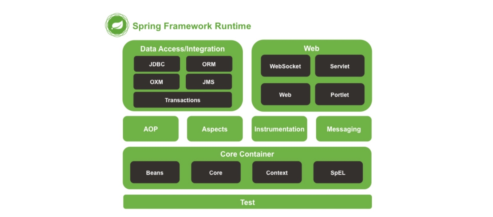

## 01-Spring IOC 导读


### 一、简介
Spring 是一个轻量级的企业级应用开发框架，于2004年由 Rod Johnson 发布了1.0版本。经过十几年的迭代，现在的 Spring 框架已经非常成熟了。
Spring 框架包含了众多模块，包括但不限于 Core、Bean、Context、AOP、Web等。在今天，我们完全可以使用 Spring 提供的一站式解决方案开发出
我们所需要的应用。作为 Java 程序员，我们会经常和 Sprring 框架打交道，所以还是很有必要弄懂Spring 的原理。

本文着重介绍 Spring 的一些使用方法和特性，为后续的代码分析文章做铺垫。另外需要另外说明一下，本系列的源码解析文章是基于 Spring 4.3.17.RELEASE
版本编写的，而非最新的5.0.6.RELEASE 版本。


### 二、Spring 模块结构


从上图可以看出Core Container 处于整个框架的最层（忽略Test模块）。在其上还有AOP、Data、Web等模块。

### 三、Spring IOC 部分特性介绍 

#### 3.1、alias
alias 中文意思是别名。在 Spring 中，可以使用 alias 标签给 bean 起一个别名。
```
<bean id="hello" class="com.payn.spring.alias.HelloWorld">
    <property name="user" value="hello"/>
</bean>
<alias name="hello" alias="alias-hello"/>
<alias name="alias-hello" alias="double-alias-hello"/>
```

#### 3.2、autowire
即自动注入的意思。通过 autowire 特性，我们就不用再显式地配置 bean 之间的依赖。把依赖的发现过河注入都交给 Spring 去处理。
autowire 几个可选项，比如 byType、byName、constructor 等。

在 bean 配置中 autowire = byName 时，Spring 会首先通过反射获取该 bean 所依赖的bean 的名字。
（beanName），然后再通过调用 BeanFactory.getName(beanName) 方法即可获取对应的依赖实例。autowire = byName 原理大致就是这样。

```
@Target({ElementType.CONSTRUCTOR, ElementType.METHOD, ElementType.PARAMETER, ElementType.FIELD, ElementType.ANNOTATION_TYPE})
@Retention(RetentionPolicy.RUNTIME)
@Documented
public @interface Autowired {
    boolean required() default true;
}
```

#### 3.3、FactoryBean

由测试结果可以看到，当我们调用 getBean(“helloFactory”) 时，ApplicationContext 会返回一个 Hello 对象，该对象是 HelloFactoryBean 的 getObject 方法所创建的。
如果我们想获取 HelloFactoryBean 本身，则可以在 helloFactory 前加上一个前缀&，即&helloFactory。


#### 3.4、factory-method

factory-method 可用于标识静态工厂的工厂方法（工厂方法是静态的）。


#### 3.5、lookup-method

##### 3.5.1、实现 ApplicationContextAware 接口

##### 3.5.2、使用lookup-method 特性


#### 3.6、depends-on
当一个 bean 直接依赖另一个 bean，可以使用</ref>标签及逆行配置，但是如果某个bean不直接依赖某个bean，
但是又需要其他 bean 先实例化好，这时候就需要使用 depends-on 特性了。

这里有两个简单的类，其中 Hello 需要 World 在其之前完成实例化。相关配置如下：
```
<bean id="hello" class="xyz.coolblog.depnedson.Hello" depends-on="world"/>
<bean id="world" class="xyz.coolblog.depnedson.World" />
```

#### 3.7、BeanPostProcessor
BeanPostProcessor 是 bean  实例化时的后置处理器，包含两个方法
```
public interface BeanPostProcessor {
    // bean 初始化前的回调方法
    Object postProcessBeforeInitialization(Object bean, String beanName) throws BeansException;

    // bean 初始化后的回调方法    
    Object postProcessAfterInitialization(Object bean, String beanName) throws BeansException;

}
```
BeanPostprocessor 是Spring框架的一个扩展点，通过实现 BeanPostProcessor 接口，我们可以插手 bean实例化的过程。
比如熟悉的 AOP 就是在 bean 实例化后期间将切面逻辑织入 bean 实例中的。
AOP 也正式通过 BeanPostProcessor 和IOC 容器建立起了联系。

与 BeanPostProcessor 类似的还有一个叫BeanFactoryPostProcessor 扩展点，用户可以通过这个扩展点查收容器启动的过程。


#### 3.8、BeanFactoryAware
Spring 中定义了一系列的 Aware 接口，比如这里的 BeanFactoryAware ，以及BeanNameAware 和 BeanClassLoaderAware 等等。
通过实现这些 Aware 接口，我们可以在运行时获取一些配置信息或其他的一些信息。比如实现 BeanNameAware 接口，我们可以
获取bean的配置名称（beanName）。通过实现BeanFactoryAware接口，我们可以在运行时获取BeanFactory实例。


