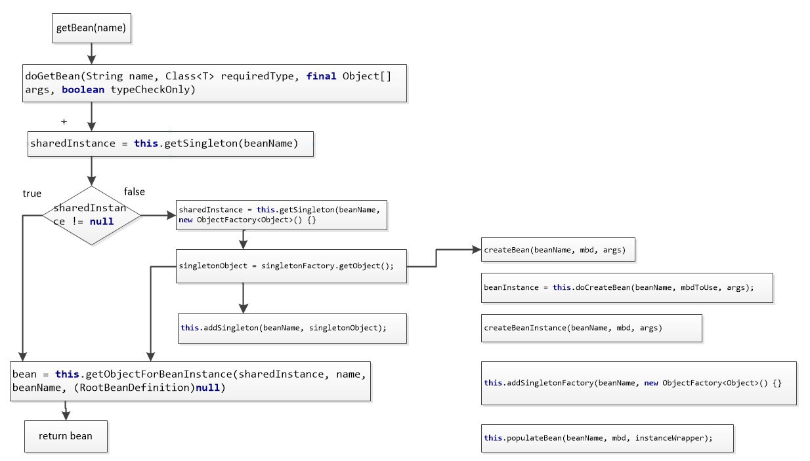
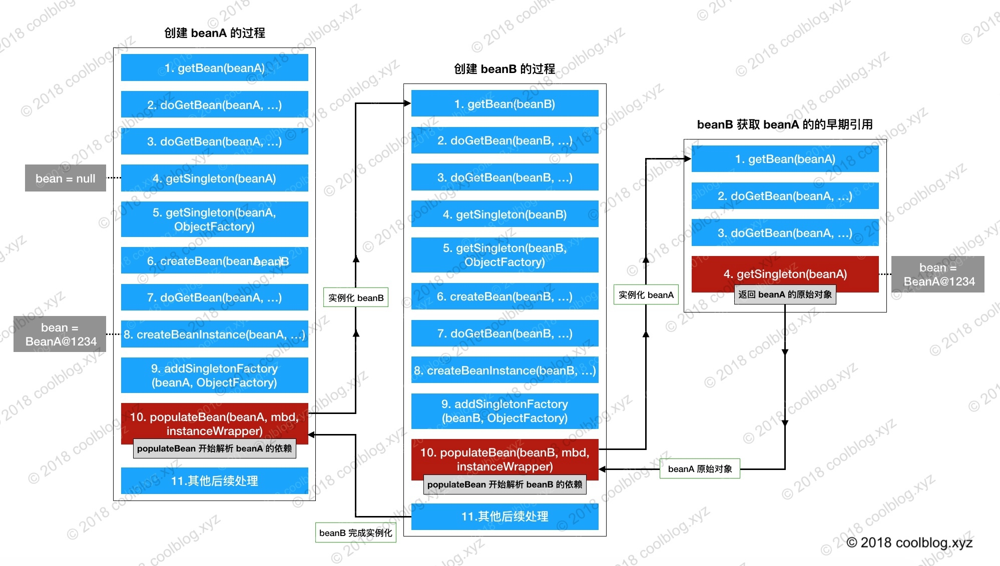

## 05-Spring IOC 容器--循环依赖的解决方法

### 一、简介
本文介绍 Spring 是如何解决循环依赖问题的。
首先介绍一下什么是循环依赖，然后进入源码分析阶段。
为了更好的说明 Spring 解决循环依赖的办法，会从获取 bean 的方法getBean(String)开始，把整个调用过程梳理一遍。梳理完后，再来详细分析源码。

### 二、背景知识
#### 2.1、什么是循环依赖
所谓的循环依赖是指，A 依赖 B，B 又依赖 A，它们之间形成了循环依赖。或者是 A 依赖 B，B 依赖 C，C 又依赖 A。
```
<bean id="beanA" class="com.payn.spring.circular01.BeanA">
    <property name="beanB" ref="beanB"/>
</bean>
<bean id="beanB" class="com.payn.spring.circular01.BeanB">
    <property name="beanA" ref="beanA"/>
</bean>
```
IOC 容器在读到上面的配置时，会按照顺序，先去实例化 beanA。然后发现 beanA 依赖于 beanB，接在又去实例化 beanB。实例化 beanB 时，发现 beanB 又依赖于 beanA。如果容器不处理循环依赖的话，容器会无限执行上面的流程，直到内存溢出，程序崩溃。
当然，Spring 是不会让这种情况发生的。
在容器再次发现 beanB 依赖于 beanA 时，容器会获取 beanA 对象的一个早期的引用（**early reference**），并把这个早期引用注入到 beanB 中，让 beanB 先完成实例化。beanB 完成实例化，beanA 就可以获取到 beanB 的引用，beanA 随之完成实例化。

#### 2.2、一些缓存的介绍
先看一组缓存的定义：
```
DefaultSingletonBeanRegistry:
/** Cache of singleton objects: bean name --> bean instance */
private final Map<String, Object> singletonObjects = new ConcurrentHashMap(256);

/** Cache of singleton factories: bean name --> ObjectFactory */
private final Map<String, ObjectFactory<?>> singletonFactories = new HashMap(16);

/** Cache of early singleton objects: bean name --> bean instance */
private final Map<String, Object> earlySingletonObjects = new HashMap(16);
```

上述缓存变量的用途：
```
缓存	                    用途
singletonObjects	    用于存放完全初始化好的 bean，从该缓存中取出的 bean 可以直接使用
earlySingletonObjects	存放原始的 bean 对象（尚未填充属性），用于解决循环依赖
singletonFactories	    存放 bean 工厂对象，用于解决循环依赖
```
上文提到了 早期引用，所谓的 早期引用 是指向原始对象的引用。
所谓的 原始对象 是指刚创建好的对象，但还未填充属性。


#### 2.3、回顾一下获取 bean 的过程
从 Spring IOC 容器中获取 bean 实例的流程。


如上图所示，getSingleton 会在内部先调用 getObject 创建 sginletonObject，然后再调用 addsingleton 将 singletopnObject 放入缓存中。
getObject 在内部调用了 createBean 方法，该方法的逻辑更多是卸载 doCreateBean 方法中。
都先调用 createBeanInstance 方法创建一个原始的 bean 对象，随后调用 addSingletonFactory 方法想缓存中添加单例 bean 工厂，该工厂可以获取原始对象的调用，
也就是所谓的 早期引用。
在之后，调用 populateBean  方法向原始 bean 对象中填充属性，并解析依赖。
getObject 执行完成后，会返回完全实例化好的 bean，紧接着调用 addSingleton 吧完全实例化好的 bean 对象放入缓存中。


### 三、源码分析
```
protected <T> T doGetBean(
            final String name, final Class<T> requiredType, final Object[] args, boolean typeCheckOnly)
            throws BeansException {

    // ...... 
    
    // 从缓存中获取 bean 实例
    Object sharedInstance = getSingleton(beanName);

    // ......
}


public Object getSingleton(String beanName) {
    return getSingleton(beanName, true);
}


protected Object getSingleton(String beanName, boolean allowEarlyReference) {
    // 从 singletonObjects 获取实例，singletonObjects 中的实例都是准备好的 bean 实例，可以直接使用
    Object singletonObject = this.singletonObjects.get(beanName);
    // 判断 beanName 对应的 bean 是否正在创建中
    if (singletonObject == null && isSingletonCurrentlyInCreation(beanName)) {
        synchronized (this.singletonObjects) {
            // 从 earlySingletonObjects 中获取提前曝光的 bean
            singletonObject = this.earlySingletonObjects.get(beanName);
            if (singletonObject == null && allowEarlyReference) {
                // 获取相应的 bean 工厂
                ObjectFactory<?> singletonFactory = this.singletonFactories.get(beanName);
                if (singletonFactory != null) {
                    // 提前曝光 bean 实例（raw bean），用于解决循环依赖
                    singletonObject = singletonFactory.getObject();
                    
                    // 将 singletonObject 放入缓存中，并将 singletonFactory 从缓存中移除
                    this.earlySingletonObjects.put(beanName, singletonObject);
                    this.singletonFactories.remove(beanName);
                }
            }
        }
    }
    return (singletonObject != NULL_OBJECT ? singletonObject : null);
}
```
上面的源码，doGetBean 所调用的方法 getSibgleton(String)是一个空客方法，其主要的逻辑在 getsingleton(String,bollean)中。

首先从 singletonObjects 缓存中获取 bean 实例。若未命中，再去 earlySingletonObjects 缓存中获取原始 bean 实例。如果仍未命中，则从 singletonFactory 缓存中获取 ObjectFactory 对象，然后再调用 getObject 方法获取原始 bean 实例的应用，也就是早期引用。
获取成功后，将该实例放入 earlySingletonObjects 缓存中，并将 ObjectFactory 对象从 singletonFactories 移除。

再来看看 getSingleton(String, ObjectFactory) 方法，这个方法也是在 doGetBean 中被调用的。这次我会把 doGetBean 的代码多贴一点出来，如下：
```
protected <T> T doGetBean(
        final String name, final Class<T> requiredType, final Object[] args, boolean typeCheckOnly)
        throws BeansException {

    // ...... 
    Object bean;

    // 从缓存中获取 bean 实例
    Object sharedInstance = getSingleton(beanName);

    // 这里先忽略 args == null 这个条件
    if (sharedInstance != null && args == null) {
        // 进行后续的处理
        bean = getObjectForBeanInstance(sharedInstance, name, beanName, null);
    } else {
        // ......

        // mbd.isSingleton() 用于判断 bean 是否是单例模式
        if (mbd.isSingleton()) {
            // 再次获取 bean 实例
            sharedInstance = getSingleton(beanName, new ObjectFactory<Object>() {
                @Override
                public Object getObject() throws BeansException {
                    try {
                        // 创建 bean 实例，createBean 返回的 bean 是完全实例化好的
                        return createBean(beanName, mbd, args);
                    } catch (BeansException ex) {
                        destroySingleton(beanName);
                        throw ex;
                    }
                }
            });
            // 进行后续的处理
            bean = getObjectForBeanInstance(sharedInstance, name, beanName, mbd);
        }

        // ......
    }

    // ......

    // 返回 bean
    return (T) bean;
}
```

```
public Object getSingleton(String beanName, ObjectFactory<?> singletonFactory) {
    synchronized (this.singletonObjects) {

        // ......
        
        // 调用 getObject 方法创建 bean 实例
        singletonObject = singletonFactory.getObject();
        newSingleton = true;

        if (newSingleton) {
            // 添加 bean 到 singletonObjects 缓存中，并从其他集合中将 bean 相关记录移除
            addSingleton(beanName, singletonObject);
        }

        // ......
        
        // 返回 singletonObject
        return (singletonObject != NULL_OBJECT ? singletonObject : null);
    }
}

protected void addSingleton(String beanName, Object singletonObject) {
    synchronized (this.singletonObjects) {
        // 将 <beanName, singletonObject> 映射存入 singletonObjects 中
        this.singletonObjects.put(beanName, (singletonObject != null ? singletonObject : NULL_OBJECT));

        // 从其他缓存中移除 beanName 相关映射
        this.singletonFactories.remove(beanName);
        this.earlySingletonObjects.remove(beanName);
        this.registeredSingletons.add(beanName);
    }
}
```
上面的代码中包含两步操作，第一步操作是调用 getObject 创建 bean 实例，第二步是调用 addSingleton 方法将创建好的 bean 放入缓存中。

doCreateBean 中的一些逻辑。如下：
```
protected Object doCreateBean(final String beanName, final RootBeanDefinition mbd, final Object[] args)
        throws BeanCreationException {

    BeanWrapper instanceWrapper = null;

    // ......

    // ☆ 创建 bean 对象，并将 bean 对象包裹在 BeanWrapper 对象中返回
    instanceWrapper = createBeanInstance(beanName, mbd, args);
    
    // 从 BeanWrapper 对象中获取 bean 对象，这里的 bean 指向的是一个原始的对象
    final Object bean = (instanceWrapper != null ? instanceWrapper.getWrappedInstance() : null);

    /*
     * earlySingletonExposure 用于表示是否”提前暴露“原始对象的引用，用于解决循环依赖。
     * 对于单例 bean，该变量一般为 true。更详细的解释可以参考我之前的文章
     */ 
    boolean earlySingletonExposure = (mbd.isSingleton() && this.allowCircularReferences &&
            isSingletonCurrentlyInCreation(beanName));
    if (earlySingletonExposure) {
        // ☆ 添加 bean 工厂对象到 singletonFactories 缓存中
        addSingletonFactory(beanName, new ObjectFactory<Object>() {
            @Override
            public Object getObject() throws BeansException {
                /* 
                 * 获取原始对象的早期引用，在 getEarlyBeanReference 方法中，会执行 AOP 
                 * 相关逻辑。若 bean 未被 AOP 拦截，getEarlyBeanReference 原样返回 
                 * bean，所以大家可以把 
                 *      return getEarlyBeanReference(beanName, mbd, bean) 
                 * 等价于：
                 *      return bean;
                 */
                return getEarlyBeanReference(beanName, mbd, bean);
            }
        });
    }

    Object exposedObject = bean;

    // ......
    
    // ☆ 填充属性，解析依赖
    populateBean(beanName, mbd, instanceWrapper);

    // ......

    // 返回 bean 实例
    return exposedObject;
}

protected void addSingletonFactory(String beanName, ObjectFactory<?> singletonFactory) {
    synchronized (this.singletonObjects) {
        if (!this.singletonObjects.containsKey(beanName)) {
            // 将 singletonFactory 添加到 singletonFactories 缓存中
            this.singletonFactories.put(beanName, singletonFactory);

            // 从其他缓存中移除相关记录，即使没有
            this.earlySingletonObjects.remove(beanName);
            this.registeredSingletons.add(beanName);
        }
    }
}
```
主要流程：
```
1. 创建原始 bean 实例 → createBeanInstance(beanName, mbd, args)
2. 添加原始对象工厂对象到 singletonFactories 缓存中 
        → addSingletonFactory(beanName, new ObjectFactory<Object>{...})
3. 填充属性，解析依赖 → populateBean(beanName, mbd, instanceWrapper)
```

上述分析有几个关键的地方：   
1、创建原始 bean 对象
```
instanceWrapper = createBeanInstance(beanName, mbd, args);
final Object bean = (instanceWrapper != null ? instanceWrapper.getWrappedInstance() : null);
```
假设 beanA 先被创建，创建后的原始对象为 BeanA@1234，上面代码中的 bean 变量指向就是这个对象。

2、暴露早期引用
```
addSingletonFactory(beanName, new ObjectFactory<Object>() {
    @Override
    public Object getObject() throws BeansException {
        return getEarlyBeanReference(beanName, mbd, bean);
    }
});
```
beanA 指向的原始对象创建好后，就开始把指向原始对象的引用通过 ObjectFactory 暴露出去。getEarlyBeanReference 方法的第三个参数 bean 指向的正是 createBeanInstance 方法创建出原始 bean 对象 BeanA@1234。

3、解析依赖
```
populateBean(beanName, mbd, instanceWrapper);
```
populateBean 用于向 beanA 这个原始对象中填充属性，当它检测到 beanA 依赖于 beanB 时，会首先去实例化 beanB。beanB 在此方法处也会解析自己的依赖，当它检测到 beanA 这个依赖，于是调用 BeanFactry.getBean(“beanA”) 这个方法，从容器中获取 beanA。


4、获取早期引用
```
protected Object getSingleton(String beanName, boolean allowEarlyReference) {
    Object singletonObject = this.singletonObjects.get(beanName);
    if (singletonObject == null && isSingletonCurrentlyInCreation(beanName)) {
        synchronized (this.singletonObjects) {
            // ☆ 从缓存中获取早期引用
            singletonObject = this.earlySingletonObjects.get(beanName);
            if (singletonObject == null && allowEarlyReference) {
                ObjectFactory<?> singletonFactory = this.singletonFactories.get(beanName);
                if (singletonFactory != null) {
                    // ☆ 从 SingletonFactory 中获取早期引用
                    singletonObject = singletonFactory.getObject();
                    
                    this.earlySingletonObjects.put(beanName, singletonObject);
                    this.singletonFactories.remove(beanName);
                }
            }
        }
    }
    return (singletonObject != NULL_OBJECT ? singletonObject : null);
}
```

流程：



