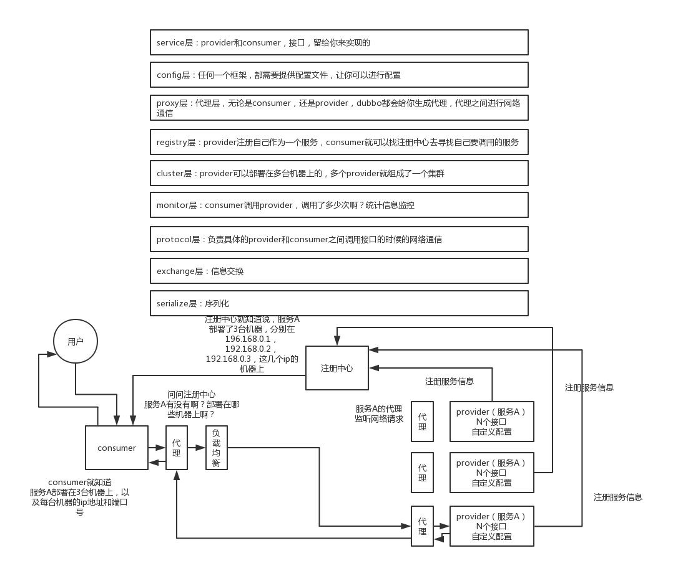

# 26-Dubbo工作原理

dubbo 的工作原理？注册中心挂了可以继续通信吗？rpc 请求的流程？

### 分析
MQ、ES、Redis、Dubbo，上来先问你一些**思考性的问题**、**原理**，比如 kafka 高可用架构原理、es 分布式架构原理、redis 线程模型原理、Dubbo 工作原理；之后就是生产环境里可能会碰到的一些问题，因为每种技术引入之后生产环境都可能会碰到一些问题；再来点综合的，就是系统设计，比如让你设计一个 MQ、设计一个搜索引擎、设计一个缓存、设计一个 rpc 框架等等。

那既然开始聊分布式系统了，自然重点先聊聊 dubbo 了，毕竟 dubbo 是目前事实上大部分公司的分布式系统的 rpc 框架标准，基于 dubbo 也可以构建一整套的微服务架构。但是需要自己大量开发。

当然去年开始 spring cloud 非常火，现在大量的公司开始转向 spring cloud 了，spring cloud 人家毕竟是微服务架构的全家桶式的这么一个东西。但是因为很多公司还在用 dubbo，所以 dubbo 肯定会是目前面试的重点，何况人家 dubbo 现在重启开源社区维护了，捐献给了 apache，未来应该也还是有一定市场和地位的。

既然聊 dubbo，那肯定是先从 dubbo 原理开始聊了，你先说说 dubbo 支撑 rpc 分布式调用的架构啥的，然后说说一次 rpc 请求 dubbo 是怎么给你完成的，对吧。

### dubbo 工作原理
- 第一层：service 层，接口层，给服务提供者和消费者来实现的
- 第二层：config 层，配置层，主要是对 dubbo 进行各种配置的
- 第三层：proxy 层，服务代理层，无论是 consumer 还是 provider，dubbo 都会给你生成代理，代理之间进行网络通信
- 第四层：registry 层，服务注册层，负责服务的注册与发现
- 第五层：cluster 层，集群层，封装多个服务提供者的路由以及负载均衡，将多个实例组合成一个服务
- 第六层：monitor 层，监控层，对 rpc 接口的调用次数和调用时间进行监控
- 第七层：protocal 层，远程调用层，封装 rpc 调用
- 第八层：exchange 层，信息交换层，封装请求响应模式，同步转异步
- 第九层：transport 层，网络传输层，抽象 mina 和 netty 为统一接口
- 第十层：serialize 层，数据序列化层

### 工作流程
- 第一步：provider 向注册中心去注册
- 第二步：consumer 从注册中心订阅服务，注册中心会通知 consumer 注册好的服务
- 第三步：consumer 调用 provider
- 第四步：consumer 和 provider 都异步通知监控中心

### 注册中心挂了可以继续通信吗？
可以，因为刚开始初始化的时候，消费者会将提供者的地址等信息**拉取到本地缓存**，所以注册中心挂了可以继续通信。

