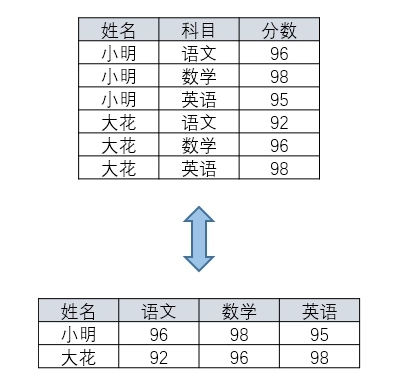
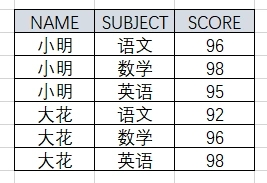
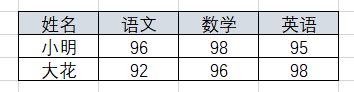

# 04-Oracle行转列


行列转换就是如下图所示两种展示形式的互相转换：  


行转列，假如我们有下表：   
  

```sql
SELECT *  
FROM student  
PIVOT (  
SUM(score) FOR subject IN (语文, 数学, 英语)  
)  
```
通过上面 SQL 语句即可得到下面的结果：   
  


PIVOT 后跟一个聚合函数来拿到结果，FOR 后面跟的科目是我们要转换的列，这样的话科目中的语文、数学、英语就就被转换为列。IN 后面跟的就是具体的科目值。   
当然我们也可以用 CASE WHEN 得到同样的结果，就是写起来麻烦一点。
```sql
SELECT name,  
MAX(  
CASE  
WHEN subject='语文'  
THEN score  
ELSE 0  
END) AS "语文",  
MAX(  
CASE  
WHEN subject='数学'  
THEN score  
ELSE 0  
END) AS "数学",  
MAX(  
CASE  
WHEN subject='英语'  
THEN score  
ELSE 0  
END) AS "英语"  
FROM student  
GROUP BY name
```

列转行，假设我们有下表 student1    
  
```sql
SELECT *  
FROM student1  
UNPIVOT (  
score FOR subject IN ("语文","数学","英语")  
)  
```

我们也可以使用下面方法得到同样结果
```sql
SELECT  
NAME,  
'语文' AS subject ,  
MAX("语文") AS score  
FROM student1 GROUP BY NAME  
UNION  
SELECT  
NAME,  
'数学' AS subject ,  
MAX("数学") AS score  
FROM student1 GROUP BY NAME  
UNION  
SELECT  
NAME,  
'英语' AS subject ,  
MAX("英语") AS score  
FROM student1 GROUP BY NAME 
```


