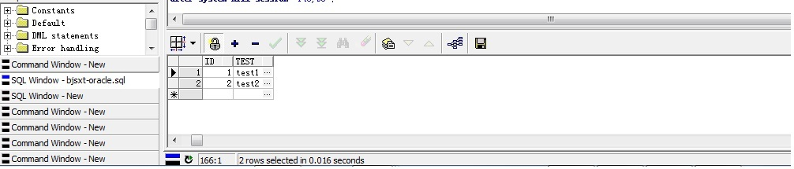
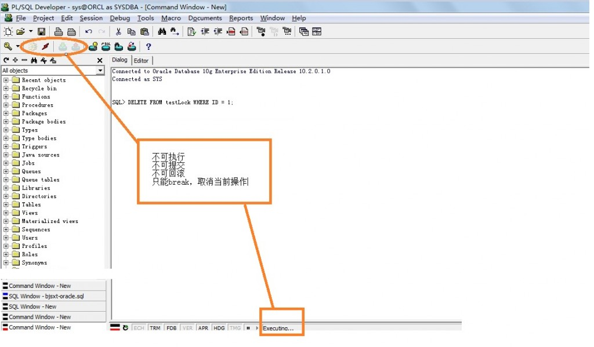
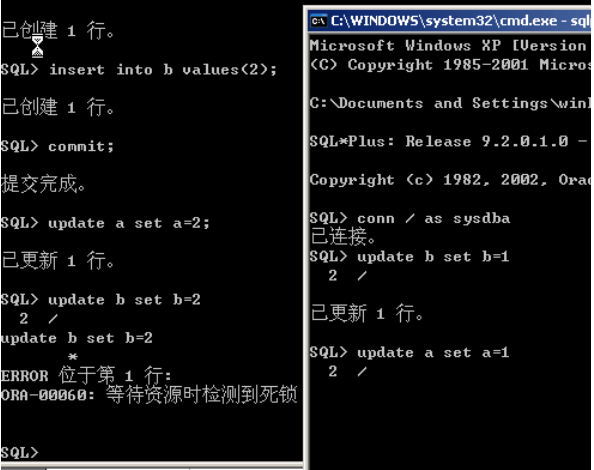
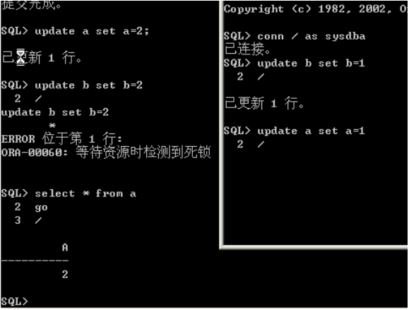
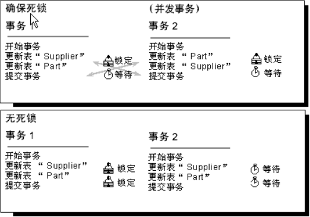
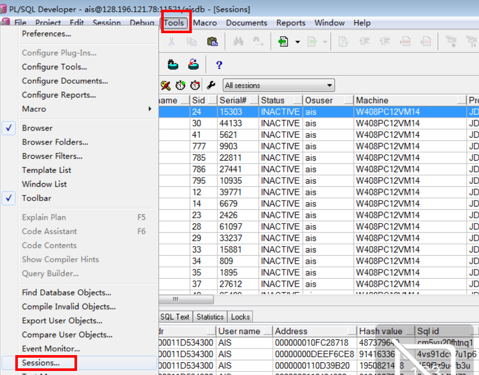

# 07-killsession&死锁

## 常用的会话查询SQL如下：  
```sql
-- 查询所有会话
select * from v$session where username is not null order by logon_time, sid
-- 查询用户会话
select * from v$session where username = user order by logon_time, sid
-- 查询活动会话
select * from v$session where username is not null and status = 'ACTIVE' order by logon_time, sid
```
或者：tool-->session


## 死锁以及解决方法
### 一、删除和更新之间引起的死锁   
造成死锁的原因就是多个线程或进程对同一个资源的争抢或相互依赖。这里列举一个对同一个资源的争抢造成死锁的实例。   
```sql
--Oracle 10g, PL/SQL version 9.2
CREATE TABLE testLock(  ID NUMBER, 
test VARCHAR(100)  ) 
COMMIT  

INSERT INTO testLock VALUES(1,'test1'); 
INSERT INTO testLock VALUES(2,'test2'); 
COMMIT; 
SELECT * FROM testLock 
```

## 死锁现象的重现：   
1) 在sql 窗口 执行：SELECT * FROM testLock FOR UPDATE; -- 加行级锁 并对内容进行修改，不要提交。      


2) 另开一个command窗口，执行：delete from testLock WHERE ID=1;   
此时发生死锁（注意此时要另开一个窗口，不然会提示：POST THE CHANGE RECORD TO THE DATABASE. 点yes 后强制commit）：   


3) 死锁查看：
```sql
select s.username,l.object_id, l.session_id,s.serial#, 
s.lockwait,s.status,s.machine,s.program from v$session s,
v$locked_object l 
where s.sid = l.session_id;
```
字段说明：
```
Username：死锁语句所用的数据库用户；
SID: session identifier， session 标示符，session 是通信双方从开始通信到通信结束期间的一个上下文。
SERIAL#: sid 会重用，但是同一个sid被重用时，serial#会增加，不会重复。
Lockwait：可以通过这个字段查询出当前正在等待的锁的相关信息。
Status：用来判断session状态。Active：正执行SQL语句。Inactive：等待操作。Killed：被标注为删除。
Machine： 死锁语句所在的机器。
Program： 产生死锁的语句主要来自哪个应用程序。
```

4) 查看引起死锁的语句：
```sql
select sql_text from v$sql where hash_value in   
(select sql_hash_value from v$session where sid in  
(select session_id from v$locked_object)); 
```

5) 死锁的处理：
```sql
alter system kill session '144,145';  
```
此时在执行delete语句的窗口出现：
```sql
delete from testLock where  ID = 1;  
-->
delete from testLock where  ID = 1  
ORA-00028: 您的会话己被终止  
```
再查看一下死锁，会发现已经没有stauts为active的记录了：
```sql
select s.username, l.session_id,s.serial#, s.lockwait,s.status,s.machine,s.program from v$session s,v$locked_object l where s.sid = l.session_id;  
```
发生死锁的语句已经被终止。

### 二、在外键上没有加索引引起的死锁
客户的10.2.0.4 RAC for AIX环境频繁出现ORA-60死锁问题，导致应用程序无法顺利执行。   
经过一系列的诊断，发现最终问题是由于外键上没有建立索引所致，由于程序在主子表上删除数据，缺少索引导致行级锁升级为表级锁，最终导致大量的锁等待和死锁。    

下面通过一个例子简单模拟一下问题： 
```sql
SQL> create table t_p (id number primary key, name varchar2(30)); 
Table created. 
SQL> create table t_f (fid number, f_name varchar2(30), foreign key (fid) references t_p); 
Table created. 
SQL> insert into t_p values (1, 'a'); 
1 row created. 
SQL> insert into t_f values (1, 'a'); 
1 row created. 
SQL> insert into t_p values (2, 'b'); 
1 row created. 
SQL> insert into t_f values (2, 'c'); 
1 row created. 
SQL> commit; 
Commit complete. 
SQL> delete t_f where fid = 2; 
1 row deleted. 
```
这时在会话2同样对子表进行删除：
```sql
SQL2> delete t_f where fid = 1; 
1 row deleted. 
```
回到会话1执行主表的删除： 
```sql
SQL> delete t_p where id = 2; 
```
会话被锁，回到会话2执行主表的删除：
```sql
SQL2> delete t_p where id = 1; 
```
会话同样被锁，这时会话1的语句被回滚，出现ORA-60死锁错误：
```sql
delete t_p where id = 2 
* 
ERROR at line 1: 
ORA-00060: deadlock detected while waiting for resource 
SQL> rollback; 
Rollback complete. 
```
将会话1操作回滚，会话2同样回滚并建立外键列上的索引： 
```sql
1 row deleted. 
SQL2> rollback; 
Rollback complete. 
SQL2> create index ind_t_f_fid on t_f(fid); 
Index created. 
```
重复上面的步骤会话1删除子表记录： 
```sql
SQL> delete t_f where fid = 2; 
1 row deleted. 
```
会话2删除子表记录： 
```sql
SQL2> delete t_f where fid = 1; 
1 row deleted. 
```
会话1删除主表记录： 
```sql
SQL> delete t_p where id = 2; 
1 row deleted. 
```
会话2删除主表记录： 
```sql
SQL> delete t_p where id = 1; 
1 row deleted. 
```
所有的删除操作都可以成功执行，关于两种情况下锁信息的不同这里就不深入分析了，重点就是在外键列上建立索引。    
虽然有一些文章提到过，如果满足某些情况，可以不在外键列上建立的索引，但是我的观点一向是，既然创建了外键，就不要在乎再多一个索引，因为一个索引所增加的代价，与缺失这个索引所带来的问题相比，是微不足道的。   
```sql
【补充】Oracle 10g和Oracle 9i trc日志内容的差别 
最主要的差别是在Oracle 10g中提示了等待资源的两条sql语句，在Oracle 9i中，只显示检测到死锁的sql语句 
Oracle 10g 10.2.0.3.0：
DEADLOCK DETECTED ( ORA-00060 )
[Transaction Deadlock]
The following deadlock is not an ORACLE error. It is a
deadlock due to user error in the design of an application
or from issuing incorrect ad-hoc SQL. The following
information may aid in determining the deadlock:
Deadlock graph:
                       ---------Blocker(s)--------  ---------Waiter(s)---------
Resource Name          process session holds waits  process session holds waits
TM-0000dd55-00000000        16     146    SX   SSX       17     148    SX   SSX
TM-0000dd55-00000000        17     148    SX   SSX       16     146    SX   SSX
session 146: DID 0001-0010-00000008	session 148: DID 0001-0011-00000006
session 148: DID 0001-0011-00000006	session 146: DID 0001-0010-00000008
Rows waited on:
Session 148: no row
Session 146: no row
Information on the OTHER waiting sessions:
Session 148:
  pid=17 serial=39 audsid=540046 user: 54/SCOTT
  O/S info: user: SKYHOME\sky, term: SKYHOME, ospid: 3028:7000, machine: WORKGROUP\SKYHOME
            program: plsqldev.exe
  application name: PL/SQL Developer, hash value=1190136663
  action name: Command Window - New, hash value=254318129
  Current SQL Statement:
  
delete t_p where id = 1
End of information on OTHER waiting sessions.
Current SQL statement for this session:
delete t_p where id = 2


Oracle 9i 9.2.0.7.0：
DEADLOCK DETECTED
Current SQL statement for this session:
delete t_p where id = 2
The following deadlock is not an ORACLE error. It is a
deadlock due to user error in the design of an application
or from issuing incorrect ad-hoc SQL. The following
information may aid in determining the deadlock:
Deadlock graph:
                       ---------Blocker(s)--------  ---------Waiter(s)---------
Resource Name          process session holds waits  process session holds waits
TM-0000260e-00000000        21      51    SX   SSX       23      20    SX   SSX
TM-0000260e-00000000        23      20    SX   SSX       21      51    SX   SSX
session 51: DID 0001-0015-0000043D	session 20: DID 0001-0017-00000397
session 20: DID 0001-0017-00000397	session 51: DID 0001-0015-0000043D
Rows waited on:
Session 20: no row
Session 51: no row
Information on the OTHER waiting sessions:
Session 20:
  pid=23 serial=53179 audsid=197296 user: 87/scott
  O/S info: user: sky, term: SKYHOME, ospid: 5540:4984, machine: WORKGROUP\SKYHOME
            program: plsqldev.exe
  client info: 127.0.0.1
  application name: PL/SQL Developer, hash value=1190136663
  action name: Command Window - New, hash value=254318129
  Current SQL Statement:
  
delete t_p where id = 1
End of information on OTHER waiting sessions.
```

### 三、两个表之前不同顺序之间的相互更新操作引起的死锁
 Oracle中的死锁：   


注：4个update语句的执行顺序按图中位置自上而下     
图中左边会话中断(此时不回滚也不提交，等待用户决定)，右边会话阻塞，等待左边会话释放a表上的锁。如图： 



## 死锁解决方法
1、将死锁减至最少 虽然不能完全避免死锁，但可以使死锁的数量减至最少。将死锁减至最少可以增加事务的吞吐量并减少系统开销，因为只有很少的事务：  
```
回滚，而回滚会取消事务执行的所有工作。
由于死锁时回滚而由应用程序重新提交。  
下列方法有助于最大限度地降低死锁：  
按同一顺序访问对象。 
避免事务中的用户交互。 
保持事务简短并在一个批处理中。 
使用低隔离级别。 
使用绑定连接。 
```

2、按同一顺序访问对象   
如果所有并发事务按同一顺序访问对象，则发生死锁的可能性会降低。例如，如果两个并发事务获得 Supplier 表上的锁，然后获得 Part 表上的锁，则在其中一个事务完成之前，另一个事务被阻塞在 Supplier 表上。第一个事务提交或回滚后，第二个事务继续进行。不发生死锁。将存储过程用于所有的数据修改可以标准化访问对象的顺序。    


3、避免事务中的用户交互   
避免编写包含用户交互的事务，因为运行没有用户交互的批处理的速度要远远快于用户手动响应查询的速度，例如答复应用程序请求参数的提示。例如，如果事务正在等待用户输入，而用户去吃午餐了或者甚至回家过周末了，则用户将此事务挂起使之不能完成。这样将降低系统的吞吐量，因为事务持有的任何锁只有在事务提交或回滚时才会释放。即使不出现死锁的情况，访问同一资源的其它事务也会被阻塞，等待该事务完成。 

4、保持事务简短并在一个批处理中    
在同一数据库中并发执行多个需要长时间运行的事务时通常发生死锁。事务运行时间越长，其持有排它锁或更新锁的时间也就越长，从而堵塞了其它活动并可能导致死锁。 保持事务在一个批处理中，可以最小化事务的网络通信往返量，减少完成事务可能的延迟并释放锁。



