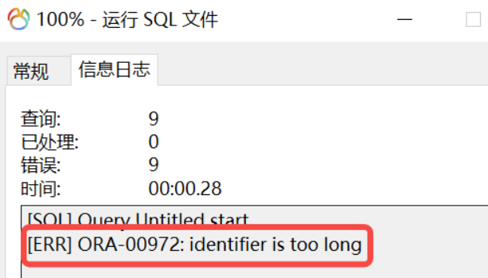
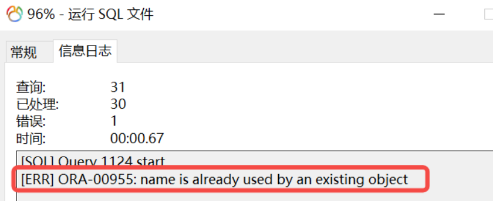
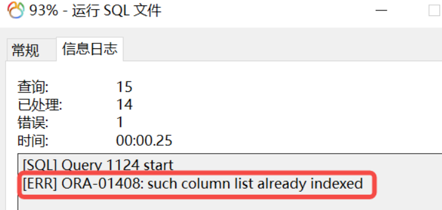
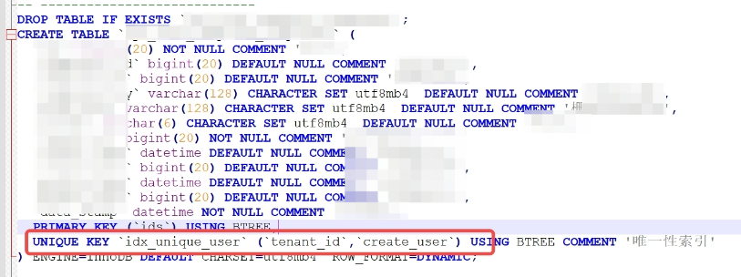
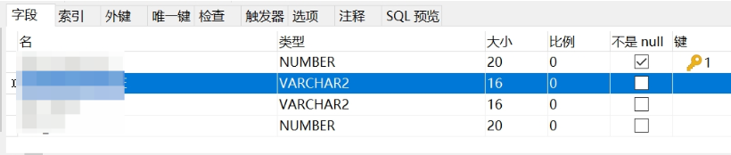

# my-ora数据库转换

## 一、数据库准备


## 二、表结构迁移
### 2.1、命名长度超长
直接运行mysql转为oracle的脚本时，可能会遇到如下问题：    
   
此报错提示“标识符”过长，查询资料得知，Oracle数据库兼容级别在12.2以前，对象名长度只能低于31个字符， 在12.2以上，可以达到128个字符。可能是表名、列名、索引名等过长导致，为了避免此问题，得规范命名，修改超长的表名、列名、索引名。

### 2.2、命名重复

在mysql中，同一个库不同的表中，索引名称是可以重复的；但是在oracle中，一个SCHEMA下的对象是不能用相同的名字命名的，因此索引的名称不能重复。建议统一索引命名规范。

### 2.3、列重复创建索引
   
mysql中，主键列还可以单独创建索引（虽然没有什么意义），但是oracle中不可以在列上重复创建索引，建议删除无效的重复列索引。

### 2.4、创建唯一索引失败
以下类型的唯一索引在oracle中无法创建，mysql的null做比较，既不是等于，也不是不等，比较特别，所以mysql不会有问题，但是在oracle中会用问题，需要将唯一索引改为普通索引
   

### 2.5、模型转换
1、选择mysql库，右击-逆向数据库到模型    
2、选择 转换模型为...        
3、选择对应的数据库版本      
4、选择 导出sql       
5、点击确定保存表结构sql      

### 2.6、脚本大小写处理
导出的oracle的建表语句中，使用了双引号，会使创建出的表名、字段名为小写，会影响程序中的sql操作，需要删除所有的双引号。

### 2.7、字段类型修改
有些版本的navicat会将mysql的char、varchar类型转换为nchar和nvarchar2，这种情况需要将nchar和nvarchar2改为char和varchar2。

### 2.8、varchar2类型长度不够问题
oracle的varchar2类型有两种单位，分别为BYTE和CHAR，默认单位为BYTE；    
    

但是在mysql中，4.1及之后的版本，VARCHAR的单位是字符；4.1之前的版本，VARCHAR的单位是字节。如果原本在mysql中是以字符为单位，那么到oracle中，以字节为单位再去存储原本的数据，就会发生存不下的情况，因此需要修改varchar2的单位为CHAR。  
在脚本开头加入如下sql即可：
```sql
alter session set NLS_LENGTH_SEMANTICS=CHAR;
```

### 2.9、运行脚本
去对应的模式下运行对应的库脚本，至此，oracle的表就创建成功了。


## 三、数据传输
表结构创建好后，开始迁移数据，数据的迁移有两种方式，一种是直接传输，还有一种是导出数据脚本。  

oracle无法一次执行超长insert语句，需要对sql进行处理，如下：   
```sql
insert into TABLE (ID, CONTENT) values (1, "超长内容... ...");
```
此时需要将超长insert语句转换成一条insert语句+多条update语句，如下：   
```sql
INSERT INTO table VALUES (1, '超长内容第一部分');
update table set content = content || '超长内容第二部分';
update table set content = content || '超长内容第三部分';
update table set content = content || '超长内容第四部分';
...
...
update table set content = content || '超长内容最后部分';
```


## 四、语法对比
mysql与oracle中sql语法存在差异，部分代码需要做调整，下面列出可能影响的点。   

### 4.1、函数差异
https://blog.csdn.net/qq_39052947/article/details/128038738

### 4.2、分页差异
```sql
-- mysql-limit语法：
SELECT * from student limit 5; -- 查询前5条数据
SELECT * from student limit 5, 8; -- 从第5(序号从0开始)条开始，查8条记录
 
-- oracle-rownum语法：
SELECT * FROM STUDENT WHERE ROWNUM = 1; -- 查询第一条数据
SELECT * FROM STUDENT WHERE ROWNUM <= 10; -- 获取前10条数据
-- 但rownum不支持查询后几条或第n(n>1)条数据，例如以下sql是不支持的
SELECT * FROM STUDENT WHERE ROWNUM > 2;
SELECT * FROM STUDENT WHERE ROWNUM = 3;
```

### 4.3、连接查询
```sql
-- MySQL使用join来完成连接查询
-- MySQL 左关联
select * from studenta left join studentb on studenta.id=studentb.id;
-- MySQL 右关联
select * from studenta right join studentb on studenta.id=studentb.id;
 
-- Oracle使用(+)来完成连接查询
-- Oracle 左关联
select * from studenta, studentb where studenta.id = studentb.id(+);
-- Oracle 右关联
select * from studenta, studentb where studenta.id(+) = studentb.id;
```

### 4.4、引号的识别
MySQL可识别双引号和单引号，Oracle只能识别单引号。

### 4.5、递归查询
mysql不支持递归查询，但是oracle支持，如下：
```sql
select A.org_id from  org A  
start with           
A.org_id = '1234'
connect by prior        
A.org_id =A.super_org_id
```

### 4.6、插入、删除
```sql
-- mysql
replace into ... ;
insert into ... select ... ;
DELETE FROM student WHERE id = 123;
 
--oracle
merge into ... ;
DELETE FROM student A WHERE A.id = 123;
DELETE student WHERE id = 123;
```


