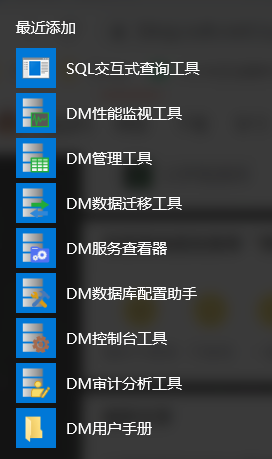

# 01-达梦数据库数据迁移

## 一、达梦数据库安装
安装教程见：   
https://javaforall.cn/140020.html

安装后：  

## 二、数据迁移

https://blog.csdn.net/qq_17082877/article/details/124356171

达梦JAVA程序指定访问模式（模式名含有特殊字符的处理）  
https://blog.csdn.net/backbug/article/details/125387210

Spring boot +Jpa 项目适配达梦8数据库
https://blog.csdn.net/qq_45217886/article/details/126193683

达梦数据库汉字存储知多少
https://eco.dameng.com/community/article/3da38ff847a6806c9ee4cf2af0018af7

mysql8 迁移到 达梦数据库  
https://blog.csdn.net/qq_35273918/article/details/105755731

