# 02-Docker安装

## 一、前提说明
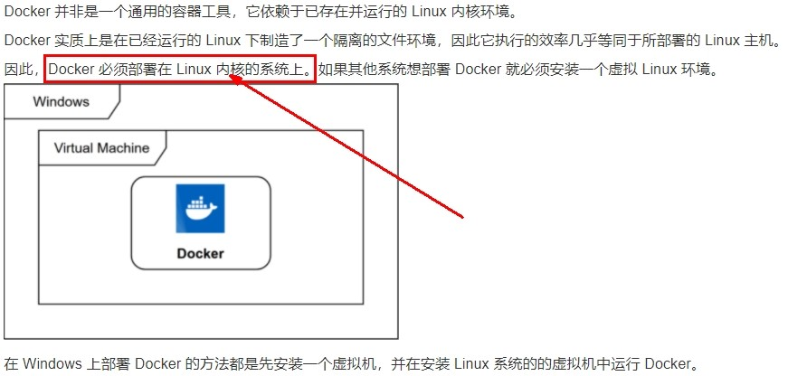  

前提条件  
目前，CentOS 仅发行版本中的内核支持 Docker。Docker 运行在CentOS 7 (64-bit)上，要求系统为64位、Linux系统内核版本为 3.8以上，这里选用Centos7.x。  

查看自己的内核  
uname命令用于打印当前系统相关信息（内核版本号、硬件架构、主机名称和操作系统类型等）。  
```
[root@docker130 ~]# cat /etc/redhat-release 
CentOS Linux release 7.5.1804 (Core) 
[root@docker130 ~]# uname -r
3.10.0-862.el7.x86_64
```

## 二、Docker的基本组成
### 镜像(image)
Docker 镜像（Image）就是一个只读的模板。镜像可以用来创建 Docker 容器，一个镜像可以创建很多容器。  
它也相当于是一个root文件系统。比如官方镜像 centos:7 就包含了完整的一套 centos:7 最小系统的 root 文件系统。  
相当于容器的“源代码”，docker镜像文件类似于Java的类模板，而docker容器实例类似于java中new出来的实例对象。  

### 容器(container)
从面向对象角度   
Docker 利用容器（Container）独立运行的一个或一组应用，应用程序或服务运行在容器里面，容器就类似于一个虚拟化的运行环境，容器是用镜像创建的运行实例。就像是Java中的类和实例对象一样，镜像是静态的定义，容器是镜像运行时的实体。容器为镜像提供了一个标准的和隔离的运行环境，它可以被启动、开始、停止、删除。每个容器都是相互隔离的、保证安全的平台   

从镜像容器角度  
可以把容器看做是一个简易版的 Linux 环境（包括root用户权限、进程空间、用户空间和网络空间等）和运行在其中的应用程序。  

### 仓库(repository)
仓库（Repository）是集中存放镜像文件的场所。  
 
类似于  
Maven仓库，存放各种jar包的地方；  
github仓库，存放各种git项目的地方；  
Docker公司提供的官方registry被称为Docker Hub，存放各种镜像模板的地方。  

仓库分为公开仓库（Public）和私有仓库（Private）两种形式。  
最大的公开仓库是 Docker Hub(https://hub.docker.com/)，  
存放了数量庞大的镜像供用户下载。国内的公开仓库包括阿里云 、网易云等  

## 三、Docker平台架构图解(架构版)
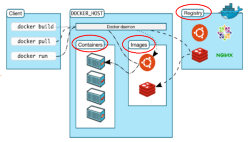  
Docker 是一个 C/S 模式的架构，后端是一个松耦合架构，众多模块各司其职。 
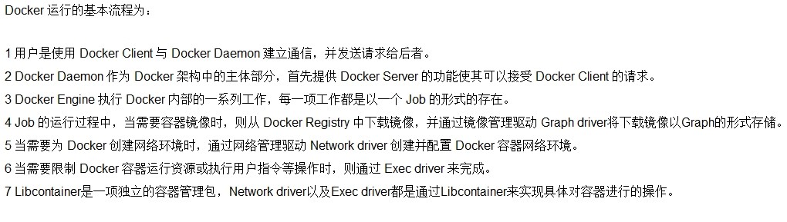  
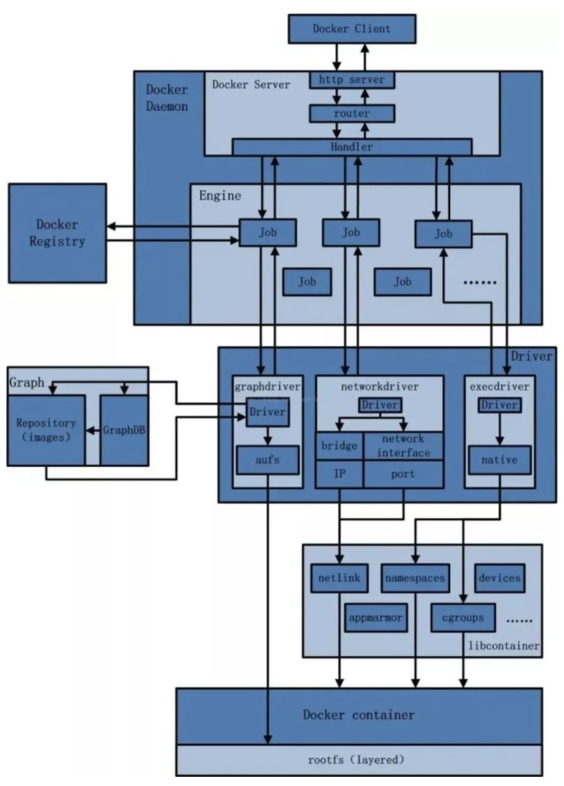  

## 四、安装步骤
https://docs.docker.com/engine/install/centos/

1、确定你是CentOS7及以上版本    
```
cat /etc/redhat-release
```
2、卸载旧版本
https://docs.docker.com/engine/install/centos/  
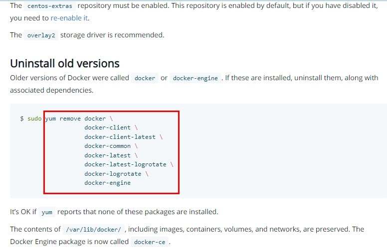  
3、yum安装gcc相关
```
yum -y install gcc
yum -y install gcc-c++
```
4、安装需要的软件包   
官网要求  
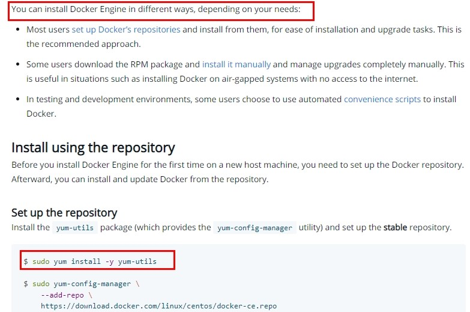  
执行命令  
```
yum install -y yum-utils
```
5、设置stable镜像仓库
不要设置成官网的！！！：   
```
yum-config-manager --add-repo https://download.docker.com/linux/centos/docker-ce.repo

报错：
[Errno 14] curl#35 - TCP connection reset by peer
[Errno 12] curl#35 - Timeout
```
推荐：   
```
yum-config-manager --add-repo http://mirrors.aliyun.com/docker-ce/linux/centos/docker-ce.repo
```
6、更新yum软件包索引
```
yum makecache fast
```
7、安装DOCKER CE
```
yum -y install docker-ce docker-ce-cli containerd.io
```
8、启动docker
```
systemctl start docker
```
9、测试
```
[root@docker130 ~]# docker version
Client: Docker Engine - Community
 Version:           20.10.22
 API version:       1.41
 Go version:        go1.18.9
 Git commit:        3a2c30b
 Built:             Thu Dec 15 22:30:24 2022
 OS/Arch:           linux/amd64
 Context:           default
 Experimental:      true

Server: Docker Engine - Community
 Engine:
  Version:          20.10.22
  API version:      1.41 (minimum version 1.12)
  Go version:       go1.18.9
  Git commit:       42c8b31
  Built:            Thu Dec 15 22:28:33 2022
  OS/Arch:          linux/amd64
  Experimental:     false
 containerd:
  Version:          1.6.14
  GitCommit:        9ba4b250366a5ddde94bb7c9d1def331423aa323
 runc:
  Version:          1.1.4
  GitCommit:        v1.1.4-0-g5fd4c4d
 docker-init:
  Version:          0.19.0
  GitCommit:        de40ad0
```
hello-world
```
docker run hello-world
```
10、卸载   
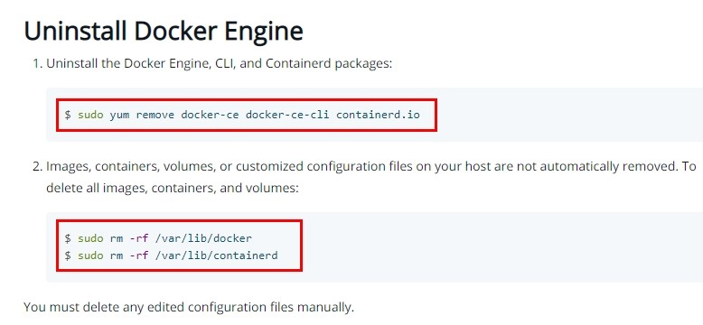  
```
systemctl stop docker
yum remove docker-ce docker-ce-cli containerd.io
rm -rf /var/lib/docker
rm -rf /var/lib/containerd
```

## 五、阿里云镜像加速
https://promotion.aliyun.com/ntms/act/kubernetes.html

1、注册一个属于自己的阿里云账户(可复用淘宝账号)

2、获得加速器地址连接  
登陆阿里云开发者平台  
点击控制台  
选择容器镜像服务  
获取加速器地址  

3、粘贴脚本直接执行  
直接粘  
```
mkdir -p /etc/docker
tee /etc/docker/daemon.json <<-'EOF'
{
  "registry-mirrors": ["https://5k5eio3g.mirror.aliyuncs.com"]
}
EOF
```
或者分步骤都行
```
mkdir -p /etc/docker
vim  /etc/docker/daemon.json
 #阿里云
{
  "registry-mirrors": ["https://｛自已的编码｝.mirror.aliyuncs.com"]
}
```

4、重启服务器
```
systemctl daemon-reload
systemctl restart docker
```

## 六、helloworld
启动Docker后台容器(测试运行 hello-world)  
systemctl restart docker
```
docker run hello-world  
```
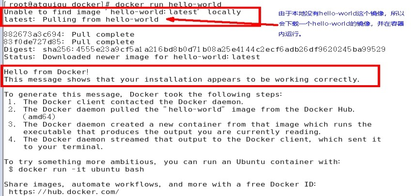  
输出这段提示以后，hello world就会停止运行，容器自动终止。

run干了什么    
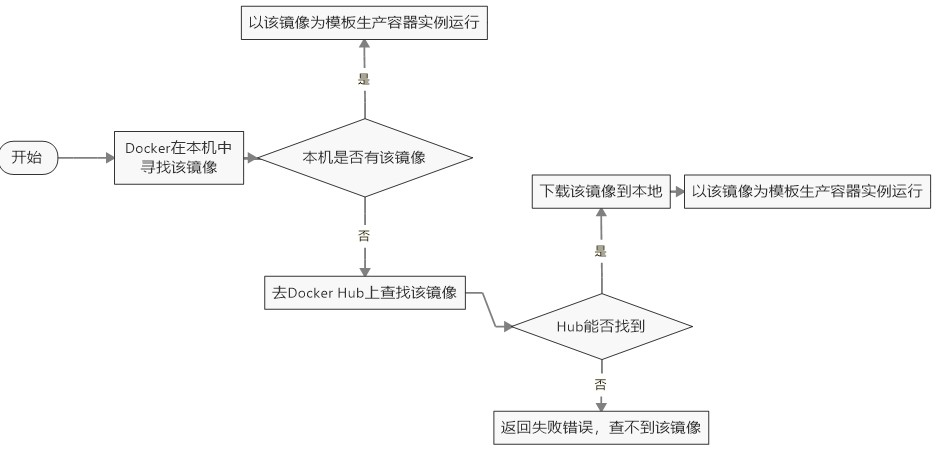  

## 七、底层原理
为什么Docker会比VM虚拟机快  
(1)docker有着比虚拟机更少的抽象层  
由于docker不需要Hypervisor(虚拟机)实现硬件资源虚拟化,运行在docker容器上的程序直接使用的都是实际物理机的硬件资源。因此在CPU、内存利用率上docker将会在效率上有明显优势。  
(2)docker利用的是宿主机的内核,而不需要加载操作系统OS内核  
当新建一个容器时,docker不需要和虚拟机一样重新加载一个操作系统内核。进而避免引寻、加载操作系统内核返回等比较费时费资源的过程,当新建一个虚拟机时,虚拟机软件需要加载OS,返回新建过程是分钟级别的。而docker由于直接利用宿主机的操作系统,则省略了返回过程,因此新建一个docker容器只需要几秒钟。  

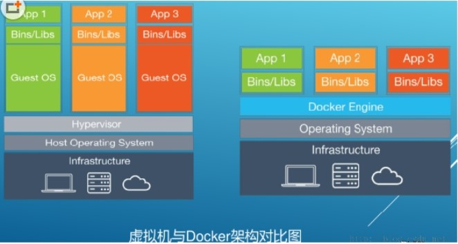  
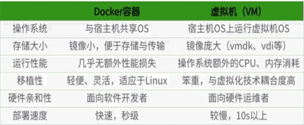  

