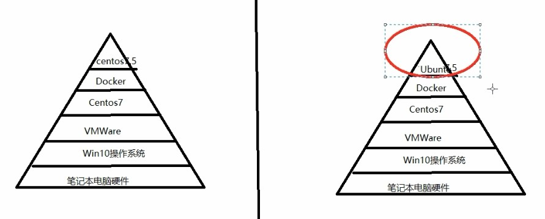
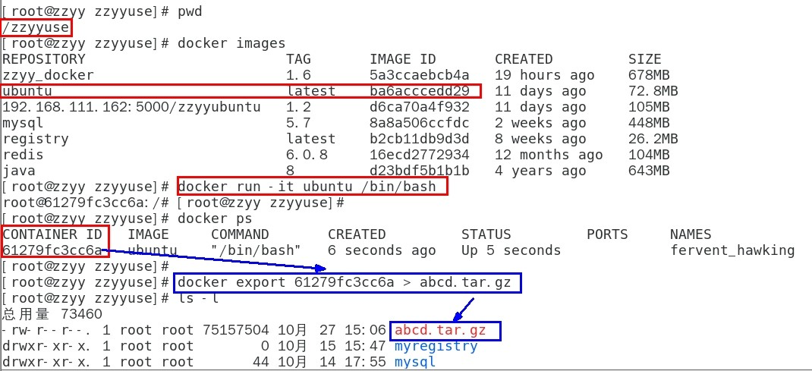
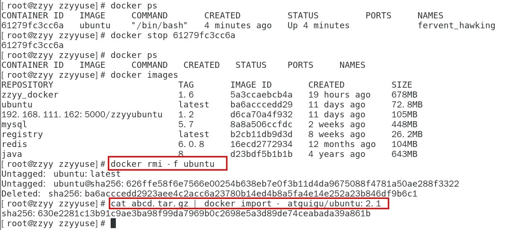

# 03-Docker常用命令

## 一、帮助启动类命令
```
启动docker：               systemctl start docker
停止docker：               systemctl stop docker
重启docker：               systemctl restart docker
查看docker状态：           systemctl status docker
开机启动：                 systemctl enable docker
查看docker概要信息：        docker info
查看docker总体帮助文档：    docker --help
```

## 二、镜像命令
### 1、docker images
```
docker images
```
列出本地主机上的镜像
各个选项说明:
```
REPOSITORY： 表示镜像的仓库源
TAG：        镜像的标签版本号
IMAGE ID：   镜像ID
CREATED：    镜像创建时间
SIZE：       镜像大小
```
同一仓库源可以有多个 TAG版本，代表这个仓库源的不同个版本，我们使用 REPOSITORY:TAG 来定义不同的镜像。如果你不指定一个镜像的版本标签，例如你只使用 ubuntu，docker 将默认使用 ubuntu:latest 镜像  
OPTIONS说明：
```
-a :列出本地所有的镜像（含历史映像层）
-q :只显示镜像ID。
```

### 2、docker search
```
docker search 某个XXX镜像名字
```
网站：https://hub.docker.com   
命令  
```
docker search [OPTIONS] 镜像名字
```
案例  
  
 ```
 [root@docker130 ~]# docker search redis
 NAME                                DESCRIPTION                                     STARS     OFFICIAL   AUTOMATED
 redis                               Redis is an open source key-value store that…   11681     [OK]       
 bitnami/redis                       Bitnami Redis Docker Image                      236                  [OK]
 ```
OPTIONS说明：  
```
--limit : 只列出N个镜像，默认25个
docker search --limit 5 redis
```

### 3、docker pull
```
docker pull 某个XXX镜像名字
```
下载镜像
```
docker pull 镜像名字[:TAG]
docker pull 镜像名字
```
没有TAG就是最新版
等价于
```
docker pull 镜像名字:latest
docker pull ubuntu
```

### 4、docker system df
 ```
docker system df 查看镜像/容器/数据卷所占的空间

[root@docker130 ~]# docker system df
TYPE            TOTAL     ACTIVE    SIZE      RECLAIMABLE
Images          1         0         72.78MB   72.78MB (100%)
Containers      0         0         0B        0B
Local Volumes   0         0         0B        0B
Build Cache     0         0         0B        0B
```

### 5、docker rmi
```
docker rmi 某个XXX镜像名字ID
```
删除单个
```
docker rmi  -f 镜像ID
```
删除多个
```
docker rmi -f 镜像名1:TAG 镜像名2:TAG
```
删除全部
```
docker rmi -f $(docker images -qa)
```

面试题：谈谈docker虚悬镜像是什么？     
仓库名、标签都是<none>的镜像，俗称虚悬镜像dangling image  
    
 

## 三、容器命令
有镜像才能创建容器， 这是根本前提(下载一个CentOS或者ubuntu镜像演示)  
说明  
  
```
docker pull centos
docker pull ubuntu
```

### 3.1、新建+启动容器
```
docker run [OPTIONS] IMAGE [COMMAND] [ARG...]
```
#### OPTIONS说明   
OPTIONS说明（常用）：有些是一个减号，有些是两个减号   
 ```
--name="容器新名字"       为容器指定一个名称；
-d: 后台运行容器并返回容器ID，也即启动守护式容器(后台运行)；
 
-i：以交互模式运行容器，通常与 -t 同时使用；
-t：为容器重新分配一个伪输入终端，通常与 -i 同时使用；
也即启动交互式容器(前台有伪终端，等待交互)；
 
-P: 随机端口映射，大写P
-p: 指定端口映射，小写p
```
  

#### 3.1、启动交互式容器(前台命令行)
```
[root@docker130 ~]# docker images
REPOSITORY   TAG       IMAGE ID       CREATED         SIZE
ubuntu       latest    ba6acccedd29   14 months ago   72.8MB
[root@docker130 ~]# docker run -it ubuntu /bin/bash
```
使用镜像centos:latest以交互模式启动一个容器,在容器内执行/bin/bash命令。
```
docker run -it ubuntu /bin/bash
```
参数说明：
```
-i: 交互式操作。
-t: 终端。
ubuntu : ubuntu 镜像。
/bin/bash：放在镜像名后的是命令，这里我们希望有个交互式 Shell，因此用的是 /bin/bash。
要退出终端，直接输入 exit:
```

### 3.2、列出当前所有正在运行的容器
```
docker ps [OPTIONS]
```
OPTIONS说明  
OPTIONS说明（常用）：  
```
-a :列出当前所有正在运行的容器+历史上运行过的
-l :显示最近创建的容器。
-n：显示最近n个创建的容器。
-q :静默模式，只显示容器编号。
```

### 3.3、退出容器
两种退出方式
```
exit
```
run进去容器，exit退出，容器停止
```
ctrl+p+q
```
run进去容器，ctrl+p+q退出，容器不停止

### 3.4、启动已停止运行的容器
```
docker start 容器ID或者容器名
```

### 3.5、重启容器
```
docker restart 容器ID或者容器名
```

### 3.6、停止容器
```
docker stop 容器ID或者容器名
```

### 3.7、强制停止容器
```
docker kill 容器ID或容器名
```

### 3.8、删除已停止的容器
```
docker rm 容器ID
```
一次性删除多个容器实例
```
docker rm -f $(docker ps -a -q)
docker ps -a -q | xargs docker rm
```

### 3.9、重要
1、有镜像才能创建容器，这是根本前提(下载一个Redis6.0.8镜像演示)    

2、启动守护式容器(后台服务器)  
1）在大部分的场景下，我们希望 docker 的服务是在后台运行的， 我们可以过 -d 指定容器的后台运行模式。  
2）docker run -d 容器名  
3）redis 前后台启动演示case  
前台交互式启动  
```
docker run -it redis:6.0.8
 ```
后台守护式启动  
```
docker run -d redis:6.0.8
```

3、查看容器日志
```
docker logs 容器ID
```

4、查看容器内运行的进程
```
docker top 容器ID

[root@docker130 ~]# docker top ac68f1ed5c01
UID                 PID                 PPID                C                   STIME               TTY                 TIME                CMD
root                1644                1623                0                   21:29               pts/0               00:00:00            /bin/bash
```

5、查看容器内部细节
```
docker inspect 容器ID
```

6、进入正在运行的容器并以命令行交互
```
docker exec -it 容器ID bashShell
```
重新进入
```
docker attach 容器ID
```
上述两个区别：  
attach 直接进入容器启动命令的终端，不会启动新的进程 用exit退出，会导致容器的停止。  
exec 是在容器中打开新的终端，并且可以启动新的进程 用exit退出，不会导致容器的停止。  
用之前的redis容器实例进入试试，进入redis服务。    
```
docker exec -it 容器ID /bin/bash
docker exec -it 容器ID redis-cli
```
一般用-d后台启动的程序，再用exec进入对应容器实例


7、从容器内拷贝文件到主机上  
容器→主机  
```
docker cp  容器ID:容器内路径 目的主机路径
```

8、导入和导出容器
```
export 导出容器的内容留作为一个tar归档文件[对应import命令]
import 从tar包中的内容创建一个新的文件系统再导入为镜像[对应export]

docker export 容器ID > 文件名.tar
cat 文件名.tar | docker import - 镜像用户/镜像名:镜像版本号
```
  
  


## 四、总结
常用命令  
  
 
```
attach    Attach to a running container                 # 当前 shell 下 attach 连接指定运行镜像
build     Build an image from a Dockerfile              # 通过 Dockerfile 定制镜像
commit    Create a new image from a container changes   # 提交当前容器为新的镜像
cp        Copy files/folders from the containers filesystem to the host path   #从容器中拷贝指定文件或者目录到宿主机中
create    Create a new container                        # 创建一个新的容器，同 run，但不启动容器
diff      Inspect changes on a container's filesystem   # 查看 docker 容器变化
events    Get real time events from the server          # 从 docker 服务获取容器实时事件
exec      Run a command in an existing container        # 在已存在的容器上运行命令
export    Stream the contents of a container as a tar archive   # 导出容器的内容流作为一个 tar 归档文件[对应 import ]
history   Show the history of an image                  # 展示一个镜像形成历史
images    List images                                   # 列出系统当前镜像
import    Create a new filesystem image from the contents of a tarball # 从tar包中的内容创建一个新的文件系统映像[对应export]
info      Display system-wide information               # 显示系统相关信息
inspect   Return low-level information on a container   # 查看容器详细信息
kill      Kill a running container                      # kill 指定 docker 容器
load      Load an image from a tar archive              # 从一个 tar 包中加载一个镜像[对应 save]
login     Register or Login to the docker registry server    # 注册或者登陆一个 docker 源服务器
logout    Log out from a Docker registry server          # 从当前 Docker registry 退出
logs      Fetch the logs of a container                 # 输出当前容器日志信息
port      Lookup the public-facing port which is NAT-ed to PRIVATE_PORT    # 查看映射端口对应的容器内部源端口
pause     Pause all processes within a container        # 暂停容器
ps        List containers                               # 列出容器列表
pull      Pull an image or a repository from the docker registry server   # 从docker镜像源服务器拉取指定镜像或者库镜像
push      Push an image or a repository to the docker registry server    # 推送指定镜像或者库镜像至docker源服务器
restart   Restart a running container                   # 重启运行的容器
rm        Remove one or more containers                 # 移除一个或者多个容器
rmi       Remove one or more images       # 移除一个或多个镜像[无容器使用该镜像才可删除，否则需删除相关容器才可继续或 -f 强制删除]
run       Run a command in a new container              # 创建一个新的容器并运行一个命令
save      Save an image to a tar archive                # 保存一个镜像为一个 tar 包[对应 load]
search    Search for an image on the Docker Hub         # 在 docker hub 中搜索镜像
start     Start a stopped containers                    # 启动容器
stop      Stop a running containers                     # 停止容器
tag       Tag an image into a repository                # 给源中镜像打标签
top       Lookup the running processes of a container   # 查看容器中运行的进程信息
unpause   Unpause a paused container                    # 取消暂停容器
version   Show the docker version information           # 查看 docker 版本号
wait      Block until a container stops, then print its exit code   # 截取容器停止时的退出状态值
```

