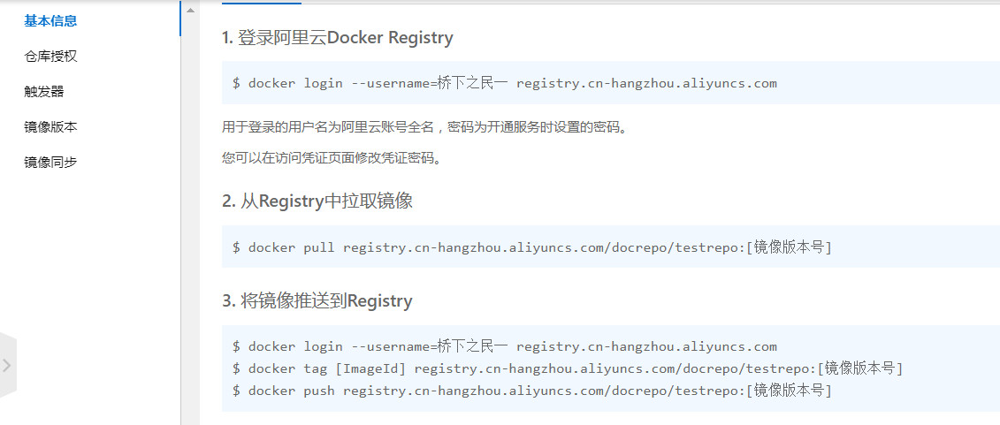

# 05-本地镜像发布到阿里云

## 一、本地镜像发布到阿里云流程
   

## 二、镜像的生成方法
基于当前容器创建一个新的镜像，新功能增强 
```
docker commit [OPTIONS] 容器ID [REPOSITORY[:TAG]]

OPTIONS说明：
-a :提交的镜像作者；
-m :提交时的说明文字；
```

## 三、将本地镜像推送到阿里云
### 1、阿里云开发者平台  
https://promotion.aliyun.com/ntms/act/kubernetes.html  

### 2、创建仓库镜像  
1）选择控制台，进入容器镜像服务  
2）选择个人实例  
3）命名空间  
4）仓库名称  
5）进入管理界面获得脚本  
   

1. 登录阿里云Docker Registry  
```
docker login --username=zhuangpf registry.cn-hangzhou.aliyuncs.com
```
用于登录的用户名为阿里云账号全名，密码为开通服务时设置的密码。  
您可以在访问凭证页面修改凭证密码。  
2. 从Registry中拉取镜像  
```
docker pull registry.cn-hangzhou.aliyuncs.com/docrepo/testrepo:[镜像版本号]
```
3. 将镜像推送到Registry
```
docker login --username=zhuangpf registry.cn-hangzhou.aliyuncs.com
docker tag [ImageId] registry.cn-hangzhou.aliyuncs.com/docrepo/testrepo:[镜像版本号]
docker push registry.cn-hangzhou.aliyuncs.com/docrepo/testrepo:[镜像版本号]
```

### 3、将镜像推送到阿里云
将镜像推送到阿里云registry
```
docker login --username=zhuangpf registry.cn-hangzhou.aliyuncs.com
docker tag fc1d6e70130d registry.cn-hangzhou.aliyuncs.com/docrepo/testrepo:1.0
docker push registry.cn-hangzhou.aliyuncs.com/docrepo/testrepo:1.0
```

## 四、将阿里云上的镜像下载到本地
```
docker pull registry.cn-hangzhou.aliyuncs.com/docrepo/testrepo:1.0
```
__