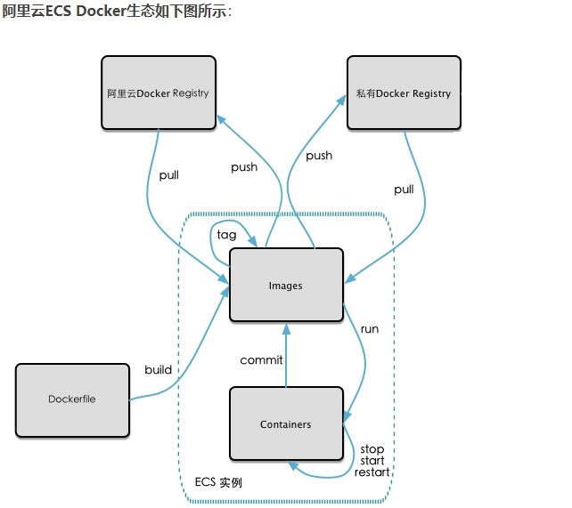

# 06-本地镜像发布到私有库

## 一、本地镜像发布到私有库流程
  

## 二、Docker Registry
官方Docker Hub地址：https://hub.docker.com/，中国大陆访问太慢了且准备被阿里云取代的趋势，不太主流。   

Dockerhub、阿里云这样的公共镜像仓库可能不太方便，涉及机密的公司不可能提供镜像给公网，所以需要创建一个本地私人仓库供给团队使用，基于公司内部项目构建镜像。  

Docker Registry是官方提供的工具，可以用于构建私有镜像仓库。  

## 三、将本地镜像推送到私有库
### 1、下载镜像Docker Registry  
```
docker pull registry 

[root@docker130 ~]# docker images
REPOSITORY                                           TAG       IMAGE ID       CREATED             SIZE
registry                                             latest    b8604a3fe854   13 months ago       26.2MB
```

### 2、运行私有库Registry，相当于本地有个私有Docker hub
```
docker run -d -p 5000:5000  -v /deploy/registry/:/tmp/registry --privileged=true registry
```
默认情况，仓库被创建在容器的/var/lib/registry目录下，建议自行用容器卷映射，方便于宿主机联调。   

### 3、演示创建一个新镜像，ubuntu安装ifconfig命令
1）从Hub上下载ubuntu镜像到本地并成功运行  
2）原始的Ubuntu镜像是不带着ifconfig命令的  
3）外网连通的情况下，安装ifconfig命令并测试通过  
docker容器内执行上述两条命令：  
```
apt-get update
apt-get install net-tools
```
4）安装完成后，commit我们自己的新镜像  
```
docker commit -m="提交的描述信息" -a="作者" 容器ID 要创建的目标镜像名:[标签名]
docker commit -m="ifconfig add" -a="zhuangpf" 521b8ebff713 myubuntu1:1.1
```
5）启动我们的新镜像并和原来的对比

### 4、curl验证私服库上有什么镜像
```
curl -XGET http://192.168.10.130:5000/v2/_catalog
[root@docker130 ~]# curl -XGET http://192.168.10.130:5000/v2/_catalog
{"repositories":[]}
```

### 5、将新镜像修改符合私服规范的Tag
```
docker tag 镜像:Tag Host:Port/Repository:Tag

docker tag myubuntu1:1.1 192.168.10.130:5000/zzyyubuntu:1.2
```

### 6、修改配置文件使之支持http
```
[root@docker130 ~]# cat /etc/docker/daemon.json 
{
  "registry-mirrors": ["https://5k5eio3g.mirror.aliyuncs.com"]
}
```
修改：
```
{
  "registry-mirrors": ["https://aa25jngu.mirror.aliyuncs.com"],
  "insecure-registries": ["192.168.10.130:5000"]
}
```
上述理由：docker默认不允许http方式推送镜像，通过配置选项来取消这个限制。====> 修改完后如果不生效，建议重启docker。   


### 7、push推送到私服库
```
[root@docker130 ~]# docker push 192.168.10.130:5000/zzyyubuntu:1.2
The push refers to repository [192.168.10.130:5000/zzyyubuntu]
a359528d6d8c: Pushed 
9f54eef41275: Pushed 
1.2: digest: sha256:8ffa7b6dc6584b0a7e9119038b16f117e37398e69f268fe500bf528cb3e6d56c size: 741
```

### 8、curl验证私服库上有什么镜像
```
[root@docker130 ~]# curl -XGET http://192.168.10.130:5000/v2/_catalog
{"repositories":["zzyyubuntu"]}
```

### 9、pull到本地并运行
```
docker pull 192.168.10.130:5000/zzyyubuntu:1.2
```
