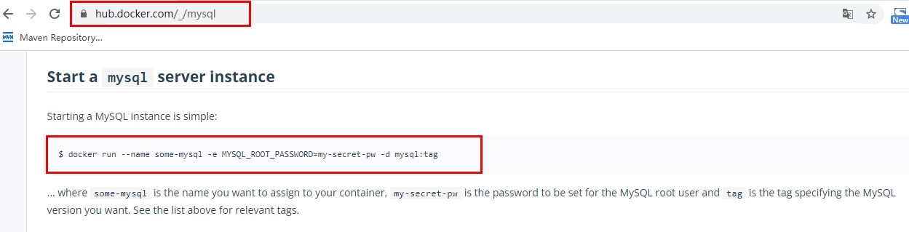

# 08-Docker常规安装简介

## 总体步骤
搜索镜像  
拉取镜像  
查看镜像  
启动镜像-->服务端口映射  
停止容器  
移除容器  

## 一、安装tomcat
### 1.1、安装tomcat
查找tomcat镜像
```
docker search tomcat
```
拉取tomcat镜像到本地
```
docker pull tomcat
```
查看是否有拉取到的tomcat
```
docker images
```
使用tomcat镜像创建容器实例(也叫运行镜像)
```
docker run -it -p 8080:8080 tomcat
```
可能的问题：404     
可能没有映射端口或者没有关闭防火墙  
把webapps.dist目录换成webapps  

免修改版说明
```
docker pull billygoo/tomcat8-jdk8
docker run -d -p 8080:8080 --name mytomcat8 billygoo/tomcat8-jdk8
```

## 二、安装mysql
### 2.2、docker hub上面查找mysql镜像
#### 2.2.1、简单版
查找mysql镜像  
```
docker search mysql
```
从docker hub上(阿里云加速器)拉取mysql镜像到本地标签为5.7
```
docker pull mysql:5.7
```
使用mysql5.7镜像创建容器(也叫运行镜像)   
   
```
docker run -p 3306:3306 -e MYSQL_ROOT_PASSWORD=123456 -d mysql:5.7

docker ps
docker exec -it 容器ID /bin/bash
mysql -uroot -p
```

问题1：docker上默认字符集编码隐患    
docker里面的mysql容器实例查看，内容如下：   
```sql
SHOW VARIABLES LIKE 'character%'

mysql> SHOW VARIABLES LIKE 'character%';
+--------------------------+----------------------------+
| Variable_name            | Value                      |
+--------------------------+----------------------------+
| character_set_client     | latin1                     |
| character_set_connection | latin1                     |
| character_set_database   | latin1                     |
| character_set_filesystem | binary                     |
| character_set_results    | latin1                     |
| character_set_server     | latin1                     |
| character_set_system     | utf8                       |
| character_sets_dir       | /usr/share/mysql/charsets/ |
+--------------------------+----------------------------+
```

问题2：删除容器后，里面的mysql数据如何办

#### 2.2.2、实战版
新建mysql容器实例
```
docker run -d -p 3306:3306 --privileged=true -v /dc/mysql/log:/var/log/mysql -v /dc/mysql/data:/var/lib/mysql -v /dc/mysql/conf:/etc/mysql/conf.d -e MYSQL_ROOT_PASSWORD=123456  --name mysql mysql:5.7
```
新建my.cnf
```
[client]
default_character_set=utf8
[mysqld]
collation_server = utf8_general_ci
character_set_server = utf8
```
进入容器：
```sql
mysql> SHOW VARIABLES LIKE 'character%';
+--------------------------+----------------------------+
| Variable_name            | Value                      |
+--------------------------+----------------------------+
| character_set_client     | utf8                       |
| character_set_connection | utf8                       |
| character_set_database   | utf8                       |
| character_set_filesystem | binary                     |
| character_set_results    | utf8                       |
| character_set_server     | utf8                       |
| character_set_system     | utf8                       |
| character_sets_dir       | /usr/share/mysql/charsets/ |
+--------------------------+----------------------------+
```

#### 2.2.3、结论 
结论：docker安装完MySQL并run出容器后，建议请先修改完字符集编码后再新建mysql库-表-插数据。


## 三、安装redis
从docker hub上(阿里云加速器)拉取redis镜像到本地标签为6.0.8   
```
docker pull redis:6.0.8
```
命令提醒：容器卷记得加入--privileged=true
```
Docker挂载主机目录Docker访问出现cannot open directory .: Permission denied
解决办法：在挂载目录后多加一个--privileged=true参数即可
```
使用redis6.0.8镜像创建容器(也叫运行镜像)
```
docker run  -p 6379:6379 --name myr3 --privileged=true -v /dc/redis/redis.conf:/etc/redis/redis.conf -v /dc/redis/data:/data -d redis:6.0.8 redis-server /etc/redis/redis.conf
```
测试redis-cli连接上来
```
docker exec -it myr3 /bin/bash
docker exec -it 运行着Rediis服务的容器ID redis-cli
```

