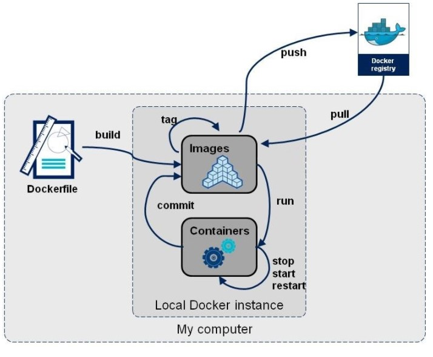
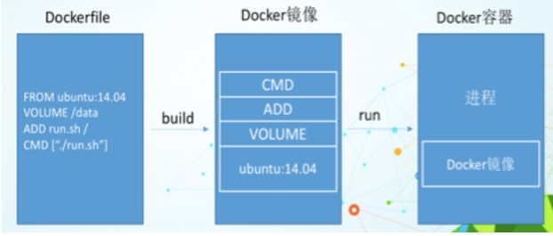
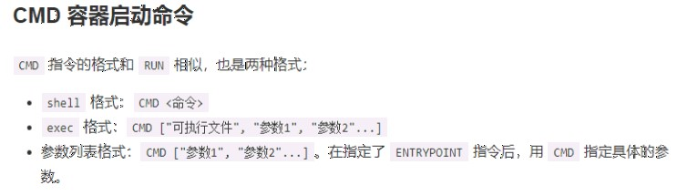
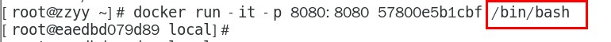
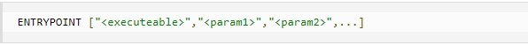
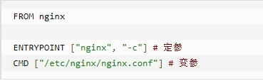
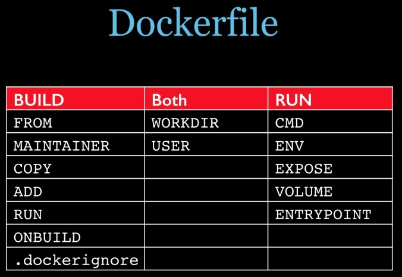
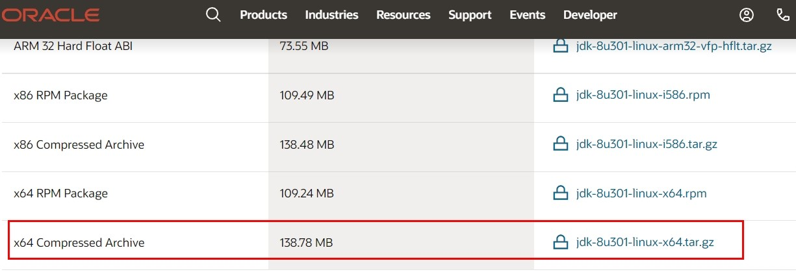

# 12-DockerFile解析

## 一、简介
Dockerfile是用来构建Docker镜像的文本文件，是由一条条构建镜像所需的指令和参数构成的脚本。

概述：  
  

官网：  
https://docs.docker.com/engine/reference/builder/  

构建三步骤：  
编写Dockerfile文件  
docker build命令构建镜像  
docker run依镜像运行容器实例  

## 二、DockerFile构建过程解析
Dockerfile内容基础知识   
1、每条保留字指令都必须为大写字母且后面要跟随至少一个参数   
2、指令按照从上到下，顺序执行   
3、#表示注释   
4、每条指令都会创建一个新的镜像层并对镜像进行提交   

Docker执行Dockerfile的大致流程  
1、docker从基础镜像运行一个容器  
2、执行一条指令并对容器作出修改  
3、执行类似docker commit的操作提交一个新的镜像层  
4、docker再基于刚提交的镜像运行一个新容器  
5、执行dockerfile中的下一条指令直到所有指令都执行完成  

总结：  
从应用软件的角度来看，Dockerfile、Docker镜像与Docker容器分别代表软件的三个不同阶段，    
Dockerfile是软件的原材料  
Docker镜像是软件的交付品  
Docker容器则可以认为是软件镜像的运行态，也即依照镜像运行的容器实例  
Dockerfile面向开发，Docker镜像成为交付标准，Docker容器则涉及部署与运维，三者缺一不可，合力充当Docker体系的基石。  

  

1、Dockerfile，需要定义一个Dockerfile，Dockerfile定义了进程需要的一切东西。Dockerfile涉及的内容包括执行代码或者是文件、环境变量、依赖包、运行时环境、动态链接库、操作系统的发行版、服务进程和内核进程(当应用进程需要和系统服务和内核进程打交道，这时需要考虑如何设计namespace的权限控制)等等;  
2、Docker镜像，在用Dockerfile定义一个文件之后，docker build时会产生一个Docker镜像，当运行 Docker镜像时会真正开始提供服务;  
3、Docker容器，容器是直接提供服务的。  

## 三、DockerFile常用保留字指令
参考tomcat8的dockerfile入门  
https://github.com/docker-library/tomcat  

### FROM
基础镜像，当前新镜像是基于哪个镜像的，指定一个已经存在的镜像作为模板，第一条必须是from

### MAINTAINER
镜像维护者的姓名和邮箱地址

### RUN
容器构建时需要运行的命令  
两种格式  
shell格式  
```
RUN <命令行命令>
# <命令行命令>等同于，在终端操作的shell命令。

RUN yum -y install vim
```
exec格式
```
RUN ["可执行文件","参数1","参数2"]
# 例如
# RUN ["./test.php","dev","offline"] 等价于 RUN ./test.php dev offline
```
RUN是在 docker build时运行

### EXPOSE
当前容器对外暴露出的端口

### WORKDIR
指定在创建容器后，终端默认登陆的进来工作目录，一个落脚点

### USER
指定该镜像以什么样的用户去执行，如果都不指定，默认是root

### ENV
用来在构建镜像过程中设置环境变量  
```
ENV MY_PATH /usr/mytest
```
这个环境变量可以在后续的任何RUN指令中使用，这就如同在命令前面指定了环境变量前缀一样；  
也可以在其它指令中直接使用这些环境变量，  
 ```
比如：WORKDIR $MY_PATH
```

### ADD
将宿主机目录下的文件拷贝进镜像且会自动处理URL和解压tar压缩包

### COPY
类似ADD，拷贝文件和目录到镜像中。 将从构建上下文目录中 <源路径> 的文件/目录复制到新的一层的镜像内的 <目标路径> 位置
```
COPY src dest
COPY ["src", "dest"]
<src源路径>：源文件或者源目录
<dest目标路径>：容器内的指定路径，该路径不用事先建好，路径不存在的话，会自动创建。
```

### VOLUME
容器数据卷，用于数据保存和持久化工作

### CMD
指定容器启动后的要干的事情  
  

注意：
Dockerfile 中可以有多个 CMD 指令，但只有最后一个生效，CMD 会被 docker run 之后的参数替换  
参考官网Tomcat的dockerfile
```
EXPOSE 8080
CMD ["catalina.sh", "run"]
```
演示自己的覆盖操作  
   

它和前面RUN命令的区别：  
CMD是在docker run 时运行。  
RUN是在 docker build时运行。  

### ENTRYPOINT
也是用来指定一个容器启动时要运行的命令   
类似于 CMD 指令，但是ENTRYPOINT不会被docker run后面的命令覆盖， 而且这些命令行参数会被当作参数送给 ENTRYPOINT 指令指定的程序  

命令格式和案例说明    
命令格式：  
   

ENTRYPOINT可以和CMD一起用，一般是变参才会使用 CMD ，这里的 CMD 等于是在给 ENTRYPOINT 传参。  
当指定了ENTRYPOINT后，CMD的含义就发生了变化，不再是直接运行其命令而是将CMD的内容作为参数传递给ENTRYPOINT指令，他两个组合会变成   
```
<ENTRYPOINT>"<CM>"
```

案例如下：假设已通过 Dockerfile 构建了 nginx:test 镜像：  
   
```
是否传参	        按照dockerfile编写执行	            传参运行
Docker命令	    docker run nginx:test	            docker run  nginx:test -c /etc/nginx/new.conf
衍生出的实际命令	nginx -c /etc/nginx/nginx.conf	    nginx -c /etc/nginx/new.conf
```

优点：  
在执行docker run的时候可以指定 ENTRYPOINT 运行所需的参数。  
注意：  
如果 Dockerfile 中如果存在多个 ENTRYPOINT 指令，仅最后一个生效。  
  
总结：  
   


## 四、案例
### 4.1、要求
Centos7镜像具备vim+ifconfig+jdk8

JDK的下载镜像地址  
官网：  
   
下载地址：  
https://www.oracle.com/java/technologies/downloads/#java8  
https://mirrors.yangxingzhen.com/jdk/  

### 4.2、编写
准备编写Dockerfile文件   
```
vim Dockerfile
```
如下
```
FROM centos
MAINTAINER zhuangpf<809566095@qq.com>

ENV MYPATH /usr/local
WORKDIR $MYPATH
 
#安装vim编辑器
RUN yum -y install vim
#安装ifconfig命令查看网络IP
RUN yum -y install net-tools
#安装java8及lib库
RUN yum -y install glibc.i686
RUN mkdir /usr/local/java
#ADD 是相对路径jar,把jdk-8u171-linux-x64.tar.gz添加到容器中,安装包必须要和Dockerfile文件在同一位置
ADD jdk-8u171-linux-x64.tar.gz /usr/local/java/
#配置java环境变量
ENV JAVA_HOME /usr/local/java/jdk1.8.0_171
ENV JRE_HOME $JAVA_HOME/jre
ENV CLASSPATH $JAVA_HOME/lib/dt.jar:$JAVA_HOME/lib/tools.jar:$JRE_HOME/lib:$CLASSPATH
ENV PATH $JAVA_HOME/bin:$PATH
 
EXPOSE 80
 
CMD echo $MYPATH
CMD echo ">>>>> success ok"
CMD /bin/bash
```

### 4.3、构建
```
docker build -t 新镜像名字:TAG .
docker build -t centosjava8:1.5 .
```
注意，上面TAG后面有个空格，有个点  
https://blog.csdn.net/Indra_ran/article/details/127066940

### 4.4、运行
```
docker run -it 新镜像名字:TAG
docker run -it centosjava8:1.5 /bin/bash
```

### 4.5、再体会下UnionFS（联合文件系统）
UnionFS（联合文件系统）：Union文件系统（UnionFS）是一种分层、轻量级并且高性能的文件系统，它支持对文件系统的修改作为一次提交来一层层的叠加，同时可以将不同目录挂载到同一个虚拟文件系统下(unite several directories into a single virtual filesystem)。Union 文件系统是 Docker 镜像的基础。镜像可以通过分层来进行继承，基于基础镜像（没有父镜像），可以制作各种具体的应用镜像。


### 4.6、虚悬镜像
仓库名、标签都是<none>的镜像，俗称dangling image

Dockerfile写一个
```
vim Dockerfile

from ubuntu
CMD echo 'action is success'
```
然后构建
```
docker build .
```

查看
```
docker image ls -f dangling=true
```
删除
 ```
docker image prune
 ```
虚悬镜像已经失去存在价值，可以删除

