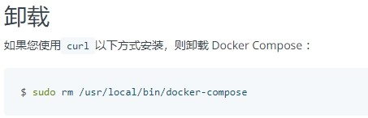
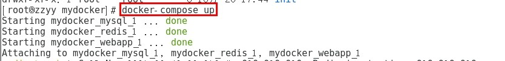
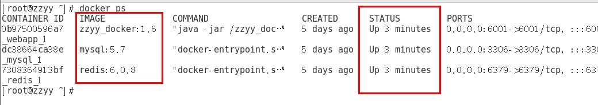
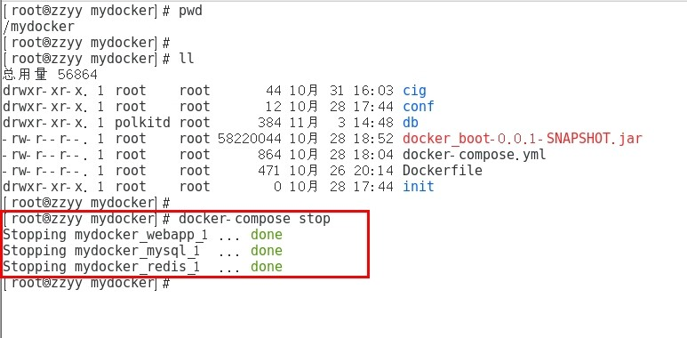

# 15-Docker-compose容器编排

## 一、简介
Compose 是 Docker 公司推出的一个工具软件，可以管理多个 Docker 容器组成一个应用。你需要定义一个 YAML 格式的配置文件docker-compose.yml，写好多个容器之间的调用关系。然后，只要一个命令，就能同时启动/关闭这些容器。

Docker-Compose是Docker官方的开源项目， 负责实现对Docker容器集群的快速编排。

## 二、作用
docker建议我们每一个容器中只运行一个服务,因为docker容器本身占用资源极少,所以最好是将每个服务单独的分割开来但是这样我们又面临了一个问题？
 
如果我需要同时部署好多个服务,难道要每个服务单独写Dockerfile然后在构建镜像,构建容器,这样累都累死了,所以docker官方给我们提供了docker-compose多服务部署的工具
 
例如要实现一个Web微服务项目，除了Web服务容器本身，往往还需要再加上后端的数据库mysql服务容器，redis服务器，注册中心eureka，甚至还包括负载均衡容器等等。。。。。。
 
Compose允许用户通过一个单独的docker-compose.yml模板文件（YAML 格式）来定义一组相关联的应用容器为一个项目（project）。
 
可以很容易地用一个配置文件定义一个多容器的应用，然后使用一条指令安装这个应用的所有依赖，完成构建。Docker-Compose 解决了容器与容器之间如何管理编排的问题。

## 三、下载安装
官网   
https://docs.docker.com/compose/compose-file/compose-file-v3/   
官网下载   
https://docs.docker.com/compose/install/   
``` 
curl -L "https://github.com/docker/compose/releases/download/1.29.2/docker-compose-$(uname -s)-$(uname -m)" -o /usr/local/bin/docker-compose
chmod +x /usr/local/bin/docker-compose
docker-compose --version
``` 
卸载步骤   
  

## 四、Compose核心概念
一文件  
docker-compose.yml  
两要素  
服务（service）  
一个个应用容器实例，比如订单微服务、库存微服务、mysql容器、nginx容器或者redis容器  
工程（project）  
由一组关联的应用容器组成的一个完整业务单元，在 docker-compose.yml 文件中定义。  

## 五、Compose使用的三个步骤
编写Dockerfile定义各个微服务应用并构建出对应的镜像文件
使用 docker-compose.yml 定义一个完整业务单元，安排好整体应用中的各个容器服务。
最后，执行docker-compose up命令 来启动并运行整个应用程序，完成一键部署上线。

## 六、Compose常用命令
``` 
docker-compose -h                           # 查看帮助
docker-compose up                           # 启动所有docker-compose服务
docker-compose up -d                        # 启动所有docker-compose服务并后台运行
docker-compose down                         # 停止并删除容器、网络、卷、镜像。
docker-compose exec  yml里面的服务id                 # 进入容器实例内部  docker-compose exec docker-compose.yml文件中写的服务id /bin/bash
docker-compose ps                      # 展示当前docker-compose编排过的运行的所有容器
docker-compose top                     # 展示当前docker-compose编排过的容器进程
 
docker-compose logs  yml里面的服务id     # 查看容器输出日志
docker-compose config     # 检查配置
docker-compose config -q  # 检查配置，有问题才有输出
docker-compose restart   # 重启服务
docker-compose start     # 启动服务
docker-compose stop      # 停止服务
``` 

## 七、Compose编排微服务
改造升级微服务工程docker_boot   
以前的基础版   

改造升级微服务工程docker_boot   
mvn package命令将微服务形成新的jar包 并上传到Linux服务器/mydocker目录下   
编写Dockerfile  
``` 
# 基础镜像使用java
FROM java:8
# 作者
MAINTAINER zpf
# VOLUME 指定临时文件目录为/tmp，在主机/var/lib/docker目录下创建了一个临时文件并链接到容器的/tmp
VOLUME /tmp
# 将jar包添加到容器中并更名为zzyy_docker.jar
ADD docker_boot-0.0.1-SNAPSHOT.jar zzyy_docker.jar
# 运行jar包
RUN bash -c 'touch /zzyy_docker.jar'
ENTRYPOINT ["java","-jar","/zzyy_docker.jar"]
#暴露6001端口作为微服务
EXPOSE 6001
``` 

构建镜像
``` 
docker build -t zzyy_docker:1.6 .
``` 

### 不用Compose  
单独的mysql容器实例  
新建mysql容器实例  
  ``` 
docker run -p 3306:3306 --name mysql57 --privileged=true -v /zzyyuse/mysql/conf:/etc/mysql/conf.d -v /zzyyuse/mysql/logs:/logs -v /zzyyuse/mysql/data:/var/lib/mysql -e MYSQL_ROOT_PASSWORD=123456 -d mysql:5.7
``` 
进入mysql容器实例并新建库db2021+新建表t_user
``` 
docker exec -it mysql57 /bin/bash
mysql -uroot -p
create database db2021;
use db2021;
CREATE TABLE `t_user` (
  `id` INT(10) UNSIGNED NOT NULL AUTO_INCREMENT,
  `username` VARCHAR(50) NOT NULL DEFAULT '' COMMENT '用户名',
  `password` VARCHAR(50) NOT NULL DEFAULT '' COMMENT '密码',
  `sex` TINYINT(4) NOT NULL DEFAULT '0' COMMENT '性别 0=女 1=男 ',
  `deleted` TINYINT(4) UNSIGNED NOT NULL DEFAULT '0' COMMENT '删除标志，默认0不删除，1删除',
  `update_time` TIMESTAMP NOT NULL DEFAULT CURRENT_TIMESTAMP ON UPDATE CURRENT_TIMESTAMP COMMENT '更新时间',
  `create_time` TIMESTAMP NOT NULL DEFAULT CURRENT_TIMESTAMP COMMENT '创建时间',
  PRIMARY KEY (`id`)
) ENGINE=INNODB AUTO_INCREMENT=1 DEFAULT CHARSET=utf8mb4 COMMENT='用户表';
``` 
单独的redis容器实例
``` 
docker run  -p 6379:6379 --name redis608 --privileged=true -v /app/redis/redis.conf:/etc/redis/redis.conf -v /app/redis/data:/data -d redis:6.0.8 redis-server /etc/redis/redis.conf
``` 
微服务工程
 ``` 
 docker run -d -p 6001:6001 zzyy_docker:1.6
``` 
上面三个容器实例依次顺序启动成功
  


swagger测试  
http://localhost:你的微服务端口/swagger-ui.html#/  

上面成功了，有哪些问题?  
先后顺序要求固定，先mysql+redis才能微服务访问成功  
多个run命令......  
容器间的启停或宕机，有可能导致IP地址对应的容器实例变化，映射出错， 要么生产IP写死(可以但是不推荐)，要么通过服务调用  

### 使用Compose  
服务编排，一套带走，安排  
编写docker-compose.yml文件  
``` 
version: "3"
 
services:
  microService:
    image: zzyy_docker:1.6
    container_name: ms01
    ports:
      - "6001:6001"
    volumes:
      - /app/microService:/data
    networks: 
      - atguigu_net 
    depends_on: 
      - redis
      - mysql
 
  redis:
    image: redis:6.0.8
    ports:
      - "6379:6379"
    volumes:
      - /app/redis/redis.conf:/etc/redis/redis.conf
      - /app/redis/data:/data
    networks: 
      - atguigu_net
    command: redis-server /etc/redis/redis.conf
 
  mysql:
    image: mysql:5.7
    environment:
      MYSQL_ROOT_PASSWORD: '123456'
      MYSQL_ALLOW_EMPTY_PASSWORD: 'no'
      MYSQL_DATABASE: 'db2021'
      MYSQL_USER: 'zzyy'
      MYSQL_PASSWORD: 'zzyy123'
    ports:
       - "3306:3306"
    volumes:
       - /app/mysql/db:/var/lib/mysql
       - /app/mysql/conf/my.cnf:/etc/my.cnf
       - /app/mysql/init:/docker-entrypoint-initdb.d
    networks:
      - atguigu_net
    command: --default-authentication-plugin=mysql_native_password #解决外部无法访问
 
networks: 
   atguigu_net: 
``` 

通过服务名访问，IP无关  
mvn package命令将微服务形成新的jar包 并上传到Linux服务器/mydocker目录下  
编写Dockerfile  
``` 
# 基础镜像使用java
FROM java:8
# 作者
MAINTAINER zzyy
# VOLUME 指定临时文件目录为/tmp，在主机/var/lib/docker目录下创建了一个临时文件并链接到容器的/tmp
VOLUME /tmp
# 将jar包添加到容器中并更名为zzyy_docker.jar
ADD docker_boot-0.0.1-SNAPSHOT.jar zzyy_docker.jar
# 运行jar包
RUN bash -c 'touch /zzyy_docker.jar'
ENTRYPOINT ["java","-jar","/zzyy_docker.jar"]
#暴露6001端口作为微服务
EXPOSE 6001
``` 
构建镜像
``` 
docker build -t zzyy_docker:1.6 .
``` 
执行 
``` 
docker-compose up 或者 执行 docker-compose up -d
``` 
  
  

### Compose常用命令
``` 
docker-compose -h                           # 查看帮助
docker-compose up                           # 启动所有docker-compose服务
docker-compose up -d                        # 启动所有docker-compose服务并后台运行
docker-compose down                         # 停止并删除容器、网络、卷、镜像。
docker-compose exec  yml里面的服务id                 # 进入容器实例内部  docker-compose exec docker-compose.yml文件中写的服务id /bin/bash
docker-compose ps                      # 展示当前docker-compose编排过的运行的所有容器
docker-compose top                     # 展示当前docker-compose编排过的容器进程
 
docker-compose logs  yml里面的服务id     # 查看容器输出日志
dokcer-compose config     # 检查配置
dokcer-compose config -q  # 检查配置，有问题才有输出
docker-compose restart   # 重启服务
docker-compose start     # 启动服务
docker-compose stop      # 停止服务
``` 
关停
  


