# 17-Docker容器监控之 CAdvisor+InfluxDB+Granfana

## 一、原生命令
``` 
docker ps

docker stats
CONTAINER ID   NAME                CPU %     MEM USAGE / LIMIT     MEM %     NET I/O          BLOCK I/O     PIDS
c1e2abb01b8c   portainer           0.00%     14.42MiB / 3.842GiB   0.37%     322kB / 4.77MB   0B / 1.63MB   8
ddb92363b45d   fervent_lederberg   0.17%     287.5MiB / 3.842GiB   7.31%     3.6kB / 2.06kB   0B / 0B       28
``` 

问题   
通过docker stats命令可以很方便的看到当前宿主机上所有容器的CPU,内存以及网络流量等数据，一般小公司够用了。。。。  
但是，docker stats统计结果只能是当前宿主机的全部容器，数据资料是实时的，没有地方存储、没有健康指标过线预警等功能  

## 二、CIG简介
容器监控3剑客   
  
CAdvisor监控收集+InfluxDB存储数据+Granfana展示图表

CAdvisor  
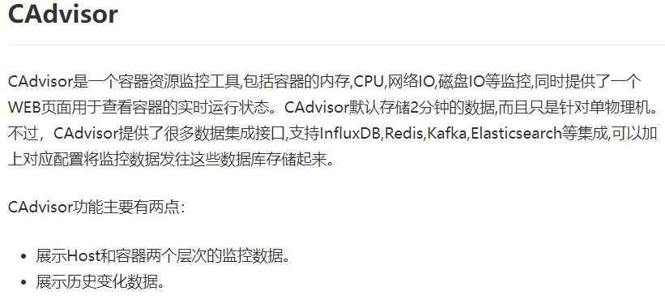   
InfluxDB  
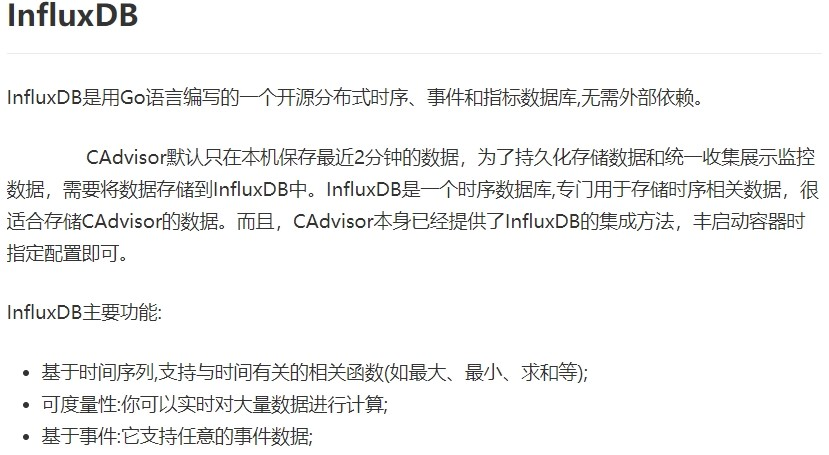   
Granfana
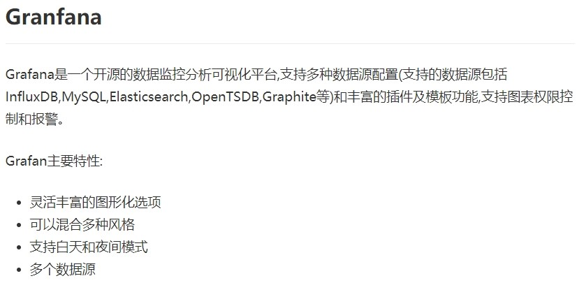  
总结   
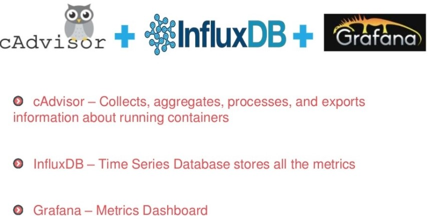  


## 三、实践
### 1、新建目录  
```
[root@docker130 ~]# cd /mydocker/
[root@docker130 mydocker]# mkdir cig
```

### 2、新建3件套组合的 docker-compose.yml   
```yaml
version: '3.1'
 
volumes:
  grafana_data: {}
 
services:
 influxdb:
  image: tutum/influxdb:0.9
  restart: always
  environment:
    - PRE_CREATE_DB=cadvisor
  ports:
    - "8083:8083"
    - "8086:8086"
  volumes:
    - ./data/influxdb:/data
 
 cadvisor:
  image: google/cadvisor
  links:
    - influxdb:influxsrv
  command: -storage_driver=influxdb -storage_driver_db=cadvisor -storage_driver_host=influxsrv:8086
  restart: always
  ports:
    - "8080:8080"
  volumes:
    - /:/rootfs:ro
    - /var/run:/var/run:rw
    - /sys:/sys:ro
    - /var/lib/docker/:/var/lib/docker:ro
 
 grafana:
  user: "104"
  image: grafana/grafana
  user: "104"
  restart: always
  links:
    - influxdb:influxsrv
  ports:
    - "3000:3000"
  volumes:
    - grafana_data:/var/lib/grafana
  environment:
    - HTTP_USER=admin
    - HTTP_PASS=admin
    - INFLUXDB_HOST=influxsrv
    - INFLUXDB_PORT=8086
    - INFLUXDB_NAME=cadvisor
    - INFLUXDB_USER=root
    - INFLUXDB_PASS=root
```

### 3、启动docker-compose文件
```
docker-compose up
```

### 4、查看三个服务容器是否启动
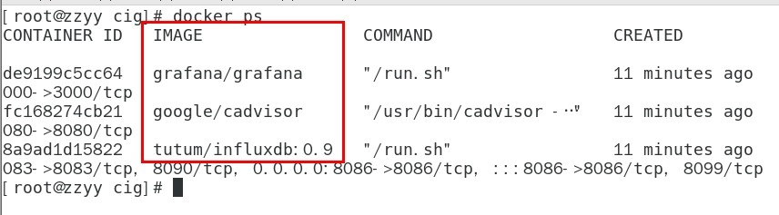  

### 5、测试   
浏览cAdvisor收集服务，http://ip:8080/   
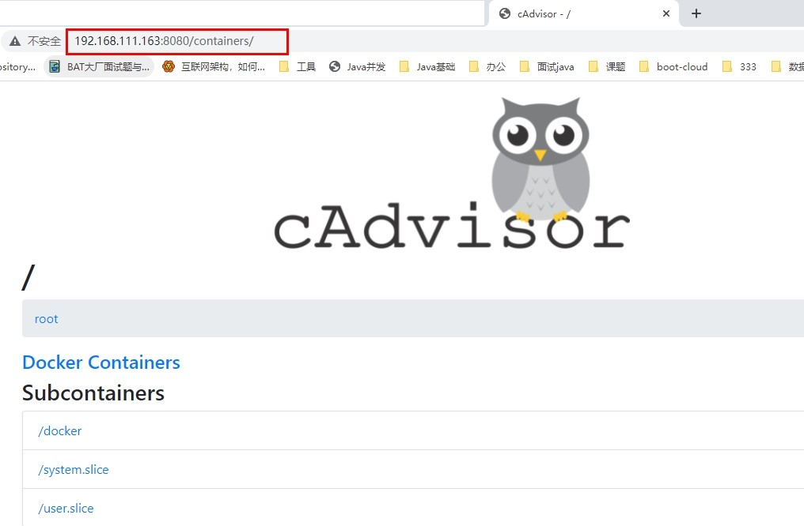  
第一次访问慢，请稍等  
cadvisor也有基础的图形展现功能，这里主要用它来作数据采集  


浏览influxdb存储服务，http://ip:8083/   

浏览grafana展现服务，http://ip:3000   
ip+3000端口的方式访问,默认帐户密码（admin/admin）     
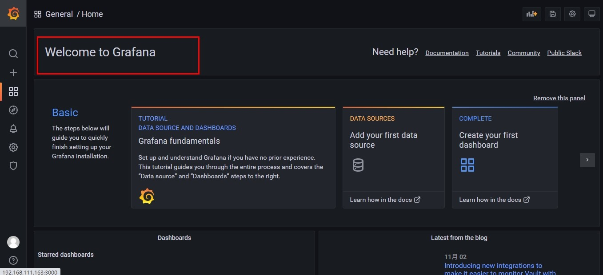  

配置步骤  
配置数据源  
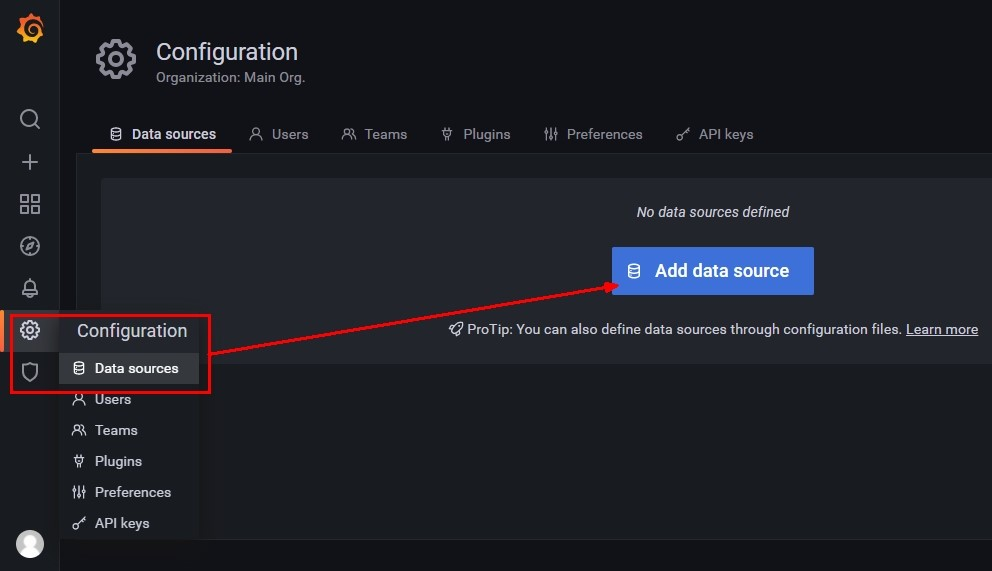  

选择influxdb数据源  
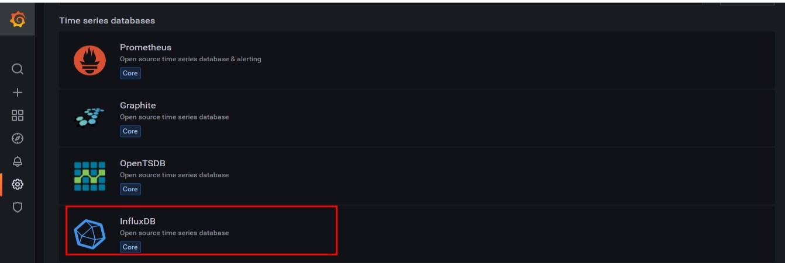  
配置细节   
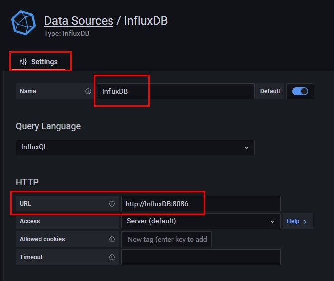   
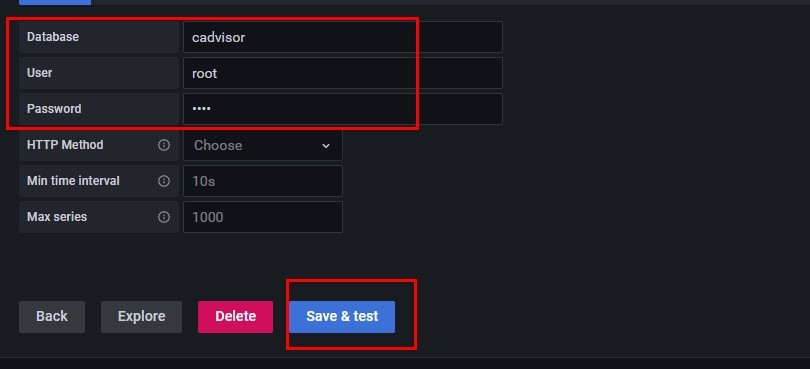    
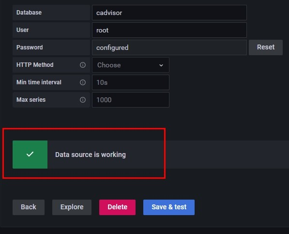    

配置面板panel    
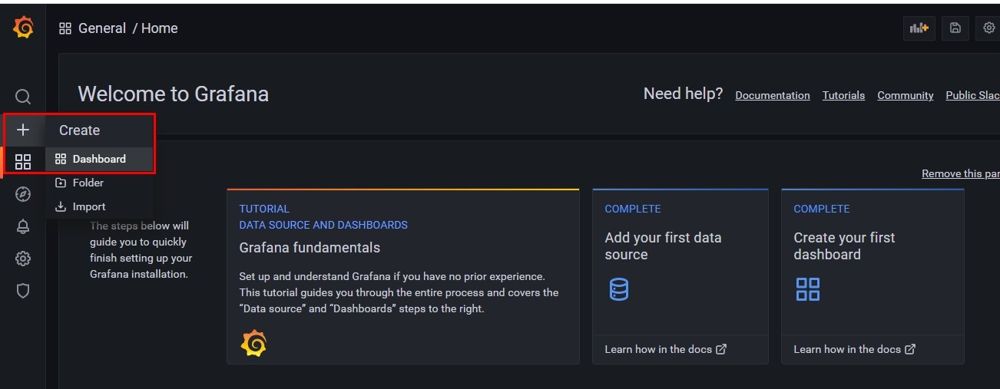    
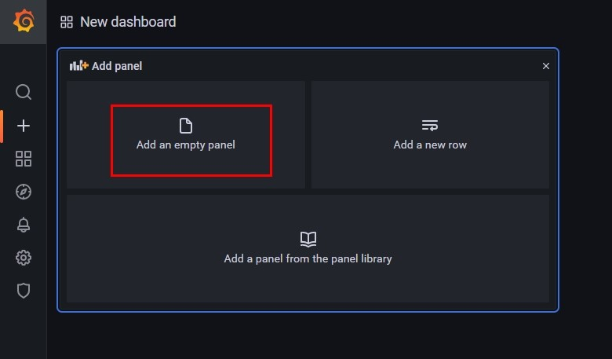    
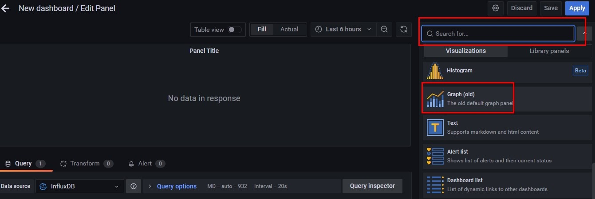    
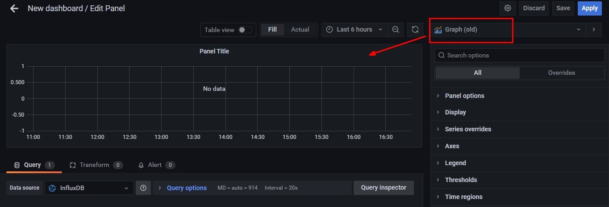    
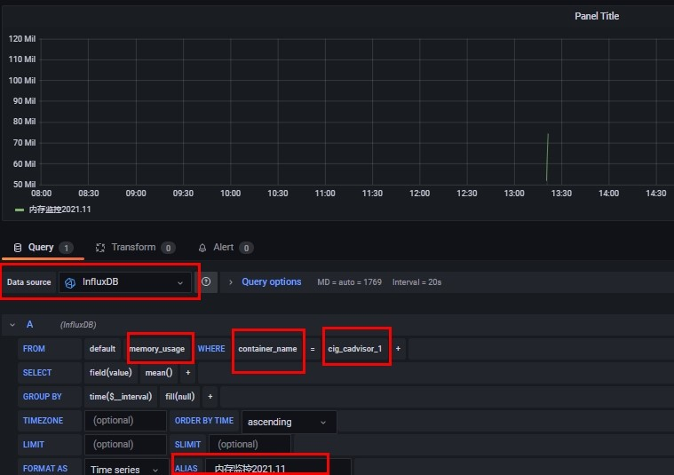    
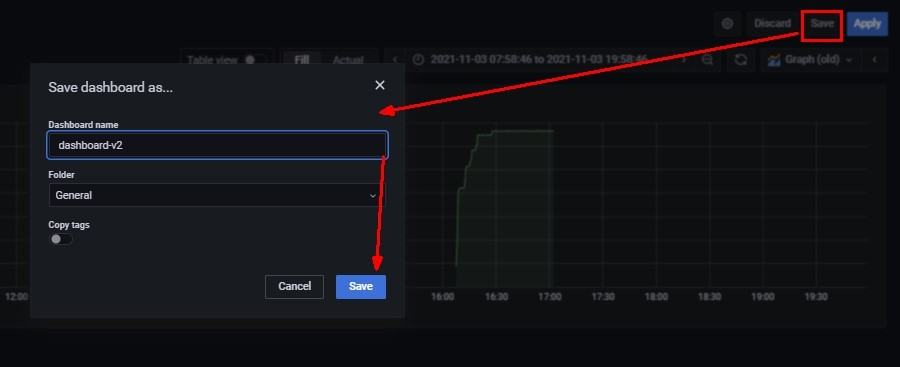    
到这里cAdvisor+InfluxDB+Grafana容器监控系统就部署完成了.


