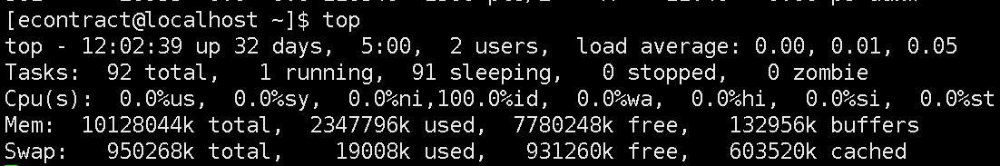

# Linux查看系统资源占用

在系统维护的过程中，随时可能有需要查看 CPU和内存的使用率，并根据相应信息分析系统状况的需求。本文介绍一下几种常见的Linux系统资源查看命令。

### 1、总体内存占用的查看
```
free
free -m
```
  

free命令查看内存占用   
（1）free命令默认是以kb为单位显示的，可以用free -m 用Mb单位来显示。    
（2）Mem行 ：   total = used  + free    其中buffers和cached虽然计算在used内， 但其实为可用内存。  
（3）Mem下一行：used为真实已占内存，free为真实可用内存。  
（4）Swap：内存交换区的使用情况。  


### 2、查看内存占用前五的进程
```
ps auxw | head -1;ps auxw|sort -rn -k4|head -5 
```
   

查看内存占用前5的进程    
内存的单位是kb，VSZ是虚拟内存的占用，RSS是真实的内存的占用。   
命令分解：   
ps auxw显示系统资源占用情况；  
head -1表示显示第一列，即标题列；  
sort -r 表示反向排序，-n表示按数字排序，-k4表示列的第4个字符。  

### 3、查看CPU占用前三的进程
```
ps auxw|head -1;ps auxw|sort -rn -k3|head -3
```
   

查看cpu占用前三的进程   
该命令与2相仿，只是选择的资源占用情况的第3列（即cpu），用“-k3”表示。  

### 4、查看系统整体的负载
```
top
参数：
top -d 2 ：每隔2秒显式所有进程的资源占用情况
top -c  ：每隔5秒显式进程的资源占用情况，并显示进程的命令行参数(默认只有进程名)
top -p 12345 -p 6789：每隔5秒显示pid是12345和pid是6789的两个进程的资源占用情况
top -d 2 -c -p 123456 ：每隔2秒显示pid是12345的进程的资源使用情况，并显式该进程启动的命令行参数
```
   

top显示系统整体负载   
（1）第一行： 系统时间  + 系统运行时间 + 几个用户 + 1/5/15分钟系统平均负载  
（2）第二行：进程总数(total) + 正在运行进程数(running) + 睡眠进程数(sleeping) + 停止的进程数(stopped)+ 僵尸进程数(zombie)   
（3）第三行：用户空间CPU占比(us) + 内核空间CPU占比(sy)+ CPU空置率(id)

   
其中：
```
PID     进程ID
USER    用户名
PR      优先级
NI      负值表示高优先级，正值表示低优先级。
VIRT    虚拟内存
RES     真实内存
SHR     共享内存
S       进程状态 D=不可中断的睡眠状态； R=运行； S=睡眠 ；T=跟踪/停止； Z=僵尸进程
```


