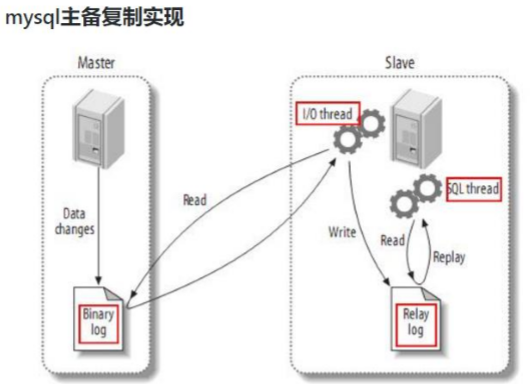
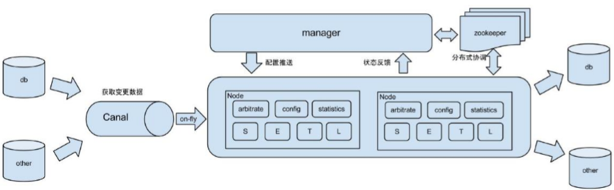
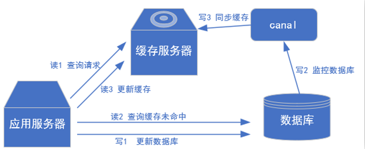
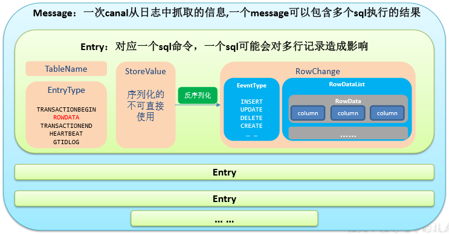

# Canal

## 一、Canal 入门 
### 1.1、什么是 Canal 
阿里巴巴 B2B 公司，因为业务的特性，卖家主要集中在国内，买家主要集中在国外，所以衍生出了同步杭州和美国异地机房的需求，从 2010 年开始，阿里系公司开始逐步的尝试基于数据库的日志解析，获取增量变更进行同步，由此衍生出了增量订阅&消费的业务。 

Canal 是用 Java 开发的基于数据库增量日志解析，提供增量数据订阅&消费的中间件。目前。Canal 主要支持了 MySQL 的 Binlog 解析，解析完成后才利用 Canal Client 来处理获得的相关数据。（数据库同步需要阿里的 Otter 中间件，基于 Canal）。 

### 1.2、MySQL 的 Binlog 
#### 1.2.1、什么是 Binlog 
MySQL 的二进制日志可以说 MySQL 最重要的日志了，它记录了所有的 DDL 和 DML(除了数据查询语句)语句，以事件形式记录，还包含语句所执行的消耗的时间，MySQL 的二进制日志是事务安全型的。 

一般来说开启二进制日志大概会有 1%的性能损耗。二进制有两个最重要的使用场景:      
其一：MySQL Replication 在 Master 端开启 Binlog， Master 把它的二进制日志传递给 Slaves来达到 Master-Slave 数据一致的目的。   
其二：自然就是数据恢复了，通过使用 MySQL Binlog 工具来使恢复数据。    

二进制日志包括两类文件：二进制日志索引文件（文件名后缀为.index）用于记录所有的二进制文件，二进制日志文件（文件名后缀为.00000*）记录数据库所有的 DDL 和 DML(除了数据查询语句)语句事件。   

#### 1.2.2、Binlog 的分类 
MySQL Binlog 的格式有三种，分别是 STATEMENT,MIXED,ROW。在配置文件中可以选择配置 binlog_format= statement|mixed|row。三种格式的区别：    

1）statement：语句级，binlog 会记录每次一执行写操作的语句。相对 row 模式节省空间，但是可能产生不一致性，比如“update  tt set create_date=now()”， 如果用 binlog 日志进行恢复，由于执行时间不同可能产生的数据就不同。   
优点：节省空间。   
缺点：有可能造成数据不一致。   

2）row：行级， binlog 会记录每次操作后每行记录的变化。   
优点：保持数据的绝对一致性。因为不管 sql 是什么，引用了什么函数，他只记录执行后的效果。   
缺点：占用较大空间。   

3）mixed：statement 的升级版，一定程度上解决了，因为一些情况而造成的 statement模式不一致问题，默认还是 statement，在某些情况下譬如：当函数中包含 UUID() 时；包含 AUTO_INCREMENT 字段的表被更新时；执行 INSERT DELAYED 语句时；用 UDF 时；会按照 ROW 的方式进行处理 。
优点：节省空间，同时兼顾了一定的一致性。   
缺点：还有些极个别情况依旧会造成不一致，另外 statement 和 mixed 对于需要对binlog 的监控的情况都不方便。   

综合上面对比，Canal 想做监控分析，选择 row 格式比较合适。    

### 1.3、Canal的工作原理
#### 1.3.1、MySQL主从复制过程 
1）Master 主库将改变记录，写到二进制日志(Binary Log)中；   
2）Slave 从库向 MySQL Master 发送 dump 协议，将 Master 主库的 binary log events 拷贝到它的中继日志(relay log)；   
3）Slave 从库读取并重做中继日志中的事件，将改变的数据同步到自己的数据库。   
   

#### 1.3.2、Canal 的工作原理 
很简单，就是把自己伪装成 Slave，假装从 Master 复制数据。   

### 1.4、使用场景 
1）原始场景： 阿里 Otter 中间件的一部分 Otter 是阿里用于进行异地数据库之间的同步框架，Canal 是其中一部分。   
   

2）常见场景 1：更新缓存 
   

3）常见场景 2：抓取业务表的新增变化数据，用于制作实时统计（我们就是这种场景）   

## 二、MySQL 的准备 
### 2.1、创建数据库 

### 2.2、创建数据表 
```
CREATE TABLE user_info(  
`id` VARCHAR(255),  
`name` VARCHAR(255),  
`sex` VARCHAR(255) );
```

### 2.3、修改配置文件开启 Binlog 
```
[atguigu@hadoop102 module]$ sudo vim /etc/my.cnf 
server-id=1 
log-bin=mysql-bin 
binlog_format=row 
binlog-do-db=gmall2023
```
注意：binlog-do-db 根据自己的情况进行修改，指定具体要同步的数据库，如果不配置则表示所有数据库均开启 Binlog   

### 2.4、重启 MySQL 使配置生效 
```
sudo systemctl restart mysqld 
```
到/var/lib/mysql 目录下查看初始文件大小 154 
```
[atguigu@hadoop102 lib]$ pwd /var/lib 
[atguigu@hadoop102 lib]$ sudo ls -l mysql 

-rw-r-----. 1 mysql mysql       56 1月  30 15:58 auto.cnf
-rw-------. 1 mysql mysql     1680 1月  30 15:58 ca-key.pem
-rw-r--r--. 1 mysql mysql     1112 1月  30 15:58 ca.pem
-rw-r--r--. 1 mysql mysql     1112 1月  30 15:58 client-cert.pem
-rw-------. 1 mysql mysql     1676 1月  30 15:58 client-key.pem
drwxr-x---. 2 mysql mysql       62 2月  16 16:24 gmall2023
-rw-r-----. 1 mysql mysql      586 2月  16 16:30 ib_buffer_pool
-rw-r-----. 1 mysql mysql 79691776 2月  16 16:30 ibdata1
-rw-r-----. 1 mysql mysql 50331648 2月  16 16:30 ib_logfile0
-rw-r-----. 1 mysql mysql 50331648 1月  30 15:58 ib_logfile1
-rw-r-----. 1 mysql mysql 12582912 2月  16 16:30 ibtmp1
drwxr-x---. 2 mysql mysql     8192 1月  30 16:15 metastore
drwxr-x---. 2 mysql mysql     4096 1月  30 15:58 mysql
-rw-r-----. 1 mysql mysql      154 2月  16 16:30 mysql-bin.000001
-rw-r-----. 1 mysql mysql       19 2月  16 16:30 mysql-bin.index
srwxrwxrwx. 1 mysql mysql        0 2月  16 16:30 mysql.sock
-rw-------. 1 mysql mysql        5 2月  16 16:30 mysql.sock.lock
drwxr-x---. 2 mysql mysql     8192 1月  30 15:58 performance_schema
-rw-------. 1 mysql mysql     1680 1月  30 15:58 private_key.pem
-rw-r--r--. 1 mysql mysql      452 1月  30 15:58 public_key.pem
-rw-r--r--. 1 mysql mysql     1112 1月  30 15:58 server-cert.pem
-rw-------. 1 mysql mysql     1676 1月  30 15:58 server-key.pem
drwxr-x---. 2 mysql mysql     8192 1月  30 15:58 sys
```

### 2.5、测试 Binlog 是否开启 
1）插入数据
```
INSERT INTO user_info VALUES('1001','zhangsan','male'); 
```
2）再次到/var/lib/mysql 目录下，查看 index 文件的大小 

### 2.6 赋权限 
在 MySQL 中执行 
```
mysql> set global validate_password_length=4; 
mysql> set global validate_password_policy=0; 
mysql> GRANT SELECT, REPLICATION SLAVE, REPLICATION CLIENT ON *.* TO 'canal'@'%' IDENTIFIED BY 'canal' ; 
```

## 三、Canal 的下载和安装 
### 3.1、下载并解压 Jar 包 
https://github.com/alibaba/canal/releases    

注意：canal 解压后是分散的，我们在指定解压目录的时候需要将 canal 指定上 [
```
[atguigu@hadoop102 software]$ mkdir /opt/module/canal
[atguigu@hadoop102 software]$ tar -zxvf canal.deployer-1.1.2.tar.gz -C /opt/module/canal 
```

### 3.2、修改 canal.properties 的配置 
```
[atguigu@hadoop102 conf]$ pwd /opt/module/canal/conf 
[atguigu@hadoop102 conf]$ vim canal.properties 

#################################################
#########               common argument         ############# 
#################################################
canal.id = 1
canal.ip =
canal.port = 11111
canal.metrics.pull.port = 11112
canal.zkServers =
# flush data to zk
canal.zookeeper.flush.period = 1000
canal.withoutNetty = false
# tcp, kafka, RocketMQ
canal.serverMode = tcp
# flush meta cursor/parse position to file
canal.file.data.dir = ${canal.conf.dir}
canal.file.flush.period = 1000
## memory store RingBuffer size, should be Math.pow(2,n)
canal.instance.memory.buffer.size = 16384
## memory store RingBuffer used memory unit size , default 1kb
canal.instance.memory.buffer.memunit = 1024 
## meory store gets mode used MEMSIZE or ITEMSIZE
canal.instance.memory.batch.mode = MEMSIZE
canal.instance.memory.rawEntry = true

## detecing config
canal.instance.detecting.enable = false
"canal.properties" 114L, 4262C           
```
说明：这个文件是 canal 的基本通用配置，canal 端口号默认就是 11111，修改 canal 的输出 model，默认 tcp，改为输出到 kafka   

多实例配置如果创建多个实例，通过前面 canal 架构，我们可以知道，一个 canal 服务中可以有多个 instance，conf/下的每一个 example 即是一个实例，每个实例下面都有独立的配置文件。默认只有一个实例 example，如果需要多个实例处理不同的 MySQL 数据的话，直接拷贝出多个 example，并对其重新命名，命名和配置文件中指定的名称一致，然后修改canal.properties 中的 canal.destinations=实例 1，实例 2，实例 3。   
```
################################################# 
#########   destinations  #############  
################################################# 
canal.destinations = example 
```

### 3.3、修改 instance.properties 
我们这里只读取一个 MySQL 数据，所以只有一个实例，这个实例的配置文件在conf/example 目录下 
```
[atguigu@hadoop102 example]$ pwd /opt/module/canal/conf/example 
[atguigu@hadoop102 example]$ vim instance.properties 

#################################################
## mysql serverId , v1.0.26+ will autoGen 
# canal.instance.mysql.slaveId=20

# enable gtid use true/false
canal.instance.gtidon=false

# position info
canal.instance.master.address=hadoop102:3306
canal.instance.master.journal.name=
canal.instance.master.position=
canal.instance.master.timestamp=
canal.instance.master.gtid=

# rds oss binlog
canal.instance.rds.accesskey=
canal.instance.rds.secretkey=
canal.instance.rds.instanceId=

# table meta tsdb info
canal.instance.tsdb.enable=true
#canal.instance.tsdb.url=jdbc:mysql://127.0.0.1:3306/canal_tsdb
#canal.instance.tsdb.dbUsername=canal
#canal.instance.tsdb.dbPassword=canal

#canal.instance.standby.address =
#canal.instance.standby.journal.name =
#canal.instance.standby.position =
#canal.instance.standby.timestamp =
#canal.instance.standby.gtid=

# username/password
canal.instance.dbUsername=canal
canal.instance.dbPassword=canal
canal.instance.connectionCharset = UTF-8
canal.instance.defaultDatabaseName =test
# enable druid Decrypt database password
canal.instance.enableDruid=false
#canal.instance.pwdPublicKey=MFwwDQYJKoZIhvcNAQEBBQADSwAwSAJBALK4BUxdDltRRE5/zXpVEVPUgunvscYFtEip3pmLlhrWpacX7y7GCMo2/JM6LeHmiiNdH1FWgGCpUfircSwlWKUCAwEAAQ==

# table regex
canal.instance.filter.regex=.*\\..*
# table black regex
canal.instance.filter.black.regex=

# mq config
canal.mq.topic=example
canal.mq.partition=0
# hash partition config
#canal.mq.partitionsNum=3
#canal.mq.partitionHash=mytest.person:id,mytest.role:id
#################################################[root@hadoop102 example]# 
```

1）配置 MySQL 服务器地址    
2）配置连接 MySQL 的用户名和密码，默认就是我们前面授权的 canal   

## 四、实时监控测试 
### 4.1、TCP 模式测试 
#### 4.1.1、创建 gmall-canal 项目 

#### 4.1.2、在 gmall-canal 模块中配置 pom.xml 
```
<dependencies>
    <dependency>
        <groupId>com.alibaba.otter</groupId>
        <artifactId>canal.client</artifactId>
        <version>1.1.2</version>
    </dependency>

    <dependency>
        <groupId>org.apache.kafka</groupId>
        <artifactId>kafka-clients</artifactId>
        <version>2.4.1</version>
    </dependency>
</dependencies>
```

#### 4.1.3、通用监视类 –CanalClient 
1）Canal 封装的数据结构    
   

2）在 gmall-canal 模块下创建 com.atguigu.app 包，并在包下创建 CanalClient（java 代码）  

### 4.2、Kafka 模式测试
1）修改 canal.properties 中 canal 的输出 model，默认 tcp，改为输出到 kafka    
2）修改 Kafka 集群的地址    
```
canal.mq.servers = hadoop102:9092,hadoop103:9092,hadoop104:9092 
```
3）修改 instance.properties 输出到 Kafka 的主题以及分区数 
```
# mq config 
canal.mq.topic=canal_test 
canal.mq.partitionsNum=1 
```
注意：默认还是输出到指定 Kafka 主题的一个 kafka分区，因为多个分区并行可能会打乱 binlog 的顺序，如果要提高并行度，首先设置kafka的分区数 >1,然 后设置canal.mq.partitionHash 属性 

4）启动 Canal 
```
[atguigu@hadoop102 example]$ cd /opt/module/canal/ 
[atguigu@hadoop102 canal]$ bin/startup.sh 
```
5）看到 CanalLauncher 你表示启动成功，同时会创建 canal_test 主题 
```
[atguigu@hadoop102 canal]$ jps 
2269 Jps 
2253 CanalLauncher 
[atguigu@hadoop102 canal]$ 
```
6）启动 Kafka 消费客户端测试，查看消费情况 
```
[atguigu@hadoop102 kafka]$ bin/kafka-console-consumer.sh --bootstrap-server hadoop102:9092 --topic canal_test 
```
7）向 MySQL 中插入数据后查看消费者控制台 
```
插入数据 INSERT INTO user_info VALUES('1001','zhangsan','male'),('1002','lisi','female'); 
 
Kafka 消费者控制台 {"data":[{"id":"1001","name":"zhangsan","sex":"male"},{"id":"1002 ","name":"lisi","sex":"female"}],"database":"gmall2021","es":1639360729000,"id":1,"isDdl":false,"mysqlType":{"id":" varchar(255)","name":"varchar(255)","sex":"varchar(255)"},"old":n ull,"sql":"","sqlType":{"id":12,"name":12,"sex":12},"table":"user _info","ts":1639361038454,"type":"INSERT"} 
```


https://www.jianshu.com/p/8d15a3617809


https://www.ydlclass.com/doc21xnv/project/mall/02/#_1-2-%E7%8E%AF%E5%A2%83%E9%83%A8%E7%BD%B2


https://blog.csdn.net/weixin_43776652/article/details/123004224
https://www.codenong.com/cs105991825/


https://blog.csdn.net/weixin_44188501/article/details/107392089


