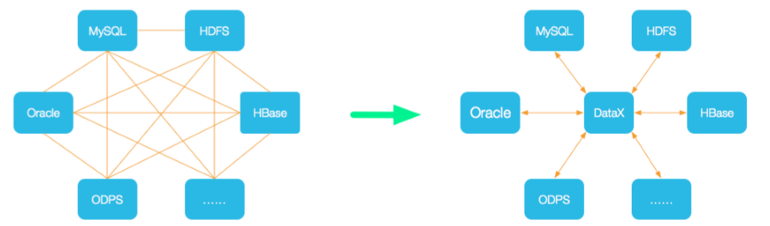
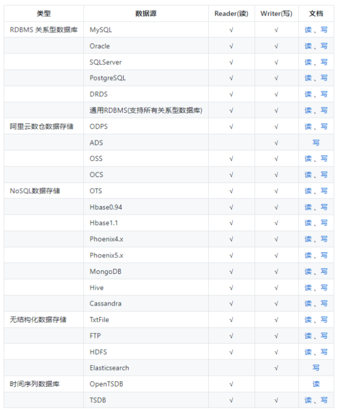
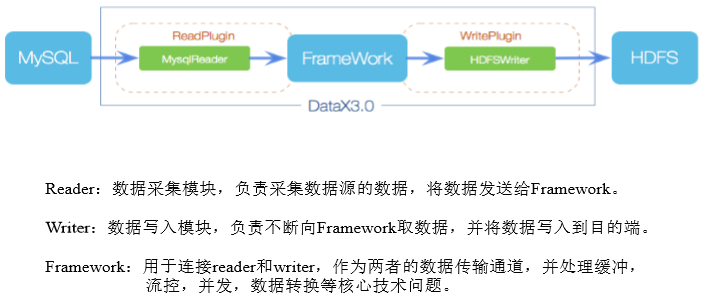
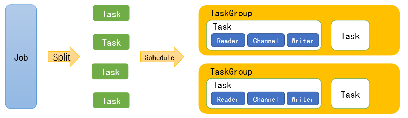
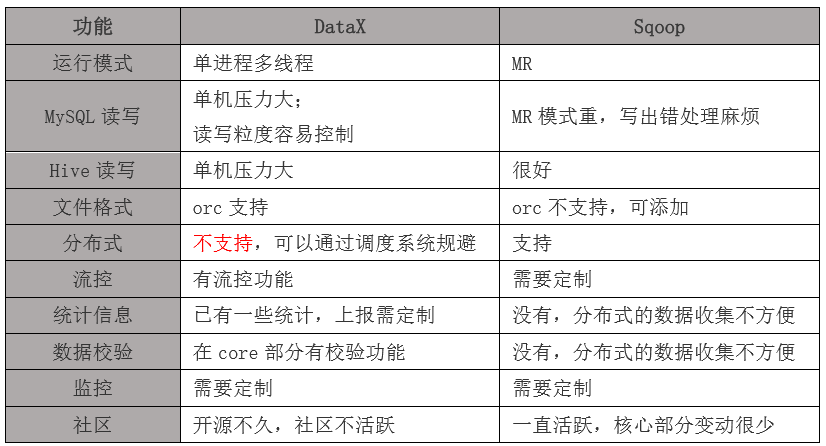
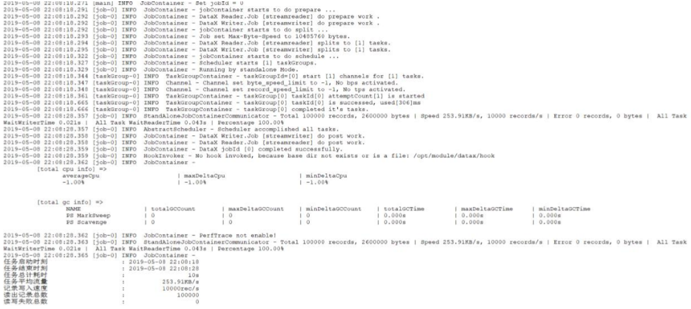
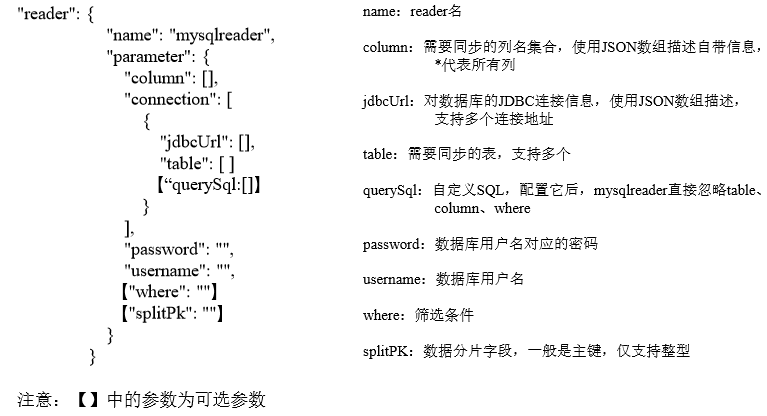
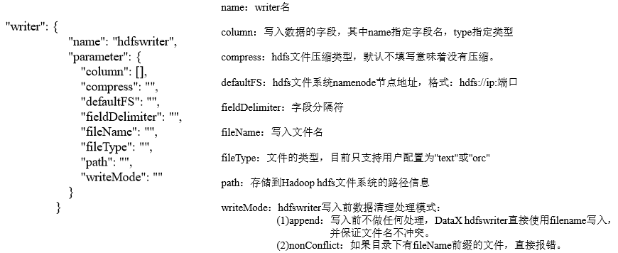
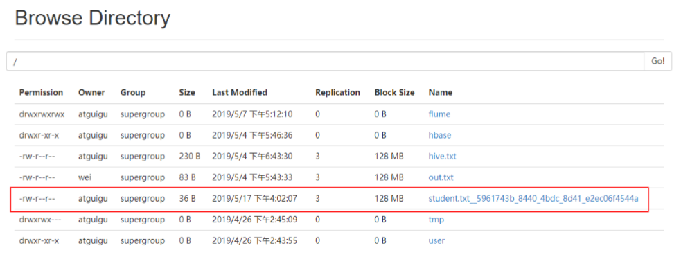
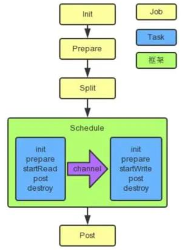

# DataX

## 一、概述
### 1.1、什么是DataX 
DataX 是阿里巴巴开源的一个异构数据源离线同步工具，致力于实现包括关系型数据库(MySQL、Oracle 等)、HDFS、Hive、ODPS、HBase、FTP 等各种异构数据源之间稳定高效的数据同步功能。 

### 1.2、DataX的设计 
为了解决异构数据源同步问题，DataX 将复杂的网状的同步链路变成了星型数据链路，DataX 作为中间传输载体负责连接各种数据源。当需要接入一个新的数据源的时候，只需要将此数据源对接到 DataX，便能跟已有的数据源做到无缝数据同步。   
   

### 1.3、支持的数据源 
DataX 目前已经有了比较全面的插件体系，主流的 RDBMS 数据库、NOSQL、大数据计算系统都已经接入。    
   

### 1.4、框架设计 
   

### 1.5、运行原理
   

Job：单个作业的管理节点，负责数据清理、子任务划分、TaskGroup监控管理。   
Task：由Job切分而来，是DataX作业的最小单元，每个Task负责一部分数据的同步工作。   
Schedule：将Task组成TaskGroup，单个TaskGroup的并发数量为5。   
TaskGroup：负责启动Task。   
 
举例来说，用户提交了一个 DataX 作业，并且配置了 20 个并发，目的是将一个 100 张分表的 mysql 数据同步到 odps 里面。 DataX 的调度决策思路是：   
1）DataXJob 根据分库分表切分成了 100 个 Task。   
2）根据 20 个并发，DataX 计算共需要分配 4 个 TaskGroup。   
3）4个TaskGroup 平分切分好的 100 个Task，每一个TaskGroup 负责以 5 个并发共计运 25 个 Task。   

### 1.6、与Sqoop的对比 
   


## 二、快速入门 
### 2.1、官方地址 
下载地址：http://datax-opensource.oss-cn-hangzhou.aliyuncs.com/datax.tar.gz   
源码地址：https://github.com/alibaba/DataX   

### 2.2、前置要求 
- Linux   
- JDK(1.8 以上，推荐 1.8)   
- Python(推荐 Python2.6.X)   

### 2.3、安装 
1）将下载好的 datax.tar.gz 上传到 hadoop102 的/opt/software   
2）解压 datax.tar.gz 到/opt/module   
```
[atguigu@hadoop102 software]$ tar -zxvf datax.tar.gz -C /opt/module/ 
```
3）运行自检脚本 
```
[atguigu@hadoop102 bin]$ cd /opt/module/datax/bin/ 
[atguigu@hadoop102 bin]$ python datax.py /opt/module/datax/job/job.json 
```
   


## 三、使用案例 
1）查看配置模板 
```
[atguigu@hadoop102 bin]$ python datax.py -r streamreader -w streamwriter 

DataX (DATAX-OPENSOURCE-3.0), From Alibaba !
Copyright (C) 2010-2017, Alibaba Group. All Rights Reserved.


Please refer to the streamreader document:
     https://github.com/alibaba/DataX/blob/master/streamreader/doc/streamreader.md 

Please refer to the streamwriter document:
     https://github.com/alibaba/DataX/blob/master/streamwriter/doc/streamwriter.md 
 
Please save the following configuration as a json file and  use
     python {DATAX_HOME}/bin/datax.py {JSON_FILE_NAME}.json 
to run the job.

{
    "job": {
        "content": [
            {
                "reader": {
                    "name": "streamreader", 
                    "parameter": {
                        "column": [], 
                        "sliceRecordCount": ""
                    }
                }, 
                "writer": {
                    "name": "streamwriter", 
                    "parameter": {
                        "encoding": "", 
                        "print": true
                    }
                }
            }
        ], 
        "setting": {
            "speed": {
                "channel": ""
            }
        }
    }
}
```
2）根据模板编写配置文件 
```
[atguigu@hadoop102 job]$ vim stream2stream.json 
```
填写以下内容： 
```
{
    "job":{
        "content":[
            {
                "reader":{
                    "name":"streamreader",
                    "parameter":{
                        "sliceRecordCount":10,
                        "column":[
                            {
                                "type":"long",
                                "value":"10"
                            },
                            {
                                "type":"string",
                                "value":"hello，DataX"
                            }
                        ]
                    }
                },
                "writer":{
                    "name":"streamwriter",
                    "parameter":{
                        "encoding":"UTF-8",
                        "print":true
                    }
                }
            }
        ],
        "setting":{
            "speed":{
                "channel":1
            }
        }
    }
}
```
3）运行 
```
[atguigu@hadoop102 job]$  /opt/module/datax/bin/datax.py /opt/module/datax/job/stream2stream.json 
```

### 3.2、读取MySQL中的数据存放到HDFS 
#### 3.2.1、查看官方模板 
```
[atguigu@hadoop102 ~]$ python /opt/module/datax/bin/datax.py -r mysqlreader -w hdfswriter 
{
    "job":{
        "content":[
            {
                "reader":{
                    "name":"mysqlreader",
                    "parameter":{
                        "column":[

                        ],
                        "connection":[
                            {
                                "jdbcUrl":[

                                ],
                                "table":[

                                ]
                            }
                        ],
                        "password":"",
                        "username":"",
                        "where":""
                    }
                },
                "writer":{
                    "name":"hdfswriter",
                    "parameter":{
                        "column":[

                        ],
                        "compress":"",
                        "defaultFS":"",
                        "fieldDelimiter":"",
                        "fileName":"",
                        "fileType":"",
                        "path":"",
                        "writeMode":""
                    }
                }
            }
        ],
        "setting":{
            "speed":{
                "channel":""
            }
        }
    }
}
```
mysqlreader 参数解析：    
    
hdfswriter 参数解析：    
    

#### 3.2.2、准备数据 
1）创建 student 表 
```
mysql> create database datax; 
mysql> use datax; 
mysql> create table student(id int,name varchar(20)); 
```
2）插入数据 
```
mysql> insert into student values(1001,'zhangsan'),(1002,'lisi'),(1003,'wangwu'); 
```

#### 3.2.3、编写配置文件 
```
[atguigu@hadoop102 datax]$ vim /opt/module/datax/job/mysql2hdfs.json 
{
    "job":{
        "content":[
            {
                "reader":{
                    "name":"mysqlreader",
                    "parameter":{
                        "column":[
                            "id",
                            "name"
                        ],
                        "connection":[
                            {
                                "jdbcUrl":[
                                    "jdbc:mysql://hadoop102:3306/datax"
                                ],
                                "table":[
                                    "student"
                                ]
                            }
                        ],
                        "username":"root",
                        "password":"000000"
                    }
                },
                "writer":{
                    "name":"hdfswriter",
                    "parameter":{
                        "column":[
                            {
                                "name":"id",
                                "type":"int"
                            },
                            {
                                "name":"name",
                                "type":"string"
                            }
                        ],
                        "defaultFS":"hdfs://hadoop102:9000",
                        "fieldDelimiter":"\t",
                        "fileName":"student.txt",
                        "fileType":"text",
                        "path":"/",
                        "writeMode":"append"
                    }
                }
            }
        ],
        "setting":{
            "speed":{
                "channel":"1"
            }
        }
    }
}
```

#### 3.2.4、执行任务 
```
[atguigu@hadoop102 datax]$ bin/datax.py job/mysql2hdfs.json 2019-05-17 16:02:16.581 [job-0] INFO  JobContainer -  任务启动时刻                    : 2019-05-17 16:02:04 
任务结束时刻                    : 2019-05-17 16:02:16 
任务总计耗时                    :                 12s 
任务平均流量                    :                3B/s 
记录写入速度                    :              0rec/s 
读出记录总数                    :                   3 
读写失败总数                    :                   0
```

#### 3.2.5、查看hdfs 
    
注意：HdfsWriter 实际执行时会在该文件名后添加随机的后缀作为每个线程写入实际文件名。   
 
#### 3.2.6、关于HA的支持 
```
"hadoopConfig":{   
    "dfs.nameservices": "ns",   
    "dfs.ha.namenodes.ns": "nn1,nn2",   
    "dfs.namenode.rpc-address.ns.nn1": "主机名:端口", 
    "dfs.namenode.rpc-address.ns.nn2": "主机名:端口", 
    "dfs.client.failover.proxy.provider.ns": 
    "org.apache.hadoop.hdfs.server.namenode.ha.ConfiguredFailoverProxyProvider" 
}
```


## 八、执行流程
### 8.1、总体流程
     
黄色： Job 部分的执行阶段，   
蓝色： Task 部分的执行阶段，   
绿色：框架执行阶段。   

### 8.2、程序入口 
datax.py 
```
…… 
ENGINE_COMMAND = "java -server ${jvm} %s -classpath %s  ${params} 
com.alibaba.datax.core.Engine -mode ${mode} -jobid ${jobid} -job ${job}" % ( 
    DEFAULT_PROPERTY_CONF, CLASS_PATH
) 
……

```
Engine.java 

### 8.3、Task切分逻辑 
JobContainer.java 

#### 8.3.1、并发数的确定 

### 8.4、调度 

#### 8.4.1、确定组数和分组 

#### 8.4.2、调度实现 

### 8.5、数据传输 

#### 8.5.1、限速的实现 

## 九、DataX使用优化 
### 9.1、关键参数 
```
job.setting.speed.channel : channel 并发数 
job.setting.speed.record : 2 全局配置 channel 的 record 限速 
job.setting.speed.byte：全局配置 channel 的 byte 限速 
core.transport.channel.speed.record：单个 channel 的 record 限速 
core.transport.channel.speed.byte：单个 channel 的 byte 限速 
```

### 9.2、优化1：提升每个channel的速度 
在 DataX 内部对每个 Channel 会有严格的速度控制，分两种，一种是控制每秒同步的记录数，另外一种是每秒同步的字节数，默认的速度限制是 1MB/s，可以根据具体硬件情况设置这个 byte 速度或者 record 速度，一般设置 byte 速度，比如：我们可以把单个 Channel 的速度上限配置为 5MB 

### 9.3、优化2：提升DataX Job内Channel并发数  
并发数 = taskGroup 的数量 * 每个 TaskGroup 并发执行的 Task 数 (默认为 5)。    
提升 job 内 Channel 并发有三种配置方式：    

### 9.3.1、配置全局Byte限速以及单Channel Byte限速 
Channel 个数 = 全局 Byte 限速 / 单 Channel Byte 限速    
```
{
    "core":{
        "transport":{
            "channel":{
                "speed":{
                    "byte":1048576
                }
            }
        }
    },
    "job":{
        "setting":{
            "speed":{
                "byte":5242880
            }
        },         
        ... 
    }
}
```
core.transport.channel.speed.byte=1048576，job.setting.speed.byte=5242880，所以    
Channel个数 = 全局 Byte 限速 / 单 Channel Byte 限速=5242880/1048576=5 个    

#### 9.3.2、配置全局Record限速以及单Channel Record限速 
Channel 个数 = 全局 Record 限速 / 单 Channel Record 限速    
```
{
    "core":{
        "transport":{
            "channel":{
                "speed":{
                    "record":100
                }
            }
        }
    },
    "job":{
        "setting":{
            "speed":{
                "record":500
            }
        }
    }
}
```
core.transport.channel.speed.record=100 ， job.setting.speed.record=500, 所 以 配 置 全 局Record 限速以及单 Channel Record 限速，Channel 个数 = 全局 Record 限速 / 单 Channel Record 限速=500/100=5   

#### 9.3.3、直接配置Channel个数 
只有在上面两种未设置才生效，上面两个同时设置是取值小的作为最终的 channel 数。   
```
{
    "job":{
        "setting":{
            "speed":{
                "channel":5
            }
        }
    }
}
```
直接配置 job.setting.speed.channel=5，所以 job 内 Channel 并发=5 个    

### 9.4、优化3：提高JVM堆内存 
当提升 DataX Job 内 Channel 并发数时，内存的占用会显著增加，因为 DataX 作为数据交换通道，在内存中会缓存较多的数据。例如 Channel 中会有一个 Buffer，作为临时的数据交换的缓冲区，而在部分 Reader 和 Writer 的中，也会存在一些 Buffer，为了防止 OOM 等错误，调大 JVM 的堆内存。   
建议将内存设置为 4G 或者 8G，这个也可以根据实际情况来调整。    

调整 JVM xms xmx 参数的两种方式：一种是直接更改 datax.py 脚本；另一种是在启动的时候，加上对应的参数，如下：     
```
python datax/bin/datax.py --jvm="-Xms8G -Xmx8G" XXX.json 
```

