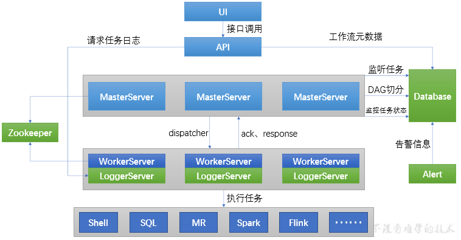
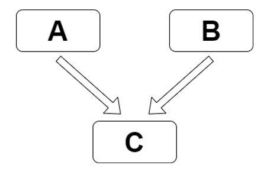
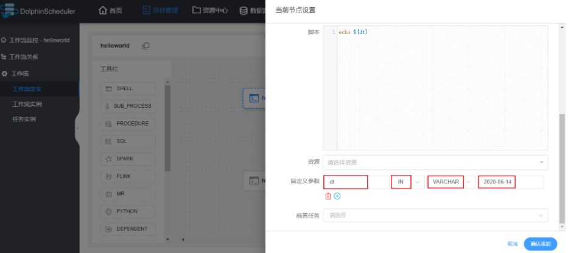
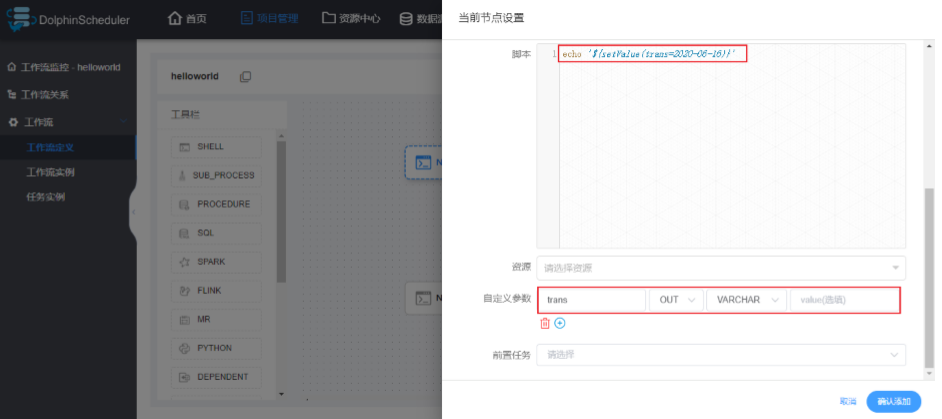
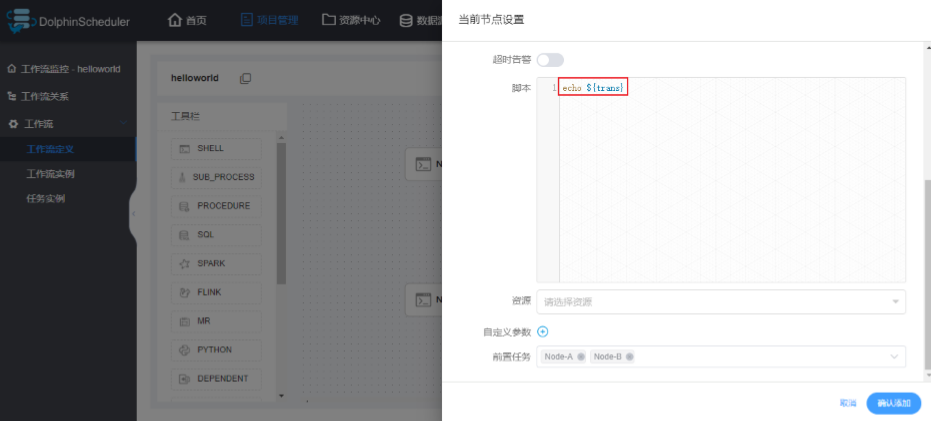
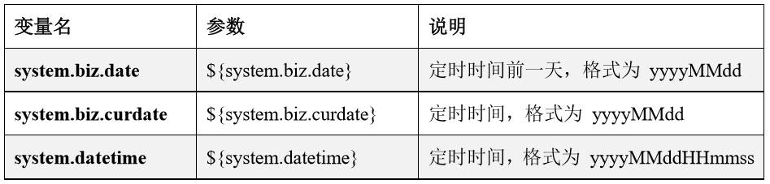
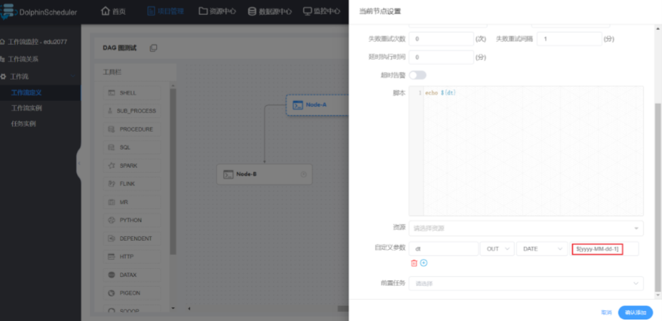

# DolphinScheduler

## 一、DolphinScheduler 简介 
### 1.1、DolphinScheduler 概述 
Apache DolphinScheduler 是一个分布式、易扩展的可视化 DAG 工作流任务调度平台。致力于解决数据处理流程中错综复杂的依赖关系，使调度系统在数据处理流程中开箱即用。

### 1.2 DolphinScheduler 核心架构 
DolphinScheduler 的主要角色如下：     
- MasterServer 采用分布式无中心设计理念，MasterServer 主要负责 DAG 任务切分、任务提交、任务监控，并同时监听其它 MasterServer 和 WorkerServer 的健康状态。 
- WorkerServer 也采用分布式无中心设计理念，WorkerServer 主要负责任务的执行和提供日志服务。 
- ZooKeeper 服务，系统中的 MasterServer 和 WorkerServer 节点都通过 ZooKeeper 来进行集群管理和容错。 
- Alert 服务，提供告警相关服务。 
- API 接口层，主要负责处理前端 UI 层的请求。 
- UI，系统的前端页面，提供系统的各种可视化操作界面。 

DolphinScheduler核心架构   
   

## 二、DolphinScheduler 部署说明 
### 2.1、软硬件环境要求 
#### 2.1.1、操作系统版本要求 
```
操作系统 版本 
Red     Hat Enterprise Linux 7.0 及以上 
CentOS  7.0 及以上 
Oracle  Enterprise Linux 7.0 及以上 
Ubuntu  LTS 16.04 及以上 
```

#### 2.1.2、服务器硬件要求 
```
CPU     内存      硬盘类型    网络      实例数量 
4 核+    8 GB+       SAS     千兆网卡    1+ 
```

### 2.2、部署模式 
DolphinScheduler 支持多种部署模式，包括单机模式（Standalone）、伪集群模式（PseudoCluster）、集群模式（Cluster）等。 

#### 2.2.1、单机模式 
单机模式（standalone）模式下，所有服务均集中于一个 StandaloneServer 进程中，并且其中内置了注册中心 Zookeeper 和数据库 H2。只需配置 JDK 环境，就可一键启动DolphinScheduler，快速体验其功能。   

#### 2.2.2、伪集群模式 
伪集群模式（Pseudo-Cluster）是在单台机器部署 DolphinScheduler 各项服务，该模式下 master、worker、api server、logger server 等服务都只在同一台机器上。Zookeeper 和数据库需单独安装并进行相应配置。   

#### 2.2.3、集群模式 
集群模式（Cluster）与伪集群模式的区别就是在多台机器部署 DolphinScheduler 各项服务，并且 Master、Worker 等服务可配置多个。   

## 三、DolphinScheduler 集群模式部署 
### 3.1、集群规划 
集群模式下，可配置多个 Master 及多个 Worker。通常可配置 2~3 个 Master，若干个Worker。由于集群资源有限，此处配置一个 Master，三个 Worker，集群规划如下。   
```
hadoop102 master、worker 
hadoop103 worker 
hadoop104 worker 
```

### 3.2、前置准备工作 
（1）三台节点均需部署 JDK（1.8+），并配置相关环境变量。    
（2）需部署数据库，支持 MySQL（5.7+）或者 PostgreSQL（8.2.15+）。    
（3）需部署 Zookeeper（3.4.6+）。    
（4）三台节点均需安装进程树分析工具 psmisc。    
```
[atguigu@hadoop102 ~]$ sudo yum install -y psmisc 
[atguigu@hadoop103 ~]$ sudo yum install -y psmisc 
[atguigu@hadoop104 ~]$ sudo yum install -y psmisc 
```

### 3.3、解压 DolphinScheduler 安装包 
（1）上传 DolphinScheduler 安装包到 hadoop102 节点的/opt/software 目录   
（2）解压安装包到当前目录   
注：解压目录并非最终的安装目录   
```
[atguigu@hadoop102 software]$ tar -zxvf apache-dolphinscheduler-2.0.5-bin 
```

### 3.4、创建元数据库及用户 
DolphinScheduler 元数据存储在关系型数据库中，故需创建相应的数据库和用户。    
（1）创建数据库
```
mysql> CREATE DATABASE dolphinscheduler DEFAULT CHARACTER SET utf8 DEFAULT COLLATE utf8_general_ci; 
```
（2）创建用户 
```
mysql> CREATE USER 'dolphinscheduler'@'%' IDENTIFIED BY 'dolphinscheduler'; 
```
注：若出现以下错误信息，表明新建用户的密码过于简单。 
```
ERROR 1819 (HY000): Your password does not satisfy the current policy requirements
```
可提高密码复杂度或者执行以下命令降低 MySQL 密码强度级别。 
```
mysql> set global validate_password_policy=0; 
mysql> set global validate_password_length=4; 
```
（3）赋予用户相应权限 
```
mysql> GRANT ALL PRIVILEGES ON dolphinscheduler.* TO 'dolphinscheduler'@'%'; 
mysql> flush privileges; 
```

### 3.5、配置一键部署脚本 
修改解压目录下的 conf/config 目录下的 install_config.conf 文件。 
```
[atguigu@hadoop102 apache-dolphinscheduler-2.0.5-bin]$ vim conf/config/install_config.conf  
```
修改内容如下。 

### 3.6、初始化数据库 
（1）拷贝 MySQL 驱动到 DolphinScheduler 的解压目录下的 lib 中，要求使用 MySQL JDBC Driver 8.0.16。 
```
[atguigu@hadoop102 apache-dolphinscheduler-2.0.5-bin]$ cp /opt/software/mysql-connector-java-8.0.16.jar lib/ 
```
（2）执行数据库初始化脚本    
数据库初始化脚本位于 DolphinScheduler 解 压 目 录 下 的 script 目 录 中 ， 即/opt/software/ds/apache-dolphinscheduler-2.0.5-bin/script/。   
```
[atguigu@hadoop102 apache-dolphinscheduler-2.0.5-bin]$ script/createdolphinscheduler.sh 
```

### 3.7、一键部署 DolphinScheduler 
（1）启动 Zookeeper 集群
```
[atguigu@hadoop102 apache-dolphinscheduler-2.0.5-bin]$ zk.sh start 
```
（2）一键部署并启动 DolphinScheduler 
```
[atguigu@hadoop102 apache-dolphinscheduler-2.0.5-bin]$ ./install.sh 
```
（3）查看 DolphinScheduler 进程    
（4）访问 DolphinScheduler UI    
DolphinScheduler UI 地址为 http://hadoop102:12345/dolphinscheduler    
初始用户的用户名为：admin，密码为 dolphinscheduler123    

### 3.8、DolphinScheduler 启停命令 
DolphinScheduler 的启停脚本均位于其安装目录的 bin 目录下。    

1）一键启停所有服务    
```
./bin/start-all.sh 
./bin/stop-all.sh 
```
注意同 Hadoop 的启停脚本进行区分。   

2）启停 Master    
```
./bin/dolphinscheduler-daemon.sh start master-server 
./bin/dolphinscheduler-daemon.sh stop master-server 
```

3）启停 Worker 
```
./bin/dolphinscheduler-daemon.sh start worker-server 
./bin/dolphinscheduler-daemon.sh stop worker-server 
```

4）启停 Api 
```
./bin/dolphinscheduler-daemon.sh start api-server 
./bin/dolphinscheduler-daemon.sh stop api-server 
```

5）启停 Logger 
```
./bin/dolphinscheduler-daemon.sh start logger-server 
./bin/dolphinscheduler-daemon.sh stop logger-server
```

6）启停 Alert 
```
./bin/dolphinscheduler-daemon.sh start alert-server 
./bin/dolphinscheduler-daemon.sh stop alert-server 
```

## 四、DolphinScheduler 入门 
### 4.1、安全中心配置 
安全中心主要有租户管理、用户管理、告警组管理、告警实例管理、Worker 分组管理、Yarn 队列管理、环境管理、令牌管理等功能。   

#### 4.1.1、Yarn 队列管理 
队列是在执行 spark、mapreduce 等程序，需要用到“队列”参数时使用的。    
此处的队列对应的是 Yarn 调度器的资源队列。故队列概念只对跑在 Yarn 上的任务类型有效。此处创建出的队列，可供后续任务进行选择。需要注意的是，在 DolphinScheduler 中创建队列，并不会影响到 Yarn 调度器的队列配置。   
此处可不创建队列。    

注：    
名称：DS 执行任务时可以选择的队列名称。    
队列值：与名称相对应的 Yarn 调度队列的名称。    

#### 4.1.2、租户管理 
租户对应的是 Linux 的用户，用于 worker 提交作业所使用的用户。如果 linux 没有这个用户，默认情况下会导致任务运行失败。可以通过修改 worker.properties 配置文件中参数 worker.tenant.auto.create=true（默认值为 false）实现当 linux 用户不存在时自动创建该用户。worker.tenant.auto.create=true 参数会要求 worker 可以免密运行 sudo 命令。   

此处创建一个 atguigu 租户，如下图。     
注：   
租户编码：租户编码是 Linux 上的用户，唯一，不能重复。   
队列：该租户提交 Yarn 任务时的默认队列。   

#### 4.1.3、用户管理 
用户对应的是 DolphinScheduler 的用户，用于登录 DolphinScheduler。用户分管理员用户和普通用户。   

管理员有授权和用户管理等权限，没有创建项目和工作流定义的操作的权限。 普通用户可以创建项目和对工作流定义的创建，编辑，执行等操作。 此处创建一个普通用户 atguigu，如下图。    
注：   
用户名：DolphinScheduler 登录账户   
租户：该用户关联的租户   
队列：默认为租户所关联的队列。   
邮件、手机号：主要用于告警通知。   

#### 4.1.4、告警实例管理与告警组管理 
告警实例与告警组用于任务运行成功或者失败之后的告警通知。一个告警组可包含多个告警实例，一个告警实例，需选择一个告警插件，并配置相应参数，目前支持的告警插件有电子邮件、钉钉、企业微信、飞书等。 

#### 4.1.5、Worker 分组管理 
一个 Worker 分组由多个 Worker 组成。在任务执行时，可以将任务分配给指定 Worker组，由该组中的 Worker 节点执行该任务。每个 Worker 至少属于一个组，默认为 default 组。Worker 所属分组可以调整，调整方式如下： 

1）方式一     
打开要设置分组的 Worker 节点上的 worker.properties 配置文件，修改 worker.groups 参数，worker.groups 参数的值为该 Worker 节点对应的分组名称,默认为 default，如果该 worker节点属于多个分组，则多个分组名称以逗号隔开。   
示例:  
```
worker.groups=default,test 
```

2）方式二   
在 Web UI 的安全中心的 Workder 分组管理中修改，如下图所示。    

#### 4.1.6、环境管理 
此处可配置 Worker 运行环境（任务运行时所需的环境变量），默认的运行环境由 Worker节点中，dolphinscheduler 安装目录下的 conf/env/dolphinscheduler_env.sh 决定。   

创建环境的操作如下图所示，环境创建完毕之后，就可供 Worker 运行任务时选择。    
注：   
环境名称：用户自定义名称。   
环境配置：与 dolphinscheduler_env.sh 配置格式相同。   
详细描述：环境的详细描述，不能为空，否则无法创建   
Worker 组：环境所属的 Worker 组。   

#### 4.1.7、令牌管理 
令牌用于通过接口访问 DolphinScheduler 各项服务时的用户验证。普通用户通过 UI 页面访问各项服务时，无需使用令牌。若需将 DolphinScheduler 与第三方服务进行集成，则需调用其接口，此时需使用令牌。 

### 4.2、项目管理 
#### 4.2.1、切换用户   
默认不使用管理员用户操作项目和工作流等，故需先切换到普通用户 atguigu。   
1）admin 用户退出   
2）使用 atguigu 用户登录   

#### 4.2.2、创建项目 

#### 4.2.3、查看项目 

### 4.3、工作流基础配置 
下图为工作流配置页面，共包含三个模快，分别为工作流定义、工作流实例和任务实例。    
- 工作流定义：用于定义工作流，包括工作流各节点任务详情及各节点依赖关系等。 
- 工作流实例：工作流每执行一次就会生成一个工作流实例。此处可查看正在运行的工作流以及已经完成的工作流
- 任务实例：工作流中的一个节点任务，每执行一次就会生成一个任务实例。此处可用于查看正在执行的节点任务以及已经完成的节点任务。 
 
#### 4.3.1、工作流定义 
工作流要求：工作流需包含三个 Shell 类型的任务节点，分别是 A，B，C。三个任务的依赖关系如下图所示：    
  

1）创建工作流      
2）配置任务节点   
（1）节点 A     
（2）节点 B   
（3）节点 C   
 
3）配置任务节点的依赖关系   
配置依赖的关系的方式如下两种：     
（1）直接对 DAG 图进行拖拽操作     
（2）在节点设置中选择 “前置任务”   

4）保存工作流定义   

#### 4.3.2、执行工作流 
1）上线工作流   
工作流须上线之后才能执行。处于上线状态的工作流定义不可修改，如需修改，须先下线。   
2）单次运行工作流   
3）定时执行工作流   
（1）点击定时   
（2）配置定时规则   
此处示例为每分钟执行一次   
（3）定时管理   
（4）定时上线   

#### 4.3.3、查看工作流实例 
1）查看所有工作流实例   
2）查看工作流执行状态   

#### 4.3.4、查看任务实例 
1）查看所有任务实例 
2）查看任务实例日志 

## 五、DolphinScheduler 进阶 
### 5.1、工作流传参 
#### 5.1.1、本地参数和全局参数 
DolphinScheduler 支持对任务节点进行灵活的传参，任务节点可通过${参数名}引用参数值。   

1）本地参数   
本地参数是指只针对单个任务节点有效的参数。   
（1）修改 helloworld 工作流 Node-A 节点如下   
  
dt：参数名   
IN/OUT：IN 表示向当前节点传参，OUT 表示向下游节点传参   
VARCHAR：参数值类型   
2020-06-14：参数值   

（2）保存工作流并运行，查看 Node-A 输出日志。    

2）全局参数    
全局参数是指针对整个工作流的所有任务节点都有效的参数。   
（1）修改 helloworld 工作流每个任务节点如下   
节点 A 配置   
节点 B 配置   
节点 C 配置    
（2）保存工作流，并设置全局参数    
（3）执行工作流，查看三个任务节点输出日志。   

#### 5.1.2、参数传递 
DolphinScheduler 支持上游任务节点向下游任务节点传参。目前支持这个特性的任务类型有：Shell、SQL、Procedure。以下案例使用 Shell 类型的任务节点进行演示。   

1）设置上游节点 Node-A   
  
注：echo '${setValue(key=value)}'为固定写法    

2）设置下游节点 Node-C   
  

3）查看输出日志   
可以看到对应节点日志中输出了其调用参数的值。   

#### 5.1.3、参数优先级 
一个任务节点引用的参数可能来自三种类型：分别是全局参数 、上游任务传递的参数、本地参数。因为参数的值存在多个来源，当参数名相同时，就需要考虑参数优先级的问题。DolphinScheduler 参数的优先级从低到高为：全局参数 <上游任务传递的参数 <本地参数。

在上游任务传递的参数的情况下，由于上游可能存在多个任务向下游传递参数。当上游传递的参数名称相同时：   
下游节点会优先使用值为非空的参数。   
如果存在多个值为非空的参数，则按照上游任务的完成时间排序，选择完成时间最早的上游任务对应的参数。    

#### 5.1.4、内置参数 
DolphinScheduler 提供了一些时间相关的系统参数，方便定时调度使用。    

1）基础内置参数    
  
```
变量名                     参数                      说明 
system.biz.date     ${system.biz.date}      定时时间前一天，格式为 yyyyMMdd 
system.biz.curdate  ${system.biz.curdate}   定时时间，格式为 yyyyMMdd 
system.datetime     ${system.datetime}      定时时间，格式为 yyyyMMddHHmmss 
```
2）衍生内置参数   
可通过衍生内置参数，设置任意格式、任意时间的日期。    

（1）自定义日期格式 
可以对 $[yyyyMMddHHmmss] 任意分解组合，如 $[yyyyMMdd], $[HHmmss], $[yyyyMM-dd]。 

（2）使用 add_months() 函数   
该函数用于加减月份， 第一个入口参数为[yyyyMMdd]，表示返回时间的格式 第二个入口参数为月份偏移量，表示加减多少个月。   
```
参数                              说明 
$[add_months(yyyyMMdd,12*N)]    后 N 年 
$[add_months(yyyyMMdd,-12*N)]   前 N 年 
$[add_months(yyyyMMdd,N)]       后 N 月 
$[add_months(yyyyMMdd,-N)]      前 N 月 
```

（3）直接加减数字   
在自定义格式后直接“+/-”数字，单位为“天”。   
```
参数              说明 
$[yyyyMMdd+7*N] 后 N 周 
$[yyyyMMdd-7*N] 前 N 周 
$[yyyyMMdd+N]   后 N 天 
$[yyyyMMdd-N]   前 N 天 
$[HHmmss+N/24]  后 N 小时 
$[HHmmss-N/24]  前 N 小时 
$[HHmmss+N/24/60] 后 N 分钟 
$[HHmmss-N/24/60] 前 N 分钟 
```

3）配置示例   
若执行的脚本需要一个格式为 yyyy-MM-dd 的前一天日期的参数，进行如下配置即可。  
  

### 5.2、引用依赖资源 
有些任务需要引用一些额外的资源，例如 MR、Spark 等任务须引用 jar 包，Shell 任务需要引用其他脚本等。DolphinScheduler 提供了资源中心来对这些资源进行统一管理。资源中心存储系统可选择本地文件系统或者 HDFS 等。资源中心除了提供文件资源管理功能，还提供了 Hive 自定义函数管理的功能。   

下面以 Shell 任务为例，演示如何引用资源中心的其他脚本。   
1）在资源中心创建脚本      
2）配置 Shell 任务引用脚本   
修改工作流节点 Node-A，引用上述脚本   
3）保存工作流并执行，查看对应节点输出日志。    

### 5.3、告警通知 
Dolphinscheduler 支持多种告警媒介，此处以电子邮件为例进行演示。    

1）准备邮箱    
如需使用 DolphinScheduler 的电子邮件告警通知功能，需要准备一个电子邮箱账号，并启用 SMTP 服务。此处以 QQ 邮箱为例。     
（1）开启 SMTP 服务   
拖动进度条在页面下方找到下图所示内容，开启 POP3/SMTP | IMAP/SMTP 任一服务即可。   
（2）获得授权码   
 
2）DolphinScheduler 配置   
（1）切换管理员用户   
（2）创建告警实例   
第一步：点击创建告警实例   
第二步：编辑告警实例   
（3）创建告警组   
第一步：点击创建告警组   
第二步：编辑告警组   

3）测试告警通知   
（1）切换普通用户   
（2）执行工作流测试   
（3）等待接受邮件   

### 5.4、工作流失败重跑 
若工作流执行到一半失败了，需要重新启动工作流。重新启动时可选择从起点开始执行，也可选择从断点开始执行。   

1）模拟失败场景   
（1）修改 Node-A 配置如下   
（2）修改资源中心的 test.sh 文件如下   

2）运行工作流     
3）查看工作流实例      
4）工作失败重跑     
（1）从起点开始   
（2）从断点开始   

