## 八、ProcessFunction API（底层 API） 


## 九、状态编程和容错机制 
流式计算分为无状态和有状态两种情况。无状态的计算观察每个独立事件，并根据最后一个事件输出结果。例如，流处理应用程序从传感器接收温度读数，并在温度超过 90 度时发出警告。有状态的计算则会基于多个事件输出结果。以下是一些例子。    
- 所有类型的窗口。例如，计算过去一小时的平均温度，就是有状态的计算。
- 所有用于复杂事件处理的状态机。例如，若在一分钟内收到两个相差 20 度以上的温度读数，则发出警告，这是有状态的计算。 
- 流与流之间的所有关联操作，以及流与静态表或动态表之间的关联操作，都是有状态的计算。 

下图展示了无状态流处理和有状态流处理的主要区别。无状态流处理分别接收每条数据记录(图中的黑条)，然后根据最新输入的数据生成输出数据(白条)。有状态流处理会维护状态(根据每条输入记录进行更新)，并基于最新输入的记录和当前的状态值生成输出记录(灰条)。    
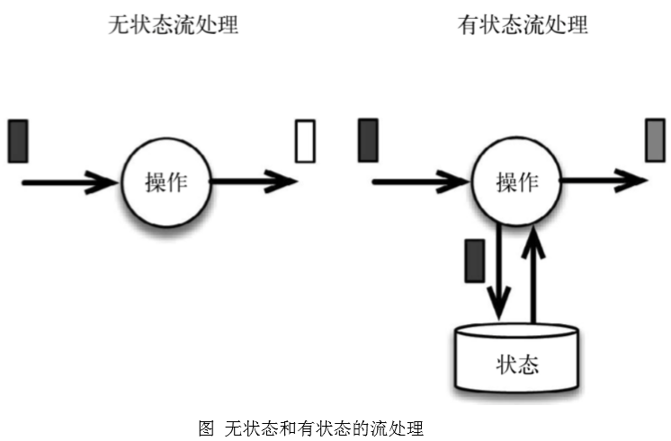   

上图中输入数据由黑条表示。无状态流处理每次只转换一条输入记录，并且仅根据最新的输入记录输出结果(白条)。有状态 流处理维护所有已处理记录的状态值，并根据每条新输入的记录更新状态，因此输出记录(灰条)反映的是综合考虑多个事件之后的结果。    

尽管无状态的计算很重要，但是流处理对有状态的计算更感兴趣。事实上，正确地实现有状态的计算比实现无状态的计算难得多。旧的流处理系统并不支持有状态的计算，而新一代的流处理系统则将状态及其正确性视为重中之重。    

### 9.1、有状态的算子和应用程序 
Flink 内置的很多算子，数据源 source，数据存储 sink 都是有状态的，流中的数据都是 buffer records，会保存一定的元素或者元数据。例如: ProcessWindowFunction会缓存输入流的数据，ProcessFunction 会保存设置的定时器信息等等。      
在 Flink 中，状态始终与特定算子相关联。总的来说，有两种类型的状态：    
- 算子状态（operator state） 
- 键控状态（keyed state） 

#### 9.3.1、算子状态（operator state） 
算子状态的作用范围限定为算子任务。这意味着由同一并行任务所处理的所有数据都可以访问到相同的状态，状态对于同一任务而言是共享的。算子状态不能由相同或不同算子的另一个任务访问。    
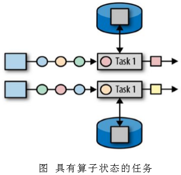   

Flink 为算子状态提供三种基本数据结构：    
列表状态（List state）     
将状态表示为一组数据的列表。     

联合列表状态（Union list state）    
也将状态表示为数据的列表。它与常规列表状态的区别在于，在发生故障时，或者从保存点（savepoint）启动应用程序时如何恢复。   

广播状态（Broadcast state）    
如果一个算子有多项任务，而它的每项任务状态又都相同，那么这种特殊情况最适合应用广播状态。    

#### 9.3.2、键控状态（keyed state） 
键控状态是根据输入数据流中定义的键（key）来维护和访问的。Flink 为每个键值维护一个状态实例，并将具有相同键的所有数据，都分区到同一个算子任务中，这个任务会维护和处理这个 key 对应的状态。当任务处理一条数据时，它会自动将状态的访问范围限定为当前数据的 key。因此，具有相同 key 的所有数据都会访问相同的状态。Keyed State 很类似于一个分布式的 key-value map 数据结构，只能用于 KeyedStream（keyBy 算子处理之后）。   
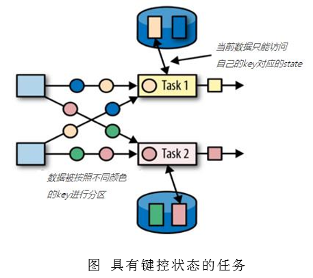   

Flink 的 Keyed State 支持以下数据类型：    
ValueState<T>保存单个的值，值的类型为 T。     
```
get 操作: ValueState.value() 
set 操作: ValueState.update(T value) 
```
ListState<T>保存一个列表，列表里的元素的数据类型为 T。基本操作如下：    
```
ListState.add(T value) 
ListState.addAll(List<T> values) 
ListState.get()返回 Iterable<T> 
ListState.update(List<T> values) 
```
MapState<K, V>保存 Key-Value 对。 
```
MapState.get(UK key) 
MapState.put(UK key, UV value) 
MapState.contains(UK key) 
MapState.remove(UK key) 
```
ReducingState<T>   
AggregatingState<I, O>   
State.clear()是清空操作。    

我们可以利用 Keyed State，实现这样一个需求：检测传感器的温度值，如果连续的两个温度差值超过 10 度，就输出报警。    
```
DataStream<Tuple3<String, Double, Double>> warningStream = dataStream 
        .keyBy("id") 
        .flatMap(new TempIncreaseWarning(10.0)); 
```
这里需要实现一个自定义的 RichFlatMapFuction，具体实现如下： 
```
public static class TempIncreaseWarning extends RichFlatMapFunction<SensorReading, Tuple3<String, Double, Double>>{
     private Double threshold; 
 
    TempIncreaseWarning(Double threshold) { 
        this.threshold = threshold; 
    } 
 
    private ValueState<Double> lastTempState; 
 
    @Override 
    public void open(Configuration parameters) throws Exception {
         lastTempState = getRuntimeContext().getState(new ValueStateDescriptor<Double>("last-temp", Double.class, Double.MIN_VALUE)); 
    } 
 
    @Override 
    public void flatMap(SensorReading value, Collector<Tuple3<String, Double, Double>> out) throws Exception {
         Double lastTemp = lastTempState.value(); 
 
        lastTempState.update(value.getTemperature()); 
 
        if( lastTemp != Double.MIN_VALUE ) { 
            // 跟最新的温度值计算差值，如果大于阈值，那么输出报警            
            Double diff = Math.abs(value.getTemperature() - lastTemp); 
            if (diff > threshold) 
                out.collect( new Tuple3<>(value.getId(), lastTemp, value.getTemperature()) ); 
        } 
    } 
} 
```
通过 RuntimeContext 注册 StateDescriptor。StateDescriptor 以状态 state 的名字和存储的数据类型为参数。   
在 open()方法中创建 state 变量。注意复习之前的 RichFunction 相关知识。   

### 9.2、状态一致性 
当在分布式系统中引入状态时，自然也引入了一致性问题。一致性实际上是"正确性级别"的另一种说法，也就是说在成功处理故障并恢复之后得到的结果，与没有发生任何故障时得到的结果相比，前者到底有多正确？举例来说，假设要对最近一小时登录的用户计数。在系统经历故障之后，计数结果是多少？如果有偏差，是有漏掉的计数还是重复计数？    

#### 9.2.1、一致性级别 
在流处理中，一致性可以分为 3 个级别：    
at-most-once: 这其实是没有正确性保障的委婉说法——故障发生之后，计数结果可能丢失。同样的还有 udp。    
at-least-once: 这表示计数结果可能大于正确值，但绝不会小于正确值。也就是说，计数程序在发生故障后可能多算，但是绝不会少算。    
exactly-once: 这指的是系统保证在发生故障后得到的计数结果与正确值一致。    

曾经，at-least-once 非常流行。第一代流处理器(如 Storm 和 Samza)刚问世时只保证 at-least-once，原因有二。     
保证 exactly-once 的系统实现起来更复杂。这在基础架构层(决定什么代表正确，以及 exactly-once 的范围是什么)和实现层都很有挑战性。    
流处理系统的早期用户愿意接受框架的局限性，并在应用层想办法弥补(例如使应用程序具有幂等性，或者用批量计算层再做一遍计算)。    

最先保证 exactly-once 的系统(Storm Trident 和 Spark Streaming)在性能和表现力这两个方面付出了很大的代价。为了保证 exactly-once，这些系统无法单独地对每条记录运用应用逻辑，而是同时处理多条(一批)记录，保证对每一批的处理要么全部成功，要么全部失败。这就导致在得到结果前，必须等待一批记录处理结束。因此，用户经常不得不使用两个流处理框架(一个用来保证 exactly-once，另一个用来对每个元素做低延迟处理)，结果使基础设施更加复杂。曾经，用户不得不在保证exactly-once 与获得低延迟和效率之间权衡利弊。Flink 避免了这种权衡。   

Flink 的一个重大价值在于，它既保证了 exactly-once，也具有低延迟和高吞吐的处理能力。    

从根本上说，Flink 通过使自身满足所有需求来避免权衡，它是业界的一次意义重大的技术飞跃。尽管这在外行看来很神奇，但是一旦了解，就会恍然大悟。    

#### 9.2.2、端到端（end-to-end）状态一致性 
目前我们看到的一致性保证都是由流处理器实现的，也就是说都是在 Flink 流处理器内部保证的；而在真实应用中，流处理应用除了流处理器以外还包含了数据源（例如 Kafka）和输出到持久化系统。    

端到端的一致性保证，意味着结果的正确性贯穿了整个流处理应用的始终；每一个组件都保证了它自己的一致性，整个端到端的一致性级别取决于所有组件中一致性最弱的组件。具体可以划分如下：    

内部保证 —— 依赖 checkpoint   
source 端 —— 需要外部源可重设数据的读取位置   
sink 端 —— 需要保证从故障恢复时，数据不会重复写入外部系统 而对于 sink 端，又有两种具体的实现方式：幂等（Idempotent）写入和事务性（Transactional）写入。    

幂等写入    
所谓幂等操作，是说一个操作，可以重复执行很多次，但只导致一次结果更改，也就是说，后面再重复执行就不起作用了。    
事务写入    
需要构建事务来写入外部系统，构建的事务对应着 checkpoint，等到 checkpoint 真正完成的时候，才把所有对应的结果写入 sink 系统中。    

对于事务性写入，具体又有两种实现方式：预写日志（WAL）和两阶段提交（2PC）。DataStream API 提供了 GenericWriteAheadSink 模板类和TwoPhaseCommitSinkFunction 接口，可以方便地实现这两种方式的事务性写入。    

不同 Source 和 Sink 的一致性保证可以用下表说明：   
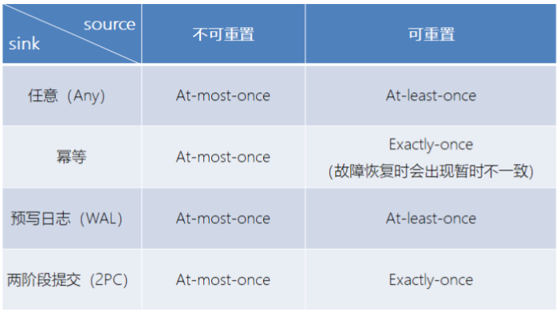   

### 9.3、检查点（checkpoint） 
Flink 具体如何保证 exactly-once 呢? 它使用一种被称为"检查点"（checkpoint）的特性，在出现故障时将系统重置回正确状态。下面通过简单的类比来解释检查点的作用。    

假设你和两位朋友正在数项链上有多少颗珠子，如下图所示。你捏住珠子，边数边拨，每拨过一颗珠子就给总数加一。你的朋友也这样数他们手中的珠子。当你分神忘记数到哪里时，怎么办呢? 如果项链上有很多珠子，你显然不想从头再数一遍，尤其是当三人的速度不一样却又试图合作的时候，更是如此(比如想记录前一分钟三人一共数了多少颗珠子，回想一下一分钟滚动窗口)。    

于是，你想了一个更好的办法: 在项链上每隔一段就松松地系上一根有色皮筋，将珠子分隔开; 当珠子被拨动的时候，皮筋也可以被拨动; 然后，你安排一个助手，让他在你和朋友拨到皮筋时记录总数。用这种方法，当有人数错时，就不必从头开始数。相反，你向其他人发出错误警示，然后你们都从上一根皮筋处开始重数，助手则会告诉每个人重数时的起始数值，例如在粉色皮筋处的数值是多少。 

Flink 检查点的作用就类似于皮筋标记。数珠子这个类比的关键点是: 对于指定的皮筋而言，珠子的相对位置是确定的; 这让皮筋成为重新计数的参考点。总状态(珠子的总数)在每颗珠子被拨动之后更新一次，助手则会保存与每根皮筋对应的检查点状态，如当遇到粉色皮筋时一共数了多少珠子，当遇到橙色皮筋时又是多少。当问题出现时，这种方法使得重新计数变得简单。   

#### 9.3.1、Flink 的检查点算法 
Flink 检查点的核心作用是确保状态正确，即使遇到程序中断，也要正确。记住这一基本点之后，我们用一个例子来看检查点是如何运行的。Flink 为用户提供了用来定义状态的工具。例如，以下这个 Scala 程序按照输入记录的第一个字段(一个字符串)进行分组并维护第二个字段的计数状态。   
```
val stream: DataStream[(String, Int)] = ...  
val counts: DataStream[(String, Int)] = stream 
    .keyBy(record => record._1) 
    .mapWithState(  (in: (String, Int), state: Option[Int])  =>  
    state match {  
    case Some(c) => ( (in._1, c + in._2), Some(c + in._2) )  
    case None => ( (in._1, in._2), Some(in._2) ) 
}) 
```
该程序有两个算子: keyBy 算子用来将记录按照第一个元素(一个字符串)进行分组，根据该 key 将数据进行重新分区，然后将记录再发送给下一个算子: 有状态的map 算子(mapWithState)。map 算子在接收到每个元素后，将输入记录的第二个字段的数据加到现有总数中，再将更新过的元素发射出去。下图表示程序的初始状态: 输入流中的 6 条记录被检查点分割线(checkpoint barrier)隔开，所有的 map 算子状态均为 0(计数还未开始)。所有 key 为 a 的记录将被顶层的 map 算子处理，所有 key 为 b的记录将被中间层的 map 算子处理，所有 key 为 c 的记录则将被底层的 map 算子处理。    
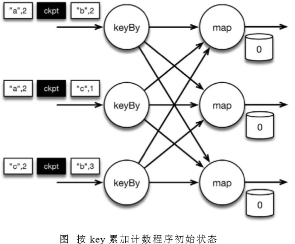   

上图是程序的初始状态。注意，a、b、c 三组的初始计数状态都是 0，即三个圆柱上的值。ckpt 表示检查点分割线（checkpoint barriers）。每条记录在处理顺序上严格地遵守在检查点之前或之后的规定，例如["b",2]在检查点之前被处理，["a",2]则在检查点之后被处理。   

当该程序处理输入流中的 6 条记录时，涉及的操作遍布 3 个并行实例(节点、CPU内核等)。那么，检查点该如何保证 exactly-once 呢?   

检查点分割线和普通数据记录类似。它们由算子处理，但并不参与计算，而是会触发与检查点相关的行为。当读取输入流的数据源(在本例中与 keyBy 算子内联)遇到检查点屏障时，它将其在输入流中的位置保存到持久化存储中。如果输入流来自消息传输系统(Kafka)，这个位置就是偏移量。Flink 的存储机制是插件化的，持久化存储可以是分布式文件系统，如 HDFS。下图展示了这个过程。    
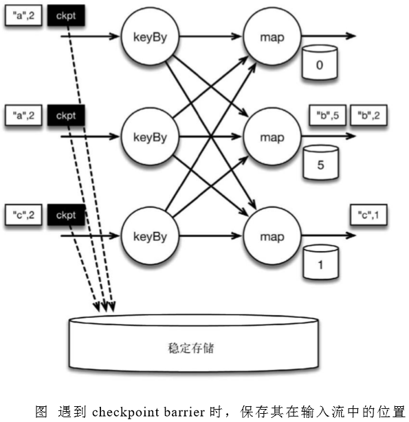   

当 Flink 数据源(在本例中与 keyBy 算子内联)遇到检查点分界线（barrier）时，它会将其在输入流中的位置保存到持久化存储中。这让 Flink 可以根据该位置重启。  
 
检查点像普通数据记录一样在算子之间流动。当 map 算子处理完前 3 条数据并收到检查点分界线时，它们会将状态以异步的方式写入持久化存储，如下图所示。    
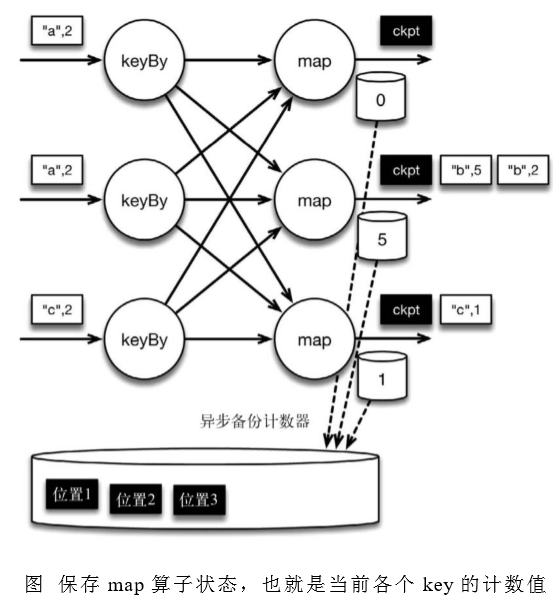   

位于检查点之前的所有记录(["b",2]、["b",3]和["c",1])被 map 算子处理之后的情况。此时，持久化存储已经备份了检查点分界线在输入流中的位置(备份操作发生在barrier 被输入算子处理的时候)。map 算子接着开始处理检查点分界线，并触发将状态异步备份到稳定存储中这个动作。   

当 map 算子的状态备份和检查点分界线的位置备份被确认之后，该检查点操作就可以被标记为完成，如下图所示。我们在无须停止或者阻断计算的条件下，在一个逻辑时间点(对应检查点屏障在输入流中的位置)为计算状态拍了快照。通过确保备份的状态和位置指向同一个逻辑时间点，后文将解释如何基于备份恢复计算，从而保证 exactly-once。值得注意的是，当没有出现故障时，Flink 检查点的开销极小，检查点操作的速度由持久化存储的可用带宽决定。回顾数珠子的例子: 除了因为数错而需要用到皮筋之外，皮筋会被很快地拨过。    
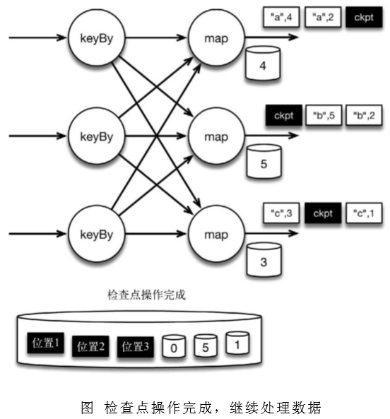   

检查点操作完成，状态和位置均已备份到稳定存储中。输入流中的所有数据记录都已处理完成。值得注意的是，备份的状态值与实际的状态值是不同的。备份反映的是检查点的状态。  

如果检查点操作失败，Flink 可以丢弃该检查点并继续正常执行，因为之后的某一个检查点可能会成功。虽然恢复时间可能更长，但是对于状态的保证依旧很有力。只有在一系列连续的检查点操作失败之后，Flink 才会抛出错误，因为这通常预示着发生了严重且持久的错误。    

现在来看看下图所示的情况: 检查点操作已经完成，但故障紧随其后。   
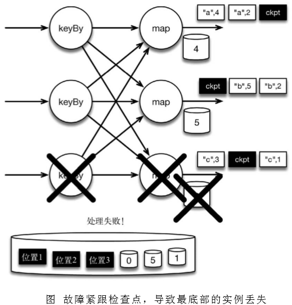   

在这种情况下，Flink 会重新拓扑(可能会获取新的执行资源)，将输入流倒回到上一个检查点，然后恢复状态值并从该处开始继续计算。在本例中，["a",2]、["a",2]和["c",2]这几条记录将被重播。    

下图展示了这一重新处理过程。从上一个检查点开始重新计算，可以保证在剩下的记录被处理之后，得到的 map 算子的状态值与没有发生故障时的状态值一致。   
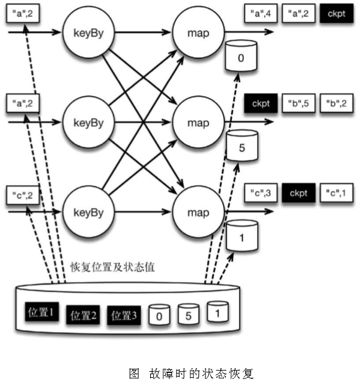   

Flink 将输入流倒回到上一个检查点屏障的位置，同时恢复 map 算子的状态值。然后，Flink 从此处开始重新处理。这样做保证了在记录被处理之后，map 算子的状态值与没有发生故障时的一致。 

Flink 检查点算法的正式名称是异步分界线快照(asynchronous barrier snapshotting)。该算法大致基于 Chandy-Lamport 分布式快照算法。 

检查点是 Flink 最有价值的创新之一，因为它使 Flink 可以保证 exactly-once，并且不需要牺牲性能。   

#### 9.3.2、Flink+Kafka 如何实现端到端的 exactly-once 语义 
我们知道，端到端的状态一致性的实现，需要每一个组件都实现，对于 Flink + Kafka 的数据管道系统（Kafka 进、Kafka 出）而言，各组件怎样保证 exactly-once语义呢？    
- 内部 —— 利用 checkpoint 机制，把状态存盘，发生故障的时候可以恢复，保证内部的状态一致性   
- source —— kafka consumer 作为 source，可以将偏移量保存下来，如果后续任务出现了故障，恢复的时候可以由连接器重置偏移量，重新消费数据，保证一致性 
- sink —— kafka producer 作为 sink，采用两阶段提交 sink，需要实现一个 TwoPhaseCommitSinkFunction 

内部的 checkpoint 机制我们已经有了了解，那 source 和 sink 具体又是怎样运行的呢？接下来我们逐步做一个分析。   
我们知道 Flink 由 JobManager 协调各个 TaskManager 进行 checkpoint 存储，checkpoint 保存在 StateBackend 中，默认 StateBackend 是内存级的，也可以改为文件级的进行持久化保存。      
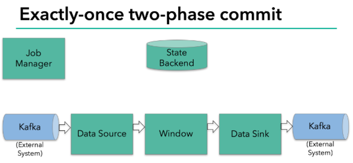   
当 checkpoint 启动时，JobManager 会将检查点分界线（barrier）注入数据流；barrier 会在算子间传递下去。    
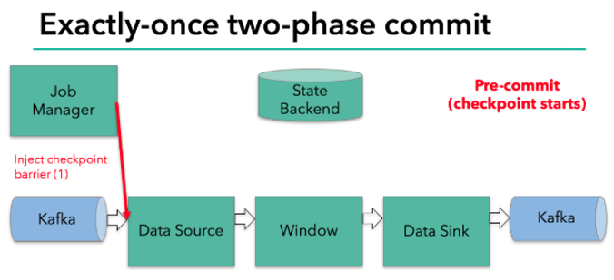   
每个算子会对当前的状态做个快照，保存到状态后端。对于 source 任务而言，就会把当前的 offset 作为状态保存起来。下次从 checkpoint 恢复时，source 任务可以重新提交偏移量，从上次保存的位置开始重新消费数据。    
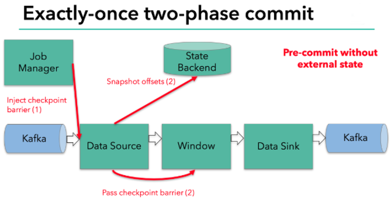   

每个内部的 transform 任务遇到 barrier 时，都会把状态存到 checkpoint 里。   
sink 任务首先把数据写入外部 kafka，这些数据都属于预提交的事务（还不能被消费）；当遇到 barrier 时，把状态保存到状态后端，并开启新的预提交事务。    
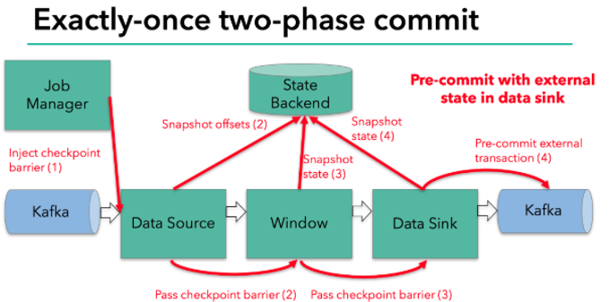   
当所有算子任务的快照完成，也就是这次的 checkpoint 完成时，JobManager 会向所有任务发通知，确认这次 checkpoint 完成。    

当 sink 任务收到确认通知，就会正式提交之前的事务，kafka 中未确认的数据就改为“已确认”，数据就真正可以被消费了。    
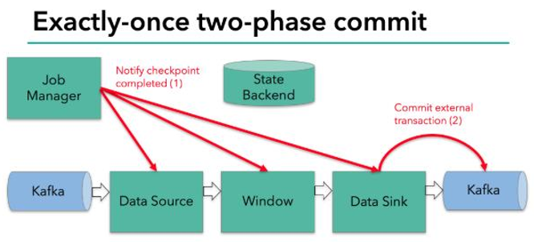  

所以我们看到，执行过程实际上是一个两段式提交，每个算子执行完成，会进行“预提交”，直到执行完 sink 操作，会发起“确认提交”，如果执行失败，预提交会放弃掉。   
具体的两阶段提交步骤总结如下：    
- 第一条数据来了之后，开启一个 kafka 的事务（transaction），正常写入 kafka 分区日志但标记为未提交，这就是“预提交” 
- jobmanager 触发 checkpoint 操作，barrier 从 source 开始向下传递，遇到 barrier 的算子将状态存入状态后端，并通知 jobmanager 
- sink 连接器收到 barrier，保存当前状态，存入 checkpoint，通知 jobmanager，并开启下一阶段的事务，用于提交下个检查点的数据 
- jobmanager 收到所有任务的通知，发出确认信息，表示 checkpoint 完成 
- sink 任务收到 jobmanager 的确认信息，正式提交这段时间的数据 
- 外部 kafka 关闭事务，提交的数据可以正常消费了。 
 
所以我们也可以看到，如果宕机需要通过 StateBackend 进行恢复，只能恢复所有确认提交的操作。 

### 9.4、选择一个状态后端(state backend) 
MemoryStateBackend      
内存级的状态后端，会将键控状态作为内存中的对象进行管理，将它们存储在 TaskManager 的 JVM 堆上；而将 checkpoint 存储在 JobManager 的内存中。    

FsStateBackend   
将 checkpoint 存到远程的持久化文件系统（FileSystem）上。而对于本地状态，跟 MemoryStateBackend 一样，也会存在 TaskManager 的 JVM 堆上。   

RocksDBStateBackend   
将所有状态序列化后，存入本地的 RocksDB 中存储。    

注意：RocksDB 的支持并不直接包含在 flink 中，需要引入依赖：    
```
<dependency>
    <groupId>org.apache.flink</groupId>
    <artifactId>flink-statebackend-rocksdb_2.12</artifactId>
    <version>1.10.1</version>
</dependency>
```
设置状态后端为 FsStateBackend，并配置检查点和重启策略： 
```
public class StateTest4_FaultTolerance {
    public static void main(String[] args) throws Exception{
        StreamExecutionEnvironment env = StreamExecutionEnvironment.getExecutionEnvironment();
        env.setParallelism(1);

        // 1. 状态后端配置
        env.setStateBackend( new MemoryStateBackend());
        env.setStateBackend( new FsStateBackend(""));
        env.setStateBackend( new RocksDBStateBackend(""));

        // 2. 检查点配置
        env.enableCheckpointing(300);

        // 高级选项
        env.getCheckpointConfig().setCheckpointingMode(CheckpointingMode.EXACTLY_ONCE);
        env.getCheckpointConfig().setCheckpointTimeout(60000L);
        env.getCheckpointConfig().setMaxConcurrentCheckpoints(2);
        env.getCheckpointConfig().setMinPauseBetweenCheckpoints(100L);
        env.getCheckpointConfig().setPreferCheckpointForRecovery(true);
        env.getCheckpointConfig().setTolerableCheckpointFailureNumber(0);

        // 3. 重启策略配置
        // 固定延迟重启
        env.setRestartStrategy(RestartStrategies.fixedDelayRestart(3, 10000L));
        // 失败率重启
        env.setRestartStrategy(RestartStrategies.failureRateRestart(3, Time.minutes(10), Time.minutes(1)));

        // socket文本流
        DataStream<String> inputStream = env.socketTextStream("localhost", 7777);

        // 转换成SensorReading类型
        DataStream<SensorReading> dataStream = inputStream.map(line -> {
            String[] fields = line.split(",");
            return new SensorReading(fields[0], new Long(fields[1]), new Double(fields[2]));
        });

        dataStream.print();
        env.execute();
    }
}
```

## 十、Table API 与 SQL 
Table API 是流处理和批处理通用的关系型 API，Table API 可以基于流输入或者批输入来运行而不需要进行任何修改。Table API 是 SQL 语言的超集并专门为 Apache Flink 设计的，Table API 是 Scala 和 Java 语言集成式的 API。与常规 SQL 语言中将查询指定为字符串不同，Table API 查询是以 Java 或 Scala 中的语言嵌入样式来定义的，具有 IDE 支持如:自动完成和语法检测。   

### 10.1、需要引入的 pom 依赖 
```
<dependency>
    <groupId>org.apache.flink</groupId>
    <artifactId>flink-table-planner_2.12</artifactId>
    <version>1.10.1</version>
</dependency>
<dependency>     
    <groupId>org.apache.flink</groupId>     
    <artifactId>flink-table-api-scala-bridge_2.12</artifactId>     
    <version>1.10.1</version> 
</dependency> 
```

### 10.2、简单了解 TableAPI 
```
def main(args: Array[String]): Unit = {   
    val env = StreamExecutionEnvironment.getExecutionEnvironment   
    env.setParallelism(1)

    val inputStream = env.readTextFile("..\\sensor.txt")   
    val dataStream = inputStream     
    .map( data => {       
        val dataArray = data.split(",") 
        SensorReading(dataArray(0).trim, dataArray(1).trim.toLong, dataArray(2).trim.toDouble)     
    }   
    )

    // 基于 env创建 
    tableEnv val settings: EnvironmentSettings = 
    EnvironmentSettings.newInstance().useOldPlanner().inStreamingMode().build() 
    val tableEnv: StreamTableEnvironment = StreamTableEnvironment.create(env, settings) 
    // 从一条流创建一张表
    val dataTable: Table = tableEnv.fromDataStream(dataStream) 
  
   // 从表里选取特定的数据
   val selectedTable: Table = dataTable.select('id, 'temperature)     .filter("id = 'sensor_1'") 
  
   val selectedStream: DataStream[(String, Double)] = selectedTable     .toAppendStream[(String, Double)] 
  
   selectedStream.print() 
  
   env.execute("table test") 
} 
```
  
#### 10.2.1、动态表 
如果流中的数据类型是 case class 可以直接根据 case class 的结构生成 table    
```
tableEnv.fromDataStream(dataStream) 
```
或者根据字段顺序单独命名 
```
tableEnv.fromDataStream(dataStream,’id,’timestamp  .......)   
```
最后的动态表可以转换为流进行输出 
```
table.toAppendStream[(String,String)] 
```

#### 10.2.2、字段 
用一个单引放到字段前面来标识字段名, 如 ‘name , ‘id ,’amount 等 

### 10.3、TableAPI 的窗口聚合操作  
#### 10.3.1、通过一个例子了解 TableAPI  
```
// 统计 每 10秒中 每个传感器温度值 的个数
def main(args: Array[String]): Unit = {   
    val env = StreamExecutionEnvironment.getExecutionEnvironment   
    env.setParallelism(1)   
    env.setStreamTimeCharacteristic(TimeCharacteristic.EventTime) 

    val inputStream = env.readTextFile("..\\sensor.txt")   
    val dataStream = inputStream     
    .map( data => {       
        val dataArray = data.split(",")       
        SensorReading(dataArray(0).trim, dataArray(1).trim.toLong, dataArray(2).trim.toDouble)     
        }     
    ) 
    .assignTimestampsAndWatermarks(new BoundedOutOfOrdernessTimestampExtractor[SensorReading](Time.seconds(1)) {       
        override def extractTimestamp(element: SensorReading): Long = element.timestamp * 1000L     
        }
    ) 
    // 基于 env创建 
    tableEnv val settings: EnvironmentSettings = EnvironmentSettings.newInstance().useOldPlanner().inStreamingMode().build() 
    val tableEnv: StreamTableEnvironment = StreamTableEnvironment.create(env, settings) 

    // 从一条流创建一张表，按照字段去定义，并指定事件时间的时间字段
    val dataTable: Table = tableEnv.fromDataStream(dataStream, 'id, 'temperature, 'ts.rowtime) 
    // 按照时间开窗聚合统计
    val resultTable: Table = dataTable     
        .window( Tumble over 10.seconds on 'ts as 'tw )     
        .groupBy('id, 'tw) 
    .select('id, 'id.count) 
      val selectedStream: DataStream[(Boolean, (String, Long))] = resultTable     .toRetractStream[(String, Long)] 
      selectedStream.print() 
      env.execute("table window test") 
} 
```

#### 10.3.2、关于 group by  
1、如果了使用 groupby，table 转换为流的时候只能用 toRetractDstream
```
val dataStream: DataStream[(Boolean, (String, Long))] = table 
.toRetractStream[(String,Long)] 
```
2、toRetractDstream 得到的第一个 boolean 型字段标识 true 就是最新的数据(Insert)，false 表示过期老数据(Delete) 
```
val dataStream: DataStream[(Boolean, (String, Long))] = table 
.toRetractStream[(String,Long)] 
dataStream.filter(_._1).print() 
```
3、如果使用的 api 包括时间窗口，那么窗口的字段必须出现在 groupBy 中。 
```
val resultTable: Table = dataTable 
    .window( Tumble over 10.seconds on 'ts as 'tw ) 
    .groupBy('id, 'tw) 
    .select('id, 'id.count) 
```

#### 10.3.3、关于时间窗口 
1、用到时间窗口，必须提前声明时间字段，如果是 processTime 直接在创建动态表时进行追加就可以。 
```
val dataTable: Table = tableEnv.fromDataStream(dataStream, 'id, 'temperature, 'ps.proctime) 
```
2、如果是 EventTime 要在创建动态表时声明 
```
val dataTable: Table = tableEnv.fromDataStream(dataStream, 'id, 'temperature, 'ts.rowtime) 
```
3、滚动窗口可以使用 Tumble over 10000.millis on 来表示 
```
val resultTable: Table = dataTable 
    .window( Tumble over 10.seconds on 'ts as 'tw ) 
    .groupBy('id, 'tw) 
    .select('id, 'id.count) 
```

### 10.4、SQL 如何编写 
```
// 统计 每 10秒中 每个传感器温度值 的个数
def main(args: Array[String]): Unit = {   
    val env = StreamExecutionEnvironment.getExecutionEnvironment   
    env.setParallelism(1)   
    env.setStreamTimeCharacteristic(TimeCharacteristic.EventTime) 

    val inputStream = env.readTextFile("..\\sensor.txt")   
    val dataStream = inputStream     
        .map( data => {       
            val dataArray = data.split(",")       
            SensorReading(dataArray(0).trim, dataArray(1).trim.toLong, dataArray(2).trim.toDouble)     
        }     
        ) 
    .assignTimestampsAndWatermarks(new BoundedOutOfOrdernessTimestampExtractor[SensorReading](Time.seconds(1)) {       
    override 
    def extractTimestamp(element: SensorReading): Long = element.timestamp * 1000L 
    })   
    // 基于 env创建 tableEnv 
    val settings: EnvironmentSettings = EnvironmentSettings.newInstance().useOldPlanner().inStreamingMode().build( ) 
    val tableEnv: StreamTableEnvironment = StreamTableEnvironment.create(env, settings) 
    // 从一条流创建一张表，按照字段去定义，并指定事件时间的时间字段
    val dataTable: Table = tableEnv.fromDataStream(dataStream, 'id, 'temperature, 'ts.rowtime) 
    // 直接写 sql完成开窗统计    
    val resultSqlTable: Table = tableEnv.sqlQuery("select id, count(id) from "   + dataTable + " group by id, tumble(ts, interval '15' second)") 
    val selectedStream: DataStream[(Boolean, (String, Long))] = resultSqlTable.toRetractStream[(String, Long)] 
    selectedStream.print() 
    env.execute("table window test") 
} 
```

## 十一、Flink CEP 简介 
### 11.1、什么是复杂事件处理CEP 
一个或多个由简单事件构成的事件流通过一定的规则匹配，然后输出用户想得到的数据，满足规则的复杂事件。    

特征：      
 目标：从有序的简单事件流中发现一些高阶特征   
输入：一个或多个由简单事件构成的事件流   
处理：识别简单事件之间的内在联系，多个符合一定规则的简单事件构成  

复杂事件   
输出：满足规则的复杂事件   
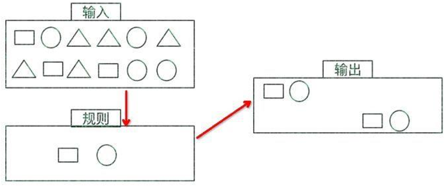  

CEP 用于分析低延迟、频繁产生的不同来源的事件流。CEP 可以帮助在复杂的、不相关的事件流中找出有意义的模式和复杂的关系，以接近实时或准实时的获得通知并阻止一些行为。

CEP 支持在流上进行模式匹配，根据模式的条件不同，分为连续的条件或不连续的条件；模式的条件允许有时间的限制，当在条件范围内没有达到满足的条件时，会导致模式匹配超时。 

看起来很简单，但是它有很多不同的功能：    
- 输入的流数据，尽快产生结果 
- 在 2 个 event 流上，基于时间进行聚合类的计算 
- 提供实时/准实时的警告和通知 
- 在多样的数据源中产生关联并分析模式 
- 高吞吐、低延迟的处理 

市场上有多种 CEP 的解决方案，例如 Spark、Samza、Beam 等，但他们都没有提供专门的 library 支持。但是 Flink 提供了专门的 CEP library。 

### 11.2、Flink CEP 
Flink 为 CEP 提供了专门的 Flink CEP library，它包含如下组件：      
Event Stream   
pattern 定义   
pattern 检测   
生成 Alert   
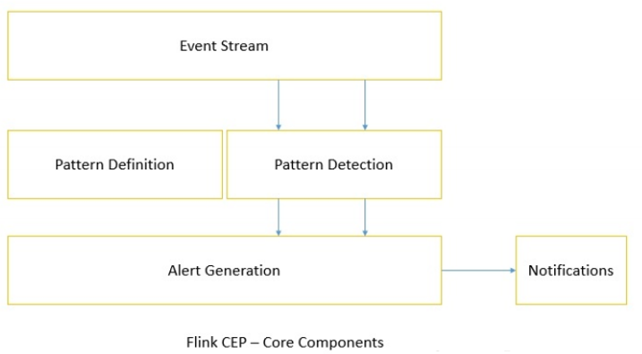    

首先，开发人员要在 DataStream 流上定义出模式条件，之后 Flink CEP 引擎进行模式检测，必要时生成告警。   
为了使用 Flink CEP，我们需要导入依赖：   
```
<dependency> 
  <groupId>org.apache.flink</groupId> 
  <artifactId>flink-cep_2.12</artifactId> 
  <version>1.10.1</version> 
</dependency> 
```

#### Pattern API   
每个 Pattern 都应该包含几个步骤，或者叫做 state。从一个 state 到另一个 state，通常我们需要定义一些条件，例如下列的代码   
```
val loginFailPattern = Pattern.begin[LoginEvent]("begin") 
  .where(_.eventType.equals("fail")) 
  .next("next") 
  .where(_.eventType.equals("fail")) 
  .within(Time.seconds(10) 
```
每个 state 都应该有一个标示：例如.begin[LoginEvent]("begin")中的"begin"    
每个 state 都需要有一个唯一的名字，而且需要一个 filter 来过滤条件，这个过滤条件定义事件需要符合的条件，例如:
```
.where(_.eventType.equals("fail"))    
```
我们也可以通过 subtype 来限制 event 的子类型： 
```
start.subtype(SubEvent.class).where(...); 
```
事实上，你可以多次调用 subtype 和 where 方法；而且如果 where 条件是不相关的，你可以通过 or 来指定一个单独的 filter 函数： 
```
pattern.where(...).or(...); 
```
之后，我们可以在此条件基础上，通过 next 或者 followedBy 方法切换到下一个state，next 的意思是说上一步符合条件的元素之后紧挨着的元素；而 followedBy 并不要求一定是挨着的元素。这两者分别称为严格近邻和非严格近邻。   
```
val strictNext = start.next("middle") 
val nonStrictNext = start.followedBy("middle") 
```
最后，我们可以将所有的 Pattern 的条件限定在一定的时间范围内： 
```
next.within(Time.seconds(10)) 
```
这个时间可以是 Processing Time，也可以是 Event Time。 

#### Pattern 检测 
通过一个 input DataStream 以及刚刚我们定义的 Pattern，我们可以创建一个PatternStream： 
```
val input = ... 
val pattern = ... 
 
val patternStream = CEP.pattern(input, pattern) 
val patternStream = CEP.pattern(loginEventStream.keyBy(_.userId), loginFail Pattern) 
```
一旦获得 PatternStream，我们就可以通过 select 或 flatSelect，从一个 Map 序列找到我们需要的警告信息。 

#### select 
select 方法需要实现一个 PatternSelectFunction，通过 select 方法来输出需要的警告。它接受一个 Map 对，包含 string/event，其中 key 为 state 的名字，event 则为真实的 Event。 
```
val loginFailDataStream = patternStream 
  .select((pattern: Map[String, Iterable[LoginEvent]]) => { 
    val first = pattern.getOrElse("begin", null).iterator.next() 
    val second = pattern.getOrElse("next", null).iterator.next() 
 
    Warning(first.userId, first.eventTime, second.eventTime, "warning") 
  }) 
```
其返回值仅为 1 条记录。 

#### flatSelect 
通过实现 PatternFlatSelectFunction，实现与 select 相似的功能。唯一的区别就是 flatSelect 方法可以返回多条记录，它通过一个 Collector[OUT]类型的参数来将要输出的数据传递到下游。 

#### 超时事件的处理 
通过 within 方法，我们的 parttern 规则将匹配的事件限定在一定的窗口范围内。当有超过窗口时间之后到达的 event，我们可以通过在 select 或 flatSelect 中，实现PatternTimeoutFunction 和 PatternFlatTimeoutFunction 来处理这种情况。 
```
val patternStream: PatternStream[Event] = CEP.pattern(input, pattern) 
val outputTag = OutputTag[String]("side-output") 
val result: SingleOutputStreamOperator[ComplexEvent] = patternStream.select (outputTag){ 
    (pattern: Map[String, Iterable[Event]], timestamp: Long) => TimeoutEvent () 
} { 
    pattern: Map[String, Iterable[Event]] => ComplexEvent() 
} 
val timeoutResult: DataStream<TimeoutEvent> = result.getSideOutput(outputTa g) 
```
