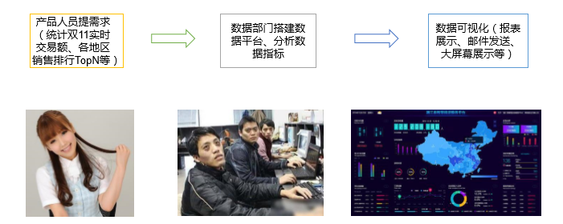
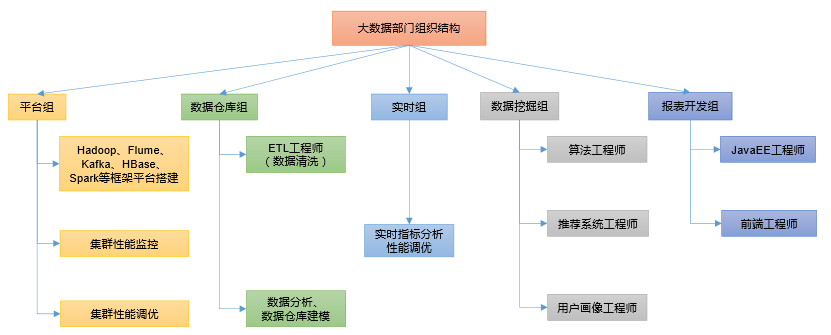

# 01-大数据技术之大数据概论

## 一、大数据概念 
大数据（Big Data）：指无法在一定时间范围内用常规软件工具进行捕捉、管理和 处理的数据集合，是需要新处理模式才能具有更强的决策力、洞察发现力和流程优化 能力的海量、高增长率和多样化的信息资产。

大数据主要解决，海量数据的采集、存储和分析计算问题。   

按顺序给出数据存储单位：bit、Byte、 KB、MB、GB、TB、PB、EB、ZB、YB、 BB、NB、DB。 1Byte = 8bit 1K = 1024Byte 1MB= 1024K 1G = 1024M 1T= 1024G 1P= 1024T

## 二、大数据特点（4V） 
1、Volume（大量）   
截至目前，人类生产的所有印刷材料的数据量是200PB，而历史上全人类总共 说过的话的数据量大约是5EB。当前，典型个人计算机硬盘的容量为TB量级，而 一些大企业的数据量已经接近EB量级。
 
2、Velocity（高速）   
这是大数据区分于传统数据挖掘的最显著特征。根据IDC的“数字宇宙”的报 告，预计到2025年，全球数据使用量将达到163ZB。在如此海量的数据面前，处 理数据的效率就是企业的生命。 

3、Variety（多样）   
这种类型的多样性也让数据被分为结构化数据和非结构化数据。相对于以往便于存储的 以数据库/文本为主的结构化数据，非结构化数据越来越多，包括网络日志、音频、视频、图 片、地理位置信息等，这些多类型的数据对数据的处理能力提出了更高要求。

4、Value（低价值密度）   
价值密度的高低与数据总量的大小成反比。

## 三、大数据应用场景 
1、抖音：推荐的都是你喜欢的视频  
2、电商站内广告推荐：给用户推荐可能喜欢的商品  
3、零售：分析用户消费习惯，为用户购买商品提供方便，从而提升商品销量。   
4、物流仓储：京东物流，上午下单下午送达、下午下单次日上午送达  
5、保险：海量数据挖掘及风险预测，助力保险 行业精准营销，提升精细化定价能力。  
6、金融：多维度体现用户特征，帮助金融机构 推荐优质客户，防范欺诈风险。  
7、房产：大数据全面助力房地产行业，打造精 准投策与营销，选出更合适的地，建造更合适的楼， 卖给更合适的人。  
8、人工智能+ 5G + 物联网 + 虚拟与现实  
 

## 四、大数据发展前景 
1、党的十九大提出“推动互联网、大数据、人工智能和实体经济深度融合”。   
2、2020年初，中央推出34万亿“新基建”投资计划   
3、下一个风口  
4、人才紧缺、竞争压力小  

## 五、大数据部门间业务流程分析 

## 六、大数据部门内组织结构 

