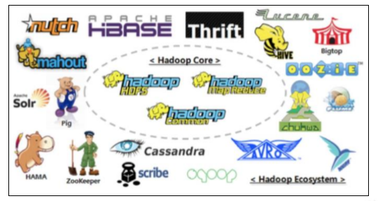
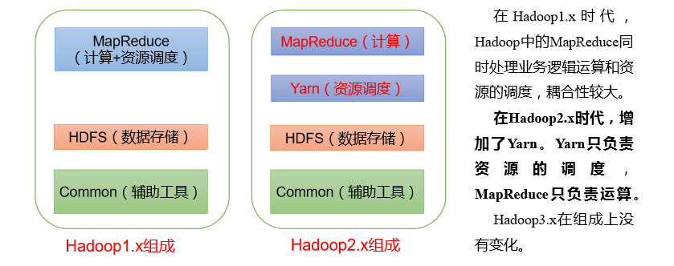
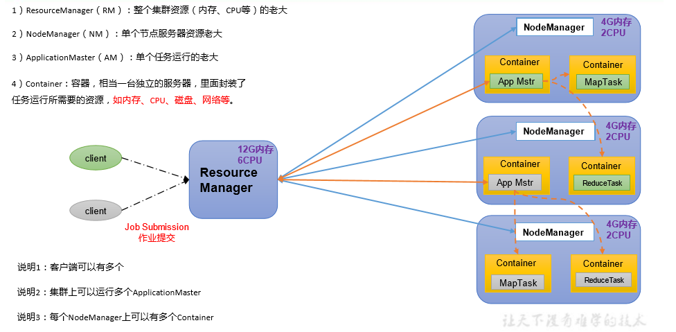
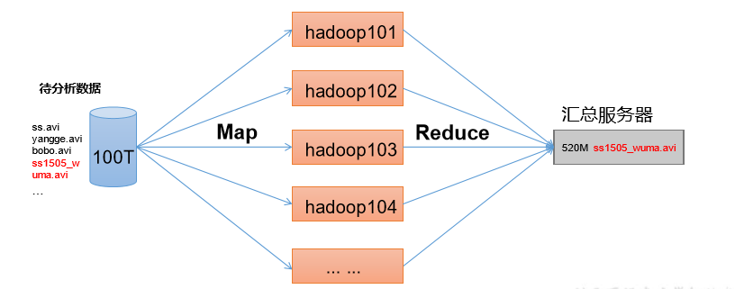
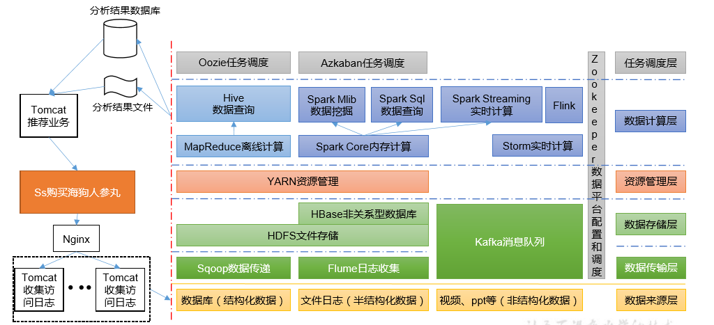

# 02-Hadoop入门

## 一、Hadoop概述
### 1.1、Hadoop是什么
1）Hadoop是一个由Apache基金会所开发的分布式系统基础架构。    
2）主要解决，海量数据的存储和海量数据的分析计算问题。    
3）广义上来说，Hadoop通常是指一个更广泛的概念——Hadoop生态圈。   



## 1.2、Hadoop发展历史
1）Hadoop创始人Doug Cutting，为了实现与Google类似的全文搜索功能，他在Lucene框架基础上进行优 化升级，查询引擎和索引引擎。   
2）2001年年底Lucene成为Apache基金会的一个子项目。  
3）对于海量数据的场景，Lucene框架面对与Google同样的困难，存储海量数据困难，检索海量速度慢。   
4）学习和模仿Google解决这些问题的办法 ：微型版Nutch。   
5）可以说Google是Hadoop的思想之源（Google在大数据方面的三篇论文）   
```
GFS --->HDFS 
Map-Reduce --->MR 
BigTable --->HBase
```
6）2003-2004年，Google公开了部分GFS和MapReduce思想的细节，以此为基础Doug Cutting等人用 了2年业余时间实现了DFS和MapReduce机制，使Nutch性能飙升。   
7）2005 年Hadoop 作为 Lucene的子项目 Nutch的一部分正式引入Apache基金会。   
8）2006 年 3 月份，Map-Reduce和Nutch Distributed File System （NDFS）分别被纳入到 Hadoop 项目 中，Hadoop就此正式诞生，标志着大数据时代来临。   
9）名字来源于Doug Cutting儿子的玩具大象。     

## 1.3 Hadoop 三大发行版本（了解） 
Hadoop 三大发行版本：Apache、Cloudera、Hortonworks。    
Apache 版本最原始（最基础）的版本，对于入门学习最好。2006    
Cloudera 内部集成了很多大数据框架，对应产品 CDH。2008    
Hortonworks 文档较好，对应产品 HDP。2011    
Hortonworks 现在已经被 Cloudera 公司收购，推出新的品牌 CDP。    


### 1）Apache Hadoop 
官网地址：http://hadoop.apache.org  
下载地址：https://hadoop.apache.org/releases.html  

### 2）Cloudera Hadoop 
官网地址：https://www.cloudera.com/downloads/cdh  
下载地址：https://docs.cloudera.com/documentation/enterprise/6/releasenotes/topics/rg_cdh_6_download.html  

（1）2008 年成立的 Cloudera 是最早将 Hadoop 商用的公司，为合作伙伴提供 Hadoop 的商用解决方案，主要是包括支持、咨询服务、培训。   
（2）2009 年 Hadoop 的创始人 Doug Cutting 也加盟 Cloudera 公司。Cloudera 产品主要为 CDH，Cloudera Manager，Cloudera Support   
（3）CDH 是 Cloudera 的 Hadoop 发行版，完全开源，比 Apache Hadoop 在兼容性，安全性，稳定性上有所增强。Cloudera 的标价为每年每个节点 10000 美元。   
（4）Cloudera Manager 是集群的软件分发及管理监控平台，可以在几个小时内部署好一个 Hadoop 集群，并对集群的节点及服务进行实时监控。   

### 3）Hortonworks Hadoop 
官网地址：https://hortonworks.com/products/data-center/hdp/   
下载地址：https://hortonworks.com/downloads/#data-platform   

（1）2011 年成立的 Hortonworks 是雅虎与硅谷风投公司 Benchmark Capital 合资组建。  
（2）公司成立之初就吸纳了大约 25 名至 30 名专门研究 Hadoop 的雅虎工程师，上述工程师均在 2005 年开始协助雅虎开发 Hadoop，贡献了 Hadoop80%的代码。  
（3）Hortonworks 的主打产品是 Hortonworks Data Platform（HDP），也同样是 100%开源的产品，HDP 除常见的项目外还包括了 Ambari，一款开源的安装和管理系统。  
（4）2018 年 Hortonworks 目前已经被 Cloudera 公司收购。  

## 1.4、Hadoop 优势（4 高） 
1）高可靠性：Hadoop底层维护多个数据副本，所以即使Hadoop某个计算元 素或存储出现故障，也不会导致数据的丢失。   
2）高扩展性：在集群间分配任务数据，可方便的扩展数以千计的节点。   
3）高效性：在MapReduce的思想下，Hadoop是并行工作的，以加快任务处 理速度。   
4）高容错性：能够自动将失败的任务重新分配。   

## 1.5、Hadoop 组成
Hadoop1.x、2.x、3.x区别  


### 1.5.1、HDFS 架构概述 
Hadoop Distributed File System，简称 HDFS，是一个分布式文件系统。   

1）NameNode（nn）：存储文件的元数据，如文件名，文件目录结构，文件属性（生成时间、副本数、 文件权限），以及每个文件的块列表和块所在的DataNode等。  
2）DataNode(dn)：在本地文件系统存储文件块数据，以及块数据的校验和。  
3）Secondary NameNode(2nn)：每隔一段时间对NameNode元数据备份。  

### 1.5.2、YARN 架构概述 
Yet Another Resource Negotiator 简称 YARN ，另一种资源协调者，是 Hadoop 的资源管理器。   


### 1.5.3、MapReduce 架构概述
MapReduce 将计算过程分为两个阶段：Map 和 Reduce   
1）Map 阶段并行处理输入数据   
2）Reduce 阶段对 Map 结果进行汇总   



### 1.5.4、HDFS、YARN、MapReduce 三者关系 


## 1.6、大数据技术生态体系 


图中涉及的技术名词解释如下： 
1）Sqoop：Sqoop 是一款开源的工具，主要用于在 Hadoop、Hive 与传统的数据库（MySQL）间进行数据的传递，可以将一个关系型数据库（例如 ：MySQL，Oracle 等）中的数据导进到 Hadoop 的 HDFS 中，也可以将 HDFS 的数据导进到关系型数据库中。  
2）Flume：Flume 是一个高可用的，高可靠的，分布式的海量日志采集、聚合和传输的系统，Flume 支持在日志系统中定制各类数据发送方，用于收集数据；   
3）Kafka：Kafka 是一种高吞吐量的分布式发布订阅消息系统；  
4）Spark：Spark 是当前最流行的开源大数据内存计算框架。可以基于 Hadoop 上存储的大数据进行计算。  
5）Flink：Flink 是当前最流行的开源大数据内存计算框架。用于实时计算的场景较多。  
6）Oozie：Oozie 是一个管理 Hadoop 作业（job）的工作流程调度管理系统。   
7）Hbase：HBase 是一个分布式的、面向列的开源数据库。HBase 不同于一般的关系数据库，它是一个适合于非结构化数据存储的数据库。   
8）Hive：Hive 是基于 Hadoop 的一个数据仓库工具，可以将结构化的数据文件映射为一张数据库表，并提供简单的 SQL 查询功能，可以将 SQL 语句转换为 MapReduce 任务进行运行。其优点是学习成本低，可以通过类 SQL 语句快速实现简单的 MapReduce 统计，不必开发专门的 MapReduce 应用，十分适合数据仓库的统计分析。   
9）ZooKeeper：它是一个针对大型分布式系统的可靠协调系统，提供的功能包括：配置维护、名字服务、分布式同步、组服务等。   

## 1.7、推荐系统框架图 



