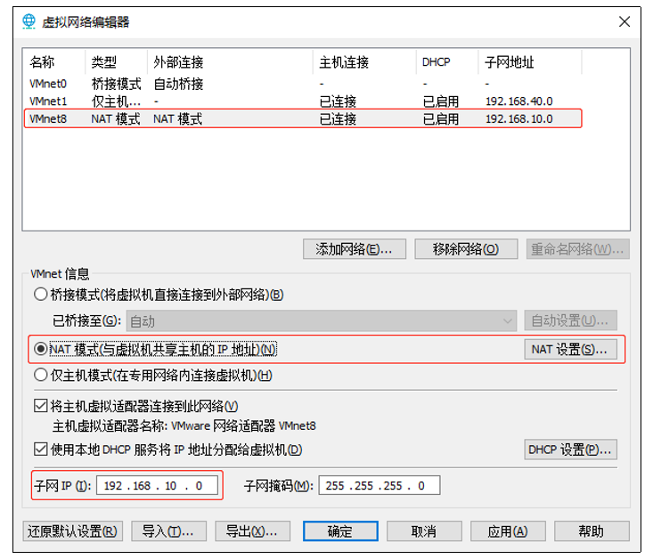
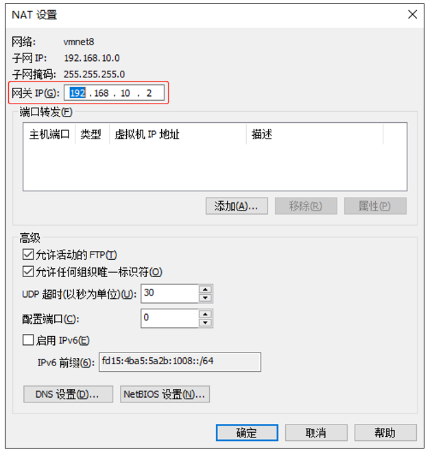
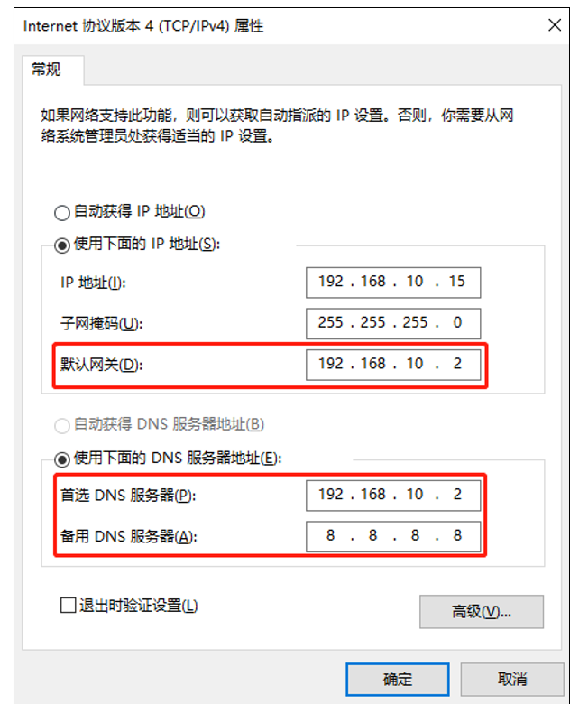

## 二、Hadoop运行环境搭建

### 2.1、模板虚拟机环境准备 
0）安装模板虚拟机，IP 地址 192.168.10.100、主机名称 hadoop100、内存 4G、硬盘 50G   
1）hadoop100 虚拟机配置要求如下（本文 Linux 系统全部以 CentOS-7.5-x86-1804 为例）   
（1）使用 yum 安装需要虚拟机可以正常上网，yum 安装前可以先测试下虚拟机联网情况      
```
ping www.baidu.com 
```
（2）安装 epel-release    
注：Extra Packages for Enterprise Linux 是为“红帽系”的操作系统提供额外的软件包，适用于 RHEL、CentOS 和 Scientific Linux。相当于是一个软件仓库，大多数 rpm 包在官方 repository 中是找不到的）    
```
yum install -y epel-release 
```
（3）注意：如果 Linux 安装的是最小系统版，还需要安装如下工具；如果安装的是 Linux桌面标准版，不需要执行如下操作    
net-tool：工具包集合，包含 ifconfig 等命令   
```
yum install -y net-tools
```
vim：编辑器   
```
yum install -y vim 
```

2）关闭防火墙，关闭防火墙开机自启 
```
systemctl stop firewalld
systemctl disable firewalld.service 
```
注意：在企业开发时，通常单个服务器的防火墙时关闭的。公司整体对外会设置非常安全的防火墙。   

3）创建 atguigu 用户，并修改 atguigu 用户的密码
```
useradd atguigu 
passwd 00000 
```

4）配置 atguigu 用户具有 root 权限，方便后期加 sudo 执行 root 权限的命令 
```
vim /etc/sudoers 
```
修改/etc/sudoers 文件，在%wheel 这行下面添加一行，如下所示： 
```
## Allow root to run any commands anywhere root    ALL=(ALL)     ALL 
 
## Allows people in group wheel to run all commands %wheel  ALL=(ALL)       ALL 
atguigu   ALL=(ALL)     NOPASSWD:ALL 
```
注意：atguigu 这一行不要直接放到 root 行下面，因为所有用户都属于 wheel 组，你先 配置了 atguigu 具有免密功能，但是程序执行到%wheel 行时，该功能又被覆盖回需要 密码。所以 atguigu 要放到%wheel 这行下面。   

5）在/opt 目录下创建文件夹，并修改所属主和所属组   
（1）在/opt 目录下创建 module、software 文件夹 
```
mkdir /opt/module 
mkdir /opt/software 
```
（2）修改 module、software 文件夹的所有者和所属组均为 atguigu 用户 
```
chown atguigu:atguigu /opt/module 
chown atguigu:atguigu /opt/software 
```
（3）查看 module、software 文件夹的所有者和所属组   
```
[root@hadoop100 ~]# cd /opt/
[root@hadoop100 opt]# ll
总用量 12
drwxr-xr-x. 2 atguigu atguigu 4096 5月  28 17:18 module
drwxr-xr-x. 2 root    root    4096 9月   7 2017 rh
drwxr-xr-x. 2 atguigu atguigu 4096 5月  28 17:18 software
```

6）卸载虚拟机自带的 JDK   
注意：如果你的虚拟机是最小化安装不需要执行这一步。  
```
rpm -qa | grep -i java | xargs -n1 rpm -e --nodeps

rpm -qa：查询所安装的所有rpm软件包
grep -i：忽略大小写
xargs -n1：表示每次只传递一个参数
rpm -e –nodeps：强制卸载软件
```

7）重启虚拟机 
```
reboot 
```

### 2.2、克隆虚拟机 
1）利用模板机 hadoop100，克隆三台虚拟机：hadoop102 hadoop103 hadoop104      
注意：克隆时，要先关闭 hadoop100    

2）修改克隆机 IP，以下以 hadoop102 举例说明  
（1）修改克隆虚拟机的静态 IP   
```
vim /etc/sysconfig/network-scripts/ifcfgens33
```
改成 
```
DEVICE=ens33
TYPE=Ethernet
ONBOOT=yes
BOOTPROTO=static
NAME="ens33"
IPADDR=192.168.10.102
PREFIX=24
GATEWAY=192.168.10.2
DNS1=192.168.10.2
```
（2）查看 Linux 虚拟机的虚拟网络编辑器，编辑->虚拟网络编辑器->VMnet8   
   
   
（3）查看 Windows 系统适配器 VMware Network Adapter VMnet8 的 IP 地址 
   
（4）保证 Linux 系统 ifcfg-ens33 文件中 IP 地址、虚拟网络编辑器地址和 Windows 系统 VM8 网络 IP 地址相同。   

3）修改克隆机主机名，以下以 hadoop102 举例说明    
（1）修改主机名称    
```
vim /etc/hostname 
```
（2）配置 Linux 克隆机主机名称映射 hosts 文件，打开/etc/hosts 
```
vim /etc/hosts 
添加如下内容
192.168.10.100 hadoop100
192.168.10.101 hadoop101
192.168.10.102 hadoop102
192.168.10.103 hadoop103
192.168.10.104 hadoop104
192.168.10.105 hadoop105
192.168.10.106 hadoop106
192.168.10.107 hadoop107
192.168.10.108 hadoop108
```

4）重启克隆机hadoop102 
```
reboot
```

5）修改windows的主机映射文件（hosts文件）  
（1）如果操作系统是window7，可以直接修改   
（a）进入C:\Windows\System32\drivers\etc路径  
（b）打开hosts文件并添加如下内容，然后保存  
```
192.168.10.100 hadoop100
192.168.10.101 hadoop101
192.168.10.102 hadoop102
192.168.10.103 hadoop103
192.168.10.104 hadoop104
192.168.10.105 hadoop105
192.168.10.106 hadoop106
192.168.10.107 hadoop107
192.168.10.108 hadoop108
```
（2）如果操作系统是window10，先拷贝出来，修改保存以后，再覆盖即可  
（a）进入C:\Windows\System32\drivers\etc路径  
（b）拷贝hosts文件到桌面  
（c）打开桌面hosts文件并添加如下内容  
```
192.168.10.100 hadoop100
192.168.10.101 hadoop101
192.168.10.102 hadoop102
192.168.10.103 hadoop103
192.168.10.104 hadoop104
192.168.10.105 hadoop105
192.168.10.106 hadoop106
192.168.10.107 hadoop107
192.168.10.108 hadoop108
```
（d）将桌面hosts文件覆盖C:\Windows\System32\drivers\etc路径hosts文件   


### 2.3、在hadoop102安装JDK
1）卸载现有JDK   
注意：安装JDK前，一定确保提前删除了虚拟机自带的JDK。详细步骤见问文档3.1节中卸载JDK步骤。   

2）用XShell传输工具将JDK导入到opt目录下面的software文件夹下面

3）在Linux系统下的opt目录中查看软件包是否导入成功

4）解压JDK到/opt/module目录下
```
tar -zxvf jdk-8u212-linux-x64.tar.gz -C /opt/module/
```

5）配置JDK环境变量  
（1）新建/etc/profile.d/my_env.sh文件  
```
sudo vim /etc/profile.d/my_env.sh
```
添加如下内容
```
#JAVA_HOME
export JAVA_HOME=/opt/module/jdk1.8.0_212
export PATH=$PATH:$JAVA_HOME/bin
```
（2）保存后退出
```
:wq
```
（3）source一下/etc/profile文件，让新的环境变量PATH生效
```
source /etc/profile
```

6）测试JDK是否安装成功
```
java -version
```
如果能看到以下结果，则代表Java安装成功。
```
java version "1.8.0_212"
```
注意：重启（如果java -version可以用就不用重启）

### 2.4、在hadoop102安装Hadoop
Hadoop下载地址：https://archive.apache.org/dist/hadoop/common/hadoop-3.1.3/         

1）用XShell文件传输工具将hadoop-3.1.3.tar.gz导入到opt目录下面的software文件夹下面

2）进入到Hadoop安装包路径下
```
cd /opt/software/
```

3）解压安装文件到/opt/module下面
```
tar -zxvf hadoop-3.1.3.tar.gz -C /opt/module/
```

4）查看是否解压成功
```
ls /opt/module/
```

5）将Hadoop添加到环境变量  
（1）获取Hadoop安装路径  
```
pwd
/opt/module/hadoop-3.1.3
```
（2）打开/etc/profile.d/my_env.sh文件
```
sudo vim /etc/profile.d/my_env.sh
```
在my_env.sh文件末尾添加如下内容：（shift+g）
```
#HADOOP_HOME
export HADOOP_HOME=/opt/module/hadoop-3.1.3
export PATH=$PATH:$HADOOP_HOME/bin
export PATH=$PATH:$HADOOP_HOME/sbin
```
（3）让修改后的文件生效
```
source /etc/profile
```

6）测试是否安装成功
```
hadoop version
Hadoop 3.1.3
```

7）重启（如果Hadoop命令不能用再重启虚拟机）
```
sudo reboot
```

### 2.5、Hadoop目录结构
1）查看Hadoop目录结构
```
bin
etc
include
lib
libexec
LICENSE.txt
NOTICE.txt
README.txt
sbin
share
```

2）重要目录  
（1）bin目录：存放对Hadoop相关服务（hdfs，yarn，mapred）进行操作的脚本  
（2）etc目录：Hadoop的配置文件目录，存放Hadoop的配置文件  
（3）lib目录：存放Hadoop的本地库（对数据进行压缩解压缩功能）  
（4）sbin目录：存放启动或停止Hadoop相关服务的脚本  
（5）share目录：存放Hadoop的依赖jar包、文档、和官方案例  


