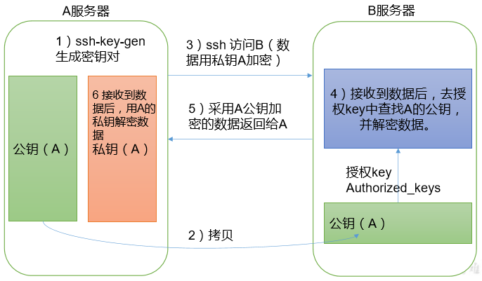
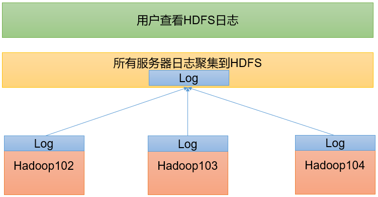
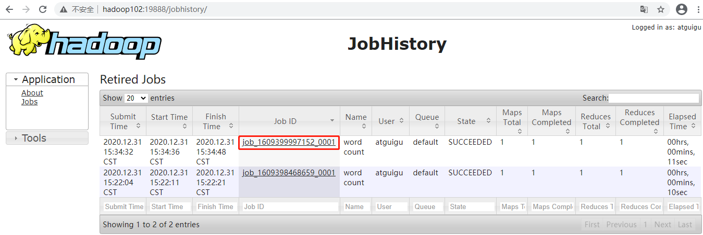
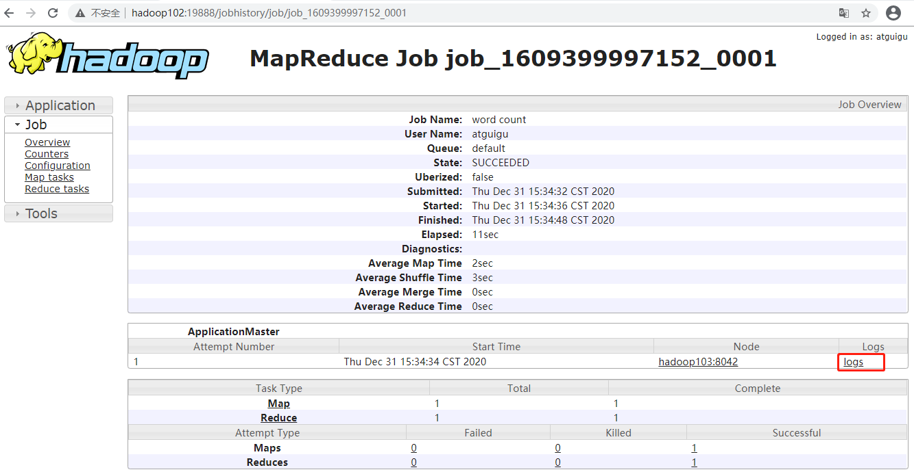
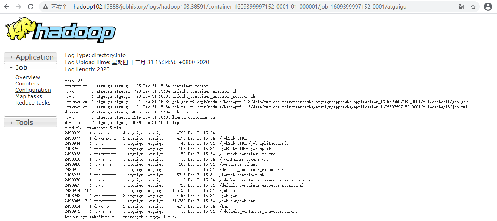

## 三、Hadoop运行模式

1）Hadoop官方网站：http://hadoop.apache.org/  

2）Hadoop运行模式包括：本地模式、伪分布式模式以及完全分布式模式。  
本地模式：单机运行，只是用来演示一下官方案例。生产环境不用。  
伪分布式模式：也是单机运行，但是具备Hadoop集群的所有功能，一台服务器模拟一个分布式的环境。个别缺钱的公司用来测试，生产环境不用。  
完全分布式模式：多台服务器组成分布式环境。生产环境使用。  

### 3.1、本地运行模式（官方WordCount）
1）创建在hadoop-3.1.3文件下面创建一个wcinput文件夹
```
mkdir wcinput
```

2）在wcinput文件下创建一个word.txt文件
```
cd wcinput
```

3）编辑word.txt文件
```
vim word.txt
```
在文件中输入如下内容
```
hadoop yarn
hadoop mapreduce
atguigu
atguigu
```

4）回到Hadoop目录/opt/module/hadoop-3.1.3

5）执行程序
```
hadoop jar share/hadoop/mapreduce/hadoop-mapreduce-examples-3.1.3.jar wordcount wcinput wcoutput
```

6）查看结果
```
cat wcoutput/part-r-00000
```
看到如下结果：
```
atguigu 2
hadoop  2
mapreduce       1
yarn    1
```

### 3.2、完全分布式运行模式
分析：
```
1）准备3台客户机（关闭防火墙、静态IP、主机名称）
2）安装JDK
3）配置环境变量
4）安装Hadoop
5）配置环境变量
6）配置集群
7）单点启动
8）配置ssh
9）群起并测试集群
```

#### 3.2.1、虚拟机准备

#### 3.2.2、编写集群分发脚本xsync
1）scp（secure copy）安全拷贝  
（1）scp定义  
scp可以实现服务器与服务器之间的数据拷贝。（from server1 to server2）  
（2）基本语法  
```
scp    -r        $pdir/$fname             $user@$host:$pdir/$fname
命令   递归     要拷贝的文件路径/名称   目的地用户@主机:目的地路径/名称
```
（3）案例实操  
前提：在hadoop102、hadoop103、hadoop104都已经创建好的/opt/module、/opt/software两个目录，并且已经把这两个目录修改为atguigu:atguigu   
```
sudo chown atguigu:atguigu -R /opt/module
```
（a）在hadoop102上，将hadoop102中/opt/module/jdk1.8.0_212目录拷贝到hadoop103上。  
```
scp -r /opt/module/jdk1.8.0_212  atguigu@hadoop103:/opt/module
```
（b）在hadoop103上，将hadoop102中/opt/module/hadoop-3.1.3目录拷贝到hadoop103上。
```
scp -r atguigu@hadoop102:/opt/module/hadoop-3.1.3 /opt/module/
```
（c）在hadoop103上操作，将hadoop102中/opt/module目录下所有目录拷贝到hadoop104上。
```
scp -r atguigu@hadoop102:/opt/module/* atguigu@hadoop104:/opt/module
```

2）rsync远程同步工具  
rsync主要用于备份和镜像。具有速度快、避免复制相同内容和支持符号链接的优点。  
rsync和scp区别：用rsync做文件的复制要比scp的速度快，rsync只对差异文件做更新。scp是把所有文件都复制过去。  
（1）基本语法
```
rsync    -av       $pdir/$fname             $user@$host:$pdir/$fname
命令   选项参数   要拷贝的文件路径/名称   目的地用户@主机:目的地路径/名称

选项参数说明
选项	功能
-a	归档拷贝
-v	显示复制过程
```
（2）案例实操
（a）删除hadoop103中/opt/module/hadoop-3.1.3/wcinput
```
rm -rf wcinput/
```
（b）同步hadoop102中的/opt/module/hadoop-3.1.3到hadoop103
```
rsync -av hadoop-3.1.3/ atguigu@hadoop103:/opt/module/hadoop-3.1.3/
```

3）xsync集群分发脚本
（1）需求：循环复制文件到所有节点的相同目录下  
（2）需求分析：  
（a）rsync命令原始拷贝：  
```
rsync -av /opt/module atguigu@hadoop103:/opt/
```
（b）期望脚本：
xsync要同步的文件名称   
（c）期望脚本在任何路径都能使用（脚本放在声明了全局环境变量的路径）  
```
echo $PATH
/usr/local/bin:/usr/bin:/usr/local/sbin:/usr/sbin:/home/atguigu/.local/bin:/home/atguigu/bin:/opt/module/jdk1.8.0_212/bin
```
（3）脚本实现  
（a）在/home/atguigu/bin目录下创建xsync文件  
（b）修改脚本 xsync 具有执行权限  
```
chmod +x xsync
```
（c）测试脚本
```
xsync /home/atguigu/bin
```
（d）将脚本复制到/bin中，以便全局调用
```
sudo cp xsync /bin/
```
（e）同步环境变量配置（root所有者）
```
sudo ./bin/xsync /etc/profile.d/my_env.sh
```
注意：如果用了sudo，那么xsync一定要给它的路径补全。   
让环境变量生效  
```
[atguigu@hadoop103 bin]$ source /etc/profile
[atguigu@hadoop104 opt]$ source /etc/profile
```

#### 3.2.3、SSH无密登录配置
1）配置ssh  
（1）基本语法  
ssh另一台电脑的IP地址  
（2）ssh连接时出现Host key verification failed的解决方法  
```
ssh hadoop103
```

2）无密钥配置  
（1）免密登录原理   
   
（2）生成公钥和私钥 
```
pwd /home/atguigu/.ssh 
ssh-keygen -t rsa 
```
会生成两个文件 id_rsa（私钥）、id_rsa.pub（公钥）    
（3）将公钥拷贝到要免密登录的目标机器上 
```
[atguigu@hadoop102 .ssh]$ ssh-copy-id hadoop102
[atguigu@hadoop102 .ssh]$ ssh-copy-id hadoop103
[atguigu@hadoop102 .ssh]$ ssh-copy-id hadoop104
```
注意：  
还需要在hadoop103上采用atguigu账号配置一下无密登录到hadoop102、hadoop103、hadoop104服务器上。  
还需要在hadoop104上采用atguigu账号配置一下无密登录到hadoop102、hadoop103、hadoop104服务器上。  
还需要在hadoop102上采用root账号，配置一下无密登录到hadoop102、hadoop103、hadoop104；  

3）.ssh文件夹下（~/.ssh）的文件功能解释
```
known_hosts	记录ssh访问过计算机的公钥（public key）
id_rsa	生成的私钥
id_rsa.pub	生成的公钥
authorized_keys	存放授权过的无密登录服务器公钥
```

#### 3.2.4、集群配置
1）集群部署规划  
注意：  
NameNode和SecondaryNameNode不要安装在同一台服务器  
ResourceManager也很消耗内存，不要和NameNode、SecondaryNameNode配置在同一台机器上。  

   

2）配置文件说明   
Hadoop 配置文件分两类：默认配置文件和自定义配置文件，只有用户想修改某一默认配置值时，才需要修改自定义配置文件，更改相应属性值。     
（1）默认配置文件： 
```
要获取的默认文件 文件存放在 Hadoop 的 jar 包中的位置 
[core-default.xml] hadoop-common-3.1.3.jar/core-default.xml 
[hdfs-default.xml] hadoop-hdfs-3.1.3.jar/hdfs-default.xml 
[yarn-default.xml] hadoop-yarn-common-3.1.3.jar/yarn-default.xml 
[mapred-default.xml] hadoop-mapreduce-client-core-3.1.3.jar/mapred-default.xml 
```
（2）自定义配置文件：   
core-site.xml、hdfs-site.xml、yarn-site.xml、mapred-site.xml 四个配置文件存放在$HADOOP_HOME/etc/hadoop 这个路径上，用户可以根据项目需求重新进行修改配置。   

3）配置集群   
（1）核心配置文件   
配置 core-site.xml   
```
vim core-site.xml
```
文件内容如下：
```xml
<?xml version="1.0" encoding="UTF-8"?>
<?xml-stylesheet type="text/xsl" href="configuration.xsl"?>

<configuration>
    <!-- 指定NameNode的地址 -->
    <property>
        <name>fs.defaultFS</name>
        <value>hdfs://hadoop102:8020</value>
    </property>
    <!-- 指定hadoop数据的存储目录 -->
    <property>
        <name>hadoop.tmp.dir</name>
        <value>/opt/module/hadoop-3.1.3/data</value>
    </property>
    <!-- 配置HDFS网页登录使用的静态用户为atguigu -->
    <property>
        <name>hadoop.http.staticuser.user</name>
        <value>atguigu</value>
    </property>
</configuration>
```

（2）HDFS配置文件  
配置hdfs-site.xml  
```
vim hdfs-site.xml
```
文件内容如下：
```xml
<?xml version="1.0" encoding="UTF-8"?>
<?xml-stylesheet type="text/xsl" href="configuration.xsl"?>

<configuration>
	<!-- nn web端访问地址-->
	<property>
        <name>dfs.namenode.http-address</name>
        <value>hadoop102:9870</value>
    </property>
	<!-- 2nn web端访问地址-->
    <property>
        <name>dfs.namenode.secondary.http-address</name>
        <value>hadoop104:9868</value>
    </property>
</configuration>
```

（3）YARN配置文件  
配置yarn-site.xml  
```
vim yarn-site.xml
```
文件内容如下：
```xml
<?xml version="1.0" encoding="UTF-8"?>
<?xml-stylesheet type="text/xsl" href="configuration.xsl"?>

<configuration>
    <!-- 指定MR走shuffle -->
    <property>
        <name>yarn.nodemanager.aux-services</name>
        <value>mapreduce_shuffle</value>
    </property>

    <!-- 指定ResourceManager的地址-->
    <property>
        <name>yarn.resourcemanager.hostname</name>
        <value>hadoop103</value>
    </property>

    <!-- 环境变量的继承 -->
    <property>
        <name>yarn.nodemanager.env-whitelist</name>
        <value>JAVA_HOME,HADOOP_COMMON_HOME,HADOOP_HDFS_HOME,HADOOP_CONF_DIR,CLASSPATH_PREPEND_DISTCACHE,HADOOP_YARN_HOME,HADOOP_MAPRED_HOME</value>
    </property>
</configuration>
```

（4）MapReduce配置文件  
配置mapred-site.xml  
```
vim mapred-site.xml
```
文件内容如下：
```xml
<?xml version="1.0" encoding="UTF-8"?>
<?xml-stylesheet type="text/xsl" href="configuration.xsl"?>

<configuration>
	<!-- 指定MapReduce程序运行在Yarn上 -->
    <property>
        <name>mapreduce.framework.name</name>
        <value>yarn</value>
    </property>
</configuration>
```

4）在集群上分发配置好的Hadoop配置文件
```
xsync /opt/module/hadoop-3.1.3/etc/hadoop/
```

5）去103和104上查看文件分发情况
```
[atguigu@hadoop103 ~]$ cat /opt/module/hadoop-3.1.3/etc/hadoop/core-site.xml
[atguigu@hadoop104 ~]$ cat /opt/module/hadoop-3.1.3/etc/hadoop/core-site.xml
```

#### 3.2.5、群起集群
1）配置workers  
```
vim /opt/module/hadoop-3.1.3/etc/hadoop/workers
```
在该文件中增加如下内容：
```
hadoop102
hadoop103
hadoop104
```
注意：该文件中添加的内容结尾不允许有空格，文件中不允许有空行。   
同步所有节点配置文件   
```
xsync /opt/module/hadoop-3.1.3/etc
```

2）启动集群  
（1）如果集群是第一次启动，需要在hadoop102节点格式化NameNode（注意：格式化NameNode，会产生新的集群id，导致NameNode和DataNode的集群id不一致，集群找不到已往数据。如果集群在运行过程中报错，需要重新格式化NameNode的话，一定要先停止namenode和datanode进程，并且要删除所有机器的data和logs目录，然后再进行格式化。）  
```
[atguigu@hadoop102 hadoop-3.1.3]$ hdfs namenode -format
```
（2）启动HDFS
```
[atguigu@hadoop102 hadoop-3.1.3]$ sbin/start-dfs.sh
```
（3）在配置了ResourceManager的节点（hadoop103）启动YARN
```
[atguigu@hadoop103 hadoop-3.1.3]$ sbin/start-yarn.sh
```
（4）Web端查看HDFS的NameNode  
（a）浏览器中输入：http://hadoop102:9870  
（b）查看HDFS上存储的数据信息  
（5）Web端查看YARN的ResourceManager  
（a）浏览器中输入：http://hadoop103:8088  
（b）查看YARN上运行的Job信息  


3）集群基本测试  
（1）上传文件到集群  
上传小文件  
```
[atguigu@hadoop102 ~]$ hadoop fs -mkdir /input
[atguigu@hadoop102 ~]$ hadoop fs -put $HADOOP_HOME/wcinput/word.txt /input
```
上传大文件
```
hadoop fs -put /opt/software/jdk-8u212-linux-x64.tar.gz  /
```

（2）上传文件后查看文件存放在什么位置     
查看HDFS文件存储路径  
```
pwd
/opt/module/hadoop-3.1.3/data/dfs/data/current/BP-1436128598-192.168.10.102-1610603650062/current/finalized/subdir0/subdir0
```
查看HDFS在磁盘存储文件内容
```
cat blk_1073741825
hadoop yarn
hadoop mapreduce 
atguigu
atguigu
```

（3）拼接
```
-rw-rw-r--. 1 atguigu atguigu 134217728 5月  23 16:01 blk_1073741836
-rw-rw-r--. 1 atguigu atguigu   1048583 5月  23 16:01 blk_1073741836_1012.meta
-rw-rw-r--. 1 atguigu atguigu  63439959 5月  23 16:01 blk_1073741837
-rw-rw-r--. 1 atguigu atguigu    495635 5月  23 16:01 blk_1073741837_1013.meta
```
拼接>>>
```
[atguigu@hadoop102 subdir0]$ cat blk_1073741836>>tmp.tar.gz
[atguigu@hadoop102 subdir0]$ cat blk_1073741837>>tmp.tar.gz
[atguigu@hadoop102 subdir0]$ tar -zxvf tmp.tar.gz
```
（4）下载
```
hadoop fs -get /jdk-8u212-linux-x64.tar.gz ./
```
（5）执行wordcount程序
```
hadoop jar share/hadoop/mapreduce/hadoop-mapreduce-examples-3.1.3.jar wordcount /input /output
```

#### 3.2.6、配置历史服务器
为了查看程序的历史运行情况，需要配置一下历史服务器。具体配置步骤如下：    

1）配置mapred-site.xml
```
vim mapred-site.xml
```
在该文件里面增加如下配置。
```
<!-- 历史服务器端地址 -->
<property>
    <name>mapreduce.jobhistory.address</name>
    <value>hadoop102:10020</value>
</property>

<!-- 历史服务器web端地址 -->
<property>
    <name>mapreduce.jobhistory.webapp.address</name>
    <value>hadoop102:19888</value>
</property>
```
2）分发配置
```
xsync $HADOOP_HOME/etc/hadoop/mapred-site.xml
```
4）查看历史服务器是否启动
```
jps
```
5）查看JobHistory  
http://hadoop102:19888/jobhistory  

#### 3.2.7、配置日志的聚集
日志聚集概念：应用运行完成以后，将程序运行日志信息上传到HDFS系统上。  
   
日志聚集功能好处：可以方便的查看到程序运行详情，方便开发调试。注意：开启日志聚集功能，需要重新启动NodeManager 、ResourceManager和HistoryServer。   
开启日志聚集功能具体步骤如下：  

1）配置yarn-site.xml
```
[atguigu@hadoop102 hadoop]$ vim yarn-site.xml
```
在该文件里面增加如下配置。
```xml
<!-- 开启日志聚集功能 -->
<property>
    <name>yarn.log-aggregation-enable</name>
    <value>true</value>
</property>
<!-- 设置日志聚集服务器地址 -->
<property>  
    <name>yarn.log.server.url</name>  
    <value>http://hadoop102:19888/jobhistory/logs</value>
</property>
<!-- 设置日志保留时间为7天 -->
<property>
    <name>yarn.log-aggregation.retain-seconds</name>
    <value>604800</value>
</property>
```

2）分发配置
```
xsync $HADOOP_HOME/etc/hadoop/yarn-site.xml
```

3）关闭NodeManager 、ResourceManager和HistoryServer
```
sbin/stop-yarn.sh
mapred --daemon stop historyserver
```

4）启动NodeManager 、ResourceManage和HistoryServer
```
start-yarn.sh
mapred --daemon start historyserver
```

5）删除HDFS上已经存在的输出文件
```
hadoop fs -rm -r /output
```

6）执行WordCount程序
```
hadoop jar share/hadoop/mapreduce/hadoop-mapreduce-examples-3.1.3.jar wordcount /input /output
```

7）查看日志  
（1）历史服务器地址  
http://hadoop102:19888/jobhistory  
（2）历史任务列表  
   
（3）查看任务运行日志
   
（4）运行日志详情
   

#### 3.2.8、集群启动/停止方式总结

1）各个模块分开启动/停止（配置ssh是前提）常用
（1）整体启动/停止HDFS
```
start-dfs.sh/stop-dfs.sh
```
（2）整体启动/停止YARN
```
start-yarn.sh/stop-yarn.sh
```

2）各个服务组件逐一启动/停止
（1）分别启动/停止HDFS组件
```
hdfs --daemon start/stop namenode/datanode/secondarynamenode
```
（2）启动/停止YARN
```
yarn --daemon start/stop  resourcemanager/nodemanager
```

#### 3.2.9、编写Hadoop集群常用脚本


