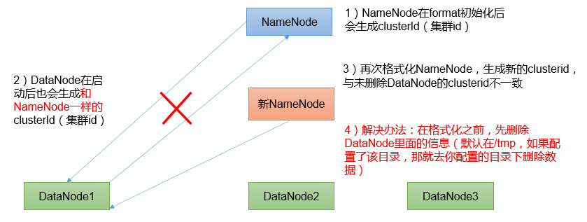

## 四、常见错误及解决方案

1）防火墙没关闭、或者没有启动YARN
INFO client.RMProxy: Connecting to ResourceManager at hadoop108/192.168.10.108:8032

2）主机名称配置错误  
3）IP地址配置错误  
4）ssh没有配置好  
5）root用户和atguigu两个用户启动集群不统一  
6）配置文件修改不细心  
7）不识别主机名称  

```
java.net.UnknownHostException: hadoop102: hadoop102
        at java.net.InetAddress.getLocalHost(InetAddress.java:1475)
        at org.apache.hadoop.mapreduce.JobSubmitter.submitJobInternal(JobSubmitter.java:146)
        at org.apache.hadoop.mapreduce.Job$10.run(Job.java:1290)
        at org.apache.hadoop.mapreduce.Job$10.run(Job.java:1287)
        at java.security.AccessController.doPrivileged(Native Method)
at javax.security.auth.Subject.doAs(Subject.java:415)
```
解决办法：  
（1）在/etc/hosts文件中添加192.168.10.102 hadoop102  
（2）主机名称不要起hadoop  hadoop000等特殊名称  

8）DataNode和NameNode进程同时只能工作一个。  
   

9）执行命令不生效，粘贴Word中命令时，遇到-和长–没区分开。导致命令失效  
解决办法：尽量不要粘贴Word中代码。  

10）jps发现进程已经没有，但是重新启动集群，提示进程已经开启。  
原因是在Linux的根目录下/tmp目录中存在启动的进程临时文件，将集群相关进程删除掉，再重新启动集群。  

11）jps不生效  
原因：全局变量hadoop java没有生效。解决办法：需要source /etc/profile文件。  

12）8088端口连接不上  
```
cat /etc/hosts
```
注释掉如下代码
```
#127.0.0.1   localhost localhost.localdomain localhost4 localhost4.localdomain4
#::1         hadoop102
```

