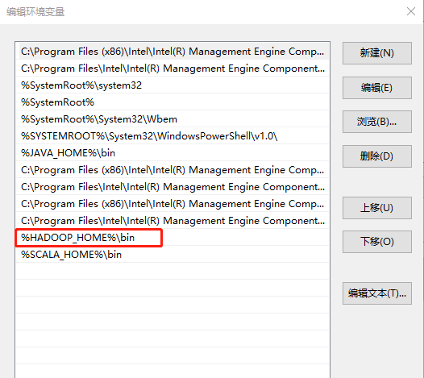

# 03-HDFS

## 一、HDFS概述
### 1.1、HDFS产出背景及定义

#### 1）HDFS产生背景
随着数据量越来越大，在一个操作系统存不下所有的数据，那么就分配到更多的操作系统管理的磁盘中，但是不方便管理和维护，迫切需要一种系统来管理多台机器上的文件，这就是分布式文件管理系统。HDFS只是分布式文件管理系统中的一种。

#### 2）HDFS定义
HDFS（Hadoop Distributed File System），它是一个文件系统，用于存储文件，通过目录树来定位文件；其次，它是分布式的，由很多服务器联合起来实现其功能，集群中的服务器有各自的角色。   
HDFS的使用场景：适合一次写入，多次读出的场景。一个文件经过创建、写入和关闭之后就不需要改变。  

### 1.2、HDFS优缺点
#### HDFS优点
1）高容错性   
数据自动保存多个副本。它通过增加副本的形式，提高容错性。  
某一个副本丢失以后，它可以自动恢复。  
2）适合处理大数据   
数据规模：能够处理数据规模达到GB、TB、甚至PB级别的数据；  
文件规模：能够处理百万规模以上的文件数量，数量相当之大。  

#### HDFS缺点
1）不适合低延时数据访问，比如毫秒级的存储数据，是做不到的。   
2）无法高效的对大量小文件进行存储。    
存储大量小文件的话，它会占用NameNode大量的内存来存储文件目录和 块信息。这样是不可取的，因为NameNode的内存总是有限的；    
小文件存储的寻址时间会超过读取时间，它违反了HDFS的设计目标。   
3）不支持并发写入、文件随机修改。    
一个文件只能有一个写，不允许多个线程同时写；   
仅支持数据append（追加），不支持文件的随机修改   

### 1.3、HDFS组成架构 
   

#### 1）NameNode（nn）：
就是Master，它 是一个主管、管理者。 
（1）管理HDFS的名称空间； 
（2）配置副本策略； 
（3）管理数据块（Block）映射信息； 
（4）处理客户端读写请求

#### 2）DataNode：
就是Slave。NameNode 下达命令，DataNode执行实际的操作。 
（1）存储实际的数据块； 
（2）执行数据块的读/写操作。
 
#### 3）Client：就是客户端。 
（1）文件切分。文件上传HDFS的时候，Client将文件切分成一个一个的Block，然后进行上传； 
（2）与NameNode交互，获取文件的位置信息；
（3）与DataNode交互，读取或者写入数据； 
（4）Client提供一些命令来管理HDFS，比如NameNode格式化； （5）Client可以通过一些命令来访问HDFS，比如对HDFS增删查改操作；

#### 4）Secondary NameNode：
并非NameNode的热备。当NameNode挂掉的时候，它并不 能马上替换NameNode并提供服务。
（1）辅助NameNode，分担其工作量，比如定期合并Fsimage和Edits，并推送给NameNode ；
（2）在紧急情况下，可辅助恢复NameNode。
 

### 1.4 HDFS、文件块大小
HDFS中的文件在物理上是分块存储（Block），块的大小可以通过配置参数 ( dfs.blocksize）来规定，默认大小在Hadoop2.x/3.x版本中是128M，1.x版本中是64M。  
   

为什么块的大小不能设置太小，也不能设置太大？  
（1）HDFS的块设置太小，会增加寻址时间，程序一直在找块的开始位置；  
（2）如果块设置的太大，从磁盘传输数据的时间会明显大于定位这个块开 始位置所需的时间。导致程序在处理这块数据时，会非常慢。  
总结：HDFS块的大小设置主要取决于磁盘传输速率。  
 


## 二、HDFS 的 Shell 操作
### 2.1、基本语法
hadoop fs 具体命令  OR  hdfs dfs 具体命令两个是完全相同的。

### 2.2、命令大全
```
bin/hadoop fs

[-appendToFile <localsrc> ... <dst>]
        [-cat [-ignoreCrc] <src> ...]
        [-chgrp [-R] GROUP PATH...]
        [-chmod [-R] <MODE[,MODE]... | OCTALMODE> PATH...]
        [-chown [-R] [OWNER][:[GROUP]] PATH...]
        [-copyFromLocal [-f] [-p] <localsrc> ... <dst>]
        [-copyToLocal [-p] [-ignoreCrc] [-crc] <src> ... <localdst>]
        [-count [-q] <path> ...]
        [-cp [-f] [-p] <src> ... <dst>]
        [-df [-h] [<path> ...]]
        [-du [-s] [-h] <path> ...]
        [-get [-p] [-ignoreCrc] [-crc] <src> ... <localdst>]
        [-getmerge [-nl] <src> <localdst>]
        [-help [cmd ...]]
        [-ls [-d] [-h] [-R] [<path> ...]]
        [-mkdir [-p] <path> ...]
        [-moveFromLocal <localsrc> ... <dst>]
        [-moveToLocal <src> <localdst>]
        [-mv <src> ... <dst>]
        [-put [-f] [-p] <localsrc> ... <dst>]
        [-rm [-f] [-r|-R] [-skipTrash] <src> ...]
        [-rmdir [--ignore-fail-on-non-empty] <dir> ...]
<acl_spec> <path>]]
        [-setrep [-R] [-w] <rep> <path> ...]
        [-stat [format] <path> ...]
        [-tail [-f] <file>]
        [-test -[defsz] <path>]
        [-text [-ignoreCrc] <src> ...]
```

### 2.3、常用命令
#### 2.3.1、准备工作
1）启动Hadoop集群（方便后续的测试）
```
sbin/start-dfs.sh
sbin/start-yarn.sh
```
2）-help：输出这个命令参数
```
hadoop fs -help rm
```
3）创建/sanguo文件夹
```
hadoop fs -mkdir /sanguo
```

#### 2.3.2、上传
1）-moveFromLocal：从本地剪切粘贴到HDFS
```
vim shuguo.txt
输入：
shuguo

hadoop fs  -moveFromLocal  ./shuguo.txt  /sanguo
```
2）-copyFromLocal：从本地文件系统中拷贝文件到HDFS路径去
```
vim weiguo.txt
输入：
weiguo

hadoop fs -copyFromLocal weiguo.txt /sanguo
```
3）-put：等同于copyFromLocal，生产环境更习惯用put
```
vim wuguo.txt
输入：
wuguo

hadoop fs -put ./wuguo.txt /sanguo
```
4）-appendToFile：追加一个文件到已经存在的文件末尾
```
vim liubei.txt
输入：
liubei

hadoop fs -appendToFile liubei.txt /sanguo/shuguo.txt
```

#### 2.3.3、下载
1）-copyToLocal：从HDFS拷贝到本地
```
hadoop fs -copyToLocal /sanguo/shuguo.txt ./
```
2）-get：等同于copyToLocal，生产环境更习惯用get
```
hadoop fs -get /sanguo/shuguo.txt ./shuguo2.txt
```

#### 2.3.4、HDFS直接操作
1）-ls: 显示目录信息
```
hadoop fs -ls /sanguo
```
2）-cat：显示文件内容
```
hadoop fs -cat /sanguo/shuguo.txt
```
3）-chgrp、-chmod、-chown：Linux文件系统中的用法一样，修改文件所属权限
```
hadoop fs  -chmod 666  /sanguo/shuguo.txt
hadoop fs  -chown  atguigu:atguigu   /sanguo/shuguo.txt
```
4）-mkdir：创建路径
```
hadoop fs -mkdir /jinguo
```
5）-cp：从HDFS的一个路径拷贝到HDFS的另一个路径
```
hadoop fs -cp /sanguo/shuguo.txt /jinguo
```
6）-mv：在HDFS目录中移动文件
```
hadoop fs -mv /sanguo/wuguo.txt /jinguo
hadoop fs -mv /sanguo/weiguo.txt /jinguo
```
7）-tail：显示一个文件的末尾1kb的数据
```
hadoop fs -tail /jinguo/shuguo.txt
```
8）-rm：删除文件或文件夹
```
hadoop fs -rm /sanguo/shuguo.txt
```
9）-rm -r：递归删除目录及目录里面内容
```
hadoop fs -rm -r /sanguo
```
10）-du统计文件夹的大小信息
```
hadoop fs -du -s -h /jinguo
27  81  /jinguo

hadoop fs -du  -h /jinguo
14  42  /jinguo/shuguo.txt
7   21   /jinguo/weiguo.txt
6   18   /jinguo/wuguo.tx
	说明：27(B Byte)表示文件大小；81表示27*3个副本；/jinguo表示查看的目录
```
11）-setrep：设置HDFS中文件的副本数量
```
hadoop fs -setrep 10 /jinguo/shuguo.txt
```
   

这里设置的副本数只是记录在NameNode的元数据中，是否真的会有这么多副本，还得看DataNode的数量。因为目前只有3台设备，最多也就3个副本，只有节点数的增加到10台时，副本数才能达到10。


## 三、HDFS的API操作
### 3.1、客户端环境准备
1）找到资料包路径下的Windows依赖文件夹，拷贝hadoop-3.1.0到非中文路径（比如d:\）。   
2）配置HADOOP_HOME环境变量   
   
3）配置Path环境变量。  
注意：如果环境变量不起作用，可以重启电脑试试。  
   
验证Hadoop环境变量是否正常。双击winutils.exe，如果报如下错误。说明缺少微软运行库（正版系统往往有这个问题）。再资料包里面有对应的微软运行库安装包双击安装即可。   
   

参考：https://blog.csdn.net/m0_57102326/article/details/126348048

### 3.2、HDFS的API案例
详见代码 HDFSClient。


## 四、HDFS的读写流程
### 4.1、HDFS写数据流程
#### 4.1.1、剖析文件写入
  

（1）客户端通过 Distributed FileSystem 模块向 NameNode 请求上传文件，NameNode 检查目标文件是否已存在，父目录是否存在。   
（2）NameNode 返回是否可以上传。   
（3）客户端请求第一个 Block 上传到哪几个 DataNode 服务器上。   
（4）NameNode 返回 3 个 DataNode 节点，分别为 dn1、dn2、dn3。   
（5）客户端通过 FSDataOutputStream 模块请求 dn1 上传数据，dn1 收到请求会继续调用dn2，然后 dn2 调用 dn3，将这个通信管道建立完成。   
（6）dn1、dn2、dn3 逐级应答客户端。   
（7）客户端开始往 dn1 上传第一个 Block（先从磁盘读取数据放到一个本地内存缓存），以 Packet 为单位，dn1 收到一个 Packet 就会传给 dn2，dn2 传给 dn3；dn1 每传一个 packet会放入一个应答队列等待应答。   
（8）当一个 Block 传输完成之后，客户端再次请求 NameNode 上传第二个 Block 的服务器。（重复执行 3-7 步）。   

#### 4.1.2、网络拓扑-节点距离计算 
在 HDFS 写数据的过程中，NameNode 会选择距离待上传数据最近距离的 DataNode 接收数据。那么这个最近距离怎么计算呢？ 
```
节点距离：两个节点到达最近的共同祖先的距离总和。 
```

网络拓扑-节点距离计算  
  
例如，假设有数据中心 d1 机架 r1 中的节点 n1。该节点可以表示为/d1/r1/n1。利用这种标记，这里给出四种距离描述。    
  

#### 4.1.3、机架感知（副本存储节点选择）
##### 1）机架感知说明  
（1）官方说明  
http://hadoop.apache.org/docs/r3.1.3/hadoop-project-dist/hadoop-hdfs/HdfsDesign.html#Data_Replication
> For the common case, when the replication factor is three, HDFS’s placement policy is to put one replica on the local machine if the writer is on a datanode, otherwise on a random datanode, another replica on a node in a different (remote) rack, and the last on a different node in the same remote rack. This policy cuts the inter-rack write traffic which generally improves write performance. The chance of rack failure is far less than that of node failure; this policy does not impact data reliability and availability guarantees. However, it does reduce the aggregate network bandwidth used when reading data since a block is placed in only two unique racks rather than three. With this policy, the replicas of a file do not evenly distribute across the racks. One third of replicas are on one node, two thirds of replicas are on one rack, and the other third are evenly distributed across the remaining racks. This policy improves write performance without compromising data reliability or read performance.

（2）源码说明  
Crtl + n 查找BlockPlacementPolicyDefault，在该类中查找chooseTargetInOrder方法。  

##### 2）Hadoop3.1.3副本节点选择
  

### 4.2 HDFS、读数据流程 
  

（1）客户端通过DistributedFileSystem向NameNode请求下载文件，NameNode通过查询元数据，找到文件块所在的DataNode地址。  
（2）挑选一台DataNode（就近原则，然后随机）服务器，请求读取数据。  
（3）DataNode开始传输数据给客户端（从磁盘里面读取数据输入流，以Packet为单位来做校验）。  
（4）客户端以Packet为单位接收，先在本地缓存，然后写入目标文件。  


## 五、NameNode和SecondaryNameNode
### 5.1、NN和2NN工作机制
思考：NameNode中的元数据是存储在哪里的？

首先，我们做个假设，如果存储在NameNode节点的磁盘中，因为经常需要进行随机访问，还有响应客户请求，必然是效率过低。因此，元数据需要存放在内存中。但如果只存在内存中，一旦断电，元数据丢失，整个集群就无法工作了。**因此产生在磁盘中备份元数据的FsImage。**

这样又会带来新的问题，当在内存中的元数据更新时，如果同时更新FsImage，就会导致效率过低，但如果不更新，就会发生一致性问题，一旦NameNode节点断电，就会产生数据丢失。因此，引入Edits文件（只进行追加操作，效率很高）。每当元数据有更新或者添加元数据时，修改内存中的元数据并追加到Edits中。这样，一旦NameNode节点断电，可以通过FsImage和Edits的合并，合成元数据。

但是，如果长时间添加数据到Edits中，会导致该文件数据过大，效率降低，而且一旦断电，恢复元数据需要的时间过长。因此，需要定期进行FsImage和Edits的合并，如果这个操作由NameNode节点完成，又会效率过低。因此，引入一个新的节点SecondaryNamenode，专门用于FsImage和Edits的合并。

NameNode工作机制  
  


#### 1）第一阶段：NameNode启动
（1）第一次启动NameNode格式化后，创建Fsimage和Edits文件。如果不是第一次启动，直接加载编辑日志和镜像文件到内存。   
（2）客户端对元数据进行增删改的请求。  
（3）NameNode记录操作日志，更新滚动日志。  
（4）NameNode在内存中对元数据进行增删改。  
 
#### 2）第二阶段：Secondary NameNode工作
（1）Secondary NameNode询问NameNode是否需要CheckPoint。直接带回NameNode是否检查结果。  
（2）Secondary NameNode请求执行CheckPoint。  
（3）NameNode滚动正在写的Edits日志。  
（4）将滚动前的编辑日志和镜像文件拷贝到Secondary NameNode。  
（5）Secondary NameNode加载编辑日志和镜像文件到内存，并合并。  
（6）生成新的镜像文件fsimage.chkpoint。  
（7）拷贝fsimage.chkpoint到NameNode。  
（8）NameNode将fsimage.chkpoint重新命名成fsimage。  

### 5.2、Fsimage和Edits解析
Fsimage和Edits概念     
NameNode被格式化之后，将在/opt/module/hadoop-3.1.3/data/tmp/dfs/name/current目录中产生如下文件     
```
fsimage_0000000000000000000 
fsimage_0000000000000000000.md5 
seen_txid 
VERSION
```
（1）Fsimage文件：HDFS文件系统元数据的一个永久性的检查点，其中包含HDFS文件系统的所有目 录和文件inode的序列化信息。  
（2）Edits文件：存放HDFS文件系统的所有更新操作的路径，文件系统客户端执行的所有写操作首先 会被记录到Edits文件中。  
（3）seen_txid文件保存的是一个数字，就是最后一个edits_的数字。  
（4）每次NameNode启动的时候都会将Fsimage文件读入内存，加载Edits里面的更新操作，保证内存 中的元数据信息是最新的、同步的，可以看成NameNode启动的时候就将Fsimage和Edits文件进行了合并。  
 
#### 1）oiv 查看 Fsimage 文件 
（1）查看 oiv 和 oev 命令    
```
current]$ hdfs 
oiv            apply the offline fsimage viewer to an fsimage 
oev            apply the offline edits viewer to an edits file 
```
（2）基本语法 
```
hdfs oiv -p 文件类型 -i 镜像文件 -o 转换后文件输出路径 
```
（3）案例实操
```
[atguigu@hadoop102 current]$ pwd
/opt/module/hadoop-3.1.3/data/dfs/name/current

[atguigu@hadoop102 current]$ hdfs oiv -p XML -i fsimage_0000000000000000025 -o /opt/module/hadoop-3.1.3/fsimage.xml

[atguigu@hadoop102 current]$ cat /opt/module/hadoop-3.1.3/fsimage.xml
```
将显示的xml文件内容拷贝到Idea中创建的xml文件中，并格式化。部分显示结果如下。
```xml
<inode>
	<id>16386</id>
	<type>DIRECTORY</type>
	<name>user</name>
	<mtime>1512722284477</mtime>
	<permission>atguigu:supergroup:rwxr-xr-x</permission>
	<nsquota>-1</nsquota>
	<dsquota>-1</dsquota>
</inode>
<inode>
	<id>16387</id>
	<type>DIRECTORY</type>
	<name>atguigu</name>
	<mtime>1512790549080</mtime>
	<permission>atguigu:supergroup:rwxr-xr-x</permission>
	<nsquota>-1</nsquota>
	<dsquota>-1</dsquota>
</inode>
<inode>
	<id>16389</id>
	<type>FILE</type>
	<name>wc.input</name>
	<replication>3</replication>
	<mtime>1512722322219</mtime>
	<atime>1512722321610</atime>
	<perferredBlockSize>134217728</perferredBlockSize>
	<permission>atguigu:supergroup:rw-r--r--</permission>
	<blocks>
		<block>
			<id>1073741825</id>
			<genstamp>1001</genstamp>
			<numBytes>59</numBytes>
		</block>
	</blocks>
</inode >
```
思考：可以看出，Fsimage中没有记录块所对应DataNode，为什么？  
在集群启动后，要求DataNode上报数据块信息，并间隔一段时间后再次上报。   

#### 2）oev查看Edits文件
（1）基本语法
```
hdfs oev -p 文件类型 -i编辑日志 -o 转换后文件输出路径
```
（2）案例实操
```
[atguigu@hadoop102 current]$ hdfs oev -p XML -i edits_0000000000000000012-0000000000000000013 -o /opt/module/hadoop-3.1.3/edits.xml

[atguigu@hadoop102 current]$ cat /opt/module/hadoop-3.1.3/edits.xml
```
将显示的xml文件内容拷贝到Idea中创建的xml文件中，并格式化。显示结果如下。
```xml
<?xml version="1.0" encoding="UTF-8"?>
<EDITS>
	<EDITS_VERSION>-63</EDITS_VERSION>
	<RECORD>
		<OPCODE>OP_START_LOG_SEGMENT</OPCODE>
		<DATA>
			<TXID>129</TXID>
		</DATA>
	</RECORD>
	<RECORD>
		<OPCODE>OP_ADD</OPCODE>
		<DATA>
			<TXID>130</TXID>
			<LENGTH>0</LENGTH>
			<INODEID>16407</INODEID>
			<PATH>/hello7.txt</PATH>
			<REPLICATION>2</REPLICATION>
			<MTIME>1512943607866</MTIME>
			<ATIME>1512943607866</ATIME>
			<BLOCKSIZE>134217728</BLOCKSIZE>
			<CLIENT_NAME>DFSClient_NONMAPREDUCE_-1544295051_1</CLIENT_NAME>
			<CLIENT_MACHINE>192.168.10.102</CLIENT_MACHINE>
			<OVERWRITE>true</OVERWRITE>
			<PERMISSION_STATUS>
				<USERNAME>atguigu</USERNAME>
				<GROUPNAME>supergroup</GROUPNAME>
				<MODE>420</MODE>
			</PERMISSION_STATUS>
			<RPC_CLIENTID>908eafd4-9aec-4288-96f1-e8011d181561</RPC_CLIENTID>
			<RPC_CALLID>0</RPC_CALLID>
		</DATA>
	</RECORD>
	<RECORD>
		<OPCODE>OP_ALLOCATE_BLOCK_ID</OPCODE>
		<DATA>
			<TXID>131</TXID>
			<BLOCK_ID>1073741839</BLOCK_ID>
		</DATA>
	</RECORD>
	<RECORD>
		<OPCODE>OP_SET_GENSTAMP_V2</OPCODE>
		<DATA>
			<TXID>132</TXID>
			<GENSTAMPV2>1016</GENSTAMPV2>
		</DATA>
	</RECORD>
	<RECORD>
		<OPCODE>OP_ADD_BLOCK</OPCODE>
		<DATA>
			<TXID>133</TXID>
			<PATH>/hello7.txt</PATH>
			<BLOCK>
				<BLOCK_ID>1073741839</BLOCK_ID>
				<NUM_BYTES>0</NUM_BYTES>
				<GENSTAMP>1016</GENSTAMP>
			</BLOCK>
			<RPC_CLIENTID></RPC_CLIENTID>
			<RPC_CALLID>-2</RPC_CALLID>
		</DATA>
	</RECORD>
	<RECORD>
		<OPCODE>OP_CLOSE</OPCODE>
		<DATA>
			<TXID>134</TXID>
			<LENGTH>0</LENGTH>
			<INODEID>0</INODEID>
			<PATH>/hello7.txt</PATH>
			<REPLICATION>2</REPLICATION>
			<MTIME>1512943608761</MTIME>
			<ATIME>1512943607866</ATIME>
			<BLOCKSIZE>134217728</BLOCKSIZE>
			<CLIENT_NAME></CLIENT_NAME>
			<CLIENT_MACHINE></CLIENT_MACHINE>
			<OVERWRITE>false</OVERWRITE>
			<BLOCK>
				<BLOCK_ID>1073741839</BLOCK_ID>
				<NUM_BYTES>25</NUM_BYTES>
				<GENSTAMP>1016</GENSTAMP>
			</BLOCK>
			<PERMISSION_STATUS>
				<USERNAME>atguigu</USERNAME>
				<GROUPNAME>supergroup</GROUPNAME>
				<MODE>420</MODE>
			</PERMISSION_STATUS>
		</DATA>
	</RECORD>
</EDITS >
```
思考：NameNode如何确定下次开机启动的时候合并哪些Edits？

### 5.3、CheckPoint时间设置
1）通常情况下，SecondaryNameNode每隔一小时执行一次。
hdfs-default.xml
```
<property>
  <name>dfs.namenode.checkpoint.period</name>
  <value>3600s</value>
</property>
```
2）一分钟检查一次操作次数，当操作次数达到1百万时，SecondaryNameNode执行一次。
```xml
<property>
  <name>dfs.namenode.checkpoint.txns</name>
  <value>1000000</value>
<description>操作动作次数</description>
</property>

<property>
  <name>dfs.namenode.checkpoint.check.period</name>
  <value>60s</value>
<description> 1分钟检查一次操作次数</description>
</property>
```

## 六、DataNode
### 6.1、DataNode工作机制
  

（1）一个数据块在DataNode上以文件形式存储在磁盘上，包括两个文件，一个是数据本身，一个是元数据包括数据块的长度，块数据的校验和，以及时间戳。  
（2）DataNode启动后向NameNode注册，通过后，周期性（6小时）的向NameNode上报所有的块信息。  

DN向NN汇报当前解读信息的时间间隔，默认6小时；
```
<property>
	<name>dfs.blockreport.intervalMsec</name>
	<value>21600000</value>
	<description>Determines block reporting interval in milliseconds.</description>
</property>
```
DN扫描自己节点块信息列表的时间，默认6小时
```
<property>
	<name>dfs.datanode.directoryscan.interval</name>
	<value>21600s</value>
	<description>Interval in seconds for Datanode to scan data directories and reconcile the difference between blocks in memory and on the disk.
	Support multiple time unit suffix(case insensitive), as described
	in dfs.heartbeat.interval.
	</description>
</property>
```
（3）心跳是每3秒一次，心跳返回结果带有NameNode给该DataNode的命令如复制块数据到另一台机器，或删除某个数据块。如果超过10分钟没有收到某个DataNode的心跳，则认为该节点不可用。  
（4）集群运行中可以安全加入和退出一些机器。  

### 6.2、数据完整性
思考：如果电脑磁盘里面存储的数据是控制高铁信号灯的红灯信号（1）和绿灯信号（0），但是存储该数据的磁盘坏了，一直显示是绿灯，是否很危险？同理DataNode节点上的数据损坏了，却没有发现，是否也很危险，那么如何解决呢？

如下是DataNode节点保证数据完整性的方法。  
（1）当DataNode读取Block的时候，它会计算CheckSum。  
（2）如果计算后的CheckSum，与Block创建时值不一样，说明Block已经损坏。  
（3）Client读取其他DataNode上的Block。  
（4）常见的校验算法crc（32），md5（128），sha1（160）  
（5）DataNode在其文件创建后周期验证CheckSum。  

  

### 6.3、掉线时限参数设置 
1 、DataNode进程死亡或 者网络故障造成DataNode 无法与NameNode通信  
2、NameNode不会立即把该节点判定 为死亡，要经过一段时间，这段时间 暂称作超时时长。  
3、HDFS默认的超时时长为10分钟+30秒。  
4、如果定义超时时间为TimeOut，则超时时长的计算公式为：  
```
TimeOut = 2 * dfs.namenode.heartbeat.recheck-interval + 10 * dfs.heartbeat.interval。   
而默认的dfs.namenode.heartbeat.recheck-interval 大小为5分钟，dfs.heartbeat.interval默认为3秒。  
```
需要注意的是 hdfs-site.xml 配置文件中的 heartbeat.recheck.interval 的单位为毫秒，dfs.heartbeat.interval 的单位为秒。
```xml
<property>
    <name>dfs.namenode.heartbeat.recheck-interval</name>
    <value>300000</value>
</property>

<property>
    <name>dfs.heartbeat.interval</name>
    <value>3</value>
</property>
```

