# 04-MapReduce

## 一、MapReduce 概述 
### 1.1、MapReduce 定义
MapReduce 是一个分布式运算程序的编程框架，是用户开发“基于 Hadoop 的数据分析应用”的核心框架。   
MapReduce 核心功能是将用户编写的业务逻辑代码和自带默认组件整合成一个完整的分布式运算程序，并发运行在一个 Hadoop 集群上。   

### 1.2、MapReduce 优缺点 
#### 1.2.1、优点
1）MapReduce易于编程   
它简单的实现一些接口，就可以完成一个分布式程序，这个分布式程序可以分布到大量廉价的PC机器上运行。也就是说你写一个分布式程序，跟写一个简单的串行程序是一模一样的。就是因为这个特点使得MapReduce编程变得非常流行。  
2）良好的扩展性  
当你的计算资源不能得到满足的时候，你可以通过简单的增加机器来扩展它的计算能力。  
3）高容错性  
MapReduce设计的初衷就是使程序能够部署在廉价的PC机器上，这就要求它具有很高的容错性。比如其中一台机器挂了，它可以把上面的计算任务转移到另外一个节点上运行，不至于这个任务运行失败，而且这个过程不需要人工参与，而完全是由Hadoop内部完成的。   
4）适合PB级以上海量数据的离线处理  
可以实现上千台服务器集群并发工作，提供数据处理能力。  

#### 1.2.2、缺点
1）不擅长实时计算  
MapReduce无法像MySQL一样，在毫秒或者秒级内返回结果。  
2）不擅长流式计算  
流式计算的输入数据是动态的，而MapReduce的输入数据集是静态的，不能动态变化。这是因为MapReduce自身的设计特点决定了数据源必须是静态的。  
3）不擅长DAG（有向无环图）计算  
多个应用程序存在依赖关系，后一个应用程序的输入为前一个的输出。在这种情况下，MapReduce并不是不能做，而是使用后，每个MapReduce作业的输出结果都会写入到磁盘，会造成大量的磁盘IO，导致性能非常的低下。  

### 1.3、MapReduce核心思想
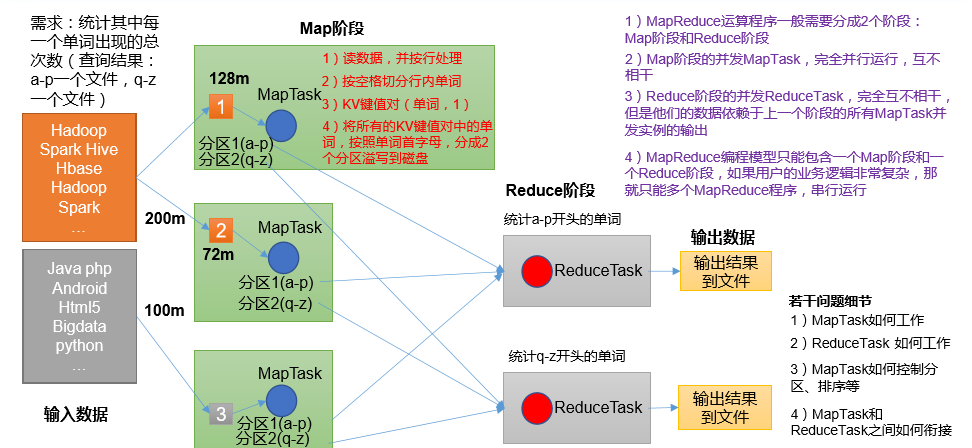

（1）分布式的运算程序往往需要分成至少2个阶段。  
（2）第一个阶段的MapTask并发实例，完全并行运行，互不相干。  
（3）第二个阶段的ReduceTask并发实例互不相干，但是他们的数据依赖于上一个阶段的所有MapTask并发实例的输出。  
（4）MapReduce编程模型只能包含一个Map阶段和一个Reduce阶段，如果用户的业务逻辑非常复杂，那就只能多个MapReduce程序，串行运行。  
总结：分析WordCount数据流走向深入理解MapReduce核心思想。  


### 1.4、MapReduce进程
一个完整的MapReduce程序在分布式运行时有三类实例进程：  
（1）MrAppMaster：负责整个程序的过程调度及状态协调。  
（2）MapTask：负责Map阶段的整个数据处理流程。  
（3）ReduceTask：负责Reduce阶段的整个数据处理流程。  


### 1.5、官方WordCount源码
采用反编译工具反编译源码，发现WordCount案例有Map类、Reduce类和驱动类。且数据的类型是Hadoop自身封装的序列化类型。  

### 1.6、常用数据序列化类型
```
Java类型	    Hadoop Writable类型
Boolean	    BooleanWritable
Byte	    ByteWritable
Int	        IntWritable
Float	    FloatWritable
Long	    LongWritable
Double	    DoubleWritable
String	    Text
Map	        MapWritable
Array	    ArrayWritable
Null	    NullWritable
```

### 1.7、MapReduce编程规范
用户编写的程序分成三个部分：Mapper、Reducer和Driver。   
1、Mapper阶段  
（1）用户自定义的Mapper要继承自己的父类  
（2）Mapper的输入数据是KV对的形式（KV的类型可自定义）  
（3）Mapper中的业务逻辑写在map()方法中  
（4）Mapper的输出数据是KV对的形式（KV的类型可自定义）  
（5）map()方法（MapTask进程）对每一个<K,V>调用一次  
 
2、Reducer阶段  
（2）Reducer的输入数据类型对应Mapper的输出数据类型，也是KV  
（3）Reducer的业务逻辑写在reduce()方法中  
（4）ReduceTask进程对每一组相同k的<k,v>组调用一次reduce()方法   

3、Driver阶段  
相当于YARN集群的客户端，用于提交我们整个程序到YARN集群，提交的是 封装了MapReduce程序相关运行参数的job对象。     
 
### 1.8、WordCount 案例实操 
见 MapReduceDemo。
本地运行   
```
F:\Development\java\jdk1.8.0_144\bin\java "-javaagent:F:\Intellij\JetBrains\IntelliJ IDEA 2017.3.4\lib\idea_rt.jar=64390:F:\Intellij\JetBrains\IntelliJ IDEA 2017.3.4\bin" -Dfile.encoding=UTF-8 -classpath F:\Development\java\jdk1.8.0_144\jre\lib\charsets.jar;F:\Development\java\jdk1.8.0_144\jre\lib\deploy.jar;F:\Development\java\jdk1.8.0_144\jre\lib\ext\access-bridge-64.jar;F:\Development\java\jdk1.8.0_144\jre\lib\ext\cldrdata.jar;F:\Development\java\jdk1.8.0_144\jre\lib\ext\dnsns.jar;F:\Development\java\jdk1.8.0_144\jre\lib\ext\jaccess.jar;F:\Development\java\jdk1.8.0_144\jre\lib\ext\jfxrt.jar;F:\Development\java\jdk1.8.0_144\jre\lib\ext\localedata.jar;F:\Development\java\jdk1.8.0_144\jre\lib\ext\nashorn.jar;F:\Development\java\jdk1.8.0_144\jre\lib\ext\sunec.jar;F:\Development\java\jdk1.8.0_144\jre\lib\ext\sunjce_provider.jar;F:\Development\java\jdk1.8.0_144\jre\lib\ext\sunmscapi.jar;F:\Development\java\jdk1.8.0_144\jre\lib\ext\sunpkcs11.jar;F:\Development\java\jdk1.8.0_144\jre\lib\ext\zipfs.jar;F:\Development\java\jdk1.8.0_144\jre\lib\javaws.jar;F:\Development\java\jdk1.8.0_144\jre\lib\jce.jar;F:\Development\java\jdk1.8.0_144\jre\lib\jfr.jar;F:\Development\java\jdk1.8.0_144\jre\lib\jfxswt.jar;F:\Development\java\jdk1.8.0_144\jre\lib\jsse.jar;F:\Development\java\jdk1.8.0_144\jre\lib\management-agent.jar;F:\Development\java\jdk1.8.0_144\jre\lib\plugin.jar;F:\Development\java\jdk1.8.0_144\jre\lib\resources.jar;F:\Development\java\jdk1.8.0_144\jre\lib\rt.jar;E:\学习LEARN\尚硅谷-大数据\尚硅谷大数据技术之Hadoop3.x\代码\MapReduceDemo\target\classes;F:\Maven\maven_repository\org\apache\hadoop\hadoop-client\3.1.3\hadoop-client-3.1.3.jar;F:\Maven\maven_repository\org\apache\hadoop\hadoop-common\3.1.3\hadoop-common-3.1.3.jar;F:\Maven\maven_repository\commons-cli\commons-cli\1.2\commons-cli-1.2.jar;F:\Maven\maven_repository\org\apache\commons\commons-math3\3.1.1\commons-math3-3.1.1.jar;F:\Maven\maven_repository\org\apache\httpcomponents\httpclient\4.5.2\httpclient-4.5.2.jar;F:\Maven\maven_repository\org\apache\httpcomponents\httpcore\4.4.4\httpcore-4.4.4.jar;F:\Maven\maven_repository\commons-codec\commons-codec\1.11\commons-codec-1.11.jar;F:\Maven\maven_repository\commons-net\commons-net\3.6\commons-net-3.6.jar;F:\Maven\maven_repository\commons-collections\commons-collections\3.2.2\commons-collections-3.2.2.jar;F:\Maven\maven_repository\org\eclipse\jetty\jetty-servlet\9.3.24.v20180605\jetty-servlet-9.3.24.v20180605.jar;F:\Maven\maven_repository\org\eclipse\jetty\jetty-security\9.3.24.v20180605\jetty-security-9.3.24.v20180605.jar;F:\Maven\maven_repository\org\eclipse\jetty\jetty-webapp\9.3.24.v20180605\jetty-webapp-9.3.24.v20180605.jar;F:\Maven\maven_repository\org\eclipse\jetty\jetty-xml\9.3.24.v20180605\jetty-xml-9.3.24.v20180605.jar;F:\Maven\maven_repository\javax\servlet\jsp\jsp-api\2.1\jsp-api-2.1.jar;F:\Maven\maven_repository\com\sun\jersey\jersey-servlet\1.19\jersey-servlet-1.19.jar;F:\Maven\maven_repository\commons-beanutils\commons-beanutils\1.9.3\commons-beanutils-1.9.3.jar;F:\Maven\maven_repository\org\apache\commons\commons-configuration2\2.1.1\commons-configuration2-2.1.1.jar;F:\Maven\maven_repository\org\apache\commons\commons-lang3\3.4\commons-lang3-3.4.jar;F:\Maven\maven_repository\com\google\re2j\re2j\1.1\re2j-1.1.jar;F:\Maven\maven_repository\com\google\code\gson\gson\2.2.4\gson-2.2.4.jar;F:\Maven\maven_repository\org\apache\hadoop\hadoop-auth\3.1.3\hadoop-auth-3.1.3.jar;F:\Maven\maven_repository\com\nimbusds\nimbus-jose-jwt\4.41.1\nimbus-jose-jwt-4.41.1.jar;F:\Maven\maven_repository\com\github\stephenc\jcip\jcip-annotations\1.0-1\jcip-annotations-1.0-1.jar;F:\Maven\maven_repository\net\minidev\json-smart\2.3\json-smart-2.3.jar;F:\Maven\maven_repository\net\minidev\accessors-smart\1.2\accessors-smart-1.2.jar;F:\Maven\maven_repository\org\ow2\asm\asm\5.0.4\asm-5.0.4.jar;F:\Maven\maven_repository\org\apache\curator\curator-framework\2.13.0\curator-framework-2.13.0.jar;F:\Maven\maven_repository\org\apache\curator\curator-recipes\2.13.0\curator-recipes-2.13.0.jar;F:\Maven\maven_repository\com\google\code\findbugs\jsr305\3.0.0\jsr305-3.0.0.jar;F:\Maven\maven_repository\org\apache\htrace\htrace-core4\4.1.0-incubating\htrace-core4-4.1.0-incubating.jar;F:\Maven\maven_repository\org\apache\commons\commons-compress\1.18\commons-compress-1.18.jar;F:\Maven\maven_repository\org\apache\kerby\kerb-simplekdc\1.0.1\kerb-simplekdc-1.0.1.jar;F:\Maven\maven_repository\org\apache\kerby\kerb-client\1.0.1\kerb-client-1.0.1.jar;F:\Maven\maven_repository\org\apache\kerby\kerby-config\1.0.1\kerby-config-1.0.1.jar;F:\Maven\maven_repository\org\apache\kerby\kerb-core\1.0.1\kerb-core-1.0.1.jar;F:\Maven\maven_repository\org\apache\kerby\kerby-pkix\1.0.1\kerby-pkix-1.0.1.jar;F:\Maven\maven_repository\org\apache\kerby\kerby-asn1\1.0.1\kerby-asn1-1.0.1.jar;F:\Maven\maven_repository\org\apache\kerby\kerby-util\1.0.1\kerby-util-1.0.1.jar;F:\Maven\maven_repository\org\apache\kerby\kerb-common\1.0.1\kerb-common-1.0.1.jar;F:\Maven\maven_repository\org\apache\kerby\kerb-crypto\1.0.1\kerb-crypto-1.0.1.jar;F:\Maven\maven_repository\org\apache\kerby\kerb-util\1.0.1\kerb-util-1.0.1.jar;F:\Maven\maven_repository\org\apache\kerby\token-provider\1.0.1\token-provider-1.0.1.jar;F:\Maven\maven_repository\org\apache\kerby\kerb-admin\1.0.1\kerb-admin-1.0.1.jar;F:\Maven\maven_repository\org\apache\kerby\kerb-server\1.0.1\kerb-server-1.0.1.jar;F:\Maven\maven_repository\org\apache\kerby\kerb-identity\1.0.1\kerb-identity-1.0.1.jar;F:\Maven\maven_repository\org\apache\kerby\kerby-xdr\1.0.1\kerby-xdr-1.0.1.jar;F:\Maven\maven_repository\org\codehaus\woodstox\stax2-api\3.1.4\stax2-api-3.1.4.jar;F:\Maven\maven_repository\com\fasterxml\woodstox\woodstox-core\5.0.3\woodstox-core-5.0.3.jar;F:\Maven\maven_repository\org\apache\hadoop\hadoop-hdfs-client\3.1.3\hadoop-hdfs-client-3.1.3.jar;F:\Maven\maven_repository\com\squareup\okhttp\okhttp\2.7.5\okhttp-2.7.5.jar;F:\Maven\maven_repository\com\squareup\okio\okio\1.6.0\okio-1.6.0.jar;F:\Maven\maven_repository\com\fasterxml\jackson\core\jackson-annotations\2.7.8\jackson-annotations-2.7.8.jar;F:\Maven\maven_repository\org\apache\hadoop\hadoop-yarn-api\3.1.3\hadoop-yarn-api-3.1.3.jar;F:\Maven\maven_repository\org\apache\hadoop\hadoop-yarn-client\3.1.3\hadoop-yarn-client-3.1.3.jar;F:\Maven\maven_repository\org\apache\hadoop\hadoop-mapreduce-client-core\3.1.3\hadoop-mapreduce-client-core-3.1.3.jar;F:\Maven\maven_repository\org\apache\hadoop\hadoop-mapreduce-client-jobclient\3.1.3\hadoop-mapreduce-client-jobclient-3.1.3.jar;F:\Maven\maven_repository\org\apache\hadoop\hadoop-annotations\3.1.3\hadoop-annotations-3.1.3.jar;F:\Maven\maven_repository\org\apache\hadoop\hadoop-mapreduce-client-app\3.1.3\hadoop-mapreduce-client-app-3.1.3.jar;F:\Maven\maven_repository\org\apache\hadoop\hadoop-mapreduce-client-common\3.1.3\hadoop-mapreduce-client-common-3.1.3.jar;F:\Maven\maven_repository\org\apache\hadoop\hadoop-yarn-server-web-proxy\3.1.3\hadoop-yarn-server-web-proxy-3.1.3.jar;F:\Maven\maven_repository\org\eclipse\jetty\jetty-server\9.3.24.v20180605\jetty-server-9.3.24.v20180605.jar;F:\Maven\maven_repository\org\eclipse\jetty\jetty-http\9.3.24.v20180605\jetty-http-9.3.24.v20180605.jar;F:\Maven\maven_repository\org\eclipse\jetty\jetty-io\9.3.24.v20180605\jetty-io-9.3.24.v20180605.jar;F:\Maven\maven_repository\org\apache\hadoop\hadoop-mapreduce-client-shuffle\3.1.3\hadoop-mapreduce-client-shuffle-3.1.3.jar;F:\Maven\maven_repository\org\apache\hadoop\hadoop-yarn-server-nodemanager\3.1.3\hadoop-yarn-server-nodemanager-3.1.3.jar;F:\Maven\maven_repository\io\dropwizard\metrics\metrics-core\3.2.4\metrics-core-3.2.4.jar;F:\Maven\maven_repository\com\fasterxml\jackson\core\jackson-databind\2.7.8\jackson-databind-2.7.8.jar;F:\Maven\maven_repository\com\fasterxml\jackson\core\jackson-core\2.7.8\jackson-core-2.7.8.jar;F:\Maven\maven_repository\com\google\protobuf\protobuf-java\2.5.0\protobuf-java-2.5.0.jar;F:\Maven\maven_repository\org\apache\avro\avro\1.7.7\avro-1.7.7.jar;F:\Maven\maven_repository\org\codehaus\jackson\jackson-core-asl\1.9.13\jackson-core-asl-1.9.13.jar;F:\Maven\maven_repository\org\codehaus\jackson\jackson-mapper-asl\1.9.13\jackson-mapper-asl-1.9.13.jar;F:\Maven\maven_repository\com\thoughtworks\paranamer\paranamer\2.3\paranamer-2.3.jar;F:\Maven\maven_repository\org\xerial\snappy\snappy-java\1.0.5\snappy-java-1.0.5.jar;F:\Maven\maven_repository\org\slf4j\slf4j-api\1.7.25\slf4j-api-1.7.25.jar;F:\Maven\maven_repository\com\google\inject\extensions\guice-servlet\4.0\guice-servlet-4.0.jar;F:\Maven\maven_repository\io\netty\netty\3.10.5.Final\netty-3.10.5.Final.jar;F:\Maven\maven_repository\org\apache\hadoop\hadoop-yarn-server-resourcemanager\3.1.3\hadoop-yarn-server-resourcemanager-3.1.3.jar;F:\Maven\maven_repository\javax\servlet\javax.servlet-api\3.1.0\javax.servlet-api-3.1.0.jar;F:\Maven\maven_repository\commons-io\commons-io\2.5\commons-io-2.5.jar;F:\Maven\maven_repository\com\google\inject\guice\4.0\guice-4.0.jar;F:\Maven\maven_repository\javax\inject\javax.inject\1\javax.inject-1.jar;F:\Maven\maven_repository\aopalliance\aopalliance\1.0\aopalliance-1.0.jar;F:\Maven\maven_repository\com\sun\jersey\jersey-json\1.19\jersey-json-1.19.jar;F:\Maven\maven_repository\com\sun\xml\bind\jaxb-impl\2.2.3-1\jaxb-impl-2.2.3-1.jar;F:\Maven\maven_repository\org\codehaus\jackson\jackson-jaxrs\1.9.2\jackson-jaxrs-1.9.2.jar;F:\Maven\maven_repository\org\codehaus\jackson\jackson-xc\1.9.2\jackson-xc-1.9.2.jar;F:\Maven\maven_repository\com\sun\jersey\contribs\jersey-guice\1.19\jersey-guice-1.19.jar;F:\Maven\maven_repository\org\apache\hadoop\hadoop-yarn-common\3.1.3\hadoop-yarn-common-3.1.3.jar;F:\Maven\maven_repository\com\sun\jersey\jersey-server\1.19\jersey-server-1.19.jar;F:\Maven\maven_repository\com\fasterxml\jackson\module\jackson-module-jaxb-annotations\2.7.8\jackson-module-jaxb-annotations-2.7.8.jar;F:\Maven\maven_repository\com\fasterxml\jackson\jaxrs\jackson-jaxrs-json-provider\2.7.8\jackson-jaxrs-json-provider-2.7.8.jar;F:\Maven\maven_repository\com\fasterxml\jackson\jaxrs\jackson-jaxrs-base\2.7.8\jackson-jaxrs-base-2.7.8.jar;F:\Maven\maven_repository\javax\xml\bind\jaxb-api\2.2.11\jaxb-api-2.2.11.jar;F:\Maven\maven_repository\org\codehaus\jettison\jettison\1.1\jettison-1.1.jar;F:\Maven\maven_repository\commons-lang\commons-lang\2.6\commons-lang-2.6.jar;F:\Maven\maven_repository\com\sun\jersey\jersey-core\1.19\jersey-core-1.19.jar;F:\Maven\maven_repository\javax\ws\rs\jsr311-api\1.1.1\jsr311-api-1.1.1.jar;F:\Maven\maven_repository\com\sun\jersey\jersey-client\1.19\jersey-client-1.19.jar;F:\Maven\maven_repository\org\eclipse\jetty\jetty-util\9.3.24.v20180605\jetty-util-9.3.24.v20180605.jar;F:\Maven\maven_repository\org\eclipse\jetty\jetty-util-ajax\9.3.24.v20180605\jetty-util-ajax-9.3.24.v20180605.jar;F:\Maven\maven_repository\com\google\guava\guava\27.0-jre\guava-27.0-jre.jar;F:\Maven\maven_repository\com\google\guava\failureaccess\1.0\failureaccess-1.0.jar;F:\Maven\maven_repository\com\google\guava\listenablefuture\9999.0-empty-to-avoid-conflict-with-guava\listenablefuture-9999.0-empty-to-avoid-conflict-with-guava.jar;F:\Maven\maven_repository\org\checkerframework\checker-qual\2.5.2\checker-qual-2.5.2.jar;F:\Maven\maven_repository\com\google\errorprone\error_prone_annotations\2.2.0\error_prone_annotations-2.2.0.jar;F:\Maven\maven_repository\com\google\j2objc\j2objc-annotations\1.1\j2objc-annotations-1.1.jar;F:\Maven\maven_repository\org\codehaus\mojo\animal-sniffer-annotations\1.17\animal-sniffer-annotations-1.17.jar;F:\Maven\maven_repository\commons-logging\commons-logging\1.1.3\commons-logging-1.1.3.jar;F:\Maven\maven_repository\log4j\log4j\1.2.17\log4j-1.2.17.jar;F:\Maven\maven_repository\org\apache\hadoop\hadoop-yarn-server-common\3.1.3\hadoop-yarn-server-common-3.1.3.jar;F:\Maven\maven_repository\org\apache\hadoop\hadoop-yarn-registry\3.1.3\hadoop-yarn-registry-3.1.3.jar;F:\Maven\maven_repository\commons-daemon\commons-daemon\1.0.13\commons-daemon-1.0.13.jar;F:\Maven\maven_repository\dnsjava\dnsjava\2.1.7\dnsjava-2.1.7.jar;F:\Maven\maven_repository\org\apache\geronimo\specs\geronimo-jcache_1.0_spec\1.0-alpha-1\geronimo-jcache_1.0_spec-1.0-alpha-1.jar;F:\Maven\maven_repository\org\ehcache\ehcache\3.3.1\ehcache-3.3.1.jar;F:\Maven\maven_repository\com\zaxxer\HikariCP-java7\2.4.12\HikariCP-java7-2.4.12.jar;F:\Maven\maven_repository\com\microsoft\sqlserver\mssql-jdbc\6.2.1.jre7\mssql-jdbc-6.2.1.jre7.jar;F:\Maven\maven_repository\org\apache\hadoop\hadoop-yarn-server-applicationhistoryservice\3.1.3\hadoop-yarn-server-applicationhistoryservice-3.1.3.jar;F:\Maven\maven_repository\org\objenesis\objenesis\1.0\objenesis-1.0.jar;F:\Maven\maven_repository\de\ruedigermoeller\fst\2.50\fst-2.50.jar;F:\Maven\maven_repository\com\cedarsoftware\java-util\1.9.0\java-util-1.9.0.jar;F:\Maven\maven_repository\com\cedarsoftware\json-io\2.5.1\json-io-2.5.1.jar;F:\Maven\maven_repository\org\apache\curator\curator-client\2.13.0\curator-client-2.13.0.jar;F:\Maven\maven_repository\org\apache\zookeeper\zookeeper\3.4.13\zookeeper-3.4.13.jar;F:\Maven\maven_repository\org\apache\yetus\audience-annotations\0.5.0\audience-annotations-0.5.0.jar;F:\Maven\maven_repository\org\fusesource\leveldbjni\leveldbjni-all\1.8\leveldbjni-all-1.8.jar;F:\Maven\maven_repository\junit\junit\4.12\junit-4.12.jar;F:\Maven\maven_repository\org\hamcrest\hamcrest-core\1.3\hamcrest-core-1.3.jar;F:\Maven\maven_repository\org\slf4j\slf4j-log4j12\1.7.30\slf4j-log4j12-1.7.30.jar com.atguigu.mapreduce.wordcount.WordCountDriver
2023-01-10 10:00:25,057 WARN [org.apache.hadoop.metrics2.impl.MetricsConfig] - Cannot locate configuration: tried hadoop-metrics2-jobtracker.properties,hadoop-metrics2.properties
  2023-01-10 10:00:25,869 INFO [org.apache.hadoop.metrics2.impl.MetricsSystemImpl] - Scheduled Metric snapshot period at 10 second(s).
  2023-01-10 10:00:25,869 INFO [org.apache.hadoop.metrics2.impl.MetricsSystemImpl] - JobTracker metrics system started
  2023-01-10 10:00:27,256 WARN [org.apache.hadoop.mapreduce.JobResourceUploader] - Hadoop command-line option parsing not performed. Implement the Tool interface and execute your application with ToolRunner to remedy this.
  2023-01-10 10:00:27,285 WARN [org.apache.hadoop.mapreduce.JobResourceUploader] - No job jar file set.  User classes may not be found. See Job or Job#setJar(String).
  2023-01-10 10:00:27,344 INFO [org.apache.hadoop.mapreduce.lib.input.FileInputFormat] - Total input files to process : 1
  2023-01-10 10:00:27,407 INFO [org.apache.hadoop.mapreduce.JobSubmitter] - number of splits:1
  2023-01-10 10:00:27,863 INFO [org.apache.hadoop.mapreduce.JobSubmitter] - Submitting tokens for job: job_local1041387084_0001
  2023-01-10 10:00:27,864 INFO [org.apache.hadoop.mapreduce.JobSubmitter] - Executing with tokens: []
  2023-01-10 10:00:28,142 INFO [org.apache.hadoop.mapreduce.Job] - The url to track the job: http://localhost:8080/
  2023-01-10 10:00:28,142 INFO [org.apache.hadoop.mapreduce.Job] - Running job: job_local1041387084_0001
  2023-01-10 10:00:28,162 INFO [org.apache.hadoop.mapred.LocalJobRunner] - OutputCommitter set in config null
  2023-01-10 10:00:28,168 INFO [org.apache.hadoop.mapreduce.lib.output.FileOutputCommitter] - File Output Committer Algorithm version is 2
  2023-01-10 10:00:28,168 INFO [org.apache.hadoop.mapreduce.lib.output.FileOutputCommitter] - FileOutputCommitter skip cleanup _temporary folders under output directory:false, ignore cleanup failures: false
  2023-01-10 10:00:28,169 INFO [org.apache.hadoop.mapred.LocalJobRunner] - OutputCommitter is org.apache.hadoop.mapreduce.lib.output.FileOutputCommitter
  2023-01-10 10:00:28,212 INFO [org.apache.hadoop.mapred.LocalJobRunner] - Waiting for map tasks
  2023-01-10 10:00:28,212 INFO [org.apache.hadoop.mapred.LocalJobRunner] - Starting task: attempt_local1041387084_0001_m_000000_0
  2023-01-10 10:00:28,233 INFO [org.apache.hadoop.mapreduce.lib.output.FileOutputCommitter] - File Output Committer Algorithm version is 2
  2023-01-10 10:00:28,233 INFO [org.apache.hadoop.mapreduce.lib.output.FileOutputCommitter] - FileOutputCommitter skip cleanup _temporary folders under output directory:false, ignore cleanup failures: false
  2023-01-10 10:00:28,260 INFO [org.apache.hadoop.yarn.util.ProcfsBasedProcessTree] - ProcfsBasedProcessTree currently is supported only on Linux.
  2023-01-10 10:00:28,381 INFO [org.apache.hadoop.mapred.Task] -  Using ResourceCalculatorProcessTree : org.apache.hadoop.yarn.util.WindowsBasedProcessTree@6661b302
  2023-01-10 10:00:28,395 INFO [org.apache.hadoop.mapred.MapTask] - Processing split: file:/E:/BigData/input/test01.txt:0+91
  2023-01-10 10:00:28,466 INFO [org.apache.hadoop.mapred.MapTask] - (EQUATOR) 0 kvi 26214396(104857584)
  2023-01-10 10:00:28,466 INFO [org.apache.hadoop.mapred.MapTask] - mapreduce.task.io.sort.mb: 100
  2023-01-10 10:00:28,466 INFO [org.apache.hadoop.mapred.MapTask] - soft limit at 83886080
  2023-01-10 10:00:28,466 INFO [org.apache.hadoop.mapred.MapTask] - bufstart = 0; bufvoid = 104857600
  2023-01-10 10:00:28,466 INFO [org.apache.hadoop.mapred.MapTask] - kvstart = 26214396; length = 6553600
  2023-01-10 10:00:28,473 INFO [org.apache.hadoop.mapred.MapTask] - Map output collector class = org.apache.hadoop.mapred.MapTask$MapOutputBuffer
  2023-01-10 10:00:28,489 INFO [org.apache.hadoop.mapred.LocalJobRunner] - 
  2023-01-10 10:00:28,489 INFO [org.apache.hadoop.mapred.MapTask] - Starting flush of map output
  2023-01-10 10:00:28,489 INFO [org.apache.hadoop.mapred.MapTask] - Spilling map output
  2023-01-10 10:00:28,489 INFO [org.apache.hadoop.mapred.MapTask] - bufstart = 0; bufend = 155; bufvoid = 104857600
  2023-01-10 10:00:28,489 INFO [org.apache.hadoop.mapred.MapTask] - kvstart = 26214396(104857584); kvend = 26214332(104857328); length = 65/6553600
  2023-01-10 10:00:28,506 INFO [org.apache.hadoop.mapred.MapTask] - Finished spill 0
  2023-01-10 10:00:28,528 INFO [org.apache.hadoop.mapred.Task] - Task:attempt_local1041387084_0001_m_000000_0 is done. And is in the process of committing
  2023-01-10 10:00:28,541 INFO [org.apache.hadoop.mapred.LocalJobRunner] - map
  2023-01-10 10:00:28,541 INFO [org.apache.hadoop.mapred.Task] - Task 'attempt_local1041387084_0001_m_000000_0' done.
  2023-01-10 10:00:28,598 INFO [org.apache.hadoop.mapred.Task] - Final Counters for attempt_local1041387084_0001_m_000000_0: Counters: 17
	File System Counters
		FILE: Number of bytes read=243
		FILE: Number of bytes written=349794
		FILE: Number of read operations=0
		FILE: Number of large read operations=0
		FILE: Number of write operations=0
	Map-Reduce Framework
		Map input records=6
		Map output records=17
		Map output bytes=155
		Map output materialized bytes=195
		Input split bytes=98
		Combine input records=0
		Spilled Records=17
		Failed Shuffles=0
		Merged Map outputs=0
		GC time elapsed (ms)=0
		Total committed heap usage (bytes)=257425408
	File Input Format Counters 
		Bytes Read=91
  2023-01-10 10:00:28,598 INFO [org.apache.hadoop.mapred.LocalJobRunner] - Finishing task: attempt_local1041387084_0001_m_000000_0
  2023-01-10 10:00:28,600 INFO [org.apache.hadoop.mapred.LocalJobRunner] - map task executor complete.
  2023-01-10 10:00:28,601 INFO [org.apache.hadoop.mapred.LocalJobRunner] - Waiting for reduce tasks
  2023-01-10 10:00:28,602 INFO [org.apache.hadoop.mapred.LocalJobRunner] - Starting task: attempt_local1041387084_0001_r_000000_0
  2023-01-10 10:00:28,608 INFO [org.apache.hadoop.mapreduce.lib.output.FileOutputCommitter] - File Output Committer Algorithm version is 2
  2023-01-10 10:00:28,608 INFO [org.apache.hadoop.mapreduce.lib.output.FileOutputCommitter] - FileOutputCommitter skip cleanup _temporary folders under output directory:false, ignore cleanup failures: false
  2023-01-10 10:00:28,608 INFO [org.apache.hadoop.yarn.util.ProcfsBasedProcessTree] - ProcfsBasedProcessTree currently is supported only on Linux.
  2023-01-10 10:00:28,660 INFO [org.apache.hadoop.mapred.Task] -  Using ResourceCalculatorProcessTree : org.apache.hadoop.yarn.util.WindowsBasedProcessTree@2aac9733
  2023-01-10 10:00:28,664 INFO [org.apache.hadoop.mapred.ReduceTask] - Using ShuffleConsumerPlugin: org.apache.hadoop.mapreduce.task.reduce.Shuffle@12c94bf3
  2023-01-10 10:00:28,666 WARN [org.apache.hadoop.metrics2.impl.MetricsSystemImpl] - JobTracker metrics system already initialized!
  2023-01-10 10:00:28,681 INFO [org.apache.hadoop.mapreduce.task.reduce.MergeManagerImpl] - MergerManager: memoryLimit=2653054464, maxSingleShuffleLimit=663263616, mergeThreshold=1751016064, ioSortFactor=10, memToMemMergeOutputsThreshold=10
  2023-01-10 10:00:28,683 INFO [org.apache.hadoop.mapreduce.task.reduce.EventFetcher] - attempt_local1041387084_0001_r_000000_0 Thread started: EventFetcher for fetching Map Completion Events
  2023-01-10 10:00:28,772 INFO [org.apache.hadoop.mapreduce.task.reduce.LocalFetcher] - localfetcher#1 about to shuffle output of map attempt_local1041387084_0001_m_000000_0 decomp: 191 len: 195 to MEMORY
  2023-01-10 10:00:28,783 INFO [org.apache.hadoop.mapreduce.task.reduce.InMemoryMapOutput] - Read 191 bytes from map-output for attempt_local1041387084_0001_m_000000_0
  2023-01-10 10:00:28,784 INFO [org.apache.hadoop.mapreduce.task.reduce.MergeManagerImpl] - closeInMemoryFile -> map-output of size: 191, inMemoryMapOutputs.size() -> 1, commitMemory -> 0, usedMemory ->191
  2023-01-10 10:00:28,786 INFO [org.apache.hadoop.mapreduce.task.reduce.EventFetcher] - EventFetcher is interrupted.. Returning
  2023-01-10 10:00:28,786 INFO [org.apache.hadoop.mapred.LocalJobRunner] - 1 / 1 copied.
  2023-01-10 10:00:28,786 INFO [org.apache.hadoop.mapreduce.task.reduce.MergeManagerImpl] - finalMerge called with 1 in-memory map-outputs and 0 on-disk map-outputs
  2023-01-10 10:00:28,800 INFO [org.apache.hadoop.mapred.Merger] - Merging 1 sorted segments
  2023-01-10 10:00:28,800 INFO [org.apache.hadoop.mapred.Merger] - Down to the last merge-pass, with 1 segments left of total size: 183 bytes
  2023-01-10 10:00:28,803 INFO [org.apache.hadoop.mapreduce.task.reduce.MergeManagerImpl] - Merged 1 segments, 191 bytes to disk to satisfy reduce memory limit
  2023-01-10 10:00:28,804 INFO [org.apache.hadoop.mapreduce.task.reduce.MergeManagerImpl] - Merging 1 files, 195 bytes from disk
  2023-01-10 10:00:28,805 INFO [org.apache.hadoop.mapreduce.task.reduce.MergeManagerImpl] - Merging 0 segments, 0 bytes from memory into reduce
  2023-01-10 10:00:28,805 INFO [org.apache.hadoop.mapred.Merger] - Merging 1 sorted segments
  2023-01-10 10:00:28,807 INFO [org.apache.hadoop.mapred.Merger] - Down to the last merge-pass, with 1 segments left of total size: 183 bytes
  2023-01-10 10:00:28,807 INFO [org.apache.hadoop.mapred.LocalJobRunner] - 1 / 1 copied.
  2023-01-10 10:00:28,814 INFO [org.apache.hadoop.conf.Configuration.deprecation] - mapred.skip.on is deprecated. Instead, use mapreduce.job.skiprecords
  2023-01-10 10:00:28,823 INFO [org.apache.hadoop.mapred.Task] - Task:attempt_local1041387084_0001_r_000000_0 is done. And is in the process of committing
  2023-01-10 10:00:28,825 INFO [org.apache.hadoop.mapred.LocalJobRunner] - 1 / 1 copied.
  2023-01-10 10:00:28,825 INFO [org.apache.hadoop.mapred.Task] - Task attempt_local1041387084_0001_r_000000_0 is allowed to commit now
  2023-01-10 10:00:28,837 INFO [org.apache.hadoop.mapreduce.lib.output.FileOutputCommitter] - Saved output of task 'attempt_local1041387084_0001_r_000000_0' to file:/E:/BigData/output/output01
  2023-01-10 10:00:28,837 INFO [org.apache.hadoop.mapred.LocalJobRunner] - reduce > reduce
  2023-01-10 10:00:28,837 INFO [org.apache.hadoop.mapred.Task] - Task 'attempt_local1041387084_0001_r_000000_0' done.
  2023-01-10 10:00:28,838 INFO [org.apache.hadoop.mapred.Task] - Final Counters for attempt_local1041387084_0001_r_000000_0: Counters: 24
	File System Counters
		FILE: Number of bytes read=665
		FILE: Number of bytes written=350093
		FILE: Number of read operations=0
		FILE: Number of large read operations=0
		FILE: Number of write operations=0
	Map-Reduce Framework
		Combine input records=0
		Combine output records=0
		Reduce input groups=13
		Reduce shuffle bytes=195
		Reduce input records=17
		Reduce output records=13
		Spilled Records=17
		Shuffled Maps =1
		Failed Shuffles=0
		Merged Map outputs=1
		GC time elapsed (ms)=9
		Total committed heap usage (bytes)=257425408
	Shuffle Errors
		BAD_ID=0
		CONNECTION=0
		IO_ERROR=0
		WRONG_LENGTH=0
		WRONG_MAP=0
		WRONG_REDUCE=0
	File Output Format Counters 
		Bytes Written=104
  2023-01-10 10:00:28,838 INFO [org.apache.hadoop.mapred.LocalJobRunner] - Finishing task: attempt_local1041387084_0001_r_000000_0
  2023-01-10 10:00:28,838 INFO [org.apache.hadoop.mapred.LocalJobRunner] - reduce task executor complete.
  2023-01-10 10:00:29,171 INFO [org.apache.hadoop.mapreduce.Job] - Job job_local1041387084_0001 running in uber mode : false
  2023-01-10 10:00:29,207 INFO [org.apache.hadoop.mapreduce.Job] -  map 100% reduce 100%
  2023-01-10 10:00:29,208 INFO [org.apache.hadoop.mapreduce.Job] - Job job_local1041387084_0001 completed successfully
  2023-01-10 10:00:29,216 INFO [org.apache.hadoop.mapreduce.Job] - Counters: 30
	File System Counters
		FILE: Number of bytes read=908
		FILE: Number of bytes written=699887
		FILE: Number of read operations=0
		FILE: Number of large read operations=0
		FILE: Number of write operations=0
	Map-Reduce Framework
		Map input records=6
		Map output records=17
		Map output bytes=155
		Map output materialized bytes=195
		Input split bytes=98
		Combine input records=0
		Combine output records=0
		Reduce input groups=13
		Reduce shuffle bytes=195
		Reduce input records=17
		Reduce output records=13
		Spilled Records=34
		Shuffled Maps =1
		Failed Shuffles=0
		Merged Map outputs=1
		GC time elapsed (ms)=9
		Total committed heap usage (bytes)=514850816
	Shuffle Errors
		BAD_ID=0
		CONNECTION=0
		IO_ERROR=0
		WRONG_LENGTH=0
		WRONG_MAP=0
		WRONG_REDUCE=0
	File Input Format Counters 
		Bytes Read=91
	File Output Format Counters 
		Bytes Written=104
```

#### 1.8.2、提交到集群测试 
集群上测试：    
（1）用 maven 打 jar 包，需要添加的打包插件依赖    
（2）将程序打成 jar 包    
（3）修改不带依赖的 jar 包名称为 wc.jar，并拷贝该 jar 包到 Hadoop 集群的/opt/module/hadoop-3.1.3 路径。    
（4）启动 Hadoop 集群    
（5）执行 WordCount 程序    
```
hadoop jar  wc.jar  com.atguigu.mapreduce.wordcount.WordCountDriver /user/atguigu/input /user/atguigu/output 
```
如下：
```
[atguigu@hadoop102 hadoop-3.1.3]$ hadoop jar  wc.jar  com.atguigu.mapreduce.wordcount2.WordCountDriver /input /output01
2023-01-10 11:00:17,202 INFO client.RMProxy: Connecting to ResourceManager at hadoop103/192.168.10.103:8032
2023-01-10 11:00:18,097 WARN mapreduce.JobResourceUploader: Hadoop command-line option parsing not performed. Implement the Tool interface and execute your application with ToolRunner to remedy this.
2023-01-10 11:00:18,171 INFO mapreduce.JobResourceUploader: Disabling Erasure Coding for path: /tmp/hadoop-yarn/staging/atguigu/.staging/job_1673318318861_0004
2023-01-10 11:00:18,394 INFO sasl.SaslDataTransferClient: SASL encryption trust check: localHostTrusted = false, remoteHostTrusted = false
2023-01-10 11:00:19,504 INFO input.FileInputFormat: Total input files to process : 1
2023-01-10 11:00:19,589 INFO sasl.SaslDataTransferClient: SASL encryption trust check: localHostTrusted = false, remoteHostTrusted = false
2023-01-10 11:00:19,696 INFO sasl.SaslDataTransferClient: SASL encryption trust check: localHostTrusted = false, remoteHostTrusted = false
2023-01-10 11:00:19,770 INFO mapreduce.JobSubmitter: number of splits:1
2023-01-10 11:00:20,066 INFO sasl.SaslDataTransferClient: SASL encryption trust check: localHostTrusted = false, remoteHostTrusted = false
2023-01-10 11:00:20,161 INFO mapreduce.JobSubmitter: Submitting tokens for job: job_1673318318861_0004
2023-01-10 11:00:20,161 INFO mapreduce.JobSubmitter: Executing with tokens: []
2023-01-10 11:00:20,488 INFO conf.Configuration: resource-types.xml not found
2023-01-10 11:00:20,488 INFO resource.ResourceUtils: Unable to find 'resource-types.xml'.
2023-01-10 11:00:21,138 INFO impl.YarnClientImpl: Submitted application application_1673318318861_0004
2023-01-10 11:00:21,202 INFO mapreduce.Job: The url to track the job: http://hadoop103:8088/proxy/application_1673318318861_0004/
2023-01-10 11:00:21,203 INFO mapreduce.Job: Running job: job_1673318318861_0004
2023-01-10 11:00:35,794 INFO mapreduce.Job: Job job_1673318318861_0004 running in uber mode : false
2023-01-10 11:00:35,795 INFO mapreduce.Job:  map 0% reduce 0%
2023-01-10 11:00:51,377 INFO mapreduce.Job:  map 100% reduce 0%
2023-01-10 11:01:00,733 INFO mapreduce.Job:  map 100% reduce 100%
2023-01-10 11:01:01,783 INFO mapreduce.Job: Job job_1673318318861_0004 completed successfully
2023-01-10 11:01:01,887 INFO mapreduce.Job: Counters: 53
	File System Counters
		FILE: Number of bytes read=86
		FILE: Number of bytes written=434755
		FILE: Number of read operations=0
		FILE: Number of large read operations=0
		FILE: Number of write operations=0
		HDFS: Number of bytes read=136
		HDFS: Number of bytes written=46
		HDFS: Number of read operations=8
		HDFS: Number of large read operations=0
		HDFS: Number of write operations=2
	Job Counters 
		Launched map tasks=1
		Launched reduce tasks=1
		Data-local map tasks=1
		Total time spent by all maps in occupied slots (ms)=11666
		Total time spent by all reduces in occupied slots (ms)=6788
		Total time spent by all map tasks (ms)=11666
		Total time spent by all reduce tasks (ms)=6788
		Total vcore-milliseconds taken by all map tasks=11666
		Total vcore-milliseconds taken by all reduce tasks=6788
		Total megabyte-milliseconds taken by all map tasks=11945984
		Total megabyte-milliseconds taken by all reduce tasks=6950912
	Map-Reduce Framework
		Map input records=4
		Map output records=6
		Map output bytes=68
		Map output materialized bytes=86
		Input split bytes=92
		Combine input records=0
		Combine output records=0
		Reduce input groups=5
		Reduce shuffle bytes=86
		Reduce input records=6
		Reduce output records=5
		Spilled Records=12
		Shuffled Maps =1
		Failed Shuffles=0
		Merged Map outputs=1
		GC time elapsed (ms)=209
		CPU time spent (ms)=3280
		Physical memory (bytes) snapshot=336101376
		Virtual memory (bytes) snapshot=5050912768
		Total committed heap usage (bytes)=202379264
		Peak Map Physical memory (bytes)=218710016
		Peak Map Virtual memory (bytes)=2522066944
		Peak Reduce Physical memory (bytes)=117391360
		Peak Reduce Virtual memory (bytes)=2528845824
	Shuffle Errors
		BAD_ID=0
		CONNECTION=0
		IO_ERROR=0
		WRONG_LENGTH=0
		WRONG_MAP=0
		WRONG_REDUCE=0
	File Input Format Counters 
		Bytes Read=44
	File Output Format Counters 
		Bytes Written=46
```

## 二、Hadoop序列化
### 2.1、序列化概述
1）什么是序列化  
序列化就是把内存中的对象，转换成字节序列（或其他数据传输协议）以便于存储到磁盘（持久化）和网络传输。   
反序列化就是将收到字节序列（或其他数据传输协议）或者是磁盘的持久化数据，转换成内存中的对象。  

2）为什么要序列化  
一般来说，“活的”对象只生存在内存里，关机断电就没有了。而且“活的”对象只能由本地的进程使用，不能被发送到网络上的另外一台计算机。 然而序列化可以存储“活的”对象，可以将“活的”对象发送到远程计算机。  

3）为什么不用Java的序列化  
Java的序列化是一个重量级序列化框架（Serializable），一个对象被序列化后，会附带很多额外的信息（各种校验信息，Header，继承体系等），不便于在网络中高效传输。所以，Hadoop自己开发了一套序列化机制（Writable）。  

4）Hadoop序列化特点：  
（1）紧凑 ：高效使用存储空间。  
（2）快速：读写数据的额外开销小。  
（3）互操作：支持多语言的交互  

### 2.2、自定义bean对象实现序列化接口（Writable）
在企业开发中往往常用的基本序列化类型不能满足所有需求，比如在Hadoop框架内部传递一个bean对象，那么该对象就需要实现序列化接口。  
具体实现bean对象序列化步骤如下7步。  
（1）必须实现Writable接口  
（2）反序列化时，需要反射调用空参构造函数，所以必须有空参构造  
```
public FlowBean() {
	super();
}
```
（3）重写序列化方法  
```
@Override
public void write(DataOutput out) throws IOException {
	out.writeLong(upFlow);
	out.writeLong(downFlow);
	out.writeLong(sumFlow);
```
（4）重写反序列化方法   
```
@Override
public void readFields(DataInput in) throws IOException {
	upFlow = in.readLong();
	downFlow = in.readLong();
	sumFlow = in.readLong();
}
```
（5）注意反序列化的顺序和序列化的顺序完全一致  
（6）要想把结果显示在文件中，需要重写toString()，可用"\t"分开，方便后续用。  
（7）如果需要将自定义的bean放在key中传输，则还需要实现Comparable接口，因为MapReduce框中的Shuffle过程要求对key必须能排序。详见后面排序案例。  
```
@Override
public int compareTo(FlowBean o) {
	// 倒序排列，从大到小
	return this.sumFlow > o.getSumFlow() ? -1 : 1;
}
```

### 2.3、序列化案例实操	
详见代码。


## 三、MapReduce框架原理
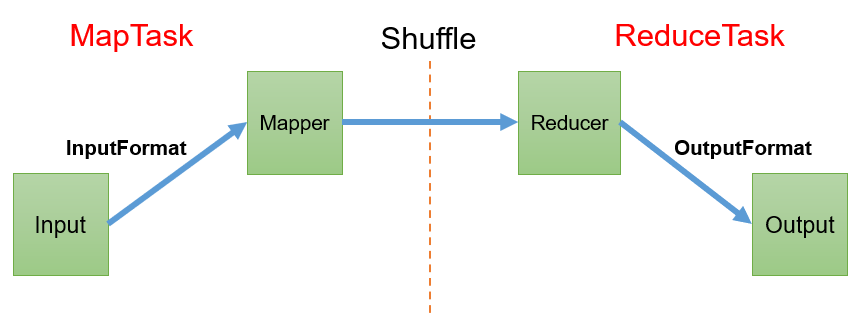  

### 3.1、InputFormat数据输入
#### 3.1.1、切片与MapTask并行度决定机制
1）问题引出   
MapTask的并行度决定Map阶段的任务处理并发度，进而影响到整个Job的处理速度。  
思考：1G的数据，启动8个MapTask，可以提高集群的并发处理能力。那么1K的数据，也启动8个MapTask，会提高集群性能吗？MapTask并行任务是否越多越好呢？哪些因素影响了MapTask并行度？  

2）MapTask并行度决定机制  
数据块：Block是HDFS物理上把数据分成一块一块。数据块是HDFS存储数据单位。  
数据切片：数据切片只是在逻辑上对输入进行分片，并不会在磁盘上将其切分成片进行存储。数据切片是MapReduce程序计算输入数据的单位，一个切片会对应启动一个MapTask。  

数据切片与MapTask并行度决定机制  
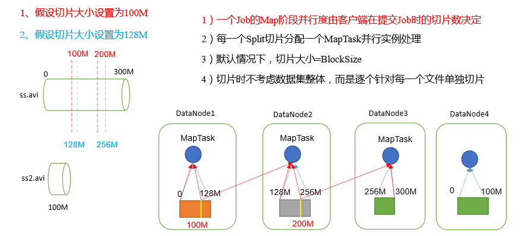  

#### 3.1.2、Job提交流程源码和切片源码详解
**1）Job提交流程源码详解**
```
    waitForCompletion()
    submit();

    // 1建立连接
	connect();	
		// 1）创建提交Job的代理
		new Cluster(getConfiguration());
			// （1）判断是本地运行环境还是yarn集群运行环境
			initialize(jobTrackAddr, conf); 

    // 2 提交job
    submitter.submitJobInternal(Job.this, cluster)

	// 1）创建给集群提交数据的Stag路径
	Path jobStagingArea = JobSubmissionFiles.getStagingDir(cluster, conf);

	// 2）获取jobid ，并创建Job路径
	JobID jobId = submitClient.getNewJobID();

	// 3）拷贝jar包到集群
    copyAndConfigureFiles(job, submitJobDir);	
	rUploader.uploadFiles(job, jobSubmitDir);

	// 4）计算切片，生成切片规划文件
    writeSplits(job, submitJobDir);
    maps = writeNewSplits(job, jobSubmitDir);
    input.getSplits(job);

	// 5）向Stag路径写XML配置文件
    writeConf(conf, submitJobFile);
	conf.writeXml(out);

	// 6）提交Job,返回提交状态
    status = submitClient.submitJob(jobId, submitJobDir.toString(), job.getCredentials());
```
Job提交流程源码解析   
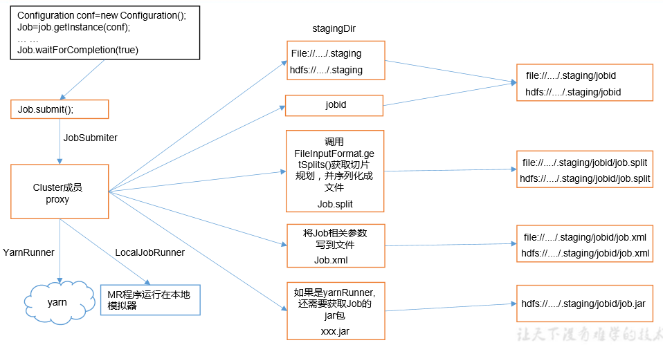  

**2）FileInputFormat 切片源码解析（input.getSplits(job)）**   
（1）程序先找到你数据存储的目录。   
（2）开始遍历处理（规划切片）目录下的每一个文件   
（3）遍历第一个文件ss.txt  
a）获取文件大小fs.sizeOf(ss.txt)    
b）计算切片大小 computeSplitSize(Math.max(minSize,Math.min(maxSize,blocksize)))=blocksize=128M    
c）默认情况下，切片大小=blocksize     
d）开始切，形成第1个切片：ss.txt—0:128M 第2个切片ss.txt—128:256M 第3个切片ss.txt—256M:300M （每次切片时，都要判断切完剩下的部分是否大于块的1.1倍，不大于1.1倍就划分一块切片）  
e）将切片信息写到一个切片规划文件中 f）整个切片的核心过程在getSplit()方法中完成 g）InputSplit只记录了切片的元数据信息，比如起始位置、长度以及所在的节点列表等。    
（4）提交切片规划文件到YARN上，YARN上的MrAppMaster就可以根据切片规划文件计算开启MapTask个数。  

#### 3.1.3、FileInputFormat 切片机制 
1、切片机制   
（1）简单地按照文件的内容长度进行切片   
（2）切片大小，默认等于Block大小   
（3）切片时不考虑数据集整体，而是逐个针对每一个文件单独切片  

2、案例分析     
（1）输入数据有两个文件：   
file1.txt 320M   
file2.txt 10M  
（2）经过FileInputFormat的切片机制 运算后，形成的切片信息如下：   
file1.txt.split1-- 0~128   
file1.txt.split2-- 128~256   
file1.txt.split3-- 256~320   
file2.txt.split1-- 0~10M  

FileInputFormat切片大小的参数配置    
（1）源码中计算切片大小的公式   
```
Math.max(minSize, Math.min(maxSize, blockSize)); 
mapreduce.input.fileinputformat.split.minsize=1 默认值为1 
mapreduce.input.fileinputformat.split.maxsize= Long.MAXValue 默认值Long.MAXValue 
```
因此，默认情况下，切片大小=blocksize。 

（2）切片大小设置   
maxsize（切片最大值）：参数如果调得比blockSize小，则会让切片变小，而且就等于配置的这个参数的值。   
minsize（切片最小值）：参数调的比blockSize大，则可以让切片变得比blockSize还大。 

（3）获取切片信息API  
```
// 获取切片的文件名称 
String name = inputSplit.getPath().getName(); 
// 根据文件类型获取切片信息 
FileSplit inputSplit = (FileSplit) context.getInputSplit();
```

#### 3.1.4、TextInputFormat 
1）FileInputFormat实现类  
思考：在运行MapReduce程序时，输入的文件格式包括：基于行的日志文件、二进制格式文件、数据库表等。那么，针对不同的数据类型，MapReduce是如何读取这些数据的呢？  
FileInputFormat常见的接口实现类包括：TextInputFormat、KeyValueTextInputFormat、NLineInputFormat、CombineTextInputFormat和自定义InputFormat等。  

2）TextInputFormat  
TextInputFormat是默认的FileInputFormat实现类。按行读取每条记录。键是存储该行在整个文件中的起始字节偏移量， LongWritable类型。值是这行的内容，不包括任何行终止符（换行符和回车符），Text类型。  

以下是一个示例，比如，一个分片包含了如下4条文本记录。
```
Rich learning form
Intelligent learning engine
Learning more convenient
From the real demand for more close to the enterprise
```
每条记录表示为以下键/值对：
```
(0,Rich learning form)
(20,Intelligent learning engine)
(49,Learning more convenient)
(74,From the real demand for more close to the enterprise)
```

#### 3.1.5、CombineTextInputFormat 切片机制 
框架默认的 TextInputFormat 切片机制是对任务按文件规划切片，不管文件多小，都会是一个单独的切片，都会交给一个 MapTask，这样如果有大量小文件，就会产生大量的MapTask，处理效率极其低下。   

1）应用场景：  
CombineTextInputFormat用于小文件过多的场景，它可以将多个小文件从逻辑上规划到一个切片中，这样，多个小文件就可以交给一个MapTask处理。

2）虚拟存储切片最大值设置  
```
CombineTextInputFormat.setMaxInputSplitSize(job, 4194304);// 4m  
```
注意：虚拟存储切片最大值设置最好根据实际的小文件大小情况来设置具体的值。  

3）切片机制  
生成切片过程包括：虚拟存储过程和切片过程二部分。  

CombineTextInputFormat切片机制  
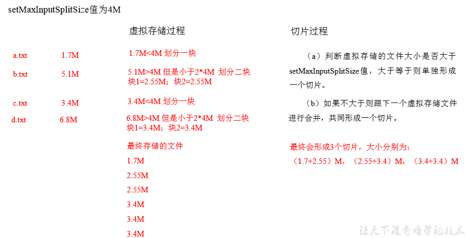  

（1）虚拟存储过程：  
将输入目录下所有文件大小，依次和设置的setMaxInputSplitSize值比较，如果不大于设置的最大值，逻辑上划分一个块。如果输入文件大于设置的最大值且大于两倍，那么以最大值切割一块；当剩余数据大小超过设置的最大值且不大于最大值2倍，此时将文件均分成2个虚拟存储块（防止出现太小切片）。  
例如setMaxInputSplitSize值为4M，输入文件大小为8.02M，则先逻辑上分成一个4M。剩余的大小为4.02M，如果按照4M逻辑划分，就会出现0.02M的小的虚拟存储文件，所以将剩余的4.02M文件切分成（2.01M和2.01M）两个文件。  
（2）切片过程：  
（a）判断虚拟存储的文件大小是否大于setMaxInputSplitSize值，大于等于则单独形成一个切片。  
（b）如果不大于则跟下一个虚拟存储文件进行合并，共同形成一个切片。  
（c）测试举例：有4个小文件大小分别为1.7M、5.1M、3.4M以及6.8M这四个小文件，则虚拟存储之后形成6个文件块，大小分别为：  
1.7M，（2.55M、2.55M），3.4M以及（3.4M、3.4M）  
最终会形成3个切片，大小分别为：  
（1.7+2.55）M，（2.55+3.4）M，（3.4+3.4）M  

#### 3.1.6、CombineTextInputFormat案例实操
1）需求  
将输入的大量小文件合并成一个切片统一处理。  
（1）输入数据  
准备4个小文件  
（2）期望  
期望一个切片处理4个文件  

2）实现过程  
（1）不做任何处理，运行1.8节的WordCount案例程序，观察切片个数为4。  
```
number of splits:4  
```
（2）在WordcountDriver中增加如下代码，运行程序，并观察运行的切片个数为3。  
（a）驱动类中添加代码如下：  
```
// 如果不设置InputFormat，它默认用的是TextInputFormat.class  
job.setInputFormatClass(CombineTextInputFormat.class);  
  
//虚拟存储切片最大值设置4m  
CombineTextInputFormat.setMaxInputSplitSize(job, 4194304);  
```
（b）运行如果为3个切片。  
```
number of splits:3  
```
（3）在WordcountDriver中增加如下代码，运行程序，并观察运行的切片个数为1。  
（a）驱动中添加代码如下：  
```
// 如果不设置InputFormat，它默认用的是TextInputFormat.class  
job.setInputFormatClass(CombineTextInputFormat.class);  
  
//虚拟存储切片最大值设置20m  
CombineTextInputFormat.setMaxInputSplitSize(job, 20971520);  
```
（b）运行如果为1个切片  
```
number of splits:1  
```

### 3.2、MapReduce工作流程
MapReduce详细工作流程（一）   
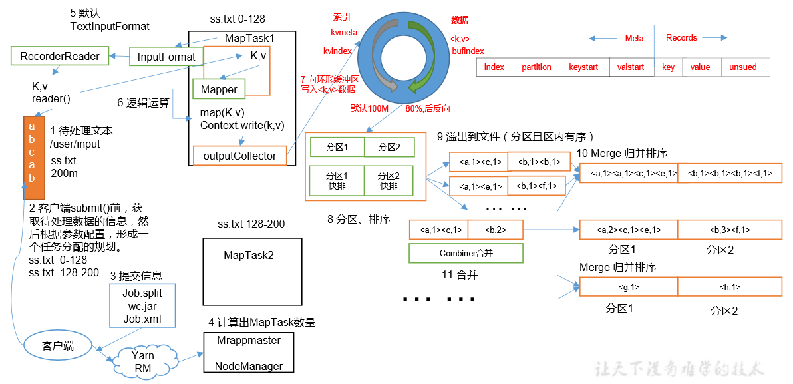   

MapReduce详细工作流程（二）  
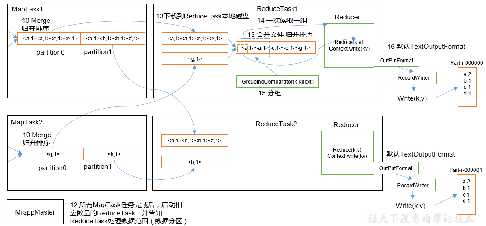   

上面的流程是整个MapReduce最全工作流程，但是Shuffle过程只是从第7步开始到第16步结束，具体Shuffle过程详解，如下：   
（1）MapTask收集我们的map()方法输出的kv对，放到内存缓冲区中   
（2）从内存缓冲区不断溢出本地磁盘文件，可能会溢出多个文件   
（3）多个溢出文件会被合并成大的溢出文件   
（4）在溢出过程及合并的过程中，都要调用Partitioner进行分区和针对key进行排序   
（5）ReduceTask根据自己的分区号，去各个MapTask机器上取相应的结果分区数据   
（6）ReduceTask会抓取到同一个分区的来自不同MapTask的结果文件，ReduceTask会将这些文件再进行合并（归并排序）   
（7）合并成大文件后，Shuffle的过程也就结束了，后面进入ReduceTask的逻辑运算过程（从文件中取出一个一个的键值对Group，调用用户自定义的reduce()方法）   
注意：  
（1）Shuffle中的缓冲区大小会影响到MapReduce程序的执行效率，原则上说，缓冲区越大，磁盘io的次数越少，执行速度就越快。  
（2）缓冲区的大小可以通过参数调整，参数：mapreduce.task.io.sort.mb默认100M。  

### 3.3、Shuffle机制
#### 3.3.1、Shuffle机制
Map方法之后，Reduce方法之前的数据处理过程称之为Shuffle。  
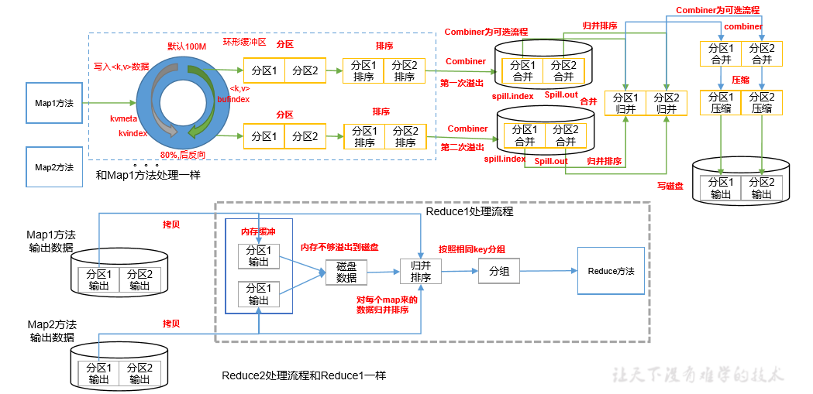  

#### 3.3.2、Partition 分区 
1、问题引出 要求将统计结果按照条件输出到不同文件中（分区）。比如：将统计结果按照手机 归属地不同省份输出到不同文件中（分区）   

2、默认Partitioner分区 
```
public class HashPartitioner<K, V> extends Partitioner<K, V> {
    public int getPartition(K key, V value, int numReduceTasks) { 
        return (key.hashCode() & Integer.MAX_VALUE) % numReduceTasks; 
    }
} 
```
默认分区是根据key的hashCode对ReduceTasks个数取模得到的。用户没法控制哪个 key存储到哪个分区。
 
3、自定义Partitioner步骤 
（1）自定义类继承Partitioner，重写getPartition()方法
```
public class CustomPartitioner extends Partitioner<Text, FlowBean> {
    @Override
    public int getPartition(Text key, FlowBean value, int numPartitions) { 
        // 控制分区代码逻辑 … …
        return partition;
    }
} 
```
（2）在Job驱动中，设置自定义Partitioner
```
job.setPartitionerClass(CustomPartitioner.class);
```
（3）自定义Partition后，要根据自定义Partitioner的逻辑设置相应数量的ReduceTask 
```
job.setNumReduceTasks(5);
```

4、分区总结   
（1）如果ReduceTask的数量>getPartition的结果数，则会多产生几个空的输出文件part-r-000xx；  
（2）如果1<ReduceTask的数量<getPartition的结果数，则有一部分分区数据无处安放，会Exception；  
（3）如果ReduceTask的数量=1，则不管MapTask端输出多少个分区文件，最终结果都交给这一个 ReduceTask，最终也就只会产生一个结果文件part-r-00000；  
（4）分区号必须从零开始，逐一累加。  

5、案例分析 
例如：假设自定义分区数为5，则    
（1）job.setNumReduceTasks(1);会正常运行，只不过会产生一个输出文件   
（2）job.setNumReduceTasks(2);会报错   
（3）job.setNumReduceTasks(6);大于5，程序会正常运行，会产生空文件   

#### 3.3.3、Partition 分区案例实操 
1）需求  
将统计结果按照手机归属地不同省份输出到不同文件中（分区）  
（1）输入数据  
（2）期望输出数据  
手机号136、137、138、139开头都分别放到一个独立的4个文件中，其他开头的放到一个文件中。  

2）需求分析  
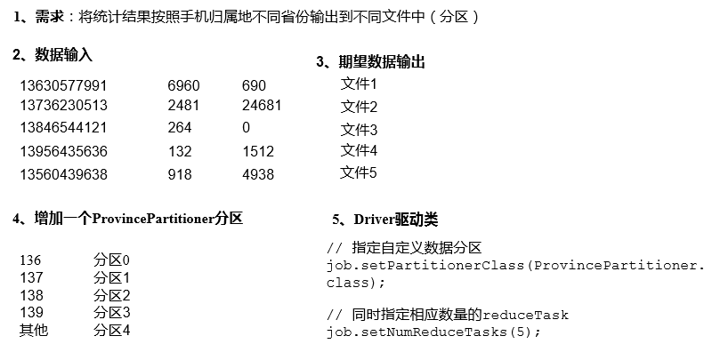  

3）在案例2.3的基础上，增加一个分区类  
```
package com.atguigu.mapreduce.partitioner;
import org.apache.hadoop.io.Text;
import org.apache.hadoop.mapreduce.Partitioner;

public class ProvincePartitioner extends Partitioner<Text, FlowBean> {

    @Override
    public int getPartition(Text text, FlowBean flowBean, int numPartitions) {
        //获取手机号前三位prePhone
        String phone = text.toString();
        String prePhone = phone.substring(0, 3);

        //定义一个分区号变量partition,根据prePhone设置分区号
        int partition;

        if("136".equals(prePhone)){
            partition = 0;
        }else if("137".equals(prePhone)){
            partition = 1;
        }else if("138".equals(prePhone)){
            partition = 2;
        }else if("139".equals(prePhone)){
            partition = 3;
        }else {
            partition = 4;
        }

        //最后返回分区号partition
        return partition;
    }
}
```

4）在驱动函数中增加自定义数据分区设置和ReduceTask设置  
```
package com.atguigu.mapreduce.partitioner;
import org.apache.hadoop.conf.Configuration;
import org.apache.hadoop.fs.Path;
import org.apache.hadoop.io.Text;
import org.apache.hadoop.mapreduce.Job;
import org.apache.hadoop.mapreduce.lib.input.FileInputFormat;
import org.apache.hadoop.mapreduce.lib.output.FileOutputFormat;
import java.io.IOException;

public class FlowDriver {

    public static void main(String[] args) throws IOException, ClassNotFoundException, InterruptedException {

        //1 获取job对象
        Configuration conf = new Configuration();
        Job job = Job.getInstance(conf);

        //2 关联本Driver类
        job.setJarByClass(FlowDriver.class);

        //3 关联Mapper和Reducer
        job.setMapperClass(FlowMapper.class);
        job.setReducerClass(FlowReducer.class);

        //4 设置Map端输出数据的KV类型
        job.setMapOutputKeyClass(Text.class);
        job.setMapOutputValueClass(FlowBean.class);

        //5 设置程序最终输出的KV类型
        job.setOutputKeyClass(Text.class);
        job.setOutputValueClass(FlowBean.class);

        //8 指定自定义分区器
        job.setPartitionerClass(ProvincePartitioner.class);

        //9 同时指定相应数量的ReduceTask
        job.setNumReduceTasks(5);

        //6 设置输入输出路径
        FileInputFormat.setInputPaths(job, new Path("D:\\inputflow"));
        FileOutputFormat.setOutputPath(job, new Path("D\\partitionout"));

        //7 提交Job
        boolean b = job.waitForCompletion(true);
        System.exit(b ? 0 : 1);
    }
}
```

#### 3.3.4、WritableComparable 排序 
排序是MapReduce框架中最重要的操作之一。  

MapTask和ReduceTask均会对数据按照key进行排序。该操作属于 Hadoop的默认行为。任何应用程序中的数据均会被排序，而不管逻辑上是 否需要。  

默认排序是按照字典顺序排序，且实现该排序的方法是快速排序。  
 
对于MapTask，它会将处理的结果暂时放到环形缓冲区中，当环形缓冲区使 用率达到一定阈值后，再对缓冲区中的数据进行一次快速排序，并将这些有序数 据溢写到磁盘上，而当数据处理完毕后，它会对磁盘上所有文件进行归并排序。  

对于ReduceTask，它从每个MapTask上远程拷贝相应的数据文件，如果文件大 小超过一定阈值，则溢写磁盘上，否则存储在内存中。如果磁盘上文件数目达到 一定阈值，则进行一次归并排序以生成一个更大文件；如果内存中文件大小或者 数目超过一定阈值，则进行一次合并后将数据溢写到磁盘上。当所有数据拷贝完 毕后，ReduceTask统一对内存和磁盘上的所有数据进行一次归并排序。  

（1）部分排序   
MapReduce根据输入记录的键对数据集排序。保证输出的每个文件内部有序。   
（2）全排序   
最终输出结果只有一个文件，且文件内部有序。实现方式是只设置一个ReduceTask。但该方法在 处理大型文件时效率极低，因为一台机器处理所有文件，完全丧失了MapReduce所提供的并行架构。  
（3）辅助排序：（GroupingComparator分组）   
在Reduce端对key进行分组。应用于：在接收的key为bean对象时，想让一个或几个字段相同（全部 字段比较不相同）的key进入到同一个reduce方法时，可以采用分组排序。  
（4）二次排序   
在自定义排序过程中，如果compareTo中的判断条件为两个即为二次排序。  
 
#### 3.3.5、WritableComparable 排序案例实操（全排序） 
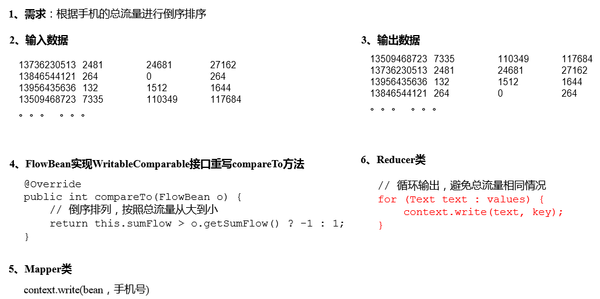


#### 3.3.6、WritableComparable 排序案例实操（区内排序） 
要求每个省份手机号输出的文件中按照总流量内部排序。    
基于前一个需求，增加自定义分区类，分区按照省份手机号设置。   
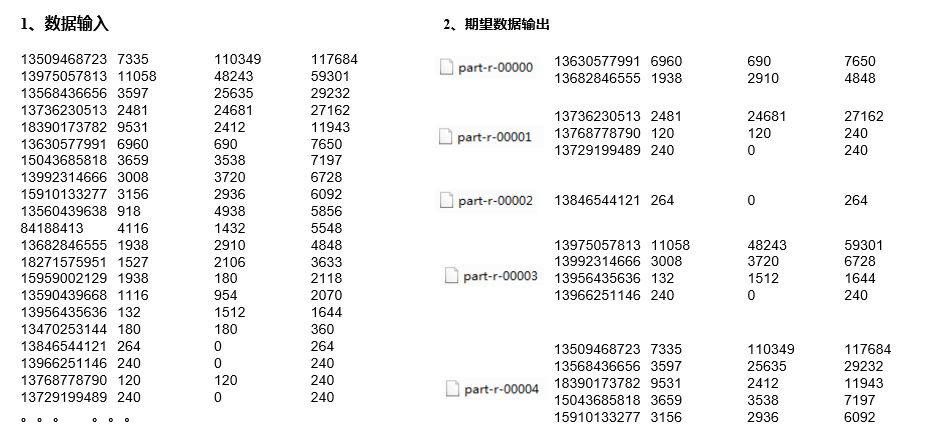  

#### 3.3.7、Combiner 合并 
（1）Combiner是MR程序中Mapper和Reducer之外的一种组件。   
（2）Combiner组件的父类就是Reducer。   
（3）Combiner和Reducer的区别在于运行的位置   
Combiner是在每一个MapTask所在的节点运行;  
Reducer是接收全局所有Mapper的输出结果；  
（4）Combiner的意义就是对每一个MapTask的输出进行局部汇总，以减小网络传输量。   
（5）Combiner能够应用的前提是不能影响最终的业务逻辑，而且，Combiner的输出kv 应该跟Reducer的输入kv类型要对应起来。   
Mapper 3 5 7 ->(3+5+7)/3=5 2 6 ->(2+6)/2=4  
Reducer (3+5+7+2+6)/5=23/5 不等于 (5+4)/2=9/2  
（6）自定义 Combiner 实现步骤   
（a）自定义一个 Combiner 继承 Reducer，重写 Reduce 方法   
```
public class WordCountCombiner extends Reducer<Text, IntWritable, Text, IntWritable> {

    private IntWritable outV = new IntWritable();

    @Override
    protected void reduce(Text key, Iterable<IntWritable> values, Context context) throws IOException, InterruptedException {

        int sum = 0;
        for (IntWritable value : values) {
            sum += value.get();
        }
     
        outV.set(sum);
     
        context.write(key,outV);
    }
}
```
（b）在 Job 驱动类中设置：   
```
job.setCombinerClass(WordCountCombiner.class); 
```

#### 3.3.8、Combiner 合并案例实操 
统计过程中对每一个 MapTask 的输出进行局部汇总，以减小网络传输量即采用Combiner 功能。    
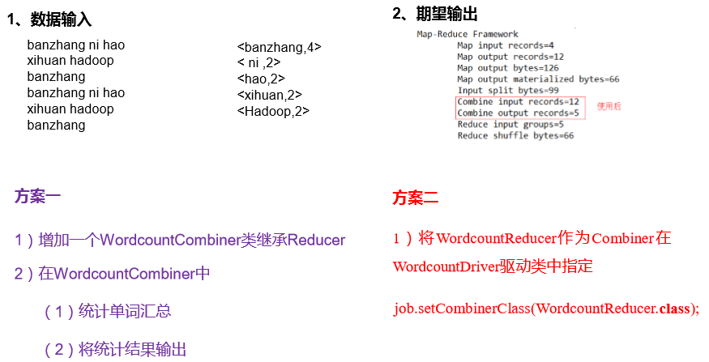  

### 3.4、OutputFormat 数据输出 
#### 3.4.1、OutputFormat 接口实现类 
OutputFormat是MapReduce输出的基类，所有实现MapReduce输出都实现了OutputFormat 接口。下面我们介绍几种常见的OutputFormat实现类。  

1、OutputFormat实现类  
2、默认输出格式TextOutputFormat  
3、自定义OutputFormat  
3.1、应用场景：   
例如：输出数据到MySQL/HBase/Elasticsearch等存储框架中。  
3.2、自定义OutputFormat步骤   
自定义一个类继承FileOutputFormat。   
改写RecordWriter，具体改写输出数据的方法write()。  
 
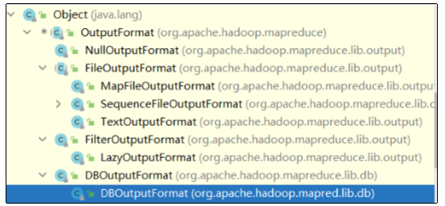  

#### 3.4.2 自定义、OutputFormat 案例实操 
  


## 3.5、MapReduce 内核源码解析 
#### 3.5.1、MapTask 工作机制 
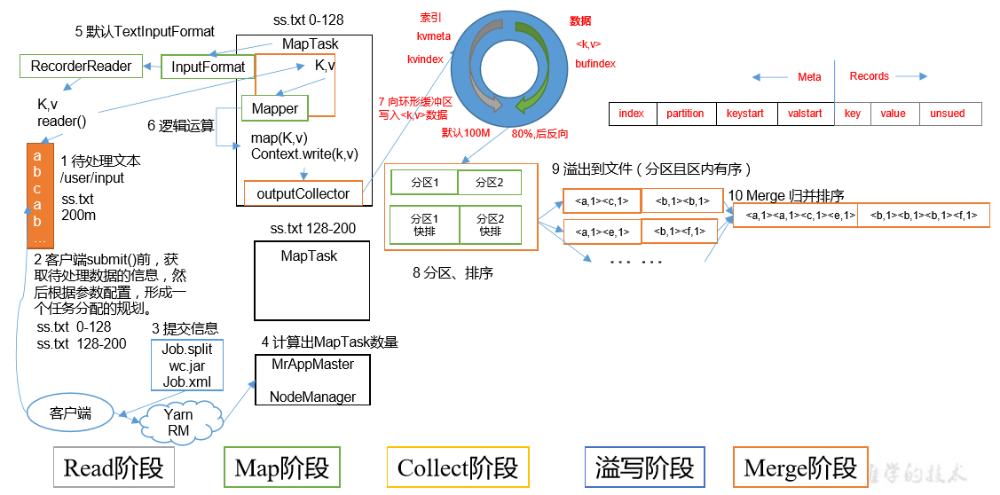   

（1）Read阶段：MapTask通过InputFormat获得的RecordReader，从输入InputSplit中解析出一个个key/value。  
（2）Map阶段：该节点主要是将解析出的key/value交给用户编写map()函数处理，并产生一系列新的key/value。  
（3）Collect收集阶段：在用户编写map()函数中，当数据处理完成后，一般会调用OutputCollector.collect()输出结果。在该函数内部，它会将生成的key/value分区（调用Partitioner），并写入一个环形内存缓冲区中。  
（4）Spill阶段：即“溢写”，当环形缓冲区满后，MapReduce会将数据写到本地磁盘上，生成一个临时文件。需要注意的是，将数据写入本地磁盘之前，先要对数据进行一次本地排序，并在必要时对数据进行合并、压缩等操作。  

溢写阶段详情：  
步骤1：利用快速排序算法对缓存区内的数据进行排序，排序方式是，先按照分区编号Partition进行排序，然后按照key进行排序。这样，经过排序后，数据以分区为单位聚集在一起，且同一分区内所有数据按照key有序。  
步骤2：按照分区编号由小到大依次将每个分区中的数据写入任务工作目录下的临时文件output/spillN.out（N表示当前溢写次数）中。如果用户设置了Combiner，则写入文件之前，对每个分区中的数据进行一次聚集操作。  
步骤3：将分区数据的元信息写到内存索引数据结构SpillRecord中，其中每个分区的元信息包括在临时文件中的偏移量、压缩前数据大小和压缩后数据大小。如果当前内存索引大小超过1MB，则将内存索引写到文件output/spillN.out.index中。  

（5）Merge阶段：当所有数据处理完成后，MapTask对所有临时文件进行一次合并，以确保最终只会生成一个数据文件。  
当所有数据处理完后，MapTask会将所有临时文件合并成一个大文件，并保存到文件output/file.out中，同时生成相应的索引文件output/file.out.index。  
在进行文件合并过程中，MapTask以分区为单位进行合并。对于某个分区，它将采用多轮递归合并的方式。每轮合并mapreduce.task.io.sort.factor（默认10）个文件，并将产生的文件重新加入待合并列表中，对文件排序后，重复以上过程，直到最终得到一个大文件。  
让每个MapTask最终只生成一个数据文件，可避免同时打开大量文件和同时读取大量小文件产生的随机读取带来的开销。  

#### 3.5.2、ReduceTask 工作机制 
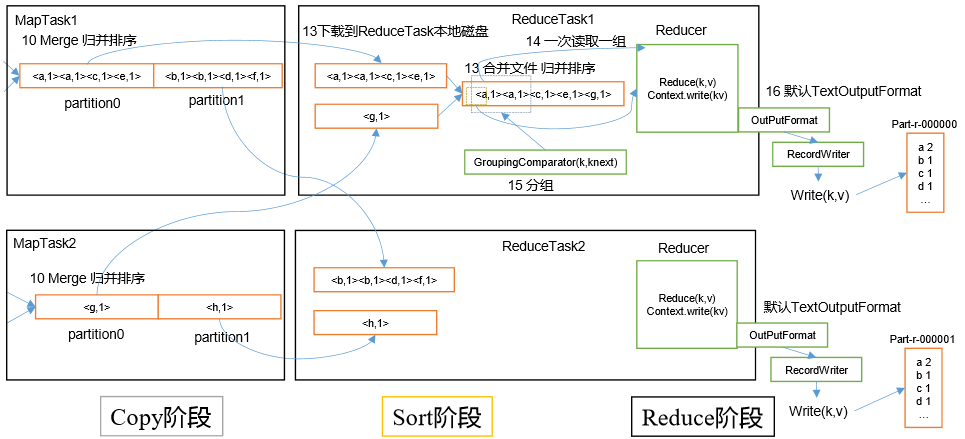 

（1）Copy阶段：ReduceTask从各个MapTask上远程拷贝一片数据，并针对某一片数据，如果其大小超过一定阈值，则写到磁盘上，否则直接放到内存中。  
（2）Sort阶段：在远程拷贝数据的同时，ReduceTask启动了两个后台线程对内存和磁盘上的文件进行合并，以防止内存使用过多或磁盘上文件过多。按照MapReduce语义，用户编写reduce()函数输入数据是按key进行聚集的一组数据。为了将key相同的数据聚在一起，Hadoop采用了基于排序的策略。由于各个MapTask已经实现对自己的处理结果进行了局部排序，因此，ReduceTask只需对所有数据进行一次归并排序即可。  
（3）Reduce阶段：reduce()函数将计算结果写到HDFS上。  

#### 3.5.3、ReduceTask 并行度决定机制 
回顾：MapTask 并行度由切片个数决定，切片个数由输入文件和切片规则决定。   
思考：ReduceTask 并行度由谁决定？   
1）设置 ReduceTask 并行度（个数）   
ReduceTask 的并行度同样影响整个 Job 的执行并发度和执行效率，但与 MapTask 的并  
发数由切片数决定不同，ReduceTask 数量的决定是可以直接手动设置：   
```
// 默认值是 1，手动设置为 4 
job.setNumReduceTasks(4); 
```

2）实验：测试 ReduceTask 多少合适  
（1）实验环境：1 个 Master 节点，16 个 Slave 节点：CPU:8GHZ，内存: 2G  
（2）实验结论：  
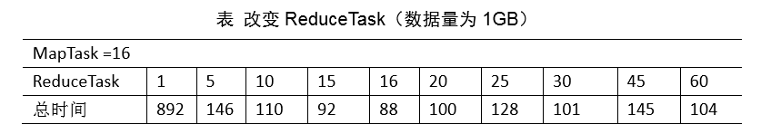   

3）注意事项  
（1）ReduceTask=0，表示没有Reduce阶段，输出文件个数和Map个数一致。  
（2）ReduceTask默认值就是1，所以输出文件个数为一个。  
（3）如果数据分布不均匀，就有可能在Reduce阶段产生数据倾斜  
（4）ReduceTask数量并不是任意设置，还要考虑业务逻辑需求，有些情况下，需要计算全 局汇总结果，就只能有1个ReduceTask。  
（5）具体多少个ReduceTask，需要根据集群性能而定。  
（6）如果分区数不是1，但是ReduceTask为1，是否执行分区过程。答案是：不执行分区过 程。因为在MapTask的源码中，执行分区的前提是先判断ReduceNum个数是否大于1。不大于1 肯定不执行。  

#### 3.5.4、MapTask & ReduceTask 源码解析 
1）MapTask 源码解析流程  
2）ReduceTask 源码解析流程   

### 3.6、Join 应用 
#### 3.6.1、Reduce Join 
Map端的主要工作：为来自不同表或文件的key/value对，打标签以区别不同来源的记录。然后用连接字段作为key，其余部分和新加的标志作为value，最后进行输出。   
Reduce端的主要工作：在Reduce端以连接字段作为key的分组已经完成，我们只需要在每一个分组当中将那些来源于不同文件的记录（在Map阶段已经打标志）分开，最后进行合并就ok了。   

#### 3.6.2、Reduce Join 案例实操 
通过将关联条件作为 Map 输出的 key，将两表满足 Join 条件的数据并携带数据所来源的文件信息，发往同一个 ReduceTask，在 Reduce 中进行数据的串联。    

Reduce端表合并（数据倾斜）   
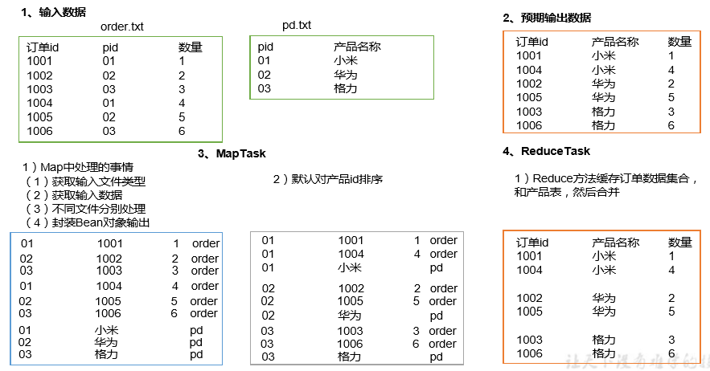   

5）总结   
缺点：这种方式中，合并的操作是在 Reduce 阶段完成，Reduce 端的处理压力太大，Map节点的运算负载则很低，资源利用率不高，且在 Reduce 阶段极易产生数据倾斜。   
解决方案：Map 端实现数据合并。   

#### 3.6.3、Map Join 
1）使用场景   
Map Join 适用于一张表十分小、一张表很大的场景。   
2）优点   
思考：在Reduce端处理过多的表，非常容易产生数据倾斜。怎么办？   
在Map端缓存多张表，提前处理业务逻辑，这样增加Map端业务，减少Reduce端数据的压力，尽可能的减少数据倾斜。   
3）具体办法：采用DistributedCache   
（1）在Mapper的setup阶段，将文件读取到缓存集合中。   
（2）在Driver驱动类中加载缓存。   
```
//缓存普通文件到Task运行节点。
job.addCacheFile(new URI("file:///e:/cache/pd.txt"));
//如果是集群运行,需要设置HDFS路径
job.addCacheFile(new URI("hdfs://hadoop102:8020/cache/pd.txt"));
```

#### 3.6.4、Map Join 案例实操 
Map端表合并案例分析（Distributedcache）  
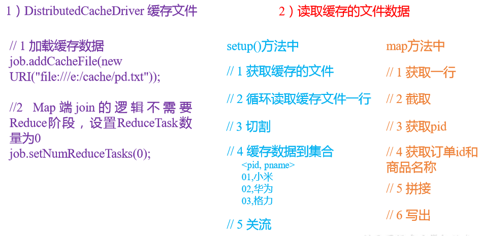  


### 3.7、数据清洗（ETL） 
“ETL，是英文Extract-Transform-Load的缩写，用来描述将数据从来源端经过抽取（Extract）、转换（Transform）、加载（Load）至目的端的过程。ETL一词较常用在数据仓库，但其对象并不限于数据仓库。   
在运行核心业务MapReduce程序之前，往往要先对数据进行清洗，清理掉不符合用户要求的数据。清理的过程往往只需要运行Mapper程序，不需要运行Reduce程序。  

### 3.8、MapReduce开发总结
1）输入数据接口：InputFormat  
（1）默认使用的实现类是：TextInputFormat  
（2）TextInputFormat的功能逻辑是：一次读一行文本，然后将该行的起始偏移量作为key，行内容作为value返回。  
（3）CombineTextInputFormat可以把多个小文件合并成一个切片处理，提高处理效率。  

2）逻辑处理接口：Mapper   
用户根据业务需求实现其中三个方法：map()   setup()   cleanup ()   

3）Partitioner分区  
（1）有默认实现 HashPartitioner，逻辑是根据key的哈希值和numReduces来返回一个分区号；key.hashCode()&Integer.MAXVALUE % numReduces  
（2）如果业务上有特别的需求，可以自定义分区。  

4）Comparable排序  
（1）当我们用自定义的对象作为key来输出时，就必须要实现WritableComparable接口，重写其中的compareTo()方法。  
（2）部分排序：对最终输出的每一个文件进行内部排序。  
（3）全排序：对所有数据进行排序，通常只有一个Reduce。  
（4）二次排序：排序的条件有两个。  

5）Combiner合并  
Combiner合并可以提高程序执行效率，减少IO传输。但是使用时必须不能影响原有的业务处理结果。  

6）逻辑处理接口：Reducer  
用户根据业务需求实现其中三个方法：reduce()   setup()   cleanup ()   

7）输出数据接口：OutputFormat  
（1）默认实现类是TextOutputFormat，功能逻辑是：将每一个KV对，向目标文本文件输出一行。  
（2）用户还可以自定义OutputFormat。  


## 四、Hadoop数据压缩
### 4.1、概述
1）压缩的好处和坏处  
压缩的优点：以减少磁盘IO、减少磁盘存储空间。  
压缩的缺点：增加CPU开销。  

2）压缩原则  
（1）运算密集型的Job，少用压缩  
（2）IO密集型的Job，多用压缩  

### 4.2、MR支持的压缩编码
1）压缩算法对比介绍  
  
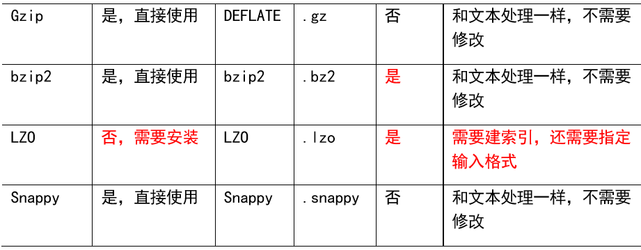  

2）压缩性能的比较   
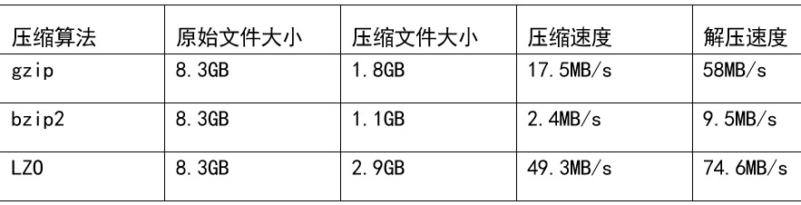   

> http://google.github.io/snappy/
  Snappy is a compression/decompression library. It does not aim for maximum compression, or compatibility with any other compression library; instead, it aims for very high speeds and reasonable compression. For instance, compared to the fastest mode of zlib, Snappy is an order of magnitude faster for most inputs, but the resulting compressed files are anywhere from 20% to 100% bigger.On a single core of a Core i7 processor in 64-bit mode, Snappy compresses at about 250 MB/sec or more and decompresses at about 500 MB/sec or more.

### 4.3、压缩方式选择 
压缩方式选择时重点考虑：压缩/解压缩速度、压缩率（压缩后存储大小）、压缩后是否可以支持切片。   

#### 4.3.1、Gzip压缩
优点：压缩率比较高；   
缺点：不支持Split；压缩/解压速度一般；  

#### 4.3.2、Bzip2压缩
优点：压缩率高；支持Split；   
缺点：压缩/解压速度慢。  

#### 4.3.3、Lzo压缩
优点：压缩/解压速度比较快；支持Split；  
缺点：压缩率一般；想支持切片需要额外创建索引。  

#### 4.3.4、Snappy压缩
优点：压缩和解压缩速度快；   
缺点：不支持Split；压缩率一般；   

#### 4.3.5、压缩位置选择
压缩可以在MapReduce作用的任意阶段启用。   
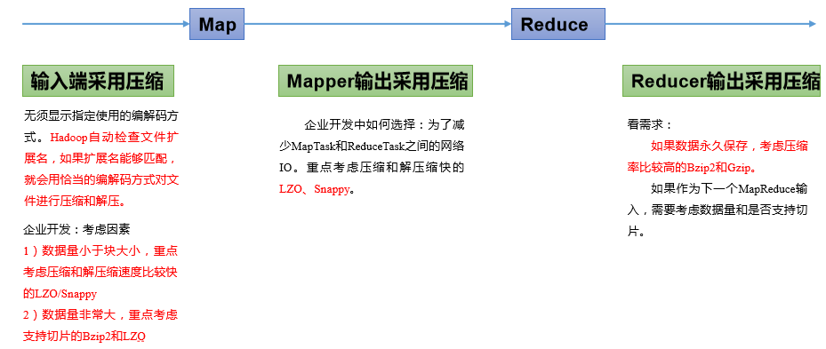    

### 4.4、压缩参数配置 
1）为了支持多种压缩/解压缩算法，Hadoop 引入了编码/解码器   
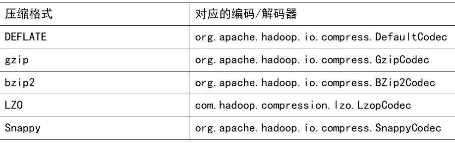  

2）要在 Hadoop 中启用压缩，可以配置如下参数   
   
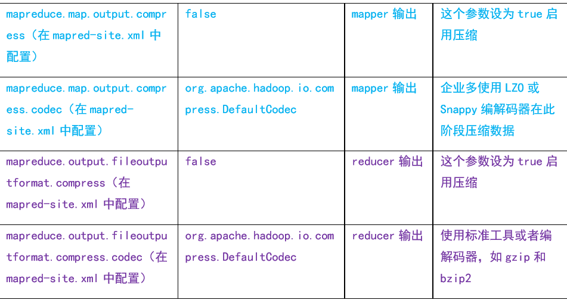   

### 4.5、压缩实操案例 
### 4.5.1、Map 输出端采用压缩 
即使你的MapReduce的输入输出文件都是未压缩的文件，你仍然可以对Map任务的中间结果输出做压缩，因为它要写在硬盘并且通过网络传输到Reduce节点，对其压缩可以提高很多性能，这些工作只要设置两个属性即可。   

## 五、常见错误及解决方案 
1）导包容易出错。尤其Text和CombineTextInputFormat。

2）Mapper中第一个输入的参数必须是LongWritable或者NullWritable，不可以是IntWritable.  报的错误是类型转换异常。

3）java.lang.Exception: java.io.IOException: Illegal partition for 13926435656 (4)，说明Partition和ReduceTask个数没对上，调整ReduceTask个数。

4）如果分区数不是1，但是reducetask为1，是否执行分区过程。答案是：不执行分区过程。因为在MapTask的源码中，执行分区的前提是先判断ReduceNum个数是否大于1。不大于1肯定不执行。

5）在Windows环境编译的jar包导入到Linux环境中运行，
```
hadoop jar wc.jar com.atguigu.mapreduce.wordcount.WordCountDriver /user/atguigu/ /user/atguigu/output
```
报如下错误：
```
Exception in thread "main" java.lang.UnsupportedClassVersionError: com/atguigu/mapreduce/wordcount/WordCountDriver : Unsupported major.minor version 52.0
```
原因是Windows环境用的jdk1.7，Linux环境用的jdk1.8。 
解决方案：统一jdk版本。 

6）缓存pd.txt小文件案例中，报找不到pd.txt文件  
原因：大部分为路径书写错误。还有就是要检查pd.txt.txt的问题。还有个别电脑写相对路径找不到pd.txt，可以修改为绝对路径。  

7）报类型转换异常。  
通常都是在驱动函数中设置Map输出和最终输出时编写错误。  
Map输出的key如果没有排序，也会报类型转换异常。  

8）集群中运行wc.jar时出现了无法获得输入文件。  
原因：WordCount案例的输入文件不能放用HDFS集群的根目录。  

9）出现了如下相关异常  
```
Exception in thread "main" java.lang.UnsatisfiedLinkError: org.apache.hadoop.io.nativeio.NativeIO$Windows.access0(Ljava/lang/String;I)Z
	at org.apache.hadoop.io.nativeio.NativeIO$Windows.access0(Native Method)
	at org.apache.hadoop.io.nativeio.NativeIO$Windows.access(NativeIO.java:609)
	at org.apache.hadoop.fs.FileUtil.canRead(FileUtil.java:977)
java.io.IOException: Could not locate executable null\bin\winutils.exe in the Hadoop binaries.
	at org.apache.hadoop.util.Shell.getQualifiedBinPath(Shell.java:356)
	at org.apache.hadoop.util.Shell.getWinUtilsPath(Shell.java:371)
	at org.apache.hadoop.util.Shell.<clinit>(Shell.java:364)
```
解决方案：拷贝hadoop.dll文件到Windows目录C:\Windows\System32。个别同学电脑还需要修改Hadoop源码。  
方案二：创建如下包名，并将NativeIO.java拷贝到该包名下   
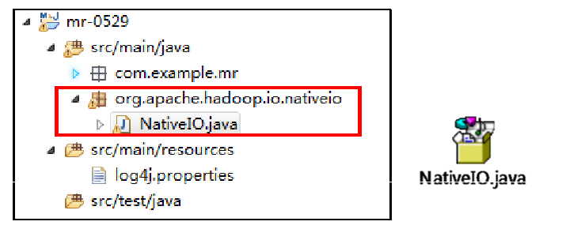   

10）自定义Outputformat时，注意在RecordWirter中的close方法必须关闭流资源。否则输出的文件内容中数据为空。  
```
@Override
public void close(TaskAttemptContext context) throws IOException, InterruptedException {
		if (atguigufos != null) {
			atguigufos.close();
		}
		if (otherfos != null) {
			otherfos.close();
		}
}
```

