# 05-Yarn

## 一、Yarn资源调度器
思考： 
1）如何管理集群资源？ 
2）如何给任务合理分配资源？ 
     
Yarn是一个资源调度平台，负责为运算程序提供服务器运算资源，相当于一个分布式的操作系统平台，而MapReduce等运算程序则相当于运行于操作系统之上的应用程序。   

### 1.1、Yarn基础架构
YARN主要由ResourceManager、NodeManager、ApplicationMaster和Container等组件构成。  
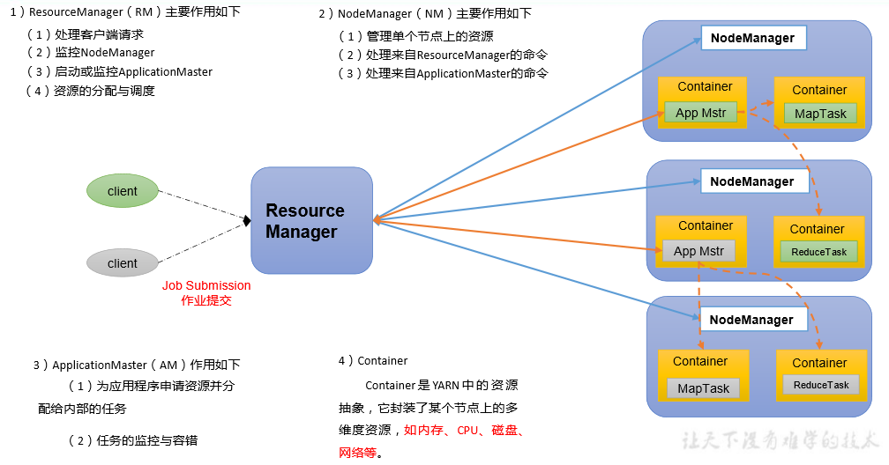    

### 1.2、Yarn工作机制
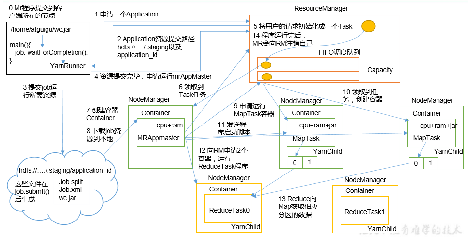    

（1）MR 程序提交到客户端所在的节点。   
（2）YarnRunner 向 ResourceManager 申请一个 Application。   
（3）RM 将该应用程序的资源路径返回给 YarnRunner。   
（4）该程序将运行所需资源提交到 HDFS 上。   
（5）程序资源提交完毕后，申请运行 mrAppMaster。   
（6）RM 将用户的请求初始化成一个 Task。   
（7）其中一个 NodeManager 领取到 Task 任务。   
（8）该 NodeManager 创建容器 Container，并产生 MRAppmaster。   
（9）Container 从 HDFS 上拷贝资源到本地。   
（10）MRAppmaster 向 RM 申请运行 MapTask 资源。   
（11）RM 将运行 MapTask 任务分配给另外两个 NodeManager，另两个 NodeManager分  别领取任务并创建容器。   
（12）MR 向两个接收到任务的 NodeManager 发送程序启动脚本，这两个 NodeManager分别启动 MapTask，MapTask 对数据分区排序。   
（13）MrAppMaster等待所有MapTask运行完毕后，向RM申请容器，运行ReduceTask。   
（14）ReduceTask 向 MapTask 获取相应分区的数据。   
（15）程序运行完毕后，MR 会向 RM 申请注销自己。   

### 1.3、作业提交全过程
HDFS、YARN、MapReduce三者关系   
    

作业提交过程之YARN   
    

作业提交过程之HDFS & MapReduce  
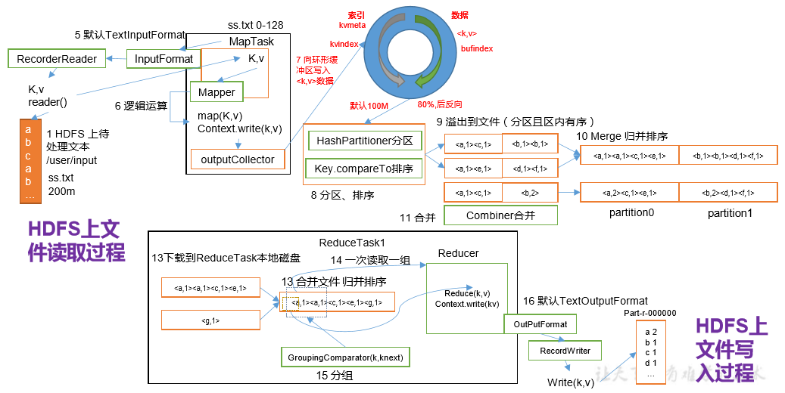    

作业提交全过程详解   
（1）作业提交   
第 1 步：Client 调用 job.waitForCompletion 方法，向整个集群提交 MapReduce 作业。   
第 2 步：Client 向 RM 申请一个作业 id。   
第 3 步：RM 给 Client 返回该 job 资源的提交路径和作业 id。   
第 4 步：Client 提交 jar 包、切片信息和配置文件到指定的资源提交路径。   
第 5 步：Client 提交完资源后，向 RM 申请运行 MrAppMaster。  

（2）作业初始化   
第 6 步：当 RM 收到 Client 的请求后，将该 job 添加到容量调度器中。   
第 7 步：某一个空闲的 NM 领取到该 Job。   
第 8 步：该 NM 创建 Container，并产生 MRAppmaster。   
第 9 步：下载 Client 提交的资源到本地。   

（3）任务分配   
第 10 步：MrAppMaster 向 RM 申请运行多个 MapTask 任务资源。   
第 11 步：RM 将运行 MapTask 任务分配给另外两个 NodeManager，另两个 NodeManager分别领取任务并创建容器。   

（4）任务运行   
第 12 步：MR 向两个接收到任务的 NodeManager 发送程序启动脚本，这两个NodeManager 分别启动 MapTask，MapTask 对数据分区排序。   
第13步：MrAppMaster等待所有MapTask运行完毕后，向RM申请容器，运行ReduceTask。  
 
第 14 步：ReduceTask 向 MapTask 获取相应分区的数据。   

第 15 步：程序运行完毕后，MR 会向 RM 申请注销自己。   

（5）进度和状态更新   
YARN 中的任务将其进度和状态(包括 counter)返回给应用管理器, 客户端每秒(通过mapreduce.client.progressmonitor.pollinterval 设置)向应用管理器请求进度更新, 展示给用户。  
 
（6）作业完成  
除了向应用管理器请求作业进度外, 客户端每5秒都会通过调用waitForCompletion()来检查作业是否完成。时间间隔可以通过mapreduce.client.completion.pollinterval来设置。作业完成之后, 应用管理器和Container会清理工作状态。作业的信息会被作业历史服务器存储以备之后用户核查。  

### 1.4、Yarn调度器和调度算法  
目前，Hadoop作业调度器主要有三种：FIFO、容量（Capacity Scheduler）和公平（Fair Scheduler）。Apache Hadoop3.1.3默认的资源调度器是Capacity Scheduler。  
CDH框架默认调度器是Fair Scheduler。  
具体设置详见：yarn-default.xml文件  
```
<property>
    <description>The class to use as the resource scheduler.</description>
    <name>yarn.resourcemanager.scheduler.class</name>
    <value>org.apache.hadoop.yarn.server.resourcemanager.scheduler.capacity.CapacityScheduler</value>
</property>
```

#### 1.4.1、先进先出调度器（FIFO）
FIFO调度器（First In First Out）：单队列，根据提交作业的先后顺序，先来先服务。  
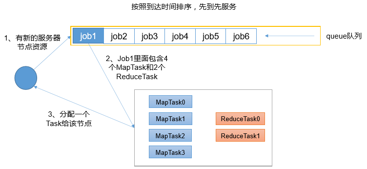    
优点：简单易懂；   
缺点：不支持多队列，生产环境很少使用；   

#### 1.4.2、容量调度器（Capacity Scheduler）
Capacity Scheduler是Yahoo开发的多用户调度器。   
容量调度器特点   
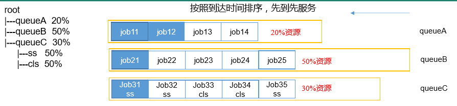  

1、多队列：每个队列可配置一定的资源量，每个队列采用FIFO调度策略。  
2、容量保证：管理员可为每个队列设置资源最低保证和资源使用上限   
3、灵活性：如果一个队列中的资源有剩余，可以暂时共享给那些需要资源的队列，而一旦该队列有新的应用 程序提交，则其他队列借调的资源会归还给该队列。  
4、多租户：支持多用户共享集群和多应用程序同时运行。为了防止同一个用户的作业独占队列中的资源，该调度器会对同一用户提交的作业所占资源量进行限定。  
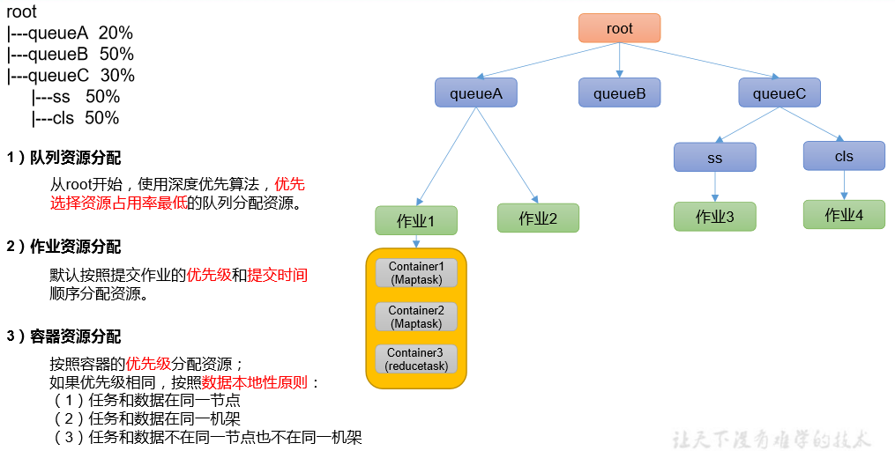  

#### 1.4.3、公平调度器（Fair Scheduler）
Fair Schedulere是Facebook开发的多用户调度器。  

公平调度器特点   
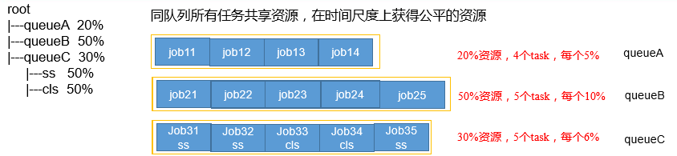  

1）与容量调度器相同点  
（1）核心调度策略不同 容量调度器：优先选择资源利用率低的队列 公平调度器：优先选择对资源的缺额比例大的  
（2）每个队列可以单独设置资源分配方式 容量调度器：FIFO、DRF 公平调度器：FIFO、FAIR、DRF  
（3）灵活性：如果一个队列中的资源有剩余，可以暂时共享给那些需要资源的队列，而一旦该队列有新的应用程序提 交，则其他队列借调的资源会归还给该队列。  
（4）多租户：支持多用户共享集群和多应用程序同时运行；为了防止同一个用户的作业独占队列中的资源，该调度器 会对同一用户提交的作业所占资源量进行限定。  

2）与容量调度器不同点    
（1）核心调度策略不同   
容量调度器：优先选择资源利用率低的队列   
公平调度器：优先选择对资源的缺额比例大的  

（2）每个队列可以单独设置资源分配方式   
容量调度器：FIFO、DRF   
公平调度器：FIFO、FAIR、DRF  

公平调度器——缺额  
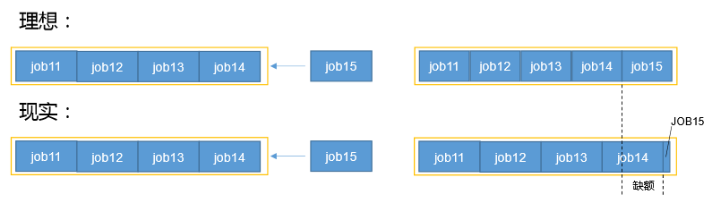   
公平调度器设计目标是：在时间尺度上，所有作业获得公平的资源。某一 时刻一个作业应获资源和实际获取资源的差距叫“缺额”。   
调度器会优先为缺额大的作业分配资源。  

公平调度器队列资源分配方式   
1）FIFO策略   
公平调度器每个队列资源分配策略如果选择FIFO的话，此时公平调度器相当于上面讲过的容量调度器。  

2）Fair策略   
Fair 策略（默认）是一种基于最大最小公平算法实现的资源多路复用方式，默认情况下，每个队列内部采用该方式分配资源。这意味着，如果一个队列中有两个应用程序同时运行，则每个应用程序可得到1/2的资源；如果三个应用程序同时运行，则 每个应用程序可得到1/3的资源。   
具体资源分配流程和容器调度器一致：  
（1）选择队列  
（2）选择作业   
（3）选择容器  
以上三部，每一步都是按照公平策略分配资源。   
实际最小资源份额：mindshare = Min（资源需求量，配置的最小资源）  
➢ 是否饥饿：isNeedy = 资源使用量 < mindshare（实际最小资源份额）  
➢ 资源分配比：minShareRatio = 资源使用量 / Max（mindshare, 1）  
➢ 资源使用权重比：useToWeightRatio = 资源使用量 / 权重  

公平调度器资源分配算法  
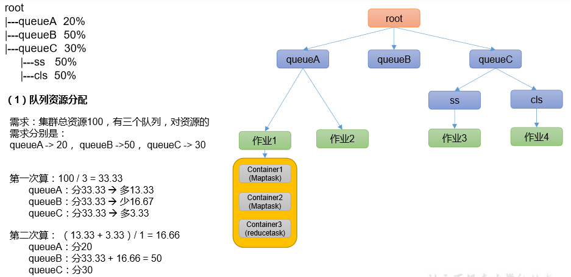  

公平调度器队列资源分配方式  
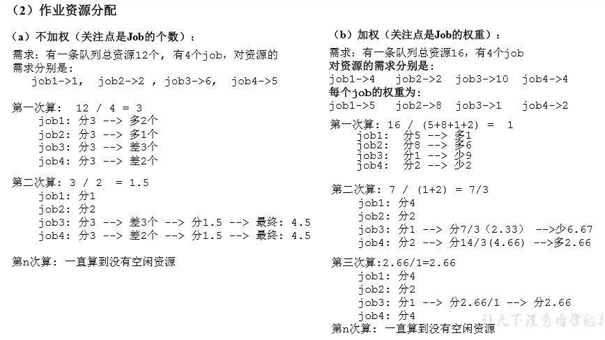   

公平调度器队列资源分配方式  
3）DRF策略     
DRF（Dominant Resource Fairness），我们之前说的资源，都是单一标准，例如只考虑内存（也是Yarn默 认的情况）。但是很多时候我们资源有很多种，例如内存，CPU，网络带宽等，这样我们很难衡量两个应用应该分配的资源比例。  
那么在YARN中，我们用DRF来决定如何调度：   
假设集群一共有100 CPU和10T 内存，而应用A需要（2 CPU, 300GB），应用B需要（6 CPU，100GB）。 则两个应用分别需要A（2%CPU, 3%内存）和B（6%CPU, 1%内存）的资源，这就意味着A是内存主导的, B是 CPU主导的，针对这种情况，我们可以选择DRF策略对不同应用进行不同资源（CPU和内存）的一个不同比例的限制。   

### 1.5、Yarn常用命令
Yarn状态的查询，除了可以在hadoop103:8088页面查看外，还可以通过命令操作。常见的命令操作如下所示：  
需求：执行WordCount案例，并用Yarn命令查看任务运行情况。  
```
[atguigu@hadoop102 hadoop-3.1.3]$ myhadoop.sh start
[atguigu@hadoop102 hadoop-3.1.3]$ hadoop jar share/hadoop/mapreduce/hadoop-mapreduce-examples-3.1.3.jar wordcount /input /output
```

#### 1.5.1、yarn application查看任务
（1）列出所有Application：   
```
[atguigu@hadoop102 hadoop-3.1.3]$ yarn application -list
2021-02-06 10:21:19,238 INFO client.RMProxy: Connecting to ResourceManager at hadoop103/192.168.10.103:8032
Total number of applications (application-types: [], states: [SUBMITTED, ACCEPTED, RUNNING] and tags: []):0
                Application-Id	    Application-Name	    Application-Type	      User	     Queue	             State	       Final-State	       Progress	                       Tracking-URL
```
（2）根据Application状态过滤：yarn application -list -appStates （所有状态：ALL、NEW、NEW_SAVING、SUBMITTED、ACCEPTED、RUNNING、FINISHED、FAILED、KILLED）   
```
atguigu@hadoop102 hadoop-3.1.3]$ yarn application -list -appStates FINISHED
2021-02-06 10:22:20,029 INFO client.RMProxy: Connecting to ResourceManager at hadoop103/192.168.10.103:8032
Total number of applications (application-types: [], states: [FINISHED] and tags: []):1
                Application-Id	    Application-Name	    Application-Type	      User	     Queue	             State	       Final-State	       Progress	                       Tracking-URL
application_1612577921195_0001	          word count	           MAPREDUCE	   atguigu	   default	          FINISHED	         SUCCEEDED	           100%	http://hadoop102:19888/jobhistory/job/job_1612577921195_0001
```
（3）Kill掉Application： 
```
[atguigu@hadoop102 hadoop-3.1.3]$ yarn application -kill application_1612577921195_0001
2021-02-06 10:23:48,530 INFO client.RMProxy: Connecting to ResourceManager at hadoop103/192.168.10.103:8032
Application application_1612577921195_0001 has already finished
```

#### 1.5.2、yarn logs查看日志
（1）查询Application日志：yarn logs -applicationId <ApplicationId>
```
[atguigu@hadoop102 hadoop-3.1.3]$ yarn logs -applicationId application_1612577921195_0001
```
（2）查询Container日志：yarn logs -applicationId <ApplicationId> -containerId <ContainerId> 
```
[atguigu@hadoop102 hadoop-3.1.3]$ yarn logs -applicationId application_1612577921195_0001 -containerId container_1612577921195_0001_01_000001
```

#### 1.5.3、yarn applicationattempt查看尝试运行的任务
（1）列出所有Application尝试的列表：yarn applicationattempt -list <ApplicationId>
```
[atguigu@hadoop102 hadoop-3.1.3]$ yarn applicationattempt -list application_1612577921195_0001
2021-02-06 10:26:54,195 INFO client.RMProxy: Connecting to ResourceManager at hadoop103/192.168.10.103:8032
Total number of application attempts :1
         ApplicationAttempt-Id	               State	                    AM-Container-Id	                       Tracking-URL
appattempt_1612577921195_0001_000001	            FINISHED	container_1612577921195_0001_01_000001	http://hadoop103:8088/proxy/application_1612577921195_0001/
```
（2）打印ApplicationAttemp状态：yarn applicationattempt -status <ApplicationAttemptId>
```
[atguigu@hadoop102 hadoop-3.1.3]$ yarn applicationattempt -status appattempt_1612577921195_0001_000001
2021-02-06 10:27:55,896 INFO client.RMProxy: Connecting to ResourceManager at hadoop103/192.168.10.103:8032
Application Attempt Report : 
	ApplicationAttempt-Id : appattempt_1612577921195_0001_000001
	State : FINISHED
	AMContainer : container_1612577921195_0001_01_000001
	Tracking-URL : http://hadoop103:8088/proxy/application_1612577921195_0001/
	RPC Port : 34756
	AM Host : hadoop104
	Diagnostics :
```

#### 1.5.4 yarn container查看容器
（1）列出所有Container：yarn container -list <ApplicationAttemptId>
```
[atguigu@hadoop102 hadoop-3.1.3]$ yarn container -list appattempt_1612577921195_0001_000001
2021-02-06 10:28:41,396 INFO client.RMProxy: Connecting to ResourceManager at hadoop103/192.168.10.103:8032
Total number of containers :0
                  Container-Id	          Start Time	         Finish Time	               State	                Host	   Node Http Address	
 ```
（2）打印Container状态：	yarn container -status <ContainerId>
```
[atguigu@hadoop102 hadoop-3.1.3]$ yarn container -status container_1612577921195_0001_01_000001
2021-02-06 10:29:58,554 INFO client.RMProxy: Connecting to ResourceManager at hadoop103/192.168.10.103:8032
Container with id 'container_1612577921195_0001_01_000001' doesn't exist in RM or Timeline Server.
```
注：只有在任务跑的途中才能看到container的状态

#### 1.5.5、yarn node查看节点状态
列出所有节点：yarn node -list -all
```
[atguigu@hadoop102 hadoop-3.1.3]$ yarn node -list -all
2021-02-06 10:31:36,962 INFO client.RMProxy: Connecting to ResourceManager at hadoop103/192.168.10.103:8032
Total Nodes:3
         Node-Id	     Node-State	Node-Http-Address	Number-of-Running-Containers
 hadoop103:38168	        RUNNING	   hadoop103:8042	                           0
 hadoop102:42012	        RUNNING	   hadoop102:8042	                           0
 hadoop104:39702	        RUNNING	   hadoop104:8042	                           0
``` 

#### 1.5.6、yarn rmadmin更新配置
加载队列配置：yarn rmadmin -refreshQueues
``` 
[atguigu@hadoop102 hadoop-3.1.3]$ yarn rmadmin -refreshQueues
2021-02-06 10:32:03,331 INFO client.RMProxy: Connecting to ResourceManager at hadoop103/192.168.10.103:8033
``` 

#### 1.5.7、yarn queue查看队列
打印队列信息：yarn queue -status <QueueName>
```
[atguigu@hadoop102 hadoop-3.1.3]$ yarn queue -status default
2021-02-06 10:32:33,403 INFO client.RMProxy: Connecting to ResourceManager at hadoop103/192.168.10.103:8032
Queue Information : 
Queue Name : default
	State : RUNNING
	Capacity : 100.0%
	Current Capacity : .0%
	Maximum Capacity : 100.0%
	Default Node Label expression : <DEFAULT_PARTITION>
	Accessible Node Labels : *
	Preemption : disabled
	Intra-queue Preemption : disabled
```

### 1.6、Yarn生产环境核心参数
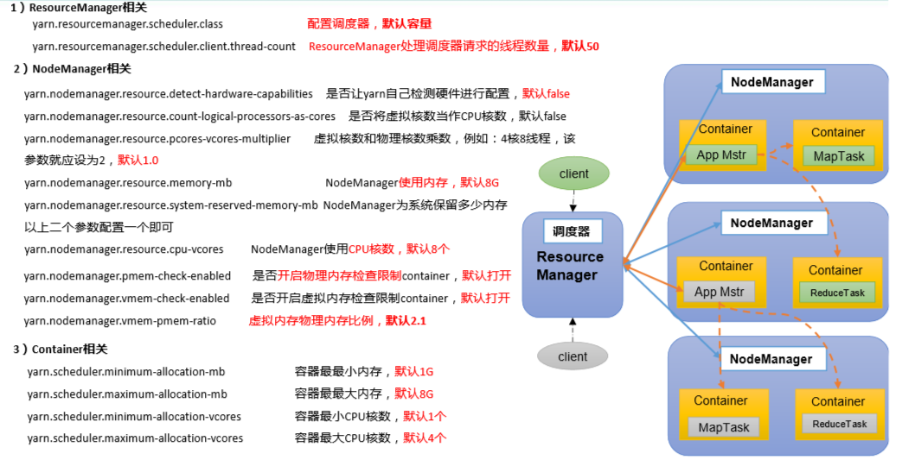   

## 二、Yarn案例实操
注：调整下列参数之前尽量拍摄Linux快照，否则后续的案例，还需要重写准备集群。  

### 2.1、Yarn生产环境核心参数配置案例
1）需求：从1G数据中，统计每个单词出现次数。服务器3台，每台配置4G内存，4核CPU，4线程。  
2）需求分析：  
1G / 128m = 8个MapTask；1个ReduceTask；1个mrAppMaster  
平均每个节点运行10个 / 3台 ≈ 3个任务（4	3	3）  
3）修改yarsite.xml配置参数如下：  
```XML
<!-- 选择调度器，默认容量 -->
<property>
	<description>The class to use as the resource scheduler.</description>
	<name>yarn.resourcemanager.scheduler.class</name>
	<value>org.apache.hadoop.yarn.server.resourcemanager.scheduler.capacity.CapacityScheduler</value>
</property>

<!-- ResourceManager处理调度器请求的线程数量,默认50；如果提交的任务数大于50，可以增加该值，但是不能超过3台 * 4线程 = 12线程（去除其他应用程序实际不能超过8） -->
<property>
	<description>Number of threads to handle scheduler interface.</description>
	<name>yarn.resourcemanager.scheduler.client.thread-count</name>
	<value>8</value>
</property>

<!-- 是否让yarn自动检测硬件进行配置，默认是false，如果该节点有很多其他应用程序，建议手动配置。如果该节点没有其他应用程序，可以采用自动 -->
<property>
	<description>Enable auto-detection of node capabilities such as
	memory and CPU.
	</description>
	<name>yarn.nodemanager.resource.detect-hardware-capabilities</name>
	<value>false</value>
</property>

<!-- 是否将虚拟核数当作CPU核数，默认是false，采用物理CPU核数 -->
<property>
	<description>Flag to determine if logical processors(such as
	hyperthreads) should be counted as cores. Only applicable on Linux
	when yarn.nodemanager.resource.cpu-vcores is set to -1 and
	yarn.nodemanager.resource.detect-hardware-capabilities is true.
	</description>
	<name>yarn.nodemanager.resource.count-logical-processors-as-cores</name>
	<value>false</value>
</property>

<!-- 虚拟核数和物理核数乘数，默认是1.0 -->
<property>
	<description>Multiplier to determine how to convert phyiscal cores to
	vcores. This value is used if yarn.nodemanager.resource.cpu-vcores
	is set to -1(which implies auto-calculate vcores) and
	yarn.nodemanager.resource.detect-hardware-capabilities is set to true. The	number of vcores will be calculated as	number of CPUs * multiplier.
	</description>
	<name>yarn.nodemanager.resource.pcores-vcores-multiplier</name>
	<value>1.0</value>
</property>

<!-- NodeManager使用内存数，默认8G，修改为4G内存 -->
<property>
	<description>Amount of physical memory, in MB, that can be allocated 
	for containers. If set to -1 and
	yarn.nodemanager.resource.detect-hardware-capabilities is true, it is
	automatically calculated(in case of Windows and Linux).
	In other cases, the default is 8192MB.
	</description>
	<name>yarn.nodemanager.resource.memory-mb</name>
	<value>4096</value>
</property>

<!-- nodemanager的CPU核数，不按照硬件环境自动设定时默认是8个，修改为4个 -->
<property>
	<description>Number of vcores that can be allocated
	for containers. This is used by the RM scheduler when allocating
	resources for containers. This is not used to limit the number of
	CPUs used by YARN containers. If it is set to -1 and
	yarn.nodemanager.resource.detect-hardware-capabilities is true, it is
	automatically determined from the hardware in case of Windows and Linux.
	In other cases, number of vcores is 8 by default.</description>
	<name>yarn.nodemanager.resource.cpu-vcores</name>
	<value>4</value>
</property>

<!-- 容器最小内存，默认1G -->
<property>
	<description>The minimum allocation for every container request at the RM	in MBs. Memory requests lower than this will be set to the value of this	property. Additionally, a node manager that is configured to have less memory	than this value will be shut down by the resource manager.
	</description>
	<name>yarn.scheduler.minimum-allocation-mb</name>
	<value>1024</value>
</property>

<!-- 容器最大内存，默认8G，修改为2G -->
<property>
	<description>The maximum allocation for every container request at the RM	in MBs. Memory requests higher than this will throw an	InvalidResourceRequestException.
	</description>
	<name>yarn.scheduler.maximum-allocation-mb</name>
	<value>2048</value>
</property>

<!-- 容器最小CPU核数，默认1个 -->
<property>
	<description>The minimum allocation for every container request at the RM	in terms of virtual CPU cores. Requests lower than this will be set to the	value of this property. Additionally, a node manager that is configured to	have fewer virtual cores than this value will be shut down by the resource	manager.
	</description>
	<name>yarn.scheduler.minimum-allocation-vcores</name>
	<value>1</value>
</property>

<!-- 容器最大CPU核数，默认4个，修改为2个 -->
<property>
	<description>The maximum allocation for every container request at the RM	in terms of virtual CPU cores. Requests higher than this will throw an
	InvalidResourceRequestException.</description>
	<name>yarn.scheduler.maximum-allocation-vcores</name>
	<value>2</value>
</property>

<!-- 虚拟内存检查，默认打开，修改为关闭 -->
<property>
	<description>Whether virtual memory limits will be enforced for
	containers.</description>
	<name>yarn.nodemanager.vmem-check-enabled</name>
	<value>false</value>
</property>

<!-- 虚拟内存和物理内存设置比例,默认2.1 -->
<property>
	<description>Ratio between virtual memory to physical memory when	setting memory limits for containers. Container allocations are	expressed in terms of physical memory, and virtual memory usage	is allowed to exceed this allocation by this ratio.
	</description>
	<name>yarn.nodemanager.vmem-pmem-ratio</name>
	<value>2.1</value>
</property>
```
关闭虚拟内存检查原因   
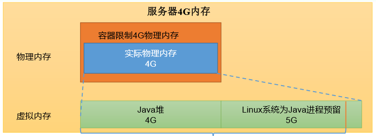  
```
<property>    
    <description>Ratio between virtual memory to physical memory when    setting memory limits for containers. Container allocations are    expressed in terms of physical memory, and virtual memory usage    is allowed to exceed this allocation by this ratio.    
    </description>
    <name>yarn.nodemanager.vmem-pmem-ratio</name>
    <value>2.1</value>
</property> 
```
4）分发配置。  
注意：如果集群的硬件资源不一致，要每个NodeManager单独配置  
5）重启集群  
```
[atguigu@hadoop102 hadoop-3.1.3]$ sbin/stop-yarn.sh
[atguigu@hadoop103 hadoop-3.1.3]$ sbin/start-yarn.sh
```
6）执行WordCount程序
```
[atguigu@hadoop102 hadoop-3.1.3]$ hadoop jar share/hadoop/mapreduce/hadoop-mapreduce-examples-3.1.3.jar wordcount /input /output
```
7）观察Yarn任务执行页面
```
http://hadoop103:8088/cluster/apps
```

### 2.2、容量调度器多队列提交案例
1）在生产环境怎么创建队列？  
（1）调度器默认就1个default队列，不能满足生产要求。  
（2）按照框架：hive /spark/ flink 每个框架的任务放入指定的队列（企业用的不是特别多）  
（3）按照业务模块：登录注册、购物车、下单、业务部门1、业务部门2  
2）创建多队列的好处？  
（1）因为担心员工不小心，写递归死循环代码，把所有资源全部耗尽。  
（2）实现任务的降级使用，特殊时期保证重要的任务队列资源充足。11.11  6.18  
业务部门1（重要）=》业务部门2（比较重要）=》下单（一般）=》购物车（一般）=》登录注册（次要）  

#### 2.2.1、需求
需求1：default队列占总内存的40%，最大资源容量占总资源60%，hive队列占总内存的60%，最大资源容量占总资源80%。  
需求2：配置队列优先级  

#### 2.2.2、配置多队列的容量调度器
1）在capacity-scheduler.xml中配置如下：  
（1）修改如下配置  
```
<!-- 指定多队列，增加hive队列 -->
<property>
    <name>yarn.scheduler.capacity.root.queues</name>
    <value>default,hive</value>
    <description>
      The queues at the this level (root is the root queue).
    </description>
</property>

<!-- 降低default队列资源额定容量为40%，默认100% -->
<property>
    <name>yarn.scheduler.capacity.root.default.capacity</name>
    <value>40</value>
</property>

<!-- 降低default队列资源最大容量为60%，默认100% -->
<property>
    <name>yarn.scheduler.capacity.root.default.maximum-capacity</name>
    <value>60</value>
</property>
```
（2）为新加队列添加必要属性：  
```
<!-- 指定hive队列的资源额定容量 -->
<property>
    <name>yarn.scheduler.capacity.root.hive.capacity</name>
    <value>60</value>
</property>

<!-- 用户最多可以使用队列多少资源，1表示 -->
<property>
    <name>yarn.scheduler.capacity.root.hive.user-limit-factor</name>
    <value>1</value>
</property>

<!-- 指定hive队列的资源最大容量 -->
<property>
    <name>yarn.scheduler.capacity.root.hive.maximum-capacity</name>
    <value>80</value>
</property>

<!-- 启动hive队列 -->
<property>
    <name>yarn.scheduler.capacity.root.hive.state</name>
    <value>RUNNING</value>
</property>

<!-- 哪些用户有权向队列提交作业 -->
<property>
    <name>yarn.scheduler.capacity.root.hive.acl_submit_applications</name>
    <value>*</value>
</property>

<!-- 哪些用户有权操作队列，管理员权限（查看/杀死） -->
<property>
    <name>yarn.scheduler.capacity.root.hive.acl_administer_queue</name>
    <value>*</value>
</property>

<!-- 哪些用户有权配置提交任务优先级 -->
<property>
    <name>yarn.scheduler.capacity.root.hive.acl_application_max_priority</name>
    <value>*</value>
</property>

<!-- 任务的超时时间设置：yarn application -appId appId -updateLifetime Timeout
参考资料：https://blog.cloudera.com/enforcing-application-lifetime-slas-yarn/ -->

<!-- 如果application指定了超时时间，则提交到该队列的application能够指定的最大超时时间不能超过该值。 
-->
<property>
    <name>yarn.scheduler.capacity.root.hive.maximum-application-lifetime</name>
    <value>-1</value>
</property>

<!-- 如果application没指定超时时间，则用default-application-lifetime作为默认值 -->
<property>
    <name>yarn.scheduler.capacity.root.hive.default-application-lifetime</name>
    <value>-1</value>
</property>
```
2）分发配置文件  
3）重启Yarn或者执行yarn rmadmin -refreshQueues刷新队列，就可以看到两条队列：  
```
[atguigu@hadoop102 hadoop-3.1.3]$ yarn rmadmin -refreshQueues
```
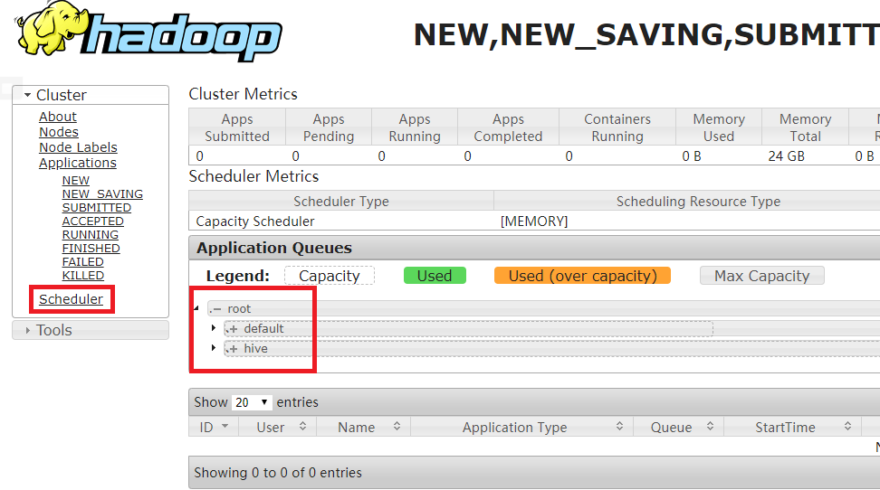   

#### 2.2.3、向Hive队列提交任务
1）hadoop jar的方式
```
[atguigu@hadoop102 hadoop-3.1.3]$ hadoop jar share/hadoop/mapreduce/hadoop-mapreduce-examples-3.1.3.jar wordcount -D mapreduce.job.queuename=hive /input /output
```
注: -D表示运行时改变参数值  

2）打jar包的方式  
默认的任务提交都是提交到default队列的。如果希望向其他队列提交任务，需要在Driver中声明：  
```
public class WcDrvier {

    public static void main(String[] args) throws IOException, ClassNotFoundException, InterruptedException {

        Configuration conf = new Configuration();

        conf.set("mapreduce.job.queuename","hive");

        //1. 获取一个Job实例
        Job job = Job.getInstance(conf);

        。。。 。。。

        //6. 提交Job
        boolean b = job.waitForCompletion(true);
        System.exit(b ? 0 : 1);
    }
}
```
这样，这个任务在集群提交时，就会提交到hive队列：  
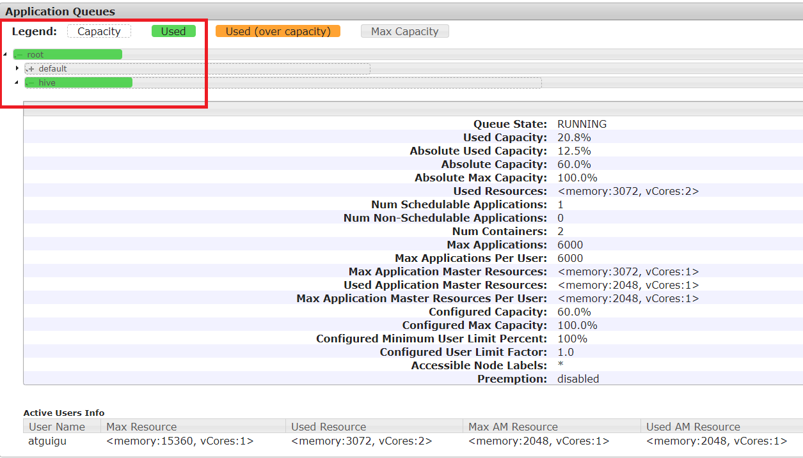  

#### 2.2.4、任务优先级
容量调度器，支持任务优先级的配置，在资源紧张时，优先级高的任务将优先获取资源。默认情况，Yarn将所有任务的优先级限制为0，若想使用任务的优先级功能，须开放该限制。   
1）修改yarn-site.xml文件，增加以下参数
```
<property>
    <name>yarn.cluster.max-application-priority</name>
    <value>5</value>
</property>
```
2）分发配置，并重启Yarn
```
[atguigu@hadoop102 hadoop]$ xsync yarn-site.xml
[atguigu@hadoop103 hadoop-3.1.3]$ sbin/stop-yarn.sh
[atguigu@hadoop103 hadoop-3.1.3]$ sbin/start-yarn.sh
```
3）模拟资源紧张环境，可连续提交以下任务，直到新提交的任务申请不到资源为止。
```
[atguigu@hadoop102 hadoop-3.1.3]$ hadoop jar /opt/module/hadoop-3.1.3/share/hadoop/mapreduce/hadoop-mapreduce-examples-3.1.3.jar pi 5 2000000
```
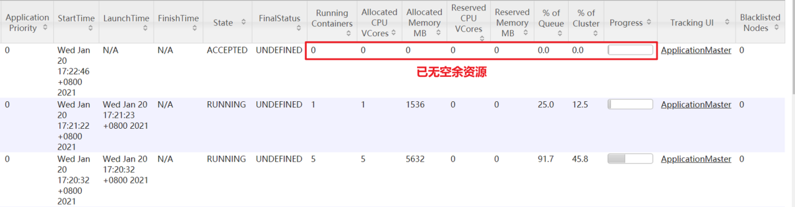   
4）再次重新提交优先级高的任务
```
[atguigu@hadoop102 hadoop-3.1.3]$ hadoop jar /opt/module/hadoop-3.1.3/share/hadoop/mapreduce/hadoop-mapreduce-examples-3.1.3.jar pi  -D mapreduce.job.priority=5 5 2000000
```
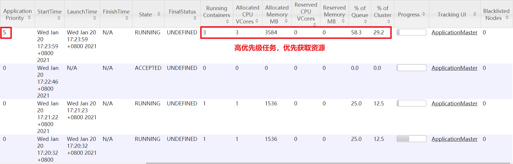   
5）也可以通过以下命令修改正在执行的任务的优先级。  
```
yarn application -appID <ApplicationID> -updatePriority 优先级
[atguigu@hadoop102 hadoop-3.1.3]$ yarn application -appID application_1611133087930_0009 -updatePriority 5
```

### 2.3、公平调度器案例
#### 2.3.1、需求
创建两个队列，分别是test和atguigu（以用户所属组命名）。期望实现以下效果：若用户提交任务时指定队列，则任务提交到指定队列运行；若未指定队列，test用户提交的任务到root.group.test队列运行，atguigu提交的任务到root.group.atguigu队列运行（注：group为用户所属组）。  
公平调度器的配置涉及到两个文件，一个是yarn-site.xml，另一个是公平调度器队列分配文件fair-scheduler.xml（文件名可自定义）。  
（1）配置文件参考资料：  
https://hadoop.apache.org/docs/r3.1.3/hadoop-yarn/hadoop-yarn-site/FairScheduler.html  
（2）任务队列放置规则参考资料：  
https://blog.cloudera.com/untangling-apache-hadoop-yarn-part-4-fair-scheduler-queue-basics/  

#### 2.3.2、配置多队列的公平调度器
1）修改yarn-site.xml文件，加入以下参数   
```
<property>
    <name>yarn.resourcemanager.scheduler.class</name>
    <value>org.apache.hadoop.yarn.server.resourcemanager.scheduler.fair.FairScheduler</value>
    <description>配置使用公平调度器</description>
</property>

<property>
    <name>yarn.scheduler.fair.allocation.file</name>
    <value>/opt/module/hadoop-3.1.3/etc/hadoop/fair-scheduler.xml</value>
    <description>指明公平调度器队列分配配置文件</description>
</property>

<property>
    <name>yarn.scheduler.fair.preemption</name>
    <value>false</value>
    <description>禁止队列间资源抢占</description>
</property>
```
2）配置fair-scheduler.xml  
```
<?xml version="1.0"?>
<allocations>
  <!-- 单个队列中Application Master占用资源的最大比例,取值0-1 ，企业一般配置0.1 -->
  <queueMaxAMShareDefault>0.5</queueMaxAMShareDefault>
  <!-- 单个队列最大资源的默认值 test atguigu default -->
  <queueMaxResourcesDefault>4096mb,4vcores</queueMaxResourcesDefault>

  <!-- 增加一个队列test -->
  <queue name="test">
    <!-- 队列最小资源 -->
    <minResources>2048mb,2vcores</minResources>
    <!-- 队列最大资源 -->
    <maxResources>4096mb,4vcores</maxResources>
    <!-- 队列中最多同时运行的应用数，默认50，根据线程数配置 -->
    <maxRunningApps>4</maxRunningApps>
    <!-- 队列中Application Master占用资源的最大比例 -->
    <maxAMShare>0.5</maxAMShare>
    <!-- 该队列资源权重,默认值为1.0 -->
    <weight>1.0</weight>
    <!-- 队列内部的资源分配策略 -->
    <schedulingPolicy>fair</schedulingPolicy>
  </queue>
  <!-- 增加一个队列atguigu -->
  <queue name="atguigu" type="parent">
    <!-- 队列最小资源 -->
    <minResources>2048mb,2vcores</minResources>
    <!-- 队列最大资源 -->
    <maxResources>4096mb,4vcores</maxResources>
    <!-- 队列中最多同时运行的应用数，默认50，根据线程数配置 -->
    <maxRunningApps>4</maxRunningApps>
    <!-- 队列中Application Master占用资源的最大比例 -->
    <maxAMShare>0.5</maxAMShare>
    <!-- 该队列资源权重,默认值为1.0 -->
    <weight>1.0</weight>
    <!-- 队列内部的资源分配策略 -->
    <schedulingPolicy>fair</schedulingPolicy>
  </queue>

  <!-- 任务队列分配策略,可配置多层规则,从第一个规则开始匹配,直到匹配成功 -->
  <queuePlacementPolicy>
    <!-- 提交任务时指定队列,如未指定提交队列,则继续匹配下一个规则; false表示：如果指定队列不存在,不允许自动创建-->
    <rule name="specified" create="false"/>
    <!-- 提交到root.group.username队列,若root.group不存在,不允许自动创建；若root.group.user不存在,允许自动创建 -->
    <rule name="nestedUserQueue" create="true">
        <rule name="primaryGroup" create="false"/>
    </rule>
    <!-- 最后一个规则必须为reject或者default。Reject表示拒绝创建提交失败，default表示把任务提交到default队列 -->
    <rule name="reject" />
  </queuePlacementPolicy>
</allocations>
```
3）分发配置并重启Yarn  
```
[atguigu@hadoop102 hadoop]$ xsync yarn-site.xml
[atguigu@hadoop102 hadoop]$ xsync fair-scheduler.xml

[atguigu@hadoop103 hadoop-3.1.3]$ sbin/stop-yarn.sh
[atguigu@hadoop103 hadoop-3.1.3]$ sbin/start-yarn.sh
```

#### 2.3.3、测试提交任务
1）提交任务时指定队列，按照配置规则，任务会到指定的root.test队列 
```
[atguigu@hadoop102 hadoop-3.1.3]$ hadoop jar /opt/module/hadoop-3.1.3/share/hadoop/mapreduce/hadoop-mapreduce-examples-3.1.3.jar pi -Dmapreduce.job.queuename=root.test 1 1
```
  
2）提交任务时不指定队列，按照配置规则，任务会到root.atguigu.atguigu队列  
```
[atguigu@hadoop102 hadoop-3.1.3]$ hadoop jar /opt/module/hadoop-3.1.3/share/hadoop/mapreduce/hadoop-mapreduce-examples-3.1.3.jar pi 1 1
```
   

### 2.4、Yarn 的 Tool 接口案例 
0）回顾：
```
[atguigu@hadoop102 hadoop-3.1.3]$ hadoop jar wc.jar com.atguigu.mapreduce.wordcount2.WordCountDriver /input /output1
```
期望可以动态传参，结果报错，误认为是第一个输入参数。
```
[atguigu@hadoop102 hadoop-3.1.3]$ hadoop jar wc.jar com.atguigu.mapreduce.wordcount2.WordCountDriver -Dmapreduce.job.queuename=root.test /input /output1
```
1）需求：自己写的程序也可以动态修改参数。编写Yarn的Tool接口。  
2）具体步骤：  
详见代码。  

3）在HDFS上准备输入文件，假设为/input目录，向集群提交该Jar包  
```
[atguigu@hadoop102 hadoop-3.1.3]$ yarn jar YarnDemo.jar com.atguigu.yarn.WordCountDriver wordcount /input /output
```
注意此时提交的3个参数，第一个用于生成特定的Tool，第二个和第三个为输入输出目录。此时如果我们希望加入设置参数，可以在wordcount后面添加参数，例如：  
```
[atguigu@hadoop102 hadoop-3.1.3]$ yarn jar YarnDemo.jar com.atguigu.yarn.WordCountDriver wordcount -Dmapreduce.job.queuename=root.test /input /output1
```
4）注：以上操作全部做完过后，快照回去或者手动将配置文件修改成之前的状态，因为本身资源就不够，分成了这么多，不方便以后测试。  

