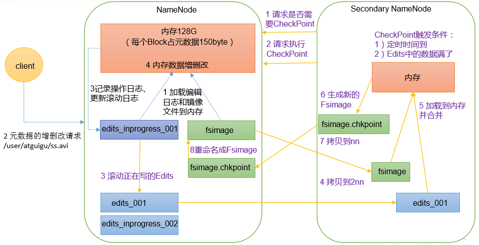

# 07-Hadoop 源码解析

## 零、RPC 通信原理解析 
HDFS、YARN、MapReduce三者关系     
  

1）需求：  
模拟RPC的客户端、服务端、通信协议三者如何工作的  
  

2）代码编写：  
（1）在HDFSClient项目基础上创建包名com.atguigu.rpc  
（2）创建RPC协议  
```java
package com.atguigu.rpc;

public interface RPCProtocol {

    long versionID = 666;

    void mkdirs(String path);
}
```
（3）创建RPC服务端   
```
package com.atguigu.rpc;

import org.apache.hadoop.conf.Configuration;
import org.apache.hadoop.ipc.RPC;
import org.apache.hadoop.ipc.Server;

import java.io.IOException;

public class NNServer implements RPCProtocol{

    @Override
    public void mkdirs(String path) {
        System.out.println("服务端，创建路径" + path);
    }

    public static void main(String[] args) throws IOException {

        Server server = new RPC.Builder(new Configuration())
                .setBindAddress("localhost")
                .setPort(8888)
                .setProtocol(RPCProtocol.class)
                .setInstance(new NNServer())
                .build();

        System.out.println("服务器开始工作");

        server.start();
    }
}
```
（4）创建RPC客户端
```
package com.atguigu.rpc;

import org.apache.hadoop.conf.Configuration;
import org.apache.hadoop.ipc.RPC;

import java.io.IOException;
import java.net.InetSocketAddress;

public class HDFSClient {

    public static void main(String[] args) throws IOException {
        RPCProtocol client = RPC.getProxy(
                RPCProtocol.class,
                RPCProtocol.versionID,
                new InetSocketAddress("localhost", 8888),
                new Configuration());

        System.out.println("我是客户端");

        client.mkdirs("/input");
    }
}
```
3）测试  
（1）启动服务端  
观察控制台打印：服务器开始工作  
在控制台Terminal窗口输入，jps，查看到NNServer服务  
（2）启动客户端	  
观察客户端控制台打印：我是客户端  
观察服务端控制台打印：服务端，创建路径/input  

4）总结  
RPC的客户端调用通信协议方法，方法的执行在服务端；  
通信协议就是接口规范。  

## 一、NameNode启动源码解析
NameNode工作机制   
  

NameNode启动源码解析  
  

0）在pom.xml中增加如下依赖  
```
<dependencies>
	<dependency>
		<groupId>org.apache.hadoop</groupId>
		<artifactId>hadoop-client</artifactId>
		<version>3.1.3</version>
	</dependency>

	<dependency>
		<groupId>org.apache.hadoop</groupId>
		<artifactId>hadoop-hdfs</artifactId>
		<version>3.1.3</version>
	</dependency>

	<dependency>
		<groupId>org.apache.hadoop</groupId>
		<artifactId>hadoop-hdfs-client</artifactId>
		<version>3.1.3</version>
		<scope>provided</scope>
	</dependency>
</dependencies>
```
1）ctrl + n 全局查找namenode，进入NameNode.java  
NameNode官方说明  
> NameNode serves as both directory namespace manager and "inode table" for the Hadoop DFS. There is a single NameNode running in any DFS deployment. (Well, except when there is a second backup/failover NameNode, or when using federated NameNodes.) The NameNode controls two critical tables: 1) filename->blocksequence (namespace) 2) block->machinelist ("inodes") The first table is stored on disk and is very precious. The second table is rebuilt every time the NameNode comes up. 'NameNode' refers to both this class as well as the 'NameNode server'. The 'FSNamesystem' class actually performs most of the filesystem management. The majority of the 'NameNode' class itself is concerned with exposing the IPC interface and the HTTP server to the outside world, plus some configuration management. NameNode implements the ClientProtocol interface, which allows clients to ask for DFS services. ClientProtocol is not designed for direct use by authors of DFS client code. End-users should instead use the FileSystem class. NameNode also implements the DatanodeProtocol interface, used by DataNodes that actually store DFS data blocks. These methods are invoked repeatedly and automatically by all the DataNodes in a DFS deployment. NameNode also implements the NamenodeProtocol interface, used by secondary namenodes or rebalancing processes to get partial NameNode state, for example partial blocksMap etc.

2）ctrl + f，查找main方法  
NameNode.java   
```
public static void main(String argv[]) throws Exception {
	if (DFSUtil.parseHelpArgument(argv, NameNode.USAGE, System.out, true)) {
		System.exit(0);
	}

	try {
		StringUtils.startupShutdownMessage(NameNode.class, argv, LOG);
		// 创建NameNode
		NameNode namenode = createNameNode(argv, null);
		if (namenode != null) {
			namenode.join();
		}
	} catch (Throwable e) {
		LOG.error("Failed to start namenode.", e);
		terminate(1, e);
	}
}
```
点击createNameNode  
```
public static NameNode createNameNode(String argv[], Configuration conf)
    throws IOException {
  … …
  StartupOption startOpt = parseArguments(argv);
  if (startOpt == null) {
    printUsage(System.err);
    return null;
  }
  setStartupOption(conf, startOpt);

  boolean aborted = false;
  switch (startOpt) {
  case FORMAT:
    aborted = format(conf, startOpt.getForceFormat(),
        startOpt.getInteractiveFormat());
    terminate(aborted ? 1 : 0);
    return null; // avoid javac warning
  case GENCLUSTERID:
    … …
  default:
    DefaultMetricsSystem.initialize("NameNode");
	// 创建NameNode对象
    return new NameNode(conf);
  }
}
```
点击NameNode   
```
public NameNode(Configuration conf) throws IOException {
  this(conf, NamenodeRole.NAMENODE);
}

protected NameNode(Configuration conf, NamenodeRole role)
    throws IOException {
  ... ...

  try {
    initializeGenericKeys(conf, nsId, namenodeId);
    initialize(getConf());
    ... ...
  } catch (IOException e) {
    this.stopAtException(e);
    throw e;
  } catch (HadoopIllegalArgumentException e) {
    this.stopAtException(e);
    throw e;
  }
  this.started.set(true);
}
```
点击initialize  
```
protected void initialize(Configuration conf) throws IOException {
  ... ...

  if (NamenodeRole.NAMENODE == role) {
	// 启动HTTP服务端（9870）
    startHttpServer(conf);
  }

  // 加载镜像文件和编辑日志到内存
  loadNamesystem(conf);
  startAliasMapServerIfNecessary(conf);

  // 创建NN的RPC服务端
  rpcServer = createRpcServer(conf);

  initReconfigurableBackoffKey();

  if (clientNamenodeAddress == null) {
    // This is expected for MiniDFSCluster. Set it now using 
    // the RPC server's bind address.
    clientNamenodeAddress = 
        NetUtils.getHostPortString(getNameNodeAddress());
    LOG.info("Clients are to use " + clientNamenodeAddress + " to access"
        + " this namenode/service.");
  }
  if (NamenodeRole.NAMENODE == role) {
    httpServer.setNameNodeAddress(getNameNodeAddress());
    httpServer.setFSImage(getFSImage());
  }

  // NN启动资源检查
  startCommonServices(conf);
  startMetricsLogger(conf);
}
```

### 1.1、启动9870端口服务
1）点击startHttpServer  
NameNode.java  
```
private void startHttpServer(final Configuration conf) throws IOException {
	httpServer = new NameNodeHttpServer(conf, this, getHttpServerBindAddress(conf));
	httpServer.start();
	httpServer.setStartupProgress(startupProgress);
}

protected InetSocketAddress getHttpServerBindAddress(Configuration conf) {
  InetSocketAddress bindAddress = getHttpServerAddress(conf);

  ... ...
  return bindAddress;
}

protected InetSocketAddress getHttpServerAddress(Configuration conf) {
  return getHttpAddress(conf);
}

public static InetSocketAddress getHttpAddress(Configuration conf) {
	return  NetUtils.createSocketAddr(
      conf.getTrimmed(DFS_NAMENODE_HTTP_ADDRESS_KEY, DFS_NAMENODE_HTTP_ADDRESS_DEFAULT));
}

public static final String  DFS_NAMENODE_HTTP_ADDRESS_DEFAULT = "0.0.0.0:" + DFS_NAMENODE_HTTP_PORT_DEFAULT;

public static final int     DFS_NAMENODE_HTTP_PORT_DEFAULT =
HdfsClientConfigKeys.DFS_NAMENODE_HTTP_PORT_DEFAULT;

int  DFS_NAMENODE_HTTP_PORT_DEFAULT = 9870;
```
2）点击startHttpServer方法中的httpServer.start();  
NameNodeHttpServer.java  
```
void start() throws IOException {
  ... ...
  // Hadoop自己封装了HttpServer，形成自己的HttpServer2
  HttpServer2.Builder builder = DFSUtil.httpServerTemplateForNNAndJN(conf,
      httpAddr, httpsAddr, "hdfs",
      DFSConfigKeys.DFS_NAMENODE_KERBEROS_INTERNAL_SPNEGO_PRINCIPAL_KEY,
      DFSConfigKeys.DFS_NAMENODE_KEYTAB_FILE_KEY);
  ... ...

  httpServer = builder.build();

  ... ...

  httpServer.setAttribute(NAMENODE_ATTRIBUTE_KEY, nn);
  httpServer.setAttribute(JspHelper.CURRENT_CONF, conf);
  setupServlets(httpServer, conf);
  httpServer.start();

  ... ...
}
```
点击setupServlets  
```
private static void setupServlets(HttpServer2 httpServer, Configuration conf) {
	httpServer.addInternalServlet("startupProgress",
		StartupProgressServlet.PATH_SPEC, StartupProgressServlet.class);
	httpServer.addInternalServlet("fsck", "/fsck", FsckServlet.class,
		true);
	httpServer.addInternalServlet("imagetransfer", ImageServlet.PATH_SPEC,
      ImageServlet.class, true);
}
```

### 1.2 加载镜像文件和编辑日志
1）点击loadNamesystem  
NameNode.java  
```
protected void loadNamesystem(Configuration conf) throws IOException {
	this.namesystem = FSNamesystem.loadFromDisk(conf);
}

static FSNamesystem loadFromDisk(Configuration conf) throws IOException {

  checkConfiguration(conf);

  FSImage fsImage = new FSImage(conf,
      FSNamesystem.getNamespaceDirs(conf),
      FSNamesystem.getNamespaceEditsDirs(conf));

  FSNamesystem namesystem = new FSNamesystem(conf, fsImage, false);
  StartupOption startOpt = NameNode.getStartupOption(conf);
  if (startOpt == StartupOption.RECOVER) {
    namesystem.setSafeMode(SafeModeAction.SAFEMODE_ENTER);
  }

  long loadStart = monotonicNow();
  try {
    namesystem.loadFSImage(startOpt);
  } catch (IOException ioe) {
    LOG.warn("Encountered exception loading fsimage", ioe);
    fsImage.close();
    throw ioe;
  }
  long timeTakenToLoadFSImage = monotonicNow() - loadStart;
  LOG.info("Finished loading FSImage in " + timeTakenToLoadFSImage + " msecs");
  NameNodeMetrics nnMetrics = NameNode.getNameNodeMetrics();
  if (nnMetrics != null) {
    nnMetrics.setFsImageLoadTime((int) timeTakenToLoadFSImage);
  }
  namesystem.getFSDirectory().createReservedStatuses(namesystem.getCTime());
  return namesystem;
}
```

### 1.3 初始化NN的RPC服务端  
1）点击createRpcServer  
NameNode.java  
```
protected NameNodeRpcServer createRpcServer(Configuration conf)
    throws IOException {
  return new NameNodeRpcServer(conf, this);
}
```
NameNodeRpcServer.java  
```
public NameNodeRpcServer(Configuration conf, NameNode nn)
      throws IOException {
	... ....	
    serviceRpcServer = new RPC.Builder(conf)
        .setProtocol(
            org.apache.hadoop.hdfs.protocolPB.ClientNamenodeProtocolPB.class)
        .setInstance(clientNNPbService)
        .setBindAddress(bindHost)
        .setPort(serviceRpcAddr.getPort())
        .setNumHandlers(serviceHandlerCount)
        .setVerbose(false)
        .setSecretManager(namesystem.getDelegationTokenSecretManager())
        .build();
	... ....	
}
```

### 1.4 NN启动资源检查
1）点击startCommonServices  
NameNode.java  
```
private void startCommonServices(Configuration conf) throws IOException {

  namesystem.startCommonServices(conf, haContext);

  registerNNSMXBean();
  if (NamenodeRole.NAMENODE != role) {
    startHttpServer(conf);
    httpServer.setNameNodeAddress(getNameNodeAddress());
    httpServer.setFSImage(getFSImage());
  }
  rpcServer.start();
  try {
    plugins = conf.getInstances(DFS_NAMENODE_PLUGINS_KEY,
        ServicePlugin.class);
  } catch (RuntimeException e) {
    String pluginsValue = conf.get(DFS_NAMENODE_PLUGINS_KEY);
    LOG.error("Unable to load NameNode plugins. Specified list of plugins: " +
        pluginsValue, e);
    throw e;
  }
  … …
}
```
2）点击startCommonServices  
FSNamesystem.java  
```
void startCommonServices(Configuration conf, HAContext haContext) throws IOException {
  this.registerMBean(); // register the MBean for the FSNamesystemState
  writeLock();
  this.haContext = haContext;
  try {
    nnResourceChecker = new NameNodeResourceChecker(conf);
    // 检查是否有足够的磁盘存储元数据（fsimage（默认100m） editLog（默认100m））
    checkAvailableResources();

    assert !blockManager.isPopulatingReplQueues();
    StartupProgress prog = NameNode.getStartupProgress();
    prog.beginPhase(Phase.SAFEMODE);
long completeBlocksTotal = getCompleteBlocksTotal();

    // 安全模式
    prog.setTotal(Phase.SAFEMODE, STEP_AWAITING_REPORTED_BLOCKS,
        completeBlocksTotal);

    // 启动块服务
    blockManager.activate(conf, completeBlocksTotal);
  } finally {
    writeUnlock("startCommonServices");
  }
  
  registerMXBean();
  DefaultMetricsSystem.instance().register(this);
  if (inodeAttributeProvider != null) {
    inodeAttributeProvider.start();
    dir.setINodeAttributeProvider(inodeAttributeProvider);
  }
  snapshotManager.registerMXBean();
  InetSocketAddress serviceAddress = NameNode.getServiceAddress(conf, true);
  this.nameNodeHostName = (serviceAddress != null) ?
      serviceAddress.getHostName() : "";
}
```
点击NameNodeResourceChecker  
NameNodeResourceChecker.java  
```
public NameNodeResourceChecker(Configuration conf) throws IOException {
  this.conf = conf;
  volumes = new HashMap<String, CheckedVolume>();
  
  // dfs.namenode.resource.du.reserved默认值 1024 * 1024 * 100 =》100m
  duReserved = conf.getLong(DFSConfigKeys.DFS_NAMENODE_DU_RESERVED_KEY,
      DFSConfigKeys.DFS_NAMENODE_DU_RESERVED_DEFAULT);
  
  Collection<URI> extraCheckedVolumes = Util.stringCollectionAsURIs(conf
      .getTrimmedStringCollection(DFSConfigKeys.DFS_NAMENODE_CHECKED_VOLUMES_KEY));
  
  Collection<URI> localEditDirs = Collections2.filter(
      FSNamesystem.getNamespaceEditsDirs(conf),
      new Predicate<URI>() {
        @Override
        public boolean apply(URI input) {
          if (input.getScheme().equals(NNStorage.LOCAL_URI_SCHEME)) {
            return true;
          }
          return false;
        }
      });

  // 对所有路径进行资源检查
  for (URI editsDirToCheck : localEditDirs) {
    addDirToCheck(editsDirToCheck,
        FSNamesystem.getRequiredNamespaceEditsDirs(conf).contains(
            editsDirToCheck));
  }

  // All extra checked volumes are marked "required"
  for (URI extraDirToCheck : extraCheckedVolumes) {
    addDirToCheck(extraDirToCheck, true);
  }
  
  minimumRedundantVolumes = conf.getInt(
      DFSConfigKeys.DFS_NAMENODE_CHECKED_VOLUMES_MINIMUM_KEY,
      DFSConfigKeys.DFS_NAMENODE_CHECKED_VOLUMES_MINIMUM_DEFAULT);
}
```
点击checkAvailableResources  
FNNamesystem.java  
```
void checkAvailableResources() {
	long resourceCheckTime = monotonicNow();
	Preconditions.checkState(nnResourceChecker != null,
		"nnResourceChecker not initialized");

	// 判断资源是否足够，不够返回false
	hasResourcesAvailable = nnResourceChecker.hasAvailableDiskSpace();

	resourceCheckTime = monotonicNow() - resourceCheckTime;
	NameNode.getNameNodeMetrics().addResourceCheckTime(resourceCheckTime);
}
```
NameNodeResourceChecker.java
```
public boolean hasAvailableDiskSpace() {
	return NameNodeResourcePolicy.areResourcesAvailable(volumes.values(),
      minimumRedundantVolumes);
}
```
NameNodeResourcePolicy.java
```
static boolean areResourcesAvailable(
    Collection<? extends CheckableNameNodeResource> resources,
    int minimumRedundantResources) {

  // TODO: workaround:
  // - during startup, if there are no edits dirs on disk, then there is
  // a call to areResourcesAvailable() with no dirs at all, which was
  // previously causing the NN to enter safemode
  if (resources.isEmpty()) {
    return true;
  }
  
  int requiredResourceCount = 0;
  int redundantResourceCount = 0;
  int disabledRedundantResourceCount = 0;

  // 判断资源是否充足
  for (CheckableNameNodeResource resource : resources) {
    if (!resource.isRequired()) {
      redundantResourceCount++;
      if (!resource.isResourceAvailable()) {
        disabledRedundantResourceCount++;
      }
    } else {
      requiredResourceCount++;
      if (!resource.isResourceAvailable()) {
        // Short circuit - a required resource is not available. 不充足返回false
        return false;
      }
    }
  }
  
  if (redundantResourceCount == 0) {
    // If there are no redundant resources, return true if there are any
    // required resources available.
    return requiredResourceCount > 0;
  } else {
    return redundantResourceCount - disabledRedundantResourceCount >=
        minimumRedundantResources;
  }
}

interface CheckableNameNodeResource {
  
  public boolean isResourceAvailable();
  
  public boolean isRequired();
}
```
ctrl + h，查找实现类CheckedVolume  
NameNodeResourceChecker.java  
```
public boolean isResourceAvailable() {

  // 获取当前目录的空间大小
  long availableSpace = df.getAvailable();

  if (LOG.isDebugEnabled()) {
    LOG.debug("Space available on volume '" + volume + "' is "
        + availableSpace);
  }

  // 如果当前空间大小，小于100m，返回false
  if (availableSpace < duReserved) {
    LOG.warn("Space available on volume '" + volume + "' is "
        + availableSpace +
        ", which is below the configured reserved amount " + duReserved);
    return false;
  } else {
    return true;
  }
}
```

### 1.5、NN对心跳超时判断  
Ctrl + n 搜索namenode，ctrl + f搜索startCommonServices  
点击namesystem.startCommonServices(conf, haContext);  
点击blockManager.activate(conf, completeBlocksTotal);  
点击datanodeManager.activate(conf);  

DatanodeManager.java
```
void activate(final Configuration conf) {
  datanodeAdminManager.activate(conf);
  heartbeatManager.activate();
}
```
DatanodeManager.java
```
void activate() {
  // 启动的线程，搜索run方法
  heartbeatThread.start();
}

public void run() {
  while(namesystem.isRunning()) {
    restartHeartbeatStopWatch();
    try {
      final long now = Time.monotonicNow();
      if (lastHeartbeatCheck + heartbeatRecheckInterval < now) {
		// 心跳检查
        heartbeatCheck();
        lastHeartbeatCheck = now;
      }
      if (blockManager.shouldUpdateBlockKey(now - lastBlockKeyUpdate)) {
        synchronized(HeartbeatManager.this) {
          for(DatanodeDescriptor d : datanodes) {
            d.setNeedKeyUpdate(true);
          }
        }
        lastBlockKeyUpdate = now;
      }
    } catch (Exception e) {
      LOG.error("Exception while checking heartbeat", e);
    }
    try {
      Thread.sleep(5000);  // 5 seconds
    } catch (InterruptedException ignored) {
    }
    // avoid declaring nodes dead for another cycle if a GC pause lasts
    // longer than the node recheck interval
    if (shouldAbortHeartbeatCheck(-5000)) {
      LOG.warn("Skipping next heartbeat scan due to excessive pause");
      lastHeartbeatCheck = Time.monotonicNow();
    }
  }
}

void heartbeatCheck() {
  final DatanodeManager dm = blockManager.getDatanodeManager();

  boolean allAlive = false;
  while (!allAlive) {
    // locate the first dead node.
    DatanodeDescriptor dead = null;

    // locate the first failed storage that isn't on a dead node.
    DatanodeStorageInfo failedStorage = null;

    // check the number of stale nodes
    int numOfStaleNodes = 0;
    int numOfStaleStorages = 0;
    synchronized(this) {
      for (DatanodeDescriptor d : datanodes) {
        // check if an excessive GC pause has occurred
        if (shouldAbortHeartbeatCheck(0)) {
          return;
        }
		// 判断DN节点是否挂断
        if (dead == null && dm.isDatanodeDead(d)) {
          stats.incrExpiredHeartbeats();
          dead = d;
        }
        if (d.isStale(dm.getStaleInterval())) {
          numOfStaleNodes++;
        }
        DatanodeStorageInfo[] storageInfos = d.getStorageInfos();
        for(DatanodeStorageInfo storageInfo : storageInfos) {
          if (storageInfo.areBlockContentsStale()) {
            numOfStaleStorages++;
          }

          if (failedStorage == null &&
              storageInfo.areBlocksOnFailedStorage() &&
              d != dead) {
            failedStorage = storageInfo;
          }
        }
      }
      
      // Set the number of stale nodes in the DatanodeManager
      dm.setNumStaleNodes(numOfStaleNodes);
      dm.setNumStaleStorages(numOfStaleStorages);
    }
    ... ...
  }
}

boolean isDatanodeDead(DatanodeDescriptor node) {
  return (node.getLastUpdateMonotonic() <
          (monotonicNow() - heartbeatExpireInterval));
}

private long heartbeatExpireInterval;
// 10分钟 + 30秒
this.heartbeatExpireInterval = 2 * heartbeatRecheckInterval + 10 * 1000 * heartbeatIntervalSeconds;

private volatile int heartbeatRecheckInterval;
heartbeatRecheckInterval = conf.getInt(
        DFSConfigKeys.DFS_NAMENODE_HEARTBEAT_RECHECK_INTERVAL_KEY, 
        DFSConfigKeys.DFS_NAMENODE_HEARTBEAT_RECHECK_INTERVAL_DEFAULT); // 5 minutes

private volatile long heartbeatIntervalSeconds;
heartbeatIntervalSeconds = conf.getTimeDuration(
        DFSConfigKeys.DFS_HEARTBEAT_INTERVAL_KEY,
        DFSConfigKeys.DFS_HEARTBEAT_INTERVAL_DEFAULT, TimeUnit.SECONDS);
public static final long    DFS_HEARTBEAT_INTERVAL_DEFAULT = 3;
```

### 1.6、安全模式

## 二、DataNode启动源码解析
DataNode工作机制  
  

DataNode启动源码解析  
  

0）在pom.xml中增加如下依赖  
```
<dependencies>
	<dependency>
		<groupId>org.apache.hadoop</groupId>
		<artifactId>hadoop-client</artifactId>
		<version>3.1.3</version>
	</dependency>

	<dependency>
		<groupId>org.apache.hadoop</groupId>
		<artifactId>hadoop-hdfs</artifactId>
		<version>3.1.3</version>
	</dependency>

	<dependency>
		<groupId>org.apache.hadoop</groupId>
		<artifactId>hadoop-hdfs-client</artifactId>
		<version>3.1.3</version>
		<scope>provided</scope>
	</dependency>
</dependencies>
```
1）ctrl + n 全局查找datanode，进入DataNode.java  
DataNode官方说明  
> DataNode is a class (and program) that stores a set of blocks for a DFS deployment. A single deployment can have one or many DataNodes. Each DataNode communicates regularly with a single NameNode. It also communicates with client code and other DataNodes from time to time. DataNodes store a series of named blocks. The DataNode allows client code to read these blocks, or to write new block data. The DataNode may also, in response to instructions from its NameNode, delete blocks or copy blocks to/from other DataNodes. The DataNode maintains just one critical table: block-> stream of bytes (of BLOCK_SIZE or less) This info is stored on a local disk. The DataNode reports the table's contents to the NameNode upon startup and every so often afterwards. DataNodes spend their lives in an endless loop of asking the NameNode for something to do. A NameNode cannot connect to a DataNode directly; a NameNode simply returns values from functions invoked by a DataNode. DataNodes maintain an open server socket so that client code or other DataNodes can read/write data. The host/port for this server is reported to the NameNode, which then sends that information to clients or other DataNodes that might be interested.

2）ctrl + f，查找main方法  
DataNode.java  
```
public static void main(String args[]) {
  if (DFSUtil.parseHelpArgument(args, DataNode.USAGE, System.out, true)) {
    System.exit(0);
  }

  secureMain(args, null);
}

public static void secureMain(String args[], SecureResources resources) {
  int errorCode = 0;
  try {
    StringUtils.startupShutdownMessage(DataNode.class, args, LOG);

    DataNode datanode = createDataNode(args, null, resources);

    … …
  } catch (Throwable e) {
    LOG.error("Exception in secureMain", e);
    terminate(1, e);
  } finally {
    LOG.warn("Exiting Datanode");
    terminate(errorCode);
  }
}

public static DataNode createDataNode(String args[], Configuration conf,
    SecureResources resources) throws IOException {
  // 初始化DN
  DataNode dn = instantiateDataNode(args, conf, resources);

  if (dn != null) {
    // 启动DN进程
    dn.runDatanodeDaemon();
  }
  return dn;
}

public static DataNode instantiateDataNode(String args [], Configuration conf,
    SecureResources resources) throws IOException {
  ... ...
  
  return makeInstance(dataLocations, conf, resources);
}

static DataNode makeInstance(Collection<StorageLocation> dataDirs,
    Configuration conf, SecureResources resources) throws IOException {
  ... ...
  return new DataNode(conf, locations, storageLocationChecker, resources);
}

DataNode(final Configuration conf,
         final List<StorageLocation> dataDirs,
         final StorageLocationChecker storageLocationChecker,
         final SecureResources resources) throws IOException {
  super(conf);
  ... ...

  try {
    hostName = getHostName(conf);
    LOG.info("Configured hostname is {}", hostName);
	// 启动DN
    startDataNode(dataDirs, resources);
  } catch (IOException ie) {
    shutdown();
    throw ie;
  }
  ... ...
}

void startDataNode(List<StorageLocation> dataDirectories,
                   SecureResources resources
                   ) throws IOException {
  ... ...
  // 创建数据存储对象
  storage = new DataStorage();
  
  // global DN settings
  registerMXBean();
  // 初始化DataXceiver
  initDataXceiver();
  
  // 启动HttpServer
  startInfoServer();

  pauseMonitor = new JvmPauseMonitor();
  pauseMonitor.init(getConf());
  pauseMonitor.start();

  // BlockPoolTokenSecretManager is required to create ipc server.
  this.blockPoolTokenSecretManager = new BlockPoolTokenSecretManager();

  // Login is done by now. Set the DN user name.
  dnUserName = UserGroupInformation.getCurrentUser().getUserName();
  LOG.info("dnUserName = {}", dnUserName);
  LOG.info("supergroup = {}", supergroup);
  
  // 初始化RPC服务
  initIpcServer();

  metrics = DataNodeMetrics.create(getConf(), getDisplayName());
  peerMetrics = dnConf.peerStatsEnabled ?
      DataNodePeerMetrics.create(getDisplayName(), getConf()) : null;
  metrics.getJvmMetrics().setPauseMonitor(pauseMonitor);

  ecWorker = new ErasureCodingWorker(getConf(), this);
  blockRecoveryWorker = new BlockRecoveryWorker(this);
  
  // 创建BlockPoolManager
  blockPoolManager = new BlockPoolManager(this);
  // 心跳管理
  blockPoolManager.refreshNamenodes(getConf());

  // Create the ReadaheadPool from the DataNode context so we can
  // exit without having to explicitly shutdown its thread pool.
  readaheadPool = ReadaheadPool.getInstance();
  saslClient = new SaslDataTransferClient(dnConf.getConf(),
      dnConf.saslPropsResolver, dnConf.trustedChannelResolver);
  saslServer = new SaslDataTransferServer(dnConf, blockPoolTokenSecretManager);
  startMetricsLogger();

  if (dnConf.diskStatsEnabled) {
    diskMetrics = new DataNodeDiskMetrics(this,
        dnConf.outliersReportIntervalMs);
  }
}
```

### 2.1、初始化DataXceiverServer
点击initDataXceiver   
```
private void initDataXceiver() throws IOException {
// dataXceiverServer是一个服务，DN用来接收客户端和其他DN发送过来的数据服务
  this.dataXceiverServer = new Daemon(threadGroup, xserver);
  this.threadGroup.setDaemon(true); // auto destroy when empty

  ... ...
}
```

### 2.2、初始化HTTP服务
点击startInfoServer();  
DataNode.java  
```
private void startInfoServer()
  throws IOException {
  // SecureDataNodeStarter will bind the privileged port to the channel if
  // the DN is started by JSVC, pass it along.
  ServerSocketChannel httpServerChannel = secureResources != null ?
      secureResources.getHttpServerChannel() : null;

  httpServer = new DatanodeHttpServer(getConf(), this, httpServerChannel);
  httpServer.start();
  if (httpServer.getHttpAddress() != null) {
    infoPort = httpServer.getHttpAddress().getPort();
  }
  if (httpServer.getHttpsAddress() != null) {
    infoSecurePort = httpServer.getHttpsAddress().getPort();
  }
}
```
DatanodeHttpServer.java  
```
public DatanodeHttpServer(final Configuration conf,
    final DataNode datanode,
    final ServerSocketChannel externalHttpChannel)
  throws IOException {
  
  ... ...
  HttpServer2.Builder builder = new HttpServer2.Builder()
      .setName("datanode")
      .setConf(confForInfoServer)
      .setACL(new AccessControlList(conf.get(DFS_ADMIN, " ")))
      .hostName(getHostnameForSpnegoPrincipal(confForInfoServer))
      .addEndpoint(URI.create("http://localhost:" + proxyPort))
      .setFindPort(true);
  ... ...
}
```

### 2.3、初始化DN的RPC服务端
点击initIpcServer  
DataNode.java  
```
private void initIpcServer() throws IOException {
  InetSocketAddress ipcAddr = NetUtils.createSocketAddr(
      getConf().getTrimmed(DFS_DATANODE_IPC_ADDRESS_KEY));
  
  ... ...
  ipcServer = new RPC.Builder(getConf())
      .setProtocol(ClientDatanodeProtocolPB.class)
      .setInstance(service)
      .setBindAddress(ipcAddr.getHostName())
      .setPort(ipcAddr.getPort())
      .setNumHandlers(
          getConf().getInt(DFS_DATANODE_HANDLER_COUNT_KEY,
              DFS_DATANODE_HANDLER_COUNT_DEFAULT)).setVerbose(false)
      .setSecretManager(blockPoolTokenSecretManager).build();
  ... ...
}
```

### 2.4、DN向NN注册
点击refreshNamenodes  
BlockPoolManager.java  
```
void refreshNamenodes(Configuration conf)
    throws IOException {
  ... ...

  synchronized (refreshNamenodesLock) {
    doRefreshNamenodes(newAddressMap, newLifelineAddressMap);
  }
}

private void doRefreshNamenodes(
    Map<String, Map<String, InetSocketAddress>> addrMap,
    Map<String, Map<String, InetSocketAddress>> lifelineAddrMap)
    throws IOException {
  … ….
  
  synchronized (this) {
    … …

    // Step 3. Start new nameservices
    if (!toAdd.isEmpty()) {

      for (String nsToAdd : toAdd) {
        … …
        BPOfferService bpos = createBPOS(nsToAdd, addrs, lifelineAddrs);
        bpByNameserviceId.put(nsToAdd, bpos);
        offerServices.add(bpos);
      }
    }
    startAll();
  }

  … …
}

protected BPOfferService createBPOS(
    final String nameserviceId,
    List<InetSocketAddress> nnAddrs,
    List<InetSocketAddress> lifelineNnAddrs) {
  // 根据NameNode个数创建对应的服务
  return new BPOfferService(nameserviceId, nnAddrs, lifelineNnAddrs, dn);
}
```
点击startAll()
```
synchronized void startAll() throws IOException {
  try {
    UserGroupInformation.getLoginUser().doAs(
        new PrivilegedExceptionAction<Object>() {
          @Override
          public Object run() throws Exception {
            for (BPOfferService bpos : offerServices) {
			  // 启动服务
              bpos.start();
            }
            return null;
          }
        });
  } catch (InterruptedException ex) {
    ... ...
  }
}
```
点击start ()  
BPOfferService.java  
```
void start() {
  for (BPServiceActor actor : bpServices) {
    actor.start();
  }
}
```
点击start ()  
BPServiceActor.java  
```
void start() {
  ... ...
  bpThread = new Thread(this);
  bpThread.setDaemon(true); // needed for JUnit testing
// 表示开启一个线程，所有查找该线程的run方法
  bpThread.start();

  if (lifelineSender != null) {
    lifelineSender.start();
  }
}
```
ctrl + f 搜索run方法  
```
public void run() {
  LOG.info(this + " starting to offer service");

  try {
    while (true) {
      // init stuff
      try {
        // setup storage
		// 向NN 注册
        connectToNNAndHandshake();
        break;
      } catch (IOException ioe) {
        // Initial handshake, storage recovery or registration failed
        runningState = RunningState.INIT_FAILED;
        if (shouldRetryInit()) {
          // Retry until all namenode's of BPOS failed initialization
          LOG.error("Initialization failed for " + this + " "
              + ioe.getLocalizedMessage());
		  // 注册失败，5s后重试
          sleepAndLogInterrupts(5000, "initializing");
        } else {
          runningState = RunningState.FAILED;
          LOG.error("Initialization failed for " + this + ". Exiting. ", ioe);
          return;
        }
      }
    }
    … …
    while (shouldRun()) {
      try {
        // 发送心跳
        offerService();
      } catch (Exception ex) {
        ... ...
      }
    }
}

private void connectToNNAndHandshake() throws IOException {
  // get NN proxy 获取NN的RPC客户端对象
  bpNamenode = dn.connectToNN(nnAddr);

  // First phase of the handshake with NN - get the namespace
  // info.
  NamespaceInfo nsInfo = retrieveNamespaceInfo();

  // Verify that this matches the other NN in this HA pair.
  // This also initializes our block pool in the DN if we are
  // the first NN connection for this BP.
  bpos.verifyAndSetNamespaceInfo(this, nsInfo);

  /* set thread name again to include NamespaceInfo when it's available. */
  this.bpThread.setName(formatThreadName("heartbeating", nnAddr));

  // 注册
  register(nsInfo);
}

DatanodeProtocolClientSideTranslatorPB connectToNN(
    InetSocketAddress nnAddr) throws IOException {
  return new DatanodeProtocolClientSideTranslatorPB(nnAddr, getConf());
}
```
DatanodeProtocolClientSideTranslatorPB.java
```
public DatanodeProtocolClientSideTranslatorPB(InetSocketAddress nameNodeAddr,
    Configuration conf) throws IOException {
  RPC.setProtocolEngine(conf, DatanodeProtocolPB.class,
      ProtobufRpcEngine.class);
  UserGroupInformation ugi = UserGroupInformation.getCurrentUser();
  rpcProxy = createNamenode(nameNodeAddr, conf, ugi);
}

private static DatanodeProtocolPB createNamenode(
    InetSocketAddress nameNodeAddr, Configuration conf,
    UserGroupInformation ugi) throws IOException {
  return RPC.getProxy(DatanodeProtocolPB.class,
      RPC.getProtocolVersion(DatanodeProtocolPB.class), nameNodeAddr, ugi,
      conf, NetUtils.getSocketFactory(conf, DatanodeProtocolPB.class));
}
```
点击register  
BPServiceActor.java  
```
void register(NamespaceInfo nsInfo) throws IOException {
  // 创建注册信息
  DatanodeRegistration newBpRegistration = bpos.createRegistration();

  LOG.info(this + " beginning handshake with NN");

  while (shouldRun()) {
    try {
      // Use returned registration from namenode with updated fields
	  // 把注册信息发送给NN（DN调用接口方法，执行在NN）
      newBpRegistration = bpNamenode.registerDatanode(newBpRegistration);
      newBpRegistration.setNamespaceInfo(nsInfo);
      bpRegistration = newBpRegistration;
      break;
    } catch(EOFException e) {  // namenode might have just restarted
      LOG.info("Problem connecting to server: " + nnAddr + " :"
          + e.getLocalizedMessage());
      sleepAndLogInterrupts(1000, "connecting to server");
    } catch(SocketTimeoutException e) {  // namenode is busy
      LOG.info("Problem connecting to server: " + nnAddr);
      sleepAndLogInterrupts(1000, "connecting to server");
    }
  }
  … …
}
```
ctrl + n 搜索NameNodeRpcServer  
NameNodeRpcServer.java  
ctrl + f 在NameNodeRpcServer.java中搜索registerDatanode  
```
public DatanodeRegistration registerDatanode(DatanodeRegistration nodeReg)
    throws IOException {
  checkNNStartup();
  verifySoftwareVersion(nodeReg);
  // 注册DN
  namesystem.registerDatanode(nodeReg);

  return nodeReg;
}
```
FSNamesystem.java
```
void registerDatanode(DatanodeRegistration nodeReg) throws IOException {
  writeLock();
  try {
    blockManager.registerDatanode(nodeReg);
  } finally {
    writeUnlock("registerDatanode");
  }
}
```
BlockManager.java
```
public void registerDatanode(DatanodeRegistration nodeReg)
    throws IOException {
  assert namesystem.hasWriteLock();
  datanodeManager.registerDatanode(nodeReg);
  bmSafeMode.checkSafeMode();
}

public void registerDatanode(DatanodeRegistration nodeReg)
    throws DisallowedDatanodeException, UnresolvedTopologyException {
	... ...
	// register new datanode 注册DN
    addDatanode(nodeDescr);
    blockManager.getBlockReportLeaseManager().register(nodeDescr);
    // also treat the registration message as a heartbeat
    // no need to update its timestamp
    // because its is done when the descriptor is created
	// 将DN添加到心跳管理
    heartbeatManager.addDatanode(nodeDescr);
    heartbeatManager.updateDnStat(nodeDescr);
    incrementVersionCount(nodeReg.getSoftwareVersion());
    startAdminOperationIfNecessary(nodeDescr);
    success = true;
	... ...
}

void addDatanode(final DatanodeDescriptor node) {
  // To keep host2DatanodeMap consistent with datanodeMap,
  // remove  from host2DatanodeMap the datanodeDescriptor removed
  // from datanodeMap before adding node to host2DatanodeMap.
  synchronized(this) {
    host2DatanodeMap.remove(datanodeMap.put(node.getDatanodeUuid(), node));
  }

  networktopology.add(node); // may throw InvalidTopologyException
  host2DatanodeMap.add(node);
  checkIfClusterIsNowMultiRack(node);
  resolveUpgradeDomain(node);

  … …
}
```

### 2.5、向NN发送心跳
点击BPServiceActor.java中的run方法中的offerService方法  
BPServiceActor.java  
```
private void offerService() throws Exception {

	while (shouldRun()) {
        ... ...
        HeartbeatResponse resp = null;
        if (sendHeartbeat) {

          boolean requestBlockReportLease = (fullBlockReportLeaseId == 0) &&
                  scheduler.isBlockReportDue(startTime);
          if (!dn.areHeartbeatsDisabledForTests()) {
		    // 发送心跳信息
            resp = sendHeartBeat(requestBlockReportLease);
            assert resp != null;
            if (resp.getFullBlockReportLeaseId() != 0) {
              if (fullBlockReportLeaseId != 0) {
				... ...
              }
              fullBlockReportLeaseId = resp.getFullBlockReportLeaseId();
            }
            ... ...
          }
        }
		... ...
	}
}

HeartbeatResponse sendHeartBeat(boolean requestBlockReportLease)
    throws IOException {
	... ...
	// 通过NN的RPC客户端发送给NN
	HeartbeatResponse response = bpNamenode.sendHeartbeat(bpRegistration,
        reports,
        dn.getFSDataset().getCacheCapacity(),
        dn.getFSDataset().getCacheUsed(),
        dn.getXmitsInProgress(),
        dn.getXceiverCount(),
        numFailedVolumes,
        volumeFailureSummary,
        requestBlockReportLease,
        slowPeers,
        slowDisks);
	... ...
}
```
ctrl + n 搜索NameNodeRpcServer  
NameNodeRpcServer.java  
ctrl + f 在NameNodeRpcServer.java中搜索sendHeartbeat  
```
public HeartbeatResponse sendHeartbeat(DatanodeRegistration nodeReg,
    StorageReport[] report, long dnCacheCapacity, long dnCacheUsed,
    int xmitsInProgress, int xceiverCount,
    int failedVolumes, VolumeFailureSummary volumeFailureSummary,
    boolean requestFullBlockReportLease,
    @Nonnull SlowPeerReports slowPeers,
@Nonnull SlowDiskReports slowDisks) throws IOException {

  checkNNStartup();
  verifyRequest(nodeReg);

  // 处理DN发送的心跳
  return namesystem.handleHeartbeat(nodeReg, report,
      dnCacheCapacity, dnCacheUsed, xceiverCount, xmitsInProgress,
      failedVolumes, volumeFailureSummary, requestFullBlockReportLease,
      slowPeers, slowDisks);
}

HeartbeatResponse handleHeartbeat(DatanodeRegistration nodeReg,
    StorageReport[] reports, long cacheCapacity, long cacheUsed,
    int xceiverCount, int xmitsInProgress, int failedVolumes,
    VolumeFailureSummary volumeFailureSummary,
    boolean requestFullBlockReportLease,
    @Nonnull SlowPeerReports slowPeers,
    @Nonnull SlowDiskReports slowDisks) throws IOException {
  readLock();
  try {
    //get datanode commands
    final int maxTransfer = blockManager.getMaxReplicationStreams()
        - xmitsInProgress;
	// 处理DN发送过来的心跳
    DatanodeCommand[] cmds = blockManager.getDatanodeManager().handleHeartbeat(
        nodeReg, reports, getBlockPoolId(), cacheCapacity, cacheUsed,
        xceiverCount, maxTransfer, failedVolumes, volumeFailureSummary,
        slowPeers, slowDisks);

    long blockReportLeaseId = 0;
    if (requestFullBlockReportLease) {
      blockReportLeaseId =  blockManager.requestBlockReportLeaseId(nodeReg);
    }
    //create ha status
    final NNHAStatusHeartbeat haState = new NNHAStatusHeartbeat(
        haContext.getState().getServiceState(),
        getFSImage().getCorrectLastAppliedOrWrittenTxId());

	// 响应DN的心跳
    return new HeartbeatResponse(cmds, haState, rollingUpgradeInfo,
        blockReportLeaseId);
  } finally {
    readUnlock("handleHeartbeat");
  }
}
```
点击handleHeartbeat  
DatanodeManager.java  
```
public DatanodeCommand[] handleHeartbeat(DatanodeRegistration nodeReg,
    StorageReport[] reports, final String blockPoolId,
    long cacheCapacity, long cacheUsed, int xceiverCount, 
    int maxTransfers, int failedVolumes,
    VolumeFailureSummary volumeFailureSummary,
    @Nonnull SlowPeerReports slowPeers,
    @Nonnull SlowDiskReports slowDisks) throws IOException {
  ... ...
  heartbeatManager.updateHeartbeat(nodeinfo, reports, cacheCapacity,
      cacheUsed, xceiverCount, failedVolumes, volumeFailureSummary);
  ... ...  
}
```
HeartbeatManager.java  
```
synchronized void updateHeartbeat(final DatanodeDescriptor node,
    StorageReport[] reports, long cacheCapacity, long cacheUsed,
    int xceiverCount, int failedVolumes,
    VolumeFailureSummary volumeFailureSummary) {
  stats.subtract(node);
  blockManager.updateHeartbeat(node, reports, cacheCapacity, cacheUsed,
      xceiverCount, failedVolumes, volumeFailureSummary);
  stats.add(node);
}
```
BlockManager.java
```
void updateHeartbeat(DatanodeDescriptor node, StorageReport[] reports,
    long cacheCapacity, long cacheUsed, int xceiverCount, int failedVolumes,
    VolumeFailureSummary volumeFailureSummary) {

  for (StorageReport report: reports) {
    providedStorageMap.updateStorage(node, report.getStorage());
  }
  node.updateHeartbeat(reports, cacheCapacity, cacheUsed, xceiverCount,
      failedVolumes, volumeFailureSummary);
}
```
DatanodeDescriptor.java  
```
void updateHeartbeat(StorageReport[] reports, long cacheCapacity,
    long cacheUsed, int xceiverCount, int volFailures,
    VolumeFailureSummary volumeFailureSummary) {
  updateHeartbeatState(reports, cacheCapacity, cacheUsed, xceiverCount,
      volFailures, volumeFailureSummary);
  heartbeatedSinceRegistration = true;
}

void updateHeartbeatState(StorageReport[] reports, long cacheCapacity,
    long cacheUsed, int xceiverCount, int volFailures,
    VolumeFailureSummary volumeFailureSummary) {
  // 更新存储
  updateStorageStats(reports, cacheCapacity, cacheUsed, xceiverCount,
      volFailures, volumeFailureSummary);
  // 更新心跳时间
  setLastUpdate(Time.now());
  setLastUpdateMonotonic(Time.monotonicNow());
  rollBlocksScheduled(getLastUpdateMonotonic());
}

private void updateStorageStats(StorageReport[] reports, long cacheCapacity,
    long cacheUsed, int xceiverCount, int volFailures,
    VolumeFailureSummary volumeFailureSummary) {
  long totalCapacity = 0;
  long totalRemaining = 0;
  long totalBlockPoolUsed = 0;
  long totalDfsUsed = 0;
  long totalNonDfsUsed = 0;
  … …

  setCacheCapacity(cacheCapacity);
  setCacheUsed(cacheUsed);
  setXceiverCount(xceiverCount);
  this.volumeFailures = volFailures;
  this.volumeFailureSummary = volumeFailureSummary;
  for (StorageReport report : reports) {

    DatanodeStorageInfo storage =
        storageMap.get(report.getStorage().getStorageID());
    if (checkFailedStorages) {
      failedStorageInfos.remove(storage);
    }

    storage.receivedHeartbeat(report);
    // skip accounting for capacity of PROVIDED storages!
    if (StorageType.PROVIDED.equals(storage.getStorageType())) {
      continue;
    }

    totalCapacity += report.getCapacity();
    totalRemaining += report.getRemaining();
    totalBlockPoolUsed += report.getBlockPoolUsed();
    totalDfsUsed += report.getDfsUsed();
    totalNonDfsUsed += report.getNonDfsUsed();
  }

  // Update total metrics for the node.
  // 更新存储相关信息
  setCapacity(totalCapacity);
  setRemaining(totalRemaining);
  setBlockPoolUsed(totalBlockPoolUsed);
  setDfsUsed(totalDfsUsed);
  setNonDfsUsed(totalNonDfsUsed);
  if (checkFailedStorages) {
    updateFailedStorage(failedStorageInfos);
  }
  long storageMapSize;
  synchronized (storageMap) {
    storageMapSize = storageMap.size();
  }
  if (storageMapSize != reports.length) {
    pruneStorageMap(reports);
  }
}
```


