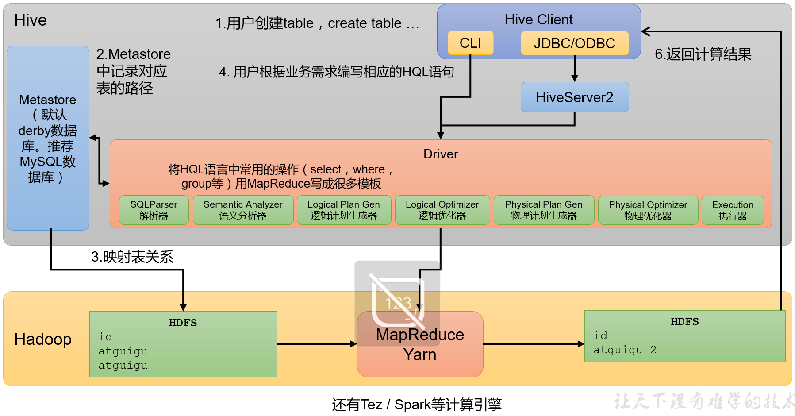
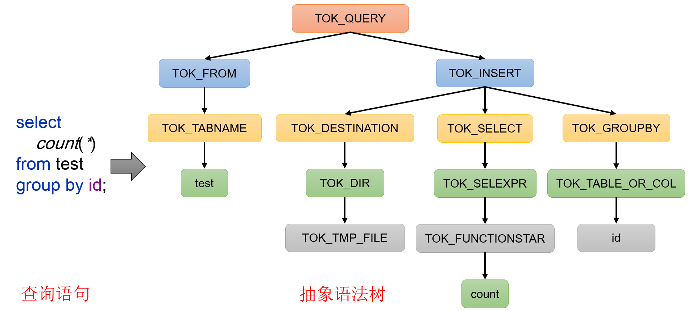
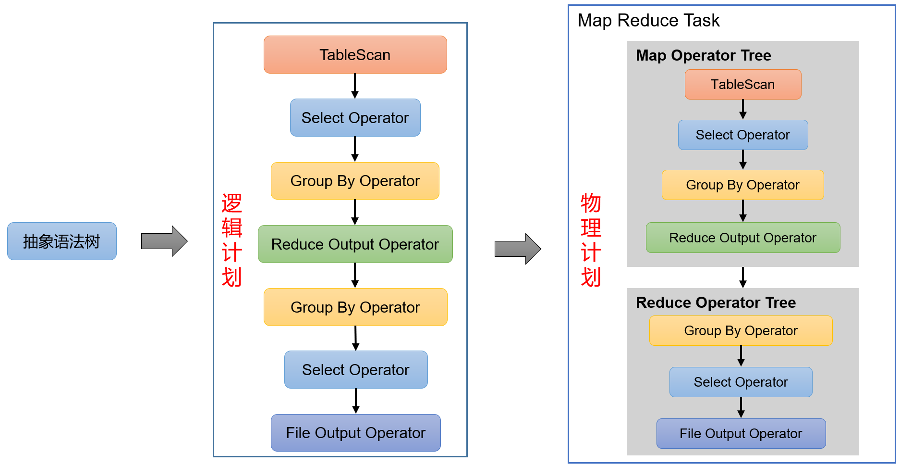

# 01-Hive入门

## 一、什么是Hive  
### 1）Hive简介
Hive是由Facebook开源，基于Hadoop的一个数据仓库工具，可以将结构化的数据文件映射为一张表，并提供类SQL查询功能。  
那为什么会有Hive呢？它是为了解决什么问题而诞生的呢？  
下面通过一个案例，来快速了解一下Hive。  
例如：需求，统计单词出现个数。  
（1）在Hadoop课程中我们用MapReduce程序实现的，当时需要写Mapper、Reducer和Driver三个类，并实现对应逻辑，相对繁琐。  
```
test表
id列

atguigu
atguigu
ss
ss
jiao
banzhang
xue
hadoop
```
（2）如果通过Hive SQL实现，一行就搞定了，简单方便，容易理解。
```
select count(*) from test group by id;
```

### 2）Hive本质
Hive是一个Hadoop客户端，用于将HQL（Hive SQL）转化成MapReduce程序。  
（1）Hive中每张表的数据存储在HDFS  
（2）Hive分析数据底层的实现是MapReduce（也可配置为Spark或者Tez）   
（3）执行程序运行在Yarn上  


## 二、Hive架构原理


### 1）用户接口：Client  
CLI（command-line interface）、JDBC/ODBC。  
说明：JDBC和ODBC的区别。  
（1）JDBC的移植性比ODBC好；（通常情况下，安装完ODBC驱动程序之后，还需要经过确定的配置才能够应用。而不相同的配置在不相同数据库服务器之间不能够通用。所以，安装一次就需要再配置一次。JDBC只需要选取适当的JDBC数据库驱动程序，就不需要额外的配置。在安装过程中，JDBC数据库驱动程序会自己完成有关的配置。）  
（2）两者使用的语言不同，JDBC在Java编程时使用，ODBC一般在C/C++编程时使用。  

### 2）元数据：Metastore  
元数据包括：数据库（默认是default）、表名、表的拥有者、列/分区字段、表的类型（是否是外部表）、表的数据所在目录等。  
默认存储在自带的derby数据库中，由于derby数据库只支持单客户端访问，生产环境中为了多人开发，推荐使用MySQL存储Metastore。  

### 3）驱动器：Driver
（1）解析器（SQLParser）：将SQL字符串转换成抽象语法树（AST）  
（2）语义分析（Semantic Analyzer）：将AST进一步划分为QeuryBlock  
（3）逻辑计划生成器（Logical Plan Gen）：将语法树生成逻辑计划  
（4）逻辑优化器（Logical Optimizer）：对逻辑计划进行优化  
（5）物理计划生成器（Physical Plan Gen）：根据优化后的逻辑计划生成物理计划  
（6）物理优化器（Physical Optimizer）：对物理计划进行优化  
（7）执行器（Execution）：执行该计划，得到查询结果并返回给客户端  

抽象语法树：  


逻辑计划与物理计划：


### 4）Hadoop
使用HDFS进行存储，可以选择MapReduce/Tez/Spark进行计算。

