# 02-Hive安装

## 一、Hive安装地址
1）Hive官网地址  
http://hive.apache.org/  
2）文档查看地址  
https://cwiki.apache.org/confluence/display/Hive/GettingStarted  
3）下载地址  
http://archive.apache.org/dist/hive/  
4）github地址  
https://github.com/apache/hive  

## 二、Hive安装部署
### 2.1、安装Hive
1）把apache-hive-3.1.3-bin.tar.gz上传到Linux的/opt/software目录下  
2）解压apache-hive-3.1.3-bin.tar.gz到/opt/module/目录下面  
```
[atguigu@hadoop102 software]$ tar -zxvf /opt/software/apache-hive-3.1.3-bin.tar.gz -C /opt/module/
```
3）修改apache-hive-3.1.3-bin.tar.gz的名称为hive  
```
[atguigu@hadoop102 software]$ mv /opt/module/apache-hive-3.1.3-bin/ /opt/module/hive  
```
4）修改/etc/profile.d/my_env.sh，添加环境变量  
```
[atguigu@hadoop102 software]$ sudo vim /etc/profile.d/my_env.sh  
```
（1）添加内容  
```
#HIVE_HOME  
export HIVE_HOME=/opt/module/hive  
export PATH=$PATH:$HIVE_HOME/bin  
```
（2）source一下  
```
[atguigu@hadoop102 hive]$ source /etc/profile.d/my_env.sh  
```
5）初始化元数据库（默认是derby数据库）  
```
[atguigu@hadoop102 hive]$ bin/schematool -dbType derby -initSchema  
```

### 2.2、启动并使用Hive
1）启动Hive
```
[atguigu@hadoop102 hive]$ bin/hive
```
2）使用Hive
```
hive> show databases;
hive> show tables;
hive> create table stu(id int, name string);
hive> insert into stu values(1,"ss");
hive> select * from stu;
```
观察HDFS的路径/user/hive/warehouse/stu，体会Hive与Hadoop之间的关系。  
Hive中的表在Hadoop中是目录；Hive中的数据在Hadoop中是文件。  

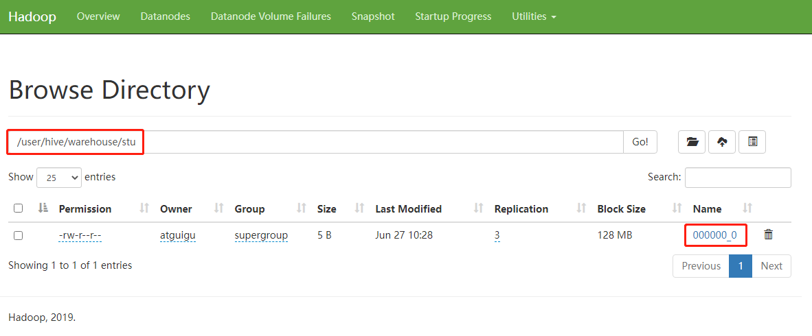   
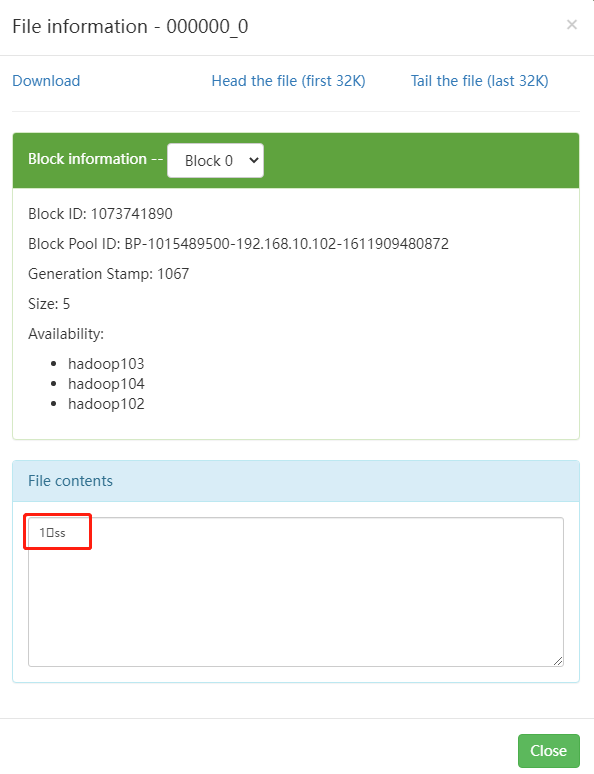   

3）在Xshell窗口中开启另一个窗口开启Hive，在/tmp/atguigu目录下监控hive.log文件  
```
[atguigu@hadoop102 atguigu]$ tail -f hive.log

Caused by: ERROR XSDB6: Another instance of Derby may have already booted the database /opt/module/hive/metastore_db.
        at org.apache.derby.iapi.error.StandardException.newException(Unknown Source)
        at org.apache.derby.iapi.error.StandardException.newException(Unknown Source)
        at org.apache.derby.impl.store.raw.data.BaseDataFileFactory.privGetJBMSLockOnDB(Unknown Source)
        at org.apache.derby.impl.store.raw.data.BaseDataFileFactory.run(Unknown Source)
...
```
原因在于Hive默认使用的元数据库为derby。derby数据库的特点是同一时间只允许一个客户端访问。如果多个Hive客户端同时访问，就会报错。由于在企业开发中，都是多人协作开发，需要多客户端同时访问Hive，怎么解决呢？我们可以将Hive的元数据改为用MySQL存储，MySQL支持多客户端同时访问。   
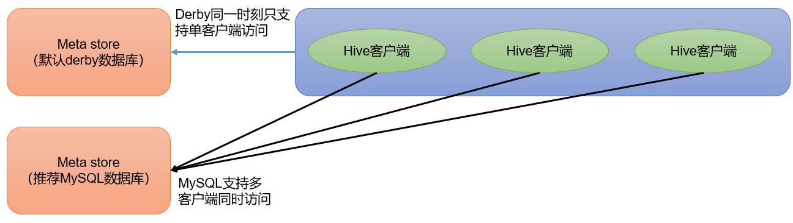   

4）首先退出hive客户端。然后在Hive的安装目录下将derby.log和metastore_db删除，顺便将HDFS上目录删除  
```
hive> quit;
[atguigu@hadoop102 hive]$ rm -rf derby.log metastore_db
[atguigu@hadoop102 hive]$ hadoop fs -rm -r /user
```

5）删除HDFS中/user/hive/warehouse/stu中数据
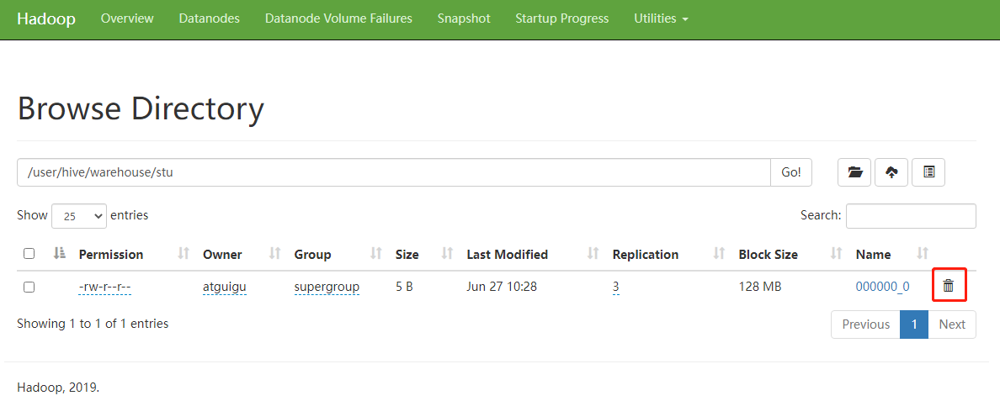   
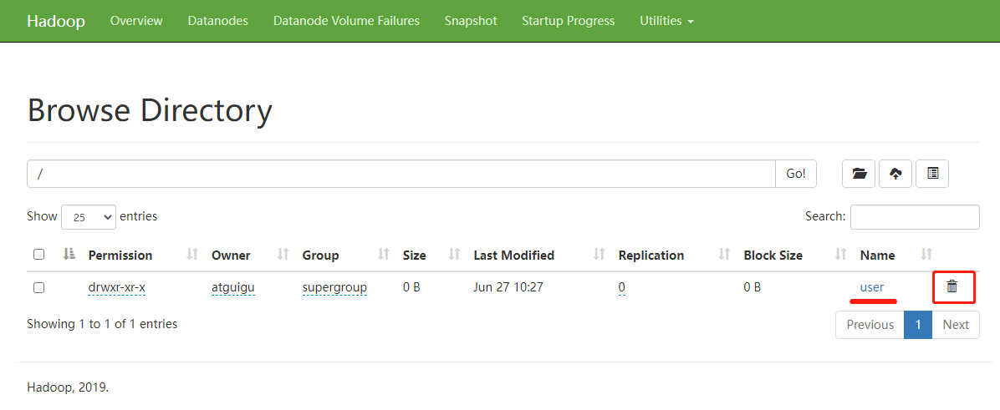   

## 三、MySQL安装
### 3.1、安装MySQL
1）上传MySQL安装包以及MySQL驱动jar包
```
mysql-5.7.28-1.el7.x86_64.rpm-bundle.tar
mysql-connector-java-5.1.37.jar
```
2）解压MySQL安装包
```
[atguigu@hadoop102 software]$ mkdir mysql_lib
[atguigu@hadoop102 software]$ tar -xf mysql-5.7.28-1.el7.x86_64.rpm-bundle.tar -C mysql_lib/
```
3）卸载系统自带的mariadb
```
[atguigu@hadoop102 ~]$ sudo rpm -qa | grep mariadb | xargs sudo rpm -e --nodeps
```
4）安装MySQL依赖
```
[atguigu@hadoop102 software]$ cd mysql_lib
[atguigu@hadoop102 mysql_lib]$ sudo rpm -ivh mysql-community-common-5.7.28-1.el7.x86_64.rpm
[atguigu@hadoop102 mysql_lib]$ sudo rpm -ivh mysql-community-libs-5.7.28-1.el7.x86_64.rpm
[atguigu@hadoop102 mysql_lib]$ sudo rpm -ivh mysql-community-libs-compat-5.7.28-1.el7.x86_64.rpm
```
5）安装mysql-client
```
[atguigu@hadoop102 mysql_lib]$ sudo rpm -ivh mysql-community-client-5.7.28-1.el7.x86_64.rpm
```
6）安装mysql-server
```
[atguigu@hadoop102 mysql_lib]$ sudo rpm -ivh mysql-community-server-5.7.28-1.el7.x86_64.rpm
```
注意：若出现以下错误
```
warning: 05_mysql-community-server-5.7.16-1.el7.x86_64.rpm: Header V3 DSA/SHA1 Signature, key ID 5072e1f5: NOKEY
error: Failed dependencies:
libaio.so.1()(64bit) is needed by mysql-community-server-5.7.16-1.el7.x86_64
```
解决办法：
```
[atguigu@hadoop102 software]$ sudo yum -y install libaio
```
7）启动MySQL
```
[atguigu@hadoop102 software]$ sudo systemctl start mysqld
```
8）查看MySQL密码
```
[atguigu@hadoop102 software]$ sudo cat /var/log/mysqld.log | grep password
[atguigu@hadoop102 software]$ sudo cat /var/log/mysqld.log | grep password
2023-01-30T07:58:57.234753Z 1 [Note] A temporary password is generated for root@localhost: HxG_JzbCt6FN
```

### 3.2、配置MySQL
配置主要是root用户 + 密码，在任何主机上都能登录MySQL数据库。  
1）用刚刚查到的密码进入MySQL（如果报错，给密码加单引号）  
```
[atguigu@hadoop102 software]$ mysql -uroot -pHxG_JzbCt6FN
```
2）设置复杂密码（由于MySQL密码策略，此密码必须足够复杂）  
```
mysql> set password=password("Qs23=zs32");
```
3）更改MySQL密码策略
```
mysql> set global validate_password_policy=0;
mysql> set global validate_password_length=4;
```
4）设置简单好记的密码
```
mysql> set password=password("123456");
```
5）进入MySQL库
```
mysql> use mysql
```
6）查询user表
```
mysql> select user, host from user;
```
7）修改user表，把Host表内容修改为%
```
mysql> update user set host="%" where user="root";
```
8）刷新
```
mysql> flush privileges;
```
9）退出
```
mysql> quit;
```

### 3.3、卸载MySQL说明
若因为安装失败或者其他原因，MySQL需要卸载重装，可参考以下内容。   
（1）清空原有数据  
1、通过/etc/my.cnf查看MySQL数据的存储位置  
```
[atguigu@hadoop102 software]$ sudo cat /etc/my.cnf
[mysqld]
datadir=/var/lib/mysql
```
2、去往/var/lib/mysql路径需要root权限  
```
[atguigu@hadoop102 mysql]$ su - root
[root@hadoop102 ~]# cd /var/lib/mysql
[root@hadoop102 mysql]# rm -rf *  （注意敲击命令的位置）
```

（2）卸载MySQL相关包
1、查看安装过的MySQL相关包
```
[atguigu@hadoop102 software]$ sudo rpm -qa | grep -i -E mysql

mysql-community-libs-5.7.16-1.el7.x86_64
mysql-community-client-5.7.16-1.el7.x86_64
mysql-community-common-5.7.16-1.el7.x86_64
mysql-community-libs-compat-5.7.16-1.el7.x86_64
mysql-community-server-5.7.16-1.el7.x86_64
```
2、一键卸载命令
```
[atguigu@hadoop102 software]$ rpm -qa | grep -i -E mysql\|mariadb | xargs -n1 sudo rpm -e --nodeps
```

## 四、配置Hive元数据存储到MySQL
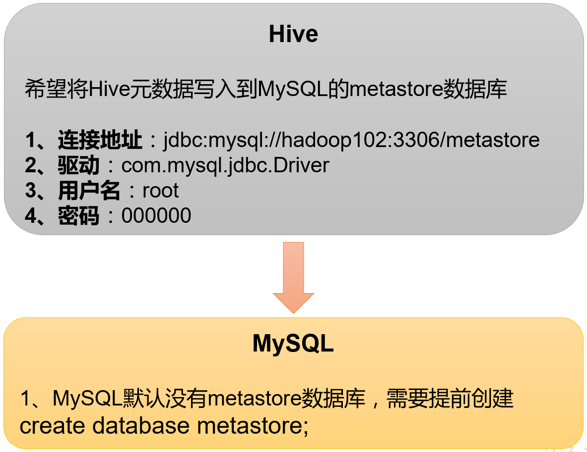   

### 4.1、配置元数据到MySQL
1）新建Hive元数据库
```
#登录MySQL
[atguigu@hadoop102 software]$ mysql -uroot -p123456

#创建Hive元数据库
mysql> create database metastore;
mysql> quit;
```
2）将MySQL的JDBC驱动拷贝到Hive的lib目录下。
```
[atguigu@hadoop102 software]$ cp /opt/software/mysql-connector-java-5.1.37.jar $HIVE_HOME/lib
```
3）在$HIVE_HOME/conf目录下新建hive-site.xml文件
```
[atguigu@hadoop102 software]$ vim $HIVE_HOME/conf/hive-site.xml
```
添加如下内容：
```
<?xml version="1.0"?>
<?xml-stylesheet type="text/xsl" href="configuration.xsl"?>

<configuration>
    <!-- jdbc连接的URL -->
    <property>
        <name>javax.jdo.option.ConnectionURL</name>
        <value>jdbc:mysql://hadoop102:3306/metastore?useSSL=false</value>
    </property>
    
    <!-- jdbc连接的Driver-->
    <property>
        <name>javax.jdo.option.ConnectionDriverName</name>
        <value>com.mysql.jdbc.Driver</value>
    </property>
    
	<!-- jdbc连接的username-->
    <property>
        <name>javax.jdo.option.ConnectionUserName</name>
        <value>root</value>
    </property>

    <!-- jdbc连接的password -->
    <property>
        <name>javax.jdo.option.ConnectionPassword</name>
        <value>123456</value>
    </property>

    <!-- Hive默认在HDFS的工作目录 -->
    <property>
        <name>hive.metastore.warehouse.dir</name>
        <value>/user/hive/warehouse</value>
    </property>
</configuration>
```
5）初始化Hive元数据库（修改为采用MySQL存储元数据）
```
[atguigu@hadoop102 hive]$ bin/schematool -dbType mysql -initSchema -verbose
```

### 4.2、验证元数据是否配置成功
1）再次启动Hive
```
[atguigu@hadoop102 hive]$ bin/hive
```
2）使用Hive
```
hive> show databases;
hive> show tables;
hive> create table stu(id int, name string);
hive> insert into stu values(1,"ss");
hive> select * from stu;
```
3）在Xshell窗口中开启另一个窗口开启Hive（两个窗口都可以操作Hive，没有出现异常）
```
hive> show databases;
hive> show tables;
hive> select * from stu;
```

### 4.3、查看MySQL中的元数据
1）登录MySQL
```
[atguigu@hadoop102 hive]$ mysql -uroot -p123456
```
2）查看元数据库metastore
```
mysql> show databases;
mysql> use metastore;
mysql> show tables;
```
（1）查看元数据库中存储的库信息
```
mysql> select * from DBS;
+-------+-----------------------+-------------------------------------------+---------+------------+------------+-----------+
| DB_ID | DESC                  | DB_LOCATION_URI                           | NAME    | OWNER_NAME | OWNER_TYPE | CTLG_NAME |
+-------+-----------------------+-------------------------------------------+---------+------------+------------+-----------+
|     1 | Default Hive database | hdfs://hadoop102:8020/user/hive/warehouse | default | public     | ROLE       | hive      |
+-------+-----------------------+-------------------------------------------+---------+------------+------------+-----------+
```
（2）查看元数据库中存储的表信息
```
mysql> select * from TBLS;
+--------+-------------+-------+------------------+---------+------------+-----------+-------+----------+---------------+
| TBL_ID | CREATE_TIME | DB_ID | LAST_ACCESS_TIME | OWNER   | OWNER_TYPE | RETENTION | SD_ID | TBL_NAME | TBL_TYPE      | 
+--------+-------------+-------+------------------+---------+------------+-----------+-------+----------+---------------+
|      1 |  1656318303 |     1 |                0 | atguigu | USER       |         0 |     1 | stu      | MANAGED_TABLE |
+--------+-------------+-------+------------------+---------+------------+-----------+-------+----------+---------------+
```
（3）查看元数据库中存储的表中列相关信息
```
mysql> select * from COLUMNS_V2;
+-------+----------+---------+------------+-------------+-------------+--------+
| CS_ID | CAT_NAME | DB_NAME | TABLE_NAME | COLUMN_NAME | COLUMN_TYPE | TBL_ID |
+-------+----------+---------+------------+-------------+-------------+--------+
|     1 | hive     | default | stu        | id          | int         |      1 |
|     2 | hive     | default | stu        | name        | string      |      1 |
+-------+----------+---------+------------+-------------+-------------+--------+
```

## 五、Hive服务部署
### 5.1、hiveserver2服务
Hive的hiveserver2服务的作用是提供jdbc/odbc接口，为用户提供远程访问Hive数据的功能，例如用户期望在个人电脑中访问远程服务中的Hive数据，就需要用到Hiveserver2。  
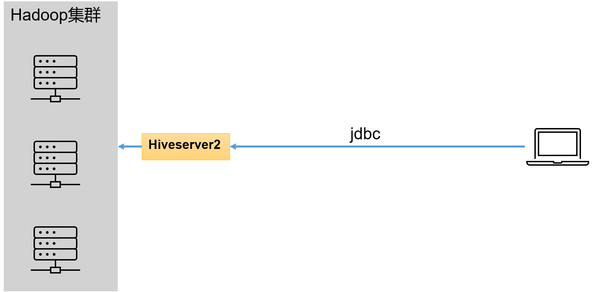   

1）用户说明  
在远程访问Hive数据时，客户端并未直接访问Hadoop集群，而是由Hivesever2代理访问。由于Hadoop集群中的数据具备访问权限控制，所以此时需考虑一个问题：那就是访问Hadoop集群的用户身份是谁？是Hiveserver2的启动用户？还是客户端的登录用户？  
答案是都有可能，具体是谁，由Hiveserver2的hive.server2.enable.doAs参数决定，该参数的含义是是否启用Hiveserver2用户模拟的功能。若启用，则Hiveserver2会模拟成客户端的登录用户去访问Hadoop集群的数据，不启用，则Hivesever2会直接使用启动用户访问Hadoop集群数据。模拟用户的功能，默认是开启的。  
具体逻辑如下：  
未开启用户模拟功能：  
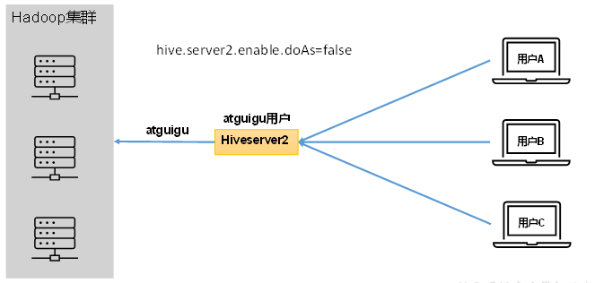   

开启用户模拟功能：  
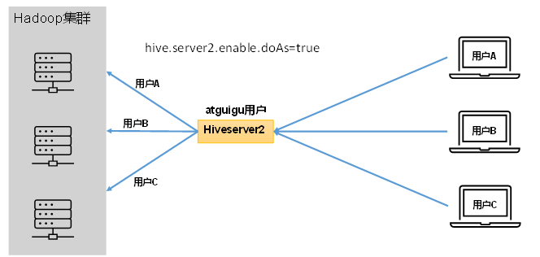   
生产环境，推荐开启用户模拟功能，因为开启后才能保证各用户之间的权限隔离。  

2）hiveserver2部署  
（1）Hadoop端配置  
hivesever2的模拟用户功能，依赖于Hadoop提供的proxy user（代理用户功能），只有Hadoop中的代理用户才能模拟其他用户的身份访问Hadoop集群。因此，需要将hiveserver2的启动用户设置为Hadoop的代理用户，配置方式如下：  
修改配置文件core-site.xml，然后记得分发三台机器  
```
[atguigu@hadoop102 ~]$ cd $HADOOP_HOME/etc/hadoop
[atguigu@hadoop102 hadoop]$ vim core-site.xml
```
增加如下配置：
```
<!--配置所有节点的atguigu用户都可作为代理用户-->
<property>
    <name>hadoop.proxyuser.atguigu.hosts</name>
    <value>*</value>
</property>

<!--配置atguigu用户能够代理的用户组为任意组-->
<property>
    <name>hadoop.proxyuser.atguigu.groups</name>
    <value>*</value>
</property>

<!--配置atguigu用户能够代理的用户为任意用户-->
<property>
    <name>hadoop.proxyuser.atguigu.users</name>
    <value>*</value>
</property>
```
（2）Hive端配置
在hive-site.xml文件中添加如下配置信息
```
[atguigu@hadoop102 conf]$ vim hive-site.xml

<!-- 指定hiveserver2连接的host -->
<property>
	<name>hive.server2.thrift.bind.host</name>
	<value>hadoop102</value>
</property>

<!-- 指定hiveserver2连接的端口号 -->
<property>
	<name>hive.server2.thrift.port</name>
	<value>10000</value>
</property>
```

3）测试  
（1）启动hiveserver2  
```
[atguigu@hadoop102 hive]$ bin/hive --service hiveserver2
```
（2）使用命令行客户端beeline进行远程访问  
启动beeline客户端  
```
[atguigu@hadoop102 hive]$ bin/beeline -u jdbc:hive2://hadoop102:10000 -n atguigu
```
看到如下界面
```
Connecting to jdbc:hive2://hadoop102:10000
Connected to: Apache Hive (version 3.1.3)
Driver: Hive JDBC (version 3.1.3)
Transaction isolation: TRANSACTION_REPEATABLE_READ
Beeline version 3.1.3 by Apache Hive
0: jdbc:hive2://hadoop102:10000>
```
（3）使用Datagrip图形化客户端进行远程访问

4）配置DataGrip连接  
（1）创建连接  
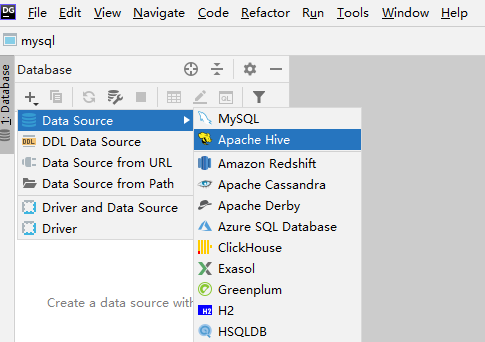   
（2）配置连接属性  
所有属性配置，和Hive的beeline客户端配置一致即可。初次使用，配置过程会提示缺少JDBC驱动，按照提示下载即可。  
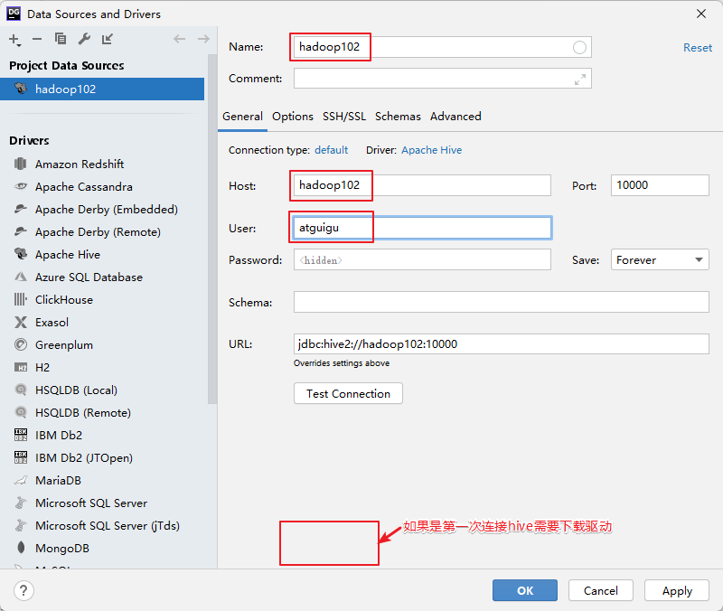   
（3）界面介绍  
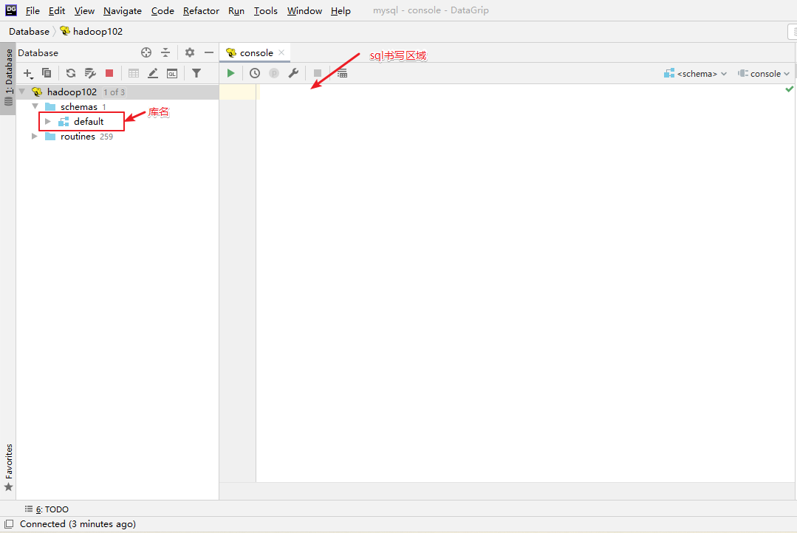   
（4）测试sql执行  
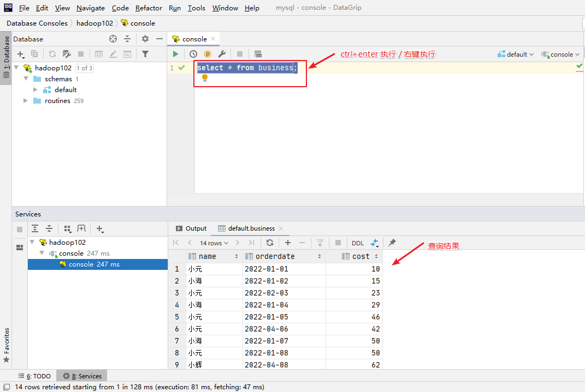   
（5）修改数据库  
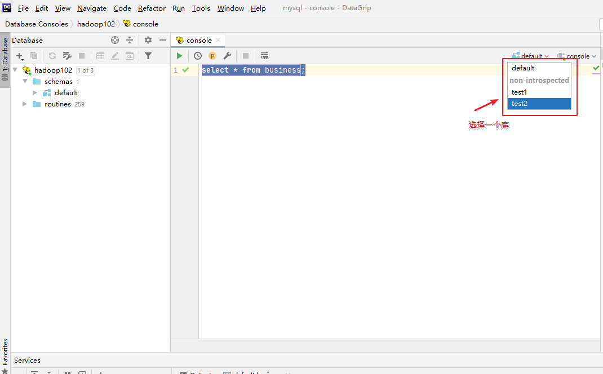   

### 5.2、metastore服务
Hive的metastore服务的作用是为Hive CLI或者Hiveserver2提供元数据访问接口。  

#### 1）metastore运行模式   
metastore有两种运行模式，分别为嵌入式模式和独立服务模式。下面分别对两种模式进行说明：  
（1）嵌入式模式   
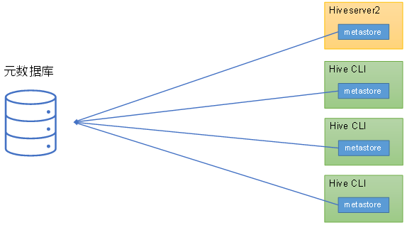   

（2）独立服务模式   
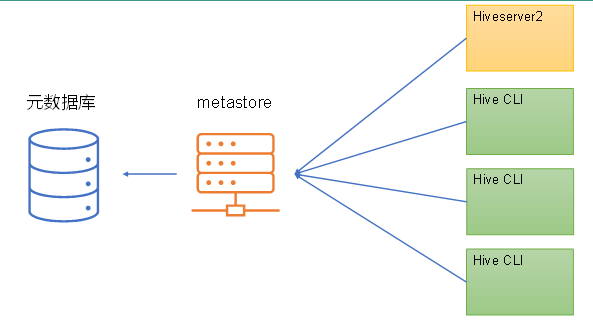   
生产环境中，不推荐使用嵌入式模式。因为其存在以下两个问题：  
（1）嵌入式模式下，每个Hive CLI都需要直接连接元数据库，当Hive CLI较多时，数据库压力会比较大。  
（2）每个客户端都需要用户元数据库的读写权限，元数据库的安全得不到很好的保证。   

#### 2）metastore部署  
（1）嵌入式模式  
嵌入式模式下，只需保证Hiveserver2和每个Hive CLI的配置文件hive-site.xml中包含连接元数据库所需要的以下参数即可：  
```
<!-- jdbc连接的URL -->
<property>
    <name>javax.jdo.option.ConnectionURL</name>
    <value>jdbc:mysql://hadoop102:3306/metastore?useSSL=false</value>
</property>

<!-- jdbc连接的Driver-->
<property>
    <name>javax.jdo.option.ConnectionDriverName</name>
    <value>com.mysql.jdbc.Driver</value>
</property>

<!-- jdbc连接的username-->
<property>
    <name>javax.jdo.option.ConnectionUserName</name>
    <value>root</value>
</property>

<!-- jdbc连接的password -->
<property>
    <name>javax.jdo.option.ConnectionPassword</name>
    <value>123456</value>
</property>
```

（2）独立服务模式  
独立服务模式需做以下配置：  
首先，保证metastore服务的配置文件hive-site.xml中包含连接元数据库所需的以下参数：  
```
<!-- jdbc连接的URL -->
<property>
    <name>javax.jdo.option.ConnectionURL</name>
    <value>jdbc:mysql://hadoop102:3306/metastore?useSSL=false</value>
</property>

<!-- jdbc连接的Driver-->
<property>
    <name>javax.jdo.option.ConnectionDriverName</name>
    <value>com.mysql.jdbc.Driver</value>
</property>

<!-- jdbc连接的username-->
<property>
    <name>javax.jdo.option.ConnectionUserName</name>
    <value>root</value>
</property>

<!-- jdbc连接的password -->
<property>
    <name>javax.jdo.option.ConnectionPassword</name>
    <value>123456</value>
</property>
```
其次，保证Hiveserver2和每个Hive CLI的配置文件hive-site.xml中包含访问metastore服务所需的以下参数：  
```
<!-- 指定metastore服务的地址 -->
<property>
	<name>hive.metastore.uris</name>
	<value>thrift://hadoop102:9083</value>
</property>
```
注意：主机名需要改为metastore服务所在节点，端口号无需修改，metastore服务的默认端口就是9083。  

#### 3）测试
此时启动Hive CLI，执行shou databases语句，会出现一下错误提示信息：  
```
hive (default)> show databases;
FAILED: HiveException java.lang.RuntimeException: Unable to instantiate org.apache.hadoop.hive.ql.metadata.SessionHiveMetaStoreClient
```
这是因为我们在Hive CLI的配置文件中配置了hive.metastore.uris参数，此时Hive CLI会去请求我们执行的metastore服务地址，所以必须启动metastore服务才能正常使用。  
metastore服务的启动命令如下：  
```
[atguigu@hadoop202 hive]$ hive --service metastore
2022-04-24 16:58:08: Starting Hive Metastore Server
```
注意：启动后该窗口不能再操作，需打开一个新的Xshell窗口来对Hive操作。  
重新启动 Hive CLI，并执行shou databases语句，就能正常访问了  
```
[atguigu@hadoop202 hive]$ bin/hive
```

### 5.3、编写Hive服务启动脚本（了解）
1）前台启动的方式导致需要打开多个Xshell窗口，可以使用如下方式后台方式启动   
```
nohup：放在命令开头，表示不挂起，也就是关闭终端进程也继续保持运行状态
/dev/null：是Linux文件系统中的一个文件，被称为黑洞，所有写入该文件的内容都会被自动丢弃
2>&1：表示将错误重定向到标准输出上
&：放在命令结尾，表示后台运行
```
一般会组合使用：nohup  [xxx命令操作]> file  2>&1 &，表示将xxx命令运行的结果输出到file中，并保持命令启动的进程在后台运行。  
如上命令不要求掌握。  
```
[atguigu@hadoop202 hive]$ nohup hive --service metastore 2>&1 &
[atguigu@hadoop202 hive]$ nohup hive --service hiveserver2 2>&1 &
```

2）为了方便使用，可以直接编写脚本来管理服务的启动和关闭  
```
[atguigu@hadoop102 hive]$ vim $HIVE_HOME/bin/hiveservices.sh
```
如下：
```
#!/bin/bash

HIVE_LOG_DIR=$HIVE_HOME/logs
if [ ! -d $HIVE_LOG_DIR ]
then
	mkdir -p $HIVE_LOG_DIR
fi

#检查进程是否运行正常，参数1为进程名，参数2为进程端口
function check_process()
{
    pid=$(ps -ef 2>/dev/null | grep -v grep | grep -i $1 | awk '{print $2}')
    ppid=$(netstat -nltp 2>/dev/null | grep $2 | awk '{print $7}' | cut -d '/' -f 1)
    echo $pid
    [[ "$pid" =~ "$ppid" ]] && [ "$ppid" ] && return 0 || return 1
}

function hive_start()
{
    metapid=$(check_process HiveMetastore 9083)
    cmd="nohup hive --service metastore >$HIVE_LOG_DIR/metastore.log 2>&1 &"
    [ -z "$metapid" ] && eval $cmd || echo "Metastroe服务已启动"
    server2pid=$(check_process HiveServer2 10000)
    cmd="nohup hive --service hiveserver2 >$HIVE_LOG_DIR/hiveServer2.log 2>&1 &"
    [ -z "$server2pid" ] && eval $cmd || echo "HiveServer2服务已启动"
}

function hive_stop()
{
metapid=$(check_process HiveMetastore 9083)
    [ "$metapid" ] && kill $metapid || echo "Metastore服务未启动"
    server2pid=$(check_process HiveServer2 10000)
    [ "$server2pid" ] && kill $server2pid || echo "HiveServer2服务未启动"
}

case $1 in
"start")
    hive_start
    ;;
"stop")
    hive_stop
    ;;
"restart")
    hive_stop
    sleep 2
    hive_start
    ;;
"status")
    check_process HiveMetastore 9083 >/dev/null && echo "Metastore服务运行正常" || echo "Metastore服务运行异常"
    check_process HiveServer2 10000 >/dev/null && echo "HiveServer2服务运行正常" || echo "HiveServer2服务运行异常"
    ;;
*)
    echo Invalid Args!
    echo 'Usage: '$(basename $0)' start|stop|restart|status'
    ;;
esac
```
3）添加执行权限
```
[atguigu@hadoop102 hive]$ chmod +x $HIVE_HOME/bin/hiveservices.sh
```
4）启动Hive后台服务
```
[atguigu@hadoop102 hive]$ hiveservices.sh start
```

## 六、Hive使用技巧
### 6.1、Hive常用交互命令
```
[atguigu@hadoop102 hive]$ bin/hive -help
usage: hive
 -d,--define <key=value>          Variable subsitution to apply to hive
                                  commands. e.g. -d A=B or --define A=B
    --database <databasename>     Specify the database to use
 -e <quoted-query-string>         SQL from command line
 -f <filename>                      SQL from files
 -H,--help                        Print help information
    --hiveconf <property=value>   Use value for given property
    --hivevar <key=value>         Variable subsitution to apply to hive
                                  commands. e.g. --hivevar A=B
 -i <filename>                    Initialization SQL file
 -S,--silent                      Silent mode in interactive shell
 -v,--verbose                     Verbose mode (echo executed SQL to the console)
```

1）在Hive命令行里创建一个表student，并插入1条数据  
```
hive (default)> create table student(id int,name string);
OK
Time taken: 1.291 seconds

hive (default)> insert into table student values(1,"zhangsan");
hive (default)> select * from student;
OK
student.id	student.name
1	zhangsan
Time taken: 0.144 seconds, Fetched: 1 row(s)
```

2）“-e”不进入hive的交互窗口执行hql语句
```
[atguigu@hadoop102 hive]$ bin/hive -e "select id from student;"
```
3）“-f”执行脚本中的hql语句  
（1）在/opt/module/hive/下创建datas目录并在datas目录下创建hivef.sql文件  
```
[atguigu@hadoop102 hive]$ mkdir datas
[atguigu@hadoop102 datas]$ vim hivef.sql
```
（2）文件中写入正确的hql语句
```
select * from student;
```
（3）执行文件中的hql语句
```
[atguigu@hadoop102 hive]$ bin/hive -f /opt/module/hive/datas/hivef.sql
```
（4）执行文件中的hql语句并将结果写入文件中
```
[atguigu@hadoop102 hive]$ bin/hive -f /opt/module/hive/datas/hivef.sql  > /opt/module/hive/datas/hive_result.txt
```

### 6.2、Hive参数配置方式
1）查看当前所有的配置信息
```
hive>set;
```

2）参数的配置三种方式  
（1）配置文件方式  
默认配置文件：hive-default.xml  
用户自定义配置文件：hive-site.xml  
注意：用户自定义配置会覆盖默认配置。另外，Hive也会读入Hadoop的配置，因为Hive是作为Hadoop的客户端启动的，Hive的配置会覆盖Hadoop的配置。配置文件的设定对本机启动的所有Hive进程都有效。  
（2）命令行参数方式  
启动Hive时，可以在命令行添加-hiveconf param=value来设定参数。例如：  
```
[atguigu@hadoop103 hive]$ bin/hive -hiveconf mapreduce.job.reduces=10;
```
注意：仅对本次Hive启动有效。  
查看参数设置  
```
hive (default)> set mapreduce.job.reduces;
```
（3）参数声明方式  
可以在HQL中使用SET关键字设定参数，例如：  
```
hive(default)> set mapreduce.job.reduces=10;
```
注意：仅对本次Hive启动有效。  
查看参数设置：  
```
hive(default)> set mapreduce.job.reduces;
```
上述三种设定方式的优先级依次递增。即配置文件 < 命令行参数 < 参数声明。注意某些系统级的参数，例如log4j相关的设定，必须用前两种方式设定，因为那些参数的读取在会话建立以前已经完成了。

### 6.3、Hive常见属性配置
1）Hive客户端显示当前库和表头    
（1）在hive-site.xml中加入如下两个配置:    
```
[atguigu@hadoop102 conf]$ vim hive-site.xml

<property>
    <name>hive.cli.print.header</name>
    <value>true</value>
    <description>Whether to print the names of the columns in query output.</description>
</property>
<property>
    <name>hive.cli.print.current.db</name>
    <value>true</value>
    <description>Whether to include the current database in the Hive prompt.</description>
</property>
```
（2）hive客户端在运行时可以显示当前使用的库和表头信息
```
[atguigu@hadoop102 conf]$ hive

hive (default)> select * from stu;
OK
stu.id	stu.name
1	ss
Time taken: 1.874 seconds, Fetched: 1 row(s)
hive (default)>
```
