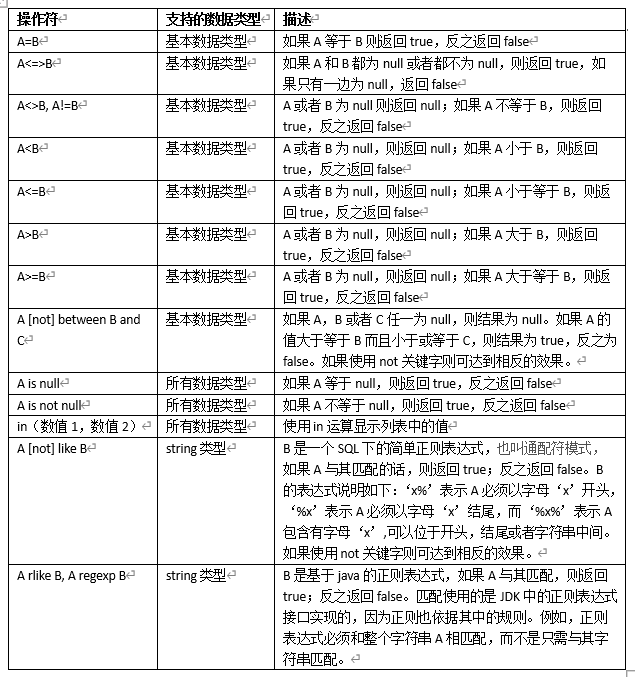
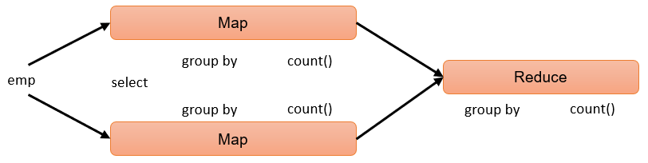
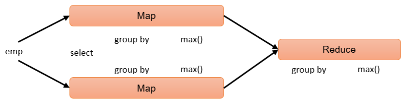
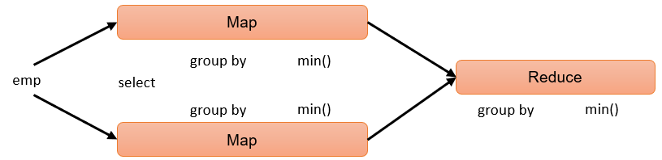
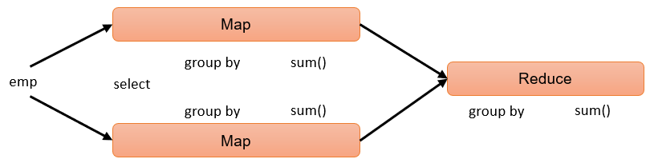
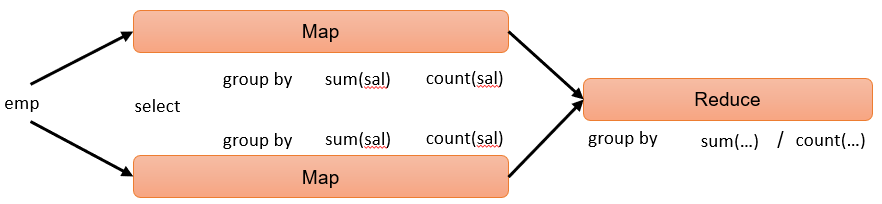

# 06-查询
## 一、基础语法
1）官网地址  
https://cwiki.apache.org/confluence/display/Hive/LanguageManual+Select  
2）查询语句语法：  
```
SELECT [ALL | DISTINCT] select_expr, select_expr, ...
  FROM table_reference       -- 从什么表查
  [WHERE where_condition]   -- 过滤
  [GROUP BY col_list]        -- 分组查询
   [HAVING col_list]          -- 分组后过滤
  [ORDER BY col_list]        -- 排序
  [CLUSTER BY col_list
    | [DISTRIBUTE BY col_list] [SORT BY col_list]
  ]
 [LIMIT number]                -- 限制输出的行数
```

## 二、基本查询（Select…From）
### 2.1、数据准备
（0）原始数据  
1、在/opt/module/hive/datas/路径上创建dept.txt文件，并赋值如下内容：  
部门编号 部门名称 部门位置id  
```
[atguigu@hadoop102 datas]$ vim dept.txt

10	行政部	1700
20	财务部	1800
30	教学部	1900
40	销售部	1700
```
员工编号 姓名 岗位    薪资  部门
```
[atguigu@hadoop102 datas]$ vim emp.txt

7369	张三	研发	800.00	30
7499	李四	财务	1600.00	20
7521	王五	行政	1250.00	10
7566	赵六	销售	2975.00	40
7654	侯七	研发	1250.00	30
7698	马八	研发	2850.00	30
7782	金九	\N	2450.0	30
7788	银十	行政	3000.00	10
7839	小芳	销售	5000.00	40
7844	小明	销售	1500.00	40
7876	小李	行政	1100.00	10
7900	小元	讲师	950.00	30
7902	小海	行政	3000.00	10
7934	小红明	讲师	1300.00	30
```
（1）创建部门表
```
hive (default)>
create table if not exists dept(
    deptno int,    -- 部门编号
    dname string,  -- 部门名称
    loc int        -- 部门位置
)
row format delimited fields terminated by '\t';
```
（2）创建员工表
```
hive (default)>
create table if not exists emp(
    empno int,      -- 员工编号
    ename string,   -- 员工姓名
    job string,     -- 员工岗位（大数据工程师、前端工程师、java工程师）
    sal double,     -- 员工薪资
    deptno int      -- 部门编号
)
row format delimited fields terminated by '\t';
```
（3）导入数据
```
hive (default)>
load data local inpath '/opt/module/hive/datas/dept.txt' into table dept;
load data local inpath '/opt/module/hive/datas/emp.txt' into table emp;
```

### 2.2、全表和特定列查询
1）全表查询  
```
hive (default)> select * from emp;
```
2）选择特定列查询
```
hive (default)> select empno, ename from emp;
```
注意：  
（1）SQL 语言大小写不敏感。   
（2）SQL 可以写在一行或者多行。  
（3）关键字不能被缩写也不能分行。  
（4）各子句一般要分行写。  
（5）使用缩进提高语句的可读性。  

### 2.3、列别名
1）重命名一个列  
2）便于计算  
3）紧跟列名，也可以在列名和别名之间加入关键字‘AS’   
4）案例实操  
查询名称和部门。  
```
hive (default)> 
select 
    ename AS name, 
    deptno dn 
from emp;
```

### 2.4、Limit语句
典型的查询会返回多行数据。limit子句用于限制返回的行数。
```
hive (default)> select * from emp limit 5; 
hive (default)> select * from emp limit 2,3; -- 表示从第2行开始，向下抓取3行
```

### 2.5、Where语句
1）使用where子句，将不满足条件的行过滤掉  
2）where子句紧随from子句  
3）案例实操  
查询出薪水大于1000的所有员工。  
```
hive (default)> select * from emp where sal > 1000;
```
注意：where子句中不能使用字段别名。

### 2.6、关系运算函数  
1）基本语法  
如下操作符主要用于where和having语句中。  
  

### 2.7、逻辑运算函数
1）基本语法（and/or/not）  
```
操作符	含义
and	逻辑并
or	逻辑或
not	逻辑否
```
2）案例实操  
（1）查询薪水大于1000，部门是30  
```
hive (default)> 
select 
    * 
from emp 
where sal > 1000 and deptno = 30;
```
（2）查询薪水大于1000，或者部门是30
```
hive (default)> 
select 
    * 
from emp 
where sal>1000 or deptno=30;
```
（3）查询除了20部门和30部门以外的员工信息
```
hive (default)> 
select 
    * 
from emp 
where deptno not in(30, 20);
```

### 2.8、聚合函数
1）语法
```
count(*)，表示统计所有行数，包含null值；
count(某列)，表示该列一共有多少行，不包含null值；
max()，求最大值，不包含null，除非所有值都是null；
min()，求最小值，不包含null，除非所有值都是null；
sum()，求和，不包含null。
avg()，求平均值，不包含null。
```

2）案例实操  
（1）求总行数（count）  
```
hive (default)> select count(*) cnt from emp;
```
hive sql执行过程：
   
（2）求工资的最大值（max）   
```
hive (default)> select max(sal) max_sal from emp;
```
hive sql执行过程：   
   
（3）求工资的最小值（min）  
```
hive (default)> select min(sal) min_sal from emp;
```
hive sql执行过程：  
   
（4）求工资的总和（sum）  
```
hive (default)> select sum(sal) sum_sal from emp;   
```
hive sql执行过程：  
   
（5）求工资的平均值（avg）  
```
hive (default)> select avg(sal) avg_sal from emp;  
```
hive sql执行过程：  
   


