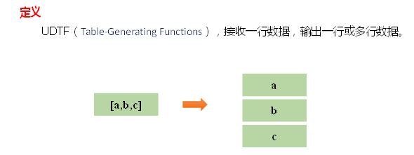
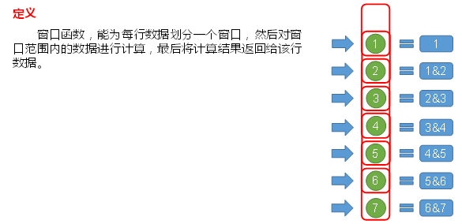
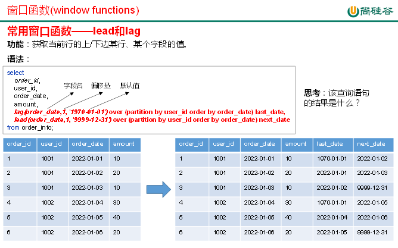
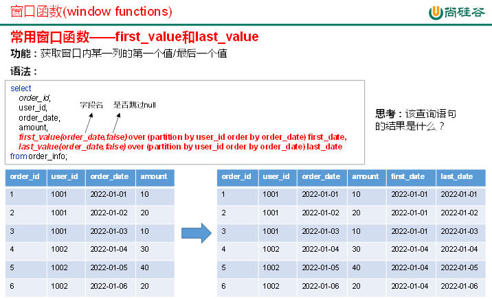
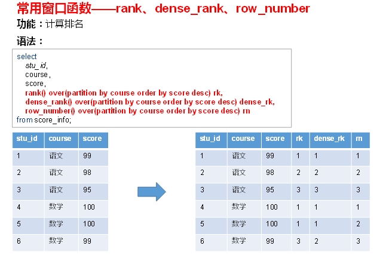

# 08-函数
## 一、函数简介
Hive会将常用的逻辑封装成函数给用户进行使用，类似于Java中的函数。  
好处：避免用户反复写逻辑，可以直接拿来使用。  
重点：用户需要知道函数叫什么，能做什么。  
Hive提供了大量的内置函数，按照其特点可大致分为如下几类：单行函数、聚合函数、炸裂函数、窗口函数。  
以下命令可用于查询所有内置函数的相关信息。  
1）查看系统内置函数  
```
hive> show functions;
```
2）查看内置函数用法
```
hive> desc function upper;
```
3）查看内置函数详细信息
```
hive> desc function extended upper;
```

## 二、单行函数
单行函数的特点是一进一出，即输入一行，输出一行。  
单行函数按照功能可分为如下几类: 日期函数、字符串函数、集合函数、数学函数、流程控制函数等。  

### 2.1、算术运算函数
```
运算符	描述
A+B	    A和B 相加
A-B	    A减去B
A*B	    A和B 相乘
A/B	    A除以B
A%B	    A对B取余
A&B	    A和B按位取与
A|B	    A和B按位取或
A^B	    A和B按位取异或
~A	    A按位取反
```
案例实操：查询出所有员工的薪水后加1显示。
```
hive (default)> select sal + 1 from emp;
```

### 2.2、数值函数
1）round：四舍五入
```
hive> select round(3.3);   3
```
2）ceil：向上取整
```
hive> select ceil(3.1) ;   4
```
3）floor：向下取整
```
hive> select floor(4.8);  4
```

### 2.3、字符串函数
1）substring：截取字符串  
语法一：substring(string A, int start)   
返回值：string   
说明：返回字符串A从start位置到结尾的字符串  
语法二：substring(string A, int start, int len)   
返回值：string  
说明：返回字符串A从start位置开始，长度为len的字符串  
案例实操：  
（1）获取第二个字符以后的所有字符  
```
hive> select substring("atguigu",2);
```
输出：
```
tguigu
```
（2）获取倒数第三个字符以后的所有字符
```
hive> select substring("atguigu",-3);
```
输出：
```
igu
```
（3）从第3个字符开始，向后获取2个字符
```
hive> select substring("atguigu",3,2);
```
输出：
```
gu
```

2）replace ：替换  
语法：replace(string A, string B, string C)   
返回值：string  
说明：将字符串A中的子字符串B替换为C。  
```
hive> select replace('atguigu', 'a', 'A')  
```
输出：  
```
hive> Atguigu  
```

3）regexp_replace：正则替换  
语法：regexp_replace(string A, string B, string C)   
返回值：string  
说明：将字符串A中的符合java正则表达式B的部分替换为C。注意，在有些情况下要使用转义字符。  
案例实操：  
```
hive> select regexp_replace('100-200', '(\\d+)', 'num')   
```
输出：  
```
hive> num-num  
```

4）regexp：正则匹配
语法：字符串 regexp 正则表达式
返回值：boolean
说明：若字符串符合正则表达式，则返回true，否则返回false。
（1）正则匹配成功，输出true
```
hive> select 'dfsaaaa' regexp 'dfsa+'
```
输出：
```
hive> true
```
（2）正则匹配失败，输出false
```
hive> select 'dfsaaaa' regexp 'dfsb+';
```
输出：
```
hive> false
```

5）repeat：重复字符串  
语法：repeat(string A, int n)  
返回值：string  
说明：将字符串A重复n遍。  
```
hive> select repeat('123', 3);  
```
输出：  
```
hive> 123123123  
```

6）split ：字符串切割  
语法：split(string str, string pat)   
返回值：array  
说明：按照正则表达式pat匹配到的内容分割str，分割后的字符串，以数组的形式返回。  
```
hive> select split('a-b-c-d','-');  
```
输出：  
```
hive> ["a","b","c","d"]  
```

7）nvl ：替换null值  
语法：nvl(A,B)   
说明：若A的值不为null，则返回A，否则返回B。   
```
hive> select nvl(null,1);   
```
输出：  
```
hive> 1  
```

8）concat ：拼接字符串  
语法：concat(string A, string B, string C, ……)   
返回：string  
说明：将A,B,C……等字符拼接为一个字符串  
```
hive> select concat('beijing','-','shanghai','-','shenzhen');  
```
输出：  
```
hive> beijing-shanghai-shenzhen  
```

9）concat_ws：以指定分隔符拼接字符串或者字符串数组
语法：concat_ws(string A, string…| array(string)) 
返回值：string
说明：使用分隔符A拼接多个字符串，或者一个数组的所有元素。
```
hive>select concat_ws('-','beijing','shanghai','shenzhen');
```
输出：
```
hive> beijing-shanghai-shenzhen

hive> select concat_ws('-',array('beijing','shenzhen','shanghai'));
```
输出：   
```
hive> beijing-shanghai-shenzhen
```

10）get_json_object：解析json字符串  
语法：get_json_object(string json_string, string path)   
返回值：string  
说明：解析json的字符串json_string，返回path指定的内容。如果输入的json字符串无效，那么返回NULL。  
案例实操：  
（1）获取json数组里面的json具体数据  
```
hive> select get_json_object('[{"name":"大海海","sex":"男","age":"25"},{"name":"小宋宋","sex":"男","age":"47"}]','$.[0].name');
```
输出：
```
hive> 大海海
```
（2）获取json数组里面的数据
```
hive> select get_json_object('[{"name":"大海海","sex":"男","age":"25"},{"name":"小宋宋","sex":"男","age":"47"}]','$.[0]');
```
输出：
```
hive> {"name":"大海海","sex":"男","age":"25"}
```

### 2.4、日期函数
1）unix_timestamp：返回当前或指定时间的时间戳  
语法：unix_timestamp()   
返回值：bigint   
案例实操：  
```
hive> select unix_timestamp('2022/08/08 08-08-08','yyyy/MM/dd HH-mm-ss'); 
```
输出：
```
1659946088
```
说明：-前面是日期后面是指，日期传进来的具体格式   

2）from_unixtime：转化UNIX时间戳（从 1970-01-01 00:00:00 UTC 到指定时间的秒数）到当前时区的时间格式  
语法：from_unixtime(bigint unixtime[, string format])   
返回值：string   
案例实操：  
```
hive> select from_unixtime(1659946088);   
```
输出：
```
2022-08-08 08:08:08
```

3）current_date：当前日期     
```
hive> select current_date;     
```
输出：
```
2022-07-11
```

4）current_timestamp：当前的日期加时间，并且精确的毫秒 
```
hive> select current_timestamp;   
```
输出：
```
2022-07-11 15:32:22.402
```

5）month：获取日期中的月  
语法：month (string date)   
返回值：int   
案例实操：  
```
hive> select month('2022-08-08 08:08:08');
```
输出：
```
8
```

6）day：获取日期中的日  
语法：day (string date)   
返回值：int   
案例实操：  
```
hive> select day('2022-08-08 08:08:08')    
```
输出：
```
8
```

7）hour：获取日期中的小时  
语法：hour (string date)   
返回值：int   
案例实操：  
```
hive> select hour('2022-08-08 08:08:08');   
```
输出：
```
8
```

8）datediff：两个日期相差的天数（结束日期减去开始日期的天数）  
语法：datediff(string enddate, string startdate)   
返回值：int   
案例实操：  
```
hive> select datediff('2021-08-08','2022-10-09');     
```
输出：
```
-427
```

9）date_add：日期加天数  
语法：date_add(string startdate, int days)   
返回值：string   
说明：返回开始日期 startdate 增加 days 天后的日期  
案例实操：  
```
hive> select date_add('2022-08-08',2);   
```
输出：
```
2022-08-10
```

10）date_sub：日期减天数  
语法：date_sub (string startdate, int days)   
返回值：string   
说明：返回开始日期startdate减少days天后的日期。  
案例实操：  
```
hive> select date_sub('2022-08-08',2);    
```
输出：
```
2022-08-06
```

11）date_format:将标准日期解析成指定格式字符串
```
hive> select date_format('2022-08-08','yyyy年-MM月-dd日')   
```
输出：
```
2022年-08月-08日
```

### 2.5、流程控制函数
1）case when：条件判断函数  
语法一：case when a then b [when c then d]* [else e] end   
返回值：T   
说明：如果a为true，则返回b；如果c为true，则返回d；否则返回 e   
```
hive> select case when 1=2 then 'tom' when 2=2 then 'mary' else 'tim' end from tabl eName; 
mary
```
语法二： case a when b then c [when d then e]* [else f] end   
返回值: T   
说明：如果a等于b，那么返回c；如果a等于d，那么返回e；否则返回f   
```
hive> select case 100 when 50 then 'tom' when 100 then 'mary' else 'tim' end from t ableName; 
mary
```

2）if: 条件判断，类似于Java中三元运算符  
语法：if（boolean testCondition, T valueTrue, T valueFalseOrNull）  
返回值：T   
说明：当条件testCondition为true时，返回valueTrue；否则返回valueFalseOrNull  
（1）条件满足，输出正确  
```
hive> select if(10 > 5,'正确','错误'); 
```
输出：正确  
（2）条件满足，输出错误  
```
hive> select if(10 < 5,'正确','错误');
```
输出：错误  

### 2.6、集合函数
1）size：集合中元素的个数
```
hive> select size(friends) from test;  --2/2  每一行数据中的friends集合里的个数
```
2）map：创建map集合  
语法：map (key1, value1, key2, value2, …)   
说明：根据输入的key和value对构建map类型  
案例实操：  
```
hive> select map('xiaohai',1,'dahai',2);  
```
输出：
```
hive> {"xiaohai":1,"dahai":2}
```
3）map_keys： 返回map中的key
```
hive> select map_keys(map('xiaohai',1,'dahai',2));
```
输出：
```
hive>["xiaohai","dahai"]
```
4）map_values: 返回map中的value
```
hive> select map_values(map('xiaohai',1,'dahai',2));
```
输出：
```
hive>[1,2]
```
5）array 声明array集合  
语法：array(val1, val2, …)   
说明：根据输入的参数构建数组array类  
案例实操：  
```
hive> select array('1','2','3','4');
```
输出：
```
hive>["1","2","3","4"]
```
6）array_contains: 判断array中是否包含某个元素
```
hive> select array_contains(array('a','b','c','d'),'a');
```
输出：
```
hive> true
```
7）sort_array：将array中的元素排序
```
hive> select sort_array(array('a','d','c'));
```
输出：
```
hive> ["a","c","d"]
```
8）struct声明struct中的各属性  
语法：struct(val1, val2, val3, …)   
说明：根据输入的参数构建结构体struct类  
案例实操：  
```
hive> select struct('name','age','weight');
```
输出：
```
hive> {"col1":"name","col2":"age","col3":"weight"}
```
9）named_struct声明struct的属性和值
```
hive> select named_struct('name','xiaosong','age',18,'weight',80);
```
输出：
```
hive> {"name":"xiaosong","age":18,"weight":80}
```

### 2.7、案例演示
1、数据准备  
1）表结构  
```
name	sex	birthday	hiredate	job	salary	bonus	friends	children
张无忌	男	1980/02/12	2022/08/09	销售	3000	12000	[阿朱，小昭]	{张小无:8,张小忌:9}
赵敏	女	1982/05/18	2022/09/10	行政	9000	2000	[阿三，阿四]	{赵小敏:8}
黄蓉	女	1982/04/13	2022/06/11	行政	12000	Null	[东邪，西毒]	{郭芙:5,郭襄:4}
```
2）建表语句
```
hive> 
create  table  employee(
    name string,  --姓名
    sex  string,  --性别
    birthday string, --出生年月
    hiredate string, --入职日期
    job string,   --岗位
    salary double, --薪资
    bonus double,  --奖金
    friends array<string>, --朋友
    children map<string,int> --孩子
)
```
3）插入数据  
```
hive> insert into employee  
  values('张无忌','男','1980/02/12','2022/08/09','销售',3000,12000,array('阿朱','小昭'),map('张小无',8,'张小忌',9)),
        ('赵敏','女','1982/05/18','2022/09/10','行政',9000,2000,array('阿三','阿四'),map('赵小敏',8)),
        ('宋青书','男','1981/03/15','2022/04/09','研发',18000,1000,array('王五','赵六'),map('宋小青',7,'宋小书',5)),
        ('周芷若','女','1981/03/17','2022/04/10','研发',18000,1000,array('王五','赵六'),map('宋小青',7,'宋小书',5)),
        ('郭靖','男','1985/03/11','2022/07/19','销售',2000,13000,array('南帝','北丐'),map('郭芙',5,'郭襄',4)),
        ('黄蓉','女','1982/12/13','2022/06/11','行政',12000,null,array('东邪','西毒'),map('郭芙',5,'郭襄',4)),
        ('杨过','男','1988/01/30','2022/08/13','前台',5000,null,array('郭靖','黄蓉'),map('杨小过',2)),
        ('小龙女','女','1985/02/12','2022/09/24','前台',6000,null,array('张三','李四'),map('杨小过',2))
```

2、需求  
1）统计每个月的入职人数  
（1）期望结果  
```
month	cnt
4	    2
6	    1
7	    1
8	    2
9	    2
```
（2）需求实现
```
select
  month(replace(hiredate,'/','-')) as month,
  count(*) as cn
from
  employee
group by
  month(replace(hiredate,'/','-'))
```
2）查询每个人的年龄（年 + 月）  
（1）期望结果  
```
name	age
张无忌	42年8月
赵敏	    40年5月
宋青书	41年7月
周芷若	41年7月
郭靖	    37年7月
黄蓉  	39年10月
杨过	    34年9月
小龙女	37年8月
```
（2）需求实现
```
-- 转换日期
select
  name,
  replace(birthday,'/','-') birthday
from
  employee  t1

-- 求出年和月
select
  name,
  year(current_date())-year(t1.birthday) year,
  month(current_date())-month(t1.birthday) month
from
  (
    select
      name,
      replace(birthday,'/','-') birthday
    from
      employee
)t1 t2

-- 根据月份正负决定年龄

select
  name,
  concat(if(month>=0,year,year-1),'年',if(month>=0,month,12+month),'月') age
from
  (
    select
      name,
      year(current_date())-year(t1.birthday) year,
      month(current_date())-month(t1.birthday) month
    from
      (
        select
          name,
          replace(birthday,'/','-') birthday
        from
          employee
    )t1
)t2 
```
3）按照薪资，奖金的和进行倒序排序，如果奖金为null，置位0  
（1）期望结果  
```
name	sal
周芷若	19000
宋青书	19000
郭靖  	15000
张无忌	15000
黄蓉	    12000
赵敏  	11000
小龙女	6000
杨过	    5000
```
（2）需求实现
```
select
  name,
  salary + nvl(bonus,0) sal
from
  employee
order by
   sal desc
```
4）查询每个人有多少个朋友  
（1）期望结果  
```
name	cnt
张无忌	2
赵敏	    2
宋青书	2
周芷若	2
郭靖  	2
黄蓉  	2
杨过  	2
小龙女	2
```
（2）需求实现
```
select 
name,
size(friends) cnt
from 
employee; 
```
5）查询每个人的孩子的姓名  
（1）期望结果  
```
name	ch_name
张无忌	["张小无","张小忌"]
赵敏	    ["赵小敏"]
宋青书	["宋小青","宋小书"]
周芷若	["宋小青","宋小书"]
郭靖	    ["郭芙","郭襄"]
黄蓉	    ["郭芙","郭襄"]
杨过  	["杨小过"]
小龙女	["杨小过"]
```
（2）需求实现
```
hive>
select 
name,
map_keys(children) ch_name
from 
employee; 
```
6）查询每个岗位男女各多少人  
（1）期望结果  
```
job	    male	female
前台	    1	    1
研发	    1	    1
行政	    0	    2
销售	    2	    0
```
（2）需求实现
```
select
  job,
  sum(if(sex='男',1,0)) male,
  sum(if(sex='女',1,0)) female
from
  employee
group by 
  job
```

## 三、高级聚合函数
多进一出 （多行传入，一个行输出）。  
1）普通聚合 count/sum.... 见第6章 6.2.4  
2）collect_list 收集并形成list集合，结果不去重  
```
hive>
select 
  sex,
  collect_list(job)
from
  employee
group by 
  sex
```
结果：
```
女	["行政","研发","行政","前台"]
男	["销售","研发","销售","前台"]
```
3）collect_set 收集并形成set集合，结果去重   
```
hive>
select 
  sex,
  collect_set(job)
from
  employee
group by 
  sex
```  
结果：
```
女	["行政","研发","前台"]
男	["销售","研发","前台"]
```

### 3.1、案例演示
1）每个月的入职人数以及姓名
```
hive> 
select
  month(replace(hiredate,'/','-')) as month,
  count(*) as cn,
  Collect_list(name) as name_list
from
  employee
group by
  month(replace(hiredate,'/','-'))
```  
结果：
```  
month  cn  name_list
4	    2	["宋青书","周芷若"]
6	    1	["黄蓉"]
7	    1	["郭靖"]
8	    2	["张无忌","杨过"]
9	    2	["赵敏","小龙女"]
```

## 四、炸裂函数
### 4.1、概述


### 4.2、案例演示
1、数据准备  
1）表结构  
```
movie	        category
《疑犯追踪》	    悬疑，动作，科幻，剧情
《Lie to me》	悬疑，警匪，动作，心理，剧情
《战狼2》	    战争，动作，灾难
```
2）建表语句
```
hive (default)>
create table movie_info(
    movie string,     --电影名称
    category string   --电影分类
) 
row format delimited fields terminated by "\t";
```
3）装载语句
```
insert overwrite table movie_info
values ("《疑犯追踪》", "悬疑,动作,科幻,剧情"),
       ("《Lie to me》", "悬疑,警匪,动作,心理,剧情"),
       ("《战狼2》", "战争,动作,灾难");
```

2、需求  
1）需求说明  
根据上述电影信息表，统计各分类的电影数量，期望结果如下：  
```
剧情	2
动作	3
心理	1
悬疑	2
战争	1
灾难	1
科幻	1
警匪	1
```
2）答案
```
select
    cate,
    count(*)
from
(
    select
        movie,
        cate
    from
    (
        select
            movie,
            split(category,',') cates
        from movie_info
    )t1 lateral view explode(cates) tmp as cate
)t2
group by cate;
```

## 五、窗口函数（开窗函数）
### 5.1、概述
  

### 5.2、常用窗口函数
按照功能，常用窗口可划分为如下几类：聚合函数、跨行取值函数、排名函数。  

1）聚合函数  
max：最大值。  
min：最小值。  
sum：求和。  
avg：平均值。  
count：计数。  

2）跨行取值函数  
（1）lead和lag  
  

注：lag和lead函数不支持自定义窗口。  
（2）first_value和last_value  
  

3）排名函数  
   
注：rank 、dense_rank、row_number不支持自定义窗口。  

### 5.3、案例演示
1、数据准备  
1）表结构  
```
order_id	user_id	user_name	order_date	order_amount
1	1001	小元	2022-01-01	10
2	1002	小海	2022-01-02	15
3	1001	小元	2022-02-03	23
4	1002	小海	2022-01-04	29
5	1001	小元	2022-01-05	46
```
2）建表语句  
```
create table order_info
(
    order_id     string, --订单id
    user_id      string, -- 用户id
    user_name    string, -- 用户姓名
    order_date   string, -- 下单日期
    order_amount int     -- 订单金额
);
```
3）装载语句
```
insert overwrite table order_info
values ('1', '1001', '小元', '2022-01-01', '10'),
       ('2', '1002', '小海', '2022-01-02', '15'),
       ('3', '1001', '小元', '2022-02-03', '23'),
       ('4', '1002', '小海', '2022-01-04', '29'),
       ('5', '1001', '小元', '2022-01-05', '46'),
       ('6', '1001', '小元', '2022-04-06', '42'),
       ('7', '1002', '小海', '2022-01-07', '50'),
       ('8', '1001', '小元', '2022-01-08', '50'),
       ('9', '1003', '小辉', '2022-04-08', '62'),
       ('10', '1003', '小辉', '2022-04-09', '62'),
       ('11', '1004', '小猛', '2022-05-10', '12'),
       ('12', '1003', '小辉', '2022-04-11', '75'),
       ('13', '1004', '小猛', '2022-06-12', '80'),
       ('14', '1003', '小辉', '2022-04-13', '94');
```

2、需求  
1）统计每个用户截至每次下单的累积下单总额  
（1）期望结果  
```
order_id	user_id	user_name	order_date	order_amount	sum_so_far
1	1001	小元	2022-01-01	10	10
5	1001	小元	2022-01-05	46	56
8	1001	小元	2022-01-08	50	106
3	1001	小元	2022-02-03	23	129
6	1001	小元	2022-04-06	42	171
2	1002	小海	2022-01-02	15	15
4	1002	小海	2022-01-04	29	44
7	1002	小海	2022-01-07	50	94
9	1003	小辉	2022-04-08	62	62
10	1003	小辉	2022-04-09	62	124
12	1003	小辉	2022-04-11	75	199
14	1003	小辉	2022-04-13	94	293
11	1004	小猛	2022-05-10	12	12
13	1004	小猛	2022-06-12	80	92
```
（2）需求实现
```
select
    order_id,
    user_id,
    user_name,
    order_date,
    order_amount,
    sum(order_amount) over(partition by user_id order by order_date rows between unbounded preceding and current row) sum_so_far
from order_info;
```

2）统计每个用户截至每次下单的当月累积下单总额  
（1）期望结果  
```
order_id	user_id	user_name	order_date	order_amount	sum_so_far
1	1001	小元	2022-01-01	10	10
5	1001	小元	2022-01-05	46	56
8	1001	小元	2022-01-08	50	106
3	1001	小元	2022-02-03	23	23
6	1001	小元	2022-04-06	42	42
2	1002	小海	2022-01-02	15	15
4	1002	小海	2022-01-04	29	44
7	1002	小海	2022-01-07	50	94
9	1003	小辉	2022-04-08	62	62
10	1003	小辉	2022-04-09	62	124
12	1003	小辉	2022-04-11	75	199
14	1003	小辉	2022-04-13	94	293
11	1004	小猛	2022-05-10	12	12
13	1004	小猛	2022-06-12	80	80
```
（2）需求实现  
```
select
    order_id,
    user_id,
    user_name,
    order_date,
    order_amount,
    sum(order_amount) over(partition by user_id,substring(order_date,1,7) order by order_date rows between unbounded preceding and current row) sum_so_far
from order_info;
```
3）统计每个用户每次下单距离上次下单相隔的天数（首次下单按0天算）  
（1）期望结果  
```
order_id	user_id	user_name	order_date	order_amount	diff
1	1001	小元	2022-01-01	10	0
5	1001	小元	2022-01-05	46	4
8	1001	小元	2022-01-08	50	3
3	1001	小元	2022-02-03	23	26
6	1001	小元	2022-04-06	42	62
2	1002	小海	2022-01-02	15	0
4	1002	小海	2022-01-04	29	2
7	1002	小海	2022-01-07	50	3
9	1003	小辉	2022-04-08	62	0
10	1003	小辉	2022-04-09	62	1
12	1003	小辉	2022-04-11	75	2
14	1003	小辉	2022-04-13	94	2
11	1004	小猛	2022-05-10	12	0
13	1004	小猛	2022-06-12	80	33
```
（2）需求实现
```
select
    order_id,
    user_id,
    user_name,
    order_date,
    order_amount,
    nvl(datediff(order_date,last_order_date),0) diff
from
(
    select
        order_id,
        user_id,
        user_name,
        order_date,
        order_amount,
        lag(order_date,1,null) over(partition by user_id order by order_date) last_order_date
    from order_info
)t1
```
4）查询所有下单记录以及每个用户的每个下单记录所在月份的首/末次下单日期  
（1）期望结果  
```
order_id	user_id	user_name	order_date	order_amount	first_date	last_date
1	1001	小元	2022-01-01	10	2022-01-01	2022-01-08
5	1001	小元	2022-01-05	46	2022-01-01	2022-01-08
8	1001	小元	2022-01-08	50	2022-01-01	2022-01-08
3	1001	小元	2022-02-03	23	2022-02-03	2022-02-03
6	1001	小元	2022-04-06	42	2022-04-06	2022-04-06
2	1002	小海	2022-01-02	15	2022-01-02	2022-01-07
4	1002	小海	2022-01-04	29	2022-01-02	2022-01-07
7	1002	小海	2022-01-07	50	2022-01-02	2022-01-07
9	1003	小辉	2022-04-08	62	2022-04-08	2022-04-13
10	1003	小辉	2022-04-09	62	2022-04-08	2022-04-13
12	1003	小辉	2022-04-11	75	2022-04-08	2022-04-13
14	1003	小辉	2022-04-13	94	2022-04-08	2022-04-13
11	1004	小猛	2022-05-10	12	2022-05-10	2022-05-10
13	1004	小猛	2022-06-12	80	2022-06-12	2022-06-12
```
（2）需求实现
```
select
    order_id,
    user_id,
    user_name,
    order_date,
    order_amount,
    first_value(order_date) over(partition by user_id,substring(order_date,1,7) order by order_date) first_date,
    last_value(order_date) over(partition by user_id,substring(order_date,1,7) order by order_date rows between unbounded preceding and unbounded following) last_date
from order_info;
```

5）为每个用户的所有下单记录按照订单金额进行排名  
（1）期望结果  
```
order_id	user_id	user_name	order_date	order_amount	rk	drk	rn
8	1001	小元	2022-01-08	50	1	1	1
5	1001	小元	2022-01-05	46	2	2	2
6	1001	小元	2022-04-06	42	3	3	3
3	1001	小元	2022-02-03	23	4	4	4
1	1001	小元	2022-01-01	10	5	5	5
7	1002	小海	2022-01-07	50	1	1	1
4	1002	小海	2022-01-04	29	2	2	2
2	1002	小海	2022-01-02	15	3	3	3
14	1003	小辉	2022-04-13	94	1	1	1
12	1003	小辉	2022-04-11	75	2	2	2
9	1003	小辉	2022-04-08	62	3	3	3
10	1003	小辉	2022-04-09	62	3	3	4
13	1004	小猛	2022-06-12	80	1	1	1
11	1004	小猛	2022-05-10	12	2	2	2
```
（2）需求实现
```
select
    order_id,
    user_id,
    user_name,
    order_date,
    order_amount,
    rank() over(partition by user_id order by order_amount desc) rk,
    dense_rank() over(partition by user_id order by order_amount desc) drk,
    row_number() over(partition by user_id order by order_amount desc) rn
from order_info;
```

## 六、自定义函数
1）Hive自带了一些函数，比如：max/min等，但是数量有限，自己可以通过自定义UDF来方便的扩展。  
2）当Hive提供的内置函数无法满足你的业务处理需要时，此时就可以考虑使用用户自定义函数（UDF：user-defined function）。  
3）根据用户自定义函数类别分为以下三种：  
（1）UDF（User-Defined-Function）  
一进一出。  
（2）UDAF（User-Defined Aggregation Function）  
用户自定义聚合函数，多进一出。  
类似于：count/max/min  
（3）UDTF（User-Defined Table-Generating Functions）  
用户自定义表生成函数，一进多出。  
如lateral view explode()  

4）官方文档地址  
https://cwiki.apache.org/confluence/display/Hive/HivePlugins  
5）编程步骤  
（1）继承Hive提供的类  
org.apache.hadoop.hive.ql.udf.generic.GenericUDF  
org.apache.hadoop.hive.ql.udf.generic.GenericUDTF;  
（2）实现类中的抽象方法  
（3）在hive的命令行窗口创建函数  
添加jar。  
```
add jar linux_jar_path
```
创建function。
```
create [temporary] function [dbname.]function_name AS class_name;
```
（4）在hive的命令行窗口删除函数
```
drop [temporary] function [if exists] [dbname.]function_name;
```

## 七、自定义UDF函数
0）需求  
自定义一个UDF实现计算给定基本数据类型的长度，例如：  
```
hive(default)> select my_len("abcd");
4
```
1）创建一个Maven工程Hive
2）导入依赖
```
<dependencies>
	<dependency>
		<groupId>org.apache.hive</groupId>
		<artifactId>hive-exec</artifactId>
		<version>3.1.3</version>
	</dependency>
</dependencies>
```
3）创建一个类
```
package com.atguigu.hive.udf;

import org.apache.hadoop.hive.ql.exec.UDFArgumentException;
import org.apache.hadoop.hive.ql.exec.UDFArgumentLengthException;
import org.apache.hadoop.hive.ql.exec.UDFArgumentTypeException;
import org.apache.hadoop.hive.ql.metadata.HiveException;
import org.apache.hadoop.hive.ql.udf.generic.GenericUDF;
import org.apache.hadoop.hive.serde2.objectinspector.ObjectInspector;
import org.apache.hadoop.hive.serde2.objectinspector.primitive.PrimitiveObjectInspectorFactory;

/**
 * 我们需计算一个要给定基本数据类型的长度
 */
public class MyUDF extends GenericUDF {
    /**
     * 判断传进来的参数的类型和长度
     * 约定返回的数据类型
     */
    @Override
    public ObjectInspector initialize(ObjectInspector[] arguments) throws UDFArgumentException {

        if (arguments.length !=1) {
            throw  new UDFArgumentLengthException("please give me  only one arg");
        }

        if (!arguments[0].getCategory().equals(ObjectInspector.Category.PRIMITIVE)){
            throw  new UDFArgumentTypeException(1, "i need primitive type arg");
        }

        return PrimitiveObjectInspectorFactory.javaIntObjectInspector;
    }

    /**
     * 解决具体逻辑的
     */
    @Override
    public Object evaluate(DeferredObject[] arguments) throws HiveException {

        Object o = arguments[0].get();
        if(o==null){
            return 0;
        }

        return o.toString().length();
    }

    @Override
    // 用于获取解释的字符串
    public String getDisplayString(String[] children) {
        return "";
    }
}
```
4）创建临时函数  
（1）打成jar包上传到服务器/opt/module/hive/datas/myudf.jar  
（2）将jar包添加到hive的classpath，临时生效  
```
hive (default)> add jar /opt/module/hive/datas/myudf.jar;
```
（3）创建临时函数与开发好的java class关联  
```
hive (default)> 
create temporary function my_len 
as "com.atguigu.hive.udf.MyUDF";
```
（4）即可在hql中使用自定义的临时函数
```
hive (default)> 
select 
    ename,
    my_len(ename) ename_len 
from emp;
```
（5）删除临时函数
```
hive (default)> drop temporary function my_len;
```
注意：临时函数只跟会话有关系，跟库没有关系。只要创建临时函数的会话不断，在当前会话下，任意一个库都可以使用，其他会话全都不能使用。   

5）创建永久函数  
（1）创建永久函数  
注意：因为add jar本身也是临时生效，所以在创建永久函数的时候，需要制定路径（并且因为元数据的原因，这个路径还得是HDFS上的路径）。  
```
hive (default)> 
create function my_len2 
as "com.atguigu.hive.udf.MyUDF" 
using jar "hdfs://hadoop102:8020/udf/myudf.jar";
```
（2）即可在hql中使用自定义的永久函数   
```
hive (default)> 
select 
    ename,
    my_len2(ename) ename_len 
from emp;
```
（3）删除永久函数 
```
hive (default)> drop function my_len2;
```

注意：永久函数跟会话没有关系，创建函数的会话断了以后，其他会话也可以使用。  
永久函数创建的时候，在函数名之前需要自己加上库名，如果不指定库名的话，会默认把当前库的库名给加上。  
永久函数使用的时候，需要在指定的库里面操作，或者在其他库里面使用的话加上，库名.函数名。  


26