# Zookeeper

## 一、Zookeeper入门
### 1.1、概述
Zookeeper 是一个开源的分布式的，为分布式框架提供协调服务的 Apache 项目。 
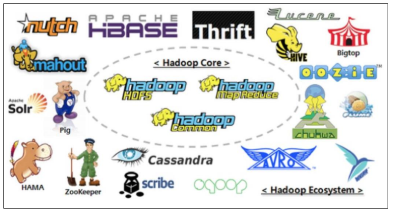  

Zookeeper工作机制   
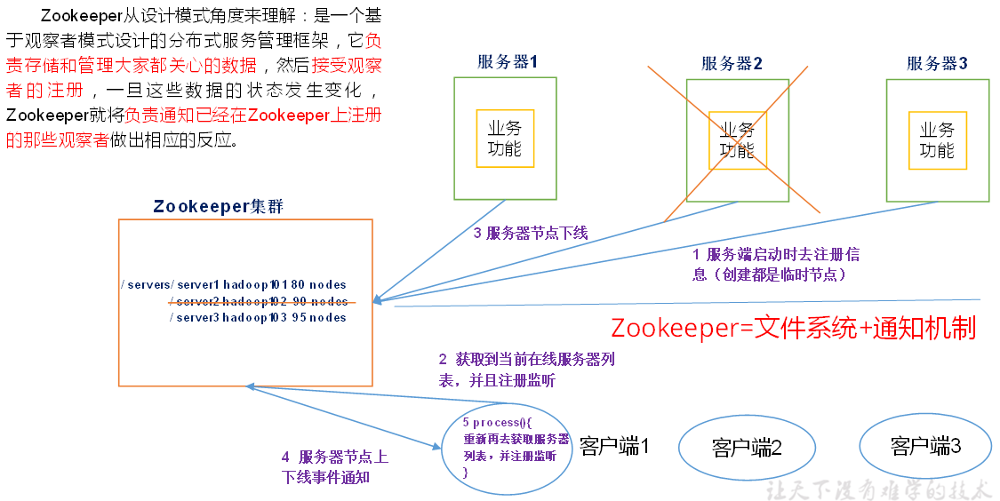   

Zookeeper从设计模式角度来理解：是一个基于观察者模式设计的分布式服务管理框架，它负责存储和管理大家都关心的数据，然后接受观察者的注册，一旦这些数据的状态发生变化，Zookeeper 就将负责通知已经在Zookeeper上注册的那些观察者做出相应的反应。

### 1.2、特点 
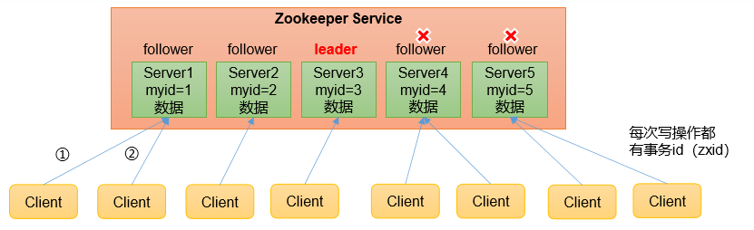  

1）Zookeeper：一个领导者（Leader），多个跟随者（Follower）组成的集群。  
2）集群中只要有半数以上节点存活，Zookeeper集群就能正常服务。所以Zookeeper适合安装奇数台服务器。  
3）全局数据一致：每个Server保存一份相同的数据副本，Client无论连接到哪个Server，数据都是一致的。  
4）更新请求顺序执行，来自同一个Client的更新请求按其发送顺序依次执行。  
5）数据更新原子性，一次数据更新要么成功，要么失败。  
6）实时性，在一定时间范围内，Client能读到最新数据。  

### 1.3、数据结构 
ZooKeeper 数据模型的结构与 Unix 文件系统很类似，整体上可以看作是一棵树，每个节点称做一个 ZNode。每一个 ZNode 默认能够存储 1MB 的数据，每个 ZNode 都可以通过其路径唯一标识。   
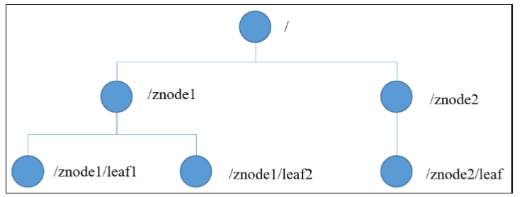    

### 1.4、应用场景 
提供的服务包括：统一命名服务、统一配置管理、统一集群管理、服务器节点动态上下线、软负载均衡等。 

#### 统一命名服务
在分布式环境下，经常需要对应用/服 务进行统一命名，便于识别。 例如：IP不容易记住，而域名容易记住。    
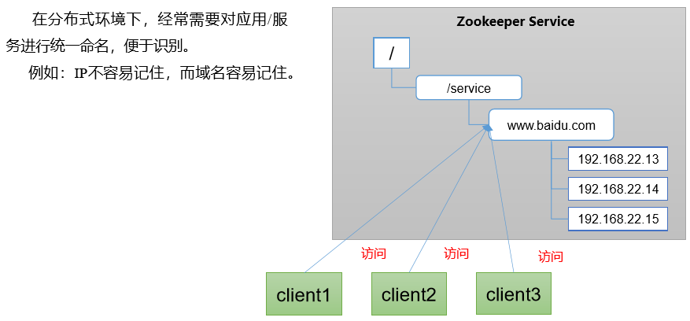    

#### 统一配置管理
1）分布式环境下，配置文件同步非常常见。     
（1）一般要求一个集群中，所有节点的配置信息是 一致的，比如 Kafka 集群。    
（2）对配置文件修改后，希望能够快速同步到各个 节点上。    

2）配置管理可交由ZooKeeper实现。  
（1）可将配置信息写入ZooKeeper上的一个Znode。  
（2）各个客户端服务器监听这个Znode。  
（3）一旦Znode中的数据被修改，ZooKeeper将通知 各个客户端服务器。  
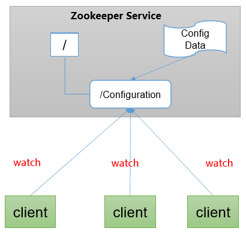    

#### 统一集群管理
1）分布式环境中，实时掌握每个节点的状态是必要的。    
（1）可根据节点实时状态做出一些调整。   
2）ZooKeeper可以实现实时监控节点状态变化    
（1）可将节点信息写入ZooKeeper上的一个ZNode。    
（2）监听这个ZNode可获取它的实时状态变化。   
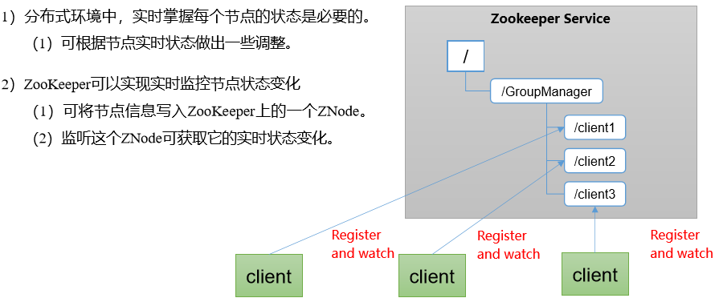     

#### 服务器动态上下线
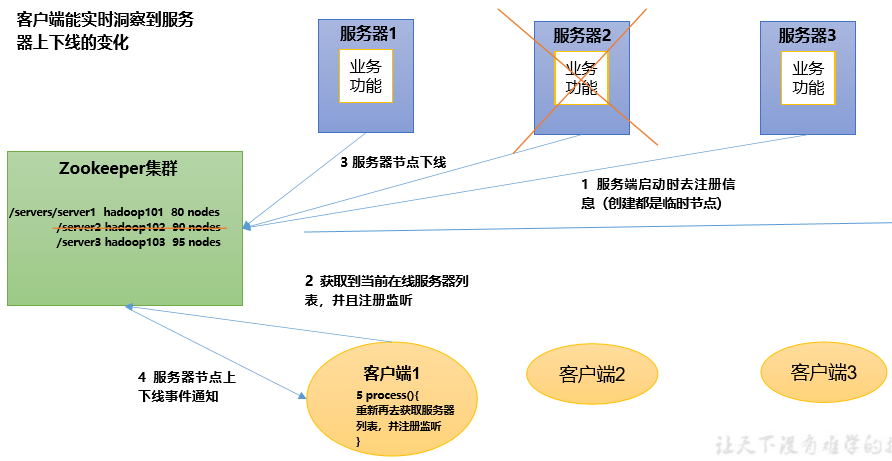   

#### 软负载均衡
在Zookeeper中记录每台服务器的访问数，让访问数最少的服务器去处理最新的客户端请求
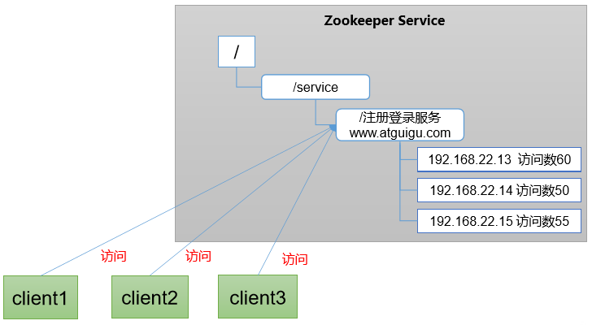   

### 1.5、下载地址 
1）官网首页：   
https://zookeeper.apache.org/   
2）下载截图   
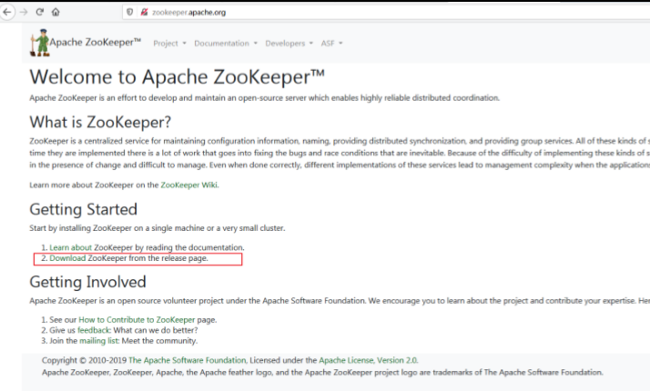   
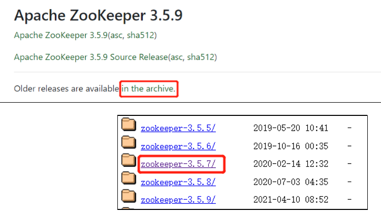   

3）下载 Linux 环境安装的 tar 包   
   

## 二、Zookeeper 本地安装 
### 2.1 本地模式安装 
1）安装前准备      
（1）安装 JDK   
（2）拷贝 apache-zookeeper-3.5.7-bin.tar.gz 安装包到 Linux 系统下   
（3）解压到指定目录   
```
[atguigu@hadoop102 software]$ tar -zxvf apache-zookeeper-3.5.7-bin.tar.gz -C /opt/module/ 
```
（4）修改名称 
```
[atguigu@hadoop102 module]$ mv apache-zookeeper-3.5.7-bin/ zookeeper-3.5.7 
```

2）配置修改    
（1）将/opt/module/zookeeper-3.5.7/conf 这个路径下的 zoo_sample.cfg 修改为 zoo.cfg；   
```
[atguigu@hadoop102 conf]$ mv zoo_sample.cfg zoo.cfg 
```
（2）打开 zoo.cfg 文件，修改 dataDir 路径： 
```
[atguigu@hadoop102 zookeeper-3.5.7]$ vim zoo.cfg 
```
修改如下内容： 
```
dataDir=/opt/module/zookeeper-3.5.7/zkData 
```
（3）在/opt/module/zookeeper-3.5.7/这个目录上创建 zkData 文件夹 
```
[atguigu@hadoop102 zookeeper-3.5.7]$ mkdir zkData 
```

3）操作 Zookeeper   
（1）启动 Zookeeper 
```
[atguigu@hadoop102 zookeeper-3.5.7]$ bin/zkServer.sh start 
```
（2）查看进程是否启动 
```
[atguigu@hadoop102 zookeeper-3.5.7]$ 
jps 
4020 Jps 
4001 QuorumPeerMain 
```
（3）查看状态 
```
atguigu@hadoop102 zookeeper-3.5.7]$ ./bin//zkServer.sh staus
ZooKeeper JMX enabled by default
Using config: /opt/module/zookeeper-3.5.7/bin/../conf/zoo.cfg
Usage: ./bin//zkServer.sh [--config <conf-dir>] {start|start-foreground|stop|restart|status|print-cmd}
```
（4）启动客户端 
```
[atguigu@hadoop102 zookeeper-3.5.7]$ bin/zkCli.sh 
```
（5）退出客户端： 
```
[zk: localhost:2181(CONNECTED) 0] quit 
```
（6）停止 Zookeeper 
```
[atguigu@hadoop102 zookeeper-3.5.7]$ bin/zkServer.sh stop 
```

### 2.2、配置参数解读 
Zookeeper中的配置文件zoo.cfg中参数含义解读如下：    
1）tickTime = 2000：通信心跳时间，Zookeeper服务器与客户端心跳时间，单位毫秒    
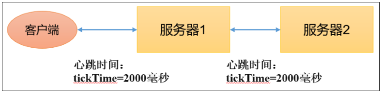   

2）initLimit = 10：LF初始通信时限    
   
Leader和Follower初始连接时能容忍的最多心跳数（tickTime的数量）    

3）syncLimit = 5：LF同步通信时限 
   
Leader和Follower之间通信时间如果超过syncLimit * tickTime，Leader认为Follwer死掉，从服务器列表中删除Follwer。   

4）dataDir：保存Zookeeper中的数据    
注意：默认的tmp目录，容易被Linux系统定期删除，所以一般不用默认的tmp目录。 

5）clientPort = 2181：客户端连接端口，通常不做修改。 

## 三、Zookeeper 集群操作 
### 3.1、集群操作 
#### 3.1.1、集群安装 
#### 1）集群规划     
在 hadoop102、hadoop103 和 hadoop104 三个节点上都部署 Zookeeper。    

#### 2）解压安装   
（1）在 hadoop102 解压 Zookeeper 安装包到/opt/module/目录下    
```
[atguigu@hadoop102 software]$ tar -zxvf apache-zookeeper-3.5.7bin.tar.gz -C /opt/module/ 
```
（2）修改 apache-zookeeper-3.5.7-bin 名称为 zookeeper-3.5.7 
```
[atguigu@hadoop102 module]$ mv apache-zookeeper-3.5.7-bin/ zookeeper-3.5.7 
```

#### 3）配置服务器编号   
（1）在/opt/module/zookeeper-3.5.7/这个目录下创建 zkData    
```
[atguigu@hadoop102 zookeeper-3.5.7]$ mkdir zkData
```
（2）在/opt/module/zookeeper-3.5.7/zkData 目录下创建一个 myid 的文件 
```
[atguigu@hadoop102 zkData]$ vi myid 
```
在文件中添加与 server 对应的编号（注意：上下不要有空行，左右不要有空格）   
```
2
```
注意：添加 myid 文件，一定要在 Linux 里面创建，在 notepad++里面很可能乱码。     
（3）拷贝配置好的 zookeeper 到其他机器上    
```
[atguigu@hadoop102 module ]$ xsync  zookeeper-3.5.7 
```
并分别在 hadoop103、hadoop104 上修改 myid 文件中内容为 3、4。    

#### 4）配置zoo.cfg文件    
（1）重命名/opt/module/zookeeper-3.5.7/conf 这个目录下的 zoo_sample.cfg 为 zoo.cfg    
```
[atguigu@hadoop102 conf]$ mv zoo_sample.cfg zoo.cfg 
```
（2）打开 zoo.cfg 文件 
```
[atguigu@hadoop102 conf]$ vim zoo.cfg 
```
修改数据存储路径配置 
```
dataDir=/opt/module/zookeeper-3.5.7/zkData 
```
增加如下配置   
```
#######################cluster##########################
server.2=hadoop102:2888:3888
server.3=hadoop103:2888:3888
server.4=hadoop104:2888:3888
```
（3）配置参数解读 
```
server.A=B:C:D。 
```
A 是一个数字，表示这个是第几号服务器；     
集群模式下配置一个文件 myid，这个文件在 dataDir 目录下，这个文件里面有一个数据就是 A 的值，Zookeeper 启动时读取此文件，拿到里面的数据与 zoo.cfg 里面的配置信息比较从而判断到底是哪个 server。   
B 是这个服务器的地址；    
C 是这个服务器 Follower 与集群中的 Leader 服务器交换信息的端口；     
D 是万一集群中的 Leader 服务器挂了，需要一个端口来重新进行选举，选出一个新的Leader，而这个端口就是用来执行选举时服务器相互通信的端口。    
（4）同步 zoo.cfg 配置文件 
```
[atguigu@hadoop102 conf]$ xsync zoo.cfg 
```

#### 5）集群操作 
（1）分别启动 Zookeeper 
```
[atguigu@hadoop102 zookeeper-3.5.7]$ bin/zkServer.sh start
[atguigu@hadoop103 zookeeper-3.5.7]$ bin/zkServer.sh start
[atguigu@hadoop104 zookeeper-3.5.7]$ bin/zkServer.sh start 
```
（2）查看状态 
```
[atguigu@hadoop102 zookeeper-3.5.7]$ bin/zkServer.sh status
ZooKeeper JMX enabled by default
Using config: /opt/module/zookeeper-3.5.7/bin/../conf/zoo.cfg
Client port found: 2181. Client address: localhost.
Mode: follower

[atguigu@hadoop103 zookeeper-3.5.7]$ bin/zkServer.sh status
ZooKeeper JMX enabled by default
Using config: /opt/module/zookeeper-3.5.7/bin/../conf/zoo.cfg
Client port found: 2181. Client address: localhost.
Mode: leader

[atguigu@hadoop104 zookeeper-3.5.7]$ bin/zkServer.sh status
ZooKeeper JMX enabled by default
Using config: /opt/module/zookeeper-3.5.7/bin/../conf/zoo.cfg
Client port found: 2181. Client address: localhost.
Mode: follower
```

#### 3.1.2、选举机制（面试重点） 
##### Zookeeper选举机制——第一次启动    
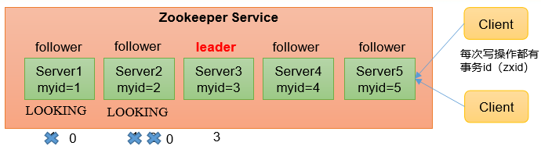   

SID：服务器ID。用来唯一标识一台 ZooKeeper集群中的机器，每台机器不能重 复，和myid一致。   
ZXID：事务ID。ZXID是一个事务ID，用来 标识一次服务器状态的变更。在某一时刻， 集群中的每台机器的ZXID值不一定完全一 致，这和ZooKeeper服务器对于客户端“更 新请求”的处理逻辑有关。  
Epoch：每个Leader任期的代号。没有 Leader时同一轮投票过程中的逻辑时钟值是 相同的。每投完一次票这个数据就会增加。   

（1）服务器1启动，发起一次选举。服务器1投自己一票。此时服务器1票数一票，不够半数以上（3票），选举无法完成，服务器1状态保持为 LOOKING；  
（2）服务器2启动，再发起一次选举。服务器1和2分别投自己一票并交换选票信息：此时服务器1发现服务器2的myid比自己目前投票推举的（服务器1） 大，更改选票为推举服务器2。此时服务器1票数0票，服务器2票数2票，没有半数以上结果，选举无法完成，服务器1，2状态保持LOOKING  
（3）服务器3启动，发起一次选举。此时服务器1和2都会更改选票为服务器3。此次投票结果：服务器1为0票，服务器2为0票，服务器3为3票。此时服 务器3的票数已经超过半数，服务器3当选Leader。服务器1，2更改状态为FOLLOWING，服务器3更改状态为LEADING；  
（4）服务器4启动，发起一次选举。此时服务器1，2，3已经不是LOOKING状态，不会更改选票信息。交换选票信息结果：服务器3为3票，服务器4为 1票。此时服务器4服从多数，更改选票信息为服务器3，并更改状态为FOLLOWING；  
（5）服务器5启动，同4一样当小弟。  

##### Zookeeper选举机制——非第一次启动
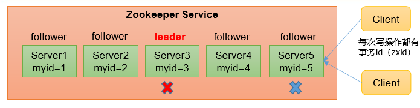   

（1）当ZooKeeper集群中的一台服务器出现以下两种情况之一时，就会开始进入Leader选举：     
• 服务器初始化启动。   
• 服务器运行期间无法和Leader保持连接。  
（2）而当一台机器进入Leader选举流程时，当前集群也可能会处于以下两种状态：    
• 集群中本来就已经存在一个Leader。    
对于第一种已经存在Leader的情况，机器试图去选举Leader时，会被告知当前服务器的Leader信息，对于该机器来说，仅仅需要和Leader机器建立连 接，并进行状态同步即可。   
• 集群中确实不存在Leader。    
假设ZooKeeper由5台服务器组成，SID分别为1、2、3、4、5，ZXID分别为8、8、8、7、7，并且此时SID为3的服务器是Leader。某一时刻，3和5服务器出现故障，因此开始进行Leader选举。       
```
                            （EPOCH，ZXID，SID ）  （EPOCH，ZXID，SID ） （EPOCH，ZXID，SID ）
SID为1、2、4的机器投票情况： （1，8，1）               （1，8，2）         （1，7，4）
```
选举Leader规则：    
- EPOCH大的直接胜出    
- EPOCH相同，事务id大的胜出    
- 事务id相同，服务器id大的胜出   
 
#### 3.1.3、ZK 集群启动停止脚本 
1）在 hadoop102 的/home/atguigu/bin 目录下创建脚本   
```
[atguigu@hadoop102 bin]$ vim zk.sh  
```
在脚本中编写如下内容 
```
#!/bin/bash

case $1 in
"start"){   
    for i in hadoop102 hadoop103 hadoop104  
    do         
        echo ---------- zookeeper $i 启动 ------------   
        ssh $i "/opt/module/zookeeper-3.5.7/bin/zkServer.sh start"  
    done 
};;
"stop"){  
    for i in hadoop102 hadoop103 hadoop104  
    do         
        echo ---------- zookeeper $i 停止 ------------       
        ssh $i "/opt/module/zookeeper-3.5.7/bin/zkServer.sh stop"  
    done 
};;
"status"){  
    for i in hadoop102 hadoop103 hadoop104  
    do         
        echo ---------- zookeeper $i 状态 ------------       
        ssh $i "/opt/module/zookeeper-3.5.7/bin/zkServer.sh status"  
    done 
};;
esac
```
2）增加脚本执行权限 
```
[atguigu@hadoop102 bin]$ chmod u+x zk.sh 
```
3）Zookeeper 集群启动脚本 
```
[atguigu@hadoop102 module]$ zk.sh start 
```
4）Zookeeper 集群停止脚本 
```
[atguigu@hadoop102 module]$ zk.sh stop 
```

### 3.2、客户端命令行操作 
#### 3.2.1、命令行语法 
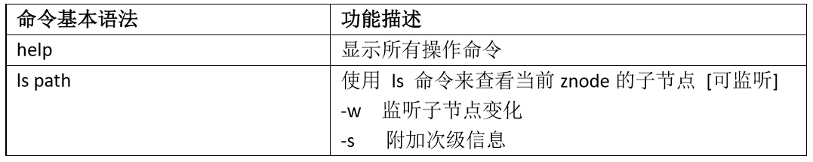   
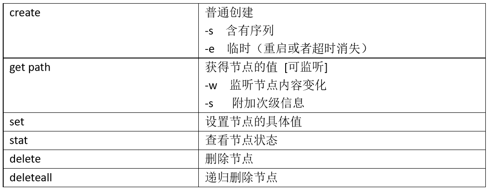   

1）启动客户端    
```
[atguigu@hadoop102 zookeeper-3.5.7]$ bin/zkCli.sh -server hadoop102:2181 
```
2）显示所有操作命令 
```
[zk: hadoop102:2181(CONNECTED) 0] help
ZooKeeper -server host:port cmd args
	addauth scheme auth
	close 
	config [-c] [-w] [-s]
	connect host:port
	create [-s] [-e] [-c] [-t ttl] path [data] [acl]
	delete [-v version] path
	deleteall path
	delquota [-n|-b] path
	get [-s] [-w] path
	getAcl [-s] path
	history 
	listquota path
	ls [-s] [-w] [-R] path
	ls2 path [watch]
	printwatches on|off
	quit 
	reconfig [-s] [-v version] [[-file path] | [-members serverID=host:port1:port2;port3[,...]*]] | [-add serverId=host:port1:port2;port3[,...]]* [-remove serverId[,...]*]
	redo cmdno
	removewatches path [-c|-d|-a] [-l]
	rmr path
	set [-s] [-v version] path data
	setAcl [-s] [-v version] [-R] path acl
	setquota -n|-b val path
	stat [-w] path
	sync path
Command not found: Command not found help
```

#### 3.2.2、znode 节点数据信息 
1）查看当前znode中所包含的内容    
```
[zk: hadoop102:2181(CONNECTED) 0] ls / 
[zookeeper] 
```
2）查看当前节点详细数据 
```
[zk: hadoop102:2181(CONNECTED) 2] ls -s /
[zookeeper]cZxid = 0x0
ctime = Thu Jan 01 08:00:00 CST 1970
mZxid = 0x0
mtime = Thu Jan 01 08:00:00 CST 1970
pZxid = 0x0
cversion = -1
dataVersion = 0
aclVersion = 0
ephemeralOwner = 0x0
dataLength = 0
numChildren = 1
```
（1）czxid：创建节点的事务 zxid    
每次修改 ZooKeeper 状态都会产生一个 ZooKeeper 事务 ID。事务 ID 是 ZooKeeper 中所有修改总的次序。每次修改都有唯一的 zxid，如果 zxid1 小于 zxid2，那么 zxid1 在 zxid2 之前发生。    
（2）ctime：znode 被创建的毫秒数（从 1970 年开始）   
（3）mzxid：znode 最后更新的事务 zxid    
（4）mtime：znode 最后修改的毫秒数（从 1970 年开始）    
（5）pZxid：znode 最后更新的子节点 zxid    
（6）cversion：znode 子节点变化号，znode 子节点修改次数    
（7）dataversion：znode 数据变化号    
（8）aclVersion：znode 访问控制列表的变化号    
（9）ephemeralOwner：如果是临时节点，这个是 znode 拥有者的 session id。如果不是临时节点则是 0。    
（10）dataLength：znode 的数据长度    
（11）numChildren：znode 子节点数量    

#### 3.2.3、节点类型（持久/短暂/有序号/无序号） 
说明：创建znode时设置顺序标识，znode名称后会附加一个值，顺序号是一个单调递增的计数器，由父节点维护。
注意：在分布式系统中，顺序号可以被用于为所有的事件进行全局排序，这样客户端可以通过顺序号推断事件的顺序。   
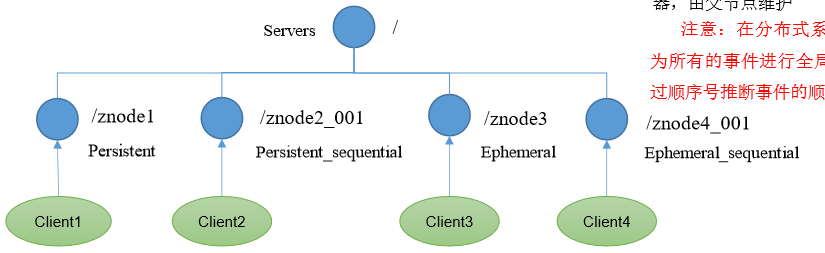   
   
持久（Persistent）：客户端和服务器端断开连接后，创建的节点不删除
短暂（Ephemeral）：客户端和服务器端断开连接后，创建的节点自己删除

（1）持久化目录节点 客户端与Zookeeper断开连接后，该节点依旧存在。  
（2）持久化顺序编号目录节点 客户端与Zookeeper断开连接后，该节点依旧存在，只是Zookeeper给该节点名称进行顺序编号。  
（3）临时目录节点 客户端与Zookeeper断开连接后，该节点被删除。  
（4）临时顺序编号目录节点 客户端与Zookeeper断开连接后，该节点被删除 ，只是 Zookeeper给该节点名称进行顺序编号。  

##### 1）分别创建2个普通节点（永久节点 + 不带序号） 
```
[zk: localhost:2181(CONNECTED) 3] create /sanguo "diaochan" 
Created /sanguo 
[zk: localhost:2181(CONNECTED) 4] create /sanguo/shuguo "liubei" 
Created /sanguo/shuguo 
```
注意：创建节点时，要赋值    

##### 2）获得节点的值    
```
[zk: hadoop102:2181(CONNECTED) 6] get -s /sanguo 
diaochan
cZxid = 0x200000002
ctime = Fri Feb 17 12:55:16 CST 2023
mZxid = 0x200000002
mtime = Fri Feb 17 12:55:16 CST 2023
pZxid = 0x200000003
cversion = 1
dataVersion = 0
aclVersion = 0
ephemeralOwner = 0x0
dataLength = 8
numChildren = 1

[zk: hadoop102:2181(CONNECTED) 7] get -s /sanguo/shuguo 
liubei
cZxid = 0x200000003
ctime = Fri Feb 17 12:55:24 CST 2023
mZxid = 0x200000003
mtime = Fri Feb 17 12:55:24 CST 2023
pZxid = 0x200000003
cversion = 0
dataVersion = 0
aclVersion = 0
ephemeralOwner = 0x0
dataLength = 6
numChildren = 0
```

##### 3）创建带序号的节点（永久节点 + 带序号）    
（1）先创建一个普通的根节点/sanguo/weiguo    
```
[zk: hadoop102:2181(CONNECTED) 8] create /sanguo/weiguo "caocao" 
Created /sanguo/weiguo
```
（2）创建带序号的节点 
```
[zk: hadoop102:2181(CONNECTED) 8] create /sanguo/weiguo "caocao" 
Created /sanguo/weiguo
[zk: hadoop102:2181(CONNECTED) 9] create -s /sanguo/weiguo/zhangliao "zhangliao" 
Created /sanguo/weiguo/zhangliao0000000000
[zk: hadoop102:2181(CONNECTED) 10] create -s /sanguo/weiguo/zhangliao "zhangliao" 
Created /sanguo/weiguo/zhangliao0000000001
[zk: hadoop102:2181(CONNECTED) 11] create -s /sanguo/weiguo/xuchu "xuchu"
Created /sanguo/weiguo/xuchu0000000002
```
如果原来没有序号节点，序号从 0 开始依次递增。如果原节点下已有 2 个节点，则再排序时从 2 开始，以此类推。    

##### 4）创建短暂节点（短暂节点 + 不带序号 or 带序号） 
（1）创建短暂的不带序号的节点    
```
[zk: hadoop102:2181(CONNECTED) 12] create -e /sanguo/wuguo "zhouyu"
Created /sanguo/wuguo
```
（2）创建短暂的带序号的节点 
```
[zk: hadoop102:2181(CONNECTED) 13] create -e -s /sanguo/wuguo "zhouyu"
Created /sanguo/wuguo0000000003
```
（3）在当前客户端是能查看到的 
```
[zk: hadoop102:2181(CONNECTED) 15]  ls /sanguo 
[shuguo, weiguo, wuguo, wuguo0000000003]
```
（4）退出当前客户端然后再重启客户端 
```
[zk: localhost:2181(CONNECTED) 12] quit 
[atguigu@hadoop104 zookeeper-3.5.7]$ bin/zkCli.sh 
```
（5）再次查看根目录下短暂节点已经删除 
```
[zk: localhost:2181(CONNECTED) 4] ls /sanguo 
[shuguo, weiguo]
```

5）修改节点数据值  
```
[zk: localhost:2181(CONNECTED) 6] set /sanguo/weiguo "simayi" 
```

#### 3.2.4、监听器原理 
客户端注册监听它关心的目录节点，当目录节点发生变化（数据改变、节点删除、子目录节点增加删除）时，ZooKeeper 会通知客户端。监听机制保证 ZooKeeper 保存的任何的数据的任何改变都能快速的响应到监听了该节点的应用程序。   


1、监听原理详解   
1）首先要有一个main()线程    
2）在main线程中创建Zookeeper客户端，这时就会创建两个线 程，一个负责网络连接通信（connet），一个负责监听（listener）。    
3）通过connect线程将注册的监听事件发送给Zookeeper。    
4）在Zookeeper的注册监听器列表中将注册的监听事件添加到列表中。    
5）Zookeeper监听到有数据或路径变化，就会将这个消息发送给listener线程。   
6）listener线程内部调用了process()方法   

2、常见的监听  
1）监听节点数据的变化   
```
get path [watch]  
```
2）监听子节点增减的变化   
```
ls path [watch]  
```

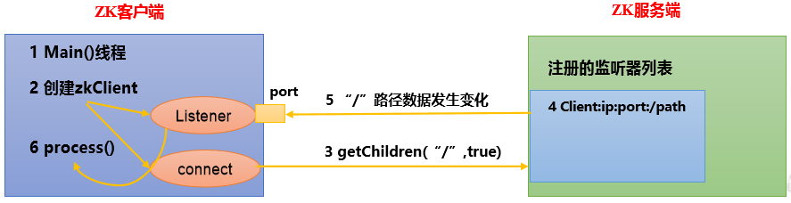   

##### 1）节点的值变化监听    
（1）在 hadoop104 主机上注册监听/sanguo 节点数据变化    
```
[zk: localhost:2181(CONNECTED) 26] get -w /sanguo   
```
（2）在 hadoop103 主机上修改/sanguo 节点的数据 
```
[zk: localhost:2181(CONNECTED) 1] set /sanguo "xisi" 
```
（3）观察 hadoop104 主机收到数据变化的监听 
```
WATCHER::

WatchedEvent state:SyncConnected type:NodeDataChanged path:/sanguo
```
注意：在hadoop103再多次修改/sanguo的值，hadoop104上不会再收到监听。因为注册一次，只能监听一次。想再次监听，需要再次注册。    

##### 2）节点的子节点变化监听（路径变化） 
（1）在 hadoop104 主机上注册监听/sanguo 节点的子节点变化    
[zk: localhost:2181(CONNECTED) 1] ls -w /sanguo  [shuguo, weiguo]  

（2）在 hadoop103 主机/sanguo 节点上创建子节点 [
```
[zk: localhost:2181(CONNECTED) 2] create /sanguo/jin "simayi" 
Created /sanguo/jin  
```
（3）观察 hadoop104 主机收到子节点变化的监听 
```
WATCHER::

WatchedEvent state:SyncConnected type:NodeChildrenChanged path:/sanguo
```
注意：节点的路径变化，也是注册一次，生效一次。想多次生效，就需要多次注册。

#### 3.2.5、节点删除与查看 
1）删除节点 
```
[zk: localhost:2181(CONNECTED) 4] delete /sanguo/jin
```
2）递归删除节点 
```
[zk: localhost:2181(CONNECTED) 15] deleteall /sanguo/shuguo 
```
3）查看节点状态 
```
[zk: localhost:2181(CONNECTED) 5] stat /sanguo 
cZxid = 0x200000002
ctime = Fri Feb 17 12:55:16 CST 2023
mZxid = 0x20000000e
mtime = Fri Feb 17 13:07:17 CST 2023
pZxid = 0x200000011
cversion = 9
dataVersion = 1
aclVersion = 0
ephemeralOwner = 0x0
dataLength = 4
numChildren = 1
```

### 3.3、客户端 API 操作 
前提：保证 hadoop102、hadoop103、hadoop104 服务器上 Zookeeper 集群服务端启动。    

详见代码。

### 3.4、客户端向服务端写数据流程 
写流程之写入请求直接发送给Leader节点   
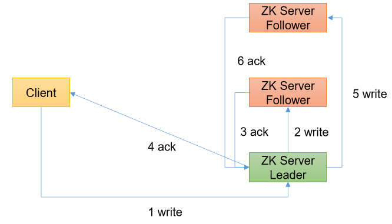   

写流程之写入请求发送给follower节点
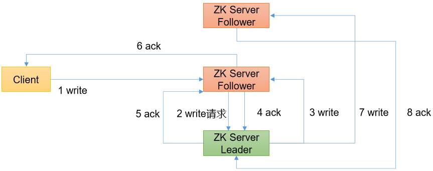   

## 四、服务器动态上下线监听案例 
### 4.1、需求 
某分布式系统中，主节点可以有多台，可以动态上下线，任意一台客户端都能实时感知到主节点服务器的上下线。   

### 4.2、需求分析 
服务器动态上下线   
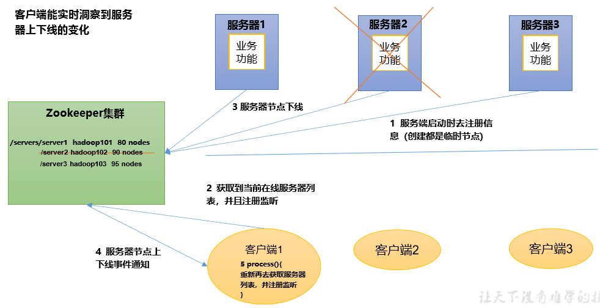   

### 4.3、具体实现 
```
[zk: localhost:2181(CONNECTED) 10] create /servers "servers" Created /servers 
```

## 五、ZooKeeper 分布式锁案例 
### 5.1、原生 Zookeeper 实现分布式锁案例 

### 5.2、Curator 框架实现分布式锁案例 
1）原生的 Java API 开发存在的问题    
（1）会话连接是异步的，需要自己去处理。比如使用 CountDownLatch    
（2）Watch 需要重复注册，不然就不能生效    
（3）开发的复杂性还是比较高的    
（4）不支持多节点删除和创建。需要自己去递归    

2）Curator是一个专门解决分布式锁的框架，解决了原生Java API开发分布式遇到的问题。    
详情请查看官方文档：https://curator.apache.org/index.html    

